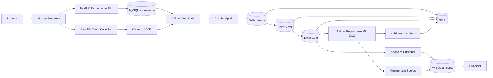

# PROJECT STRUCTURE — TLCN BATCH DATA LAKEHOUSE

## 1. Mục đích

Tài liệu này mô tả cấu trúc source code và ranh giới kiến trúc của toàn bộ Tiểu luận chuyên ngành. Cấu trúc bám theo `remake.md`, `schema.md` và `web-plan.md`.

Repository là một monorepo vì nhóm chỉ có hai người, tất cả thành phần cùng phục vụ một bài toán và cần thay đổi contract đồng bộ. Monorepo không có nghĩa là các thành phần được phép truy cập dữ liệu của nhau tùy ý.

## 2. Kiến trúc tổng thể



Ba nguồn sự thật được phân biệt rõ:

1. MySQL ecommerce là system of record cho giao dịch.
2. Delta Gold là nguồn phân tích chuẩn đã đối soát.
3. MySQL analytics chỉ là serving copy cho Superset.

Clickstream là best-effort. JSONL business event không được dùng thay cho order/payment trong OLTP.

## 3. Cây thư mục

```text
.
├── apps/
│   └── storefront/                       # Next.js source website
├── services/
│   ├── ecommerce-api/                    # FastAPI modular monolith
│   └── event-collector/                  # Versioned event ingestion + JSONL writer
├── database/
│   ├── migrations/                       # 12-table OLTP Alembic versions
│   ├── seeds/                            # Catalog/opening inventory seed
│   └── init/                             # First-volume bootstrap assets
├── generator/
│   ├── configs/                          # small/medium/large-local scenarios
│   ├── master/                           # Catalog and opening inventory
│   ├── historical/                       # Customer/order/payment history
│   ├── behavior/                         # Versioned clickstream
│   ├── repurchase/                       # Noisy 12-month repurchase histories
│   └── fixtures/                         # Malformed/late/schema-error inputs
├── pipelines/
│   └── batch/
│       ├── extract/                      # MySQL cursor + closed-file discovery
│       ├── bronze/                       # Raw append-only ingestion
│       ├── silver/                       # Typed, deduped, integrated data
│       ├── gold/                         # Dimensions, facts, marts, ML inputs
│       ├── publish/                      # Analytics staging and serving switch
│       ├── reconcile/                    # Count, amount and inventory checks
│       ├── backfill/                     # Replay/backfill namespaces
│       ├── config/                       # Layer paths and batch policy
│       └── src/tlcn_pipeline/            # Installable pipeline package
├── ml/
│   └── repurchase/
│       ├── features/                     # Point-in-time feature builders
│       ├── labels/                       # Closed 30-day labels
│       ├── training/                     # Baseline/model/evaluation
│       ├── scoring/                      # Batch prediction
│       ├── configs/                      # Versioned ML contract
│       ├── reports/                      # Generated evaluation reports
│       └── src/repurchase_ml/            # Installable ML package
├── airflow/
│   ├── dags/                             # Core DAG and downstream ML DAG
│   ├── config/                           # Executor and DAG notes
│   └── logs/                             # Local runtime logs, ignored by Git
├── quality/
│   ├── rules/                            # Bronze/Silver/Gold/ML DQ rules
│   ├── fixtures/                         # DQ input fixtures
│   └── reports/                          # Generated DQ reports
├── dashboards/
│   └── business-overview/                # Superset export without secrets
├── infrastructure/
│   ├── docker/                           # Custom Airflow/Superset images
│   ├── minio/                            # Bucket/storage conventions
│   ├── spark/                            # Spark/Delta conventions
│   ├── airflow/                          # Airflow deployment notes
│   ├── superset/                         # Superset runtime config
│   ├── mysql/                            # Source/serving database notes
│   ├── mysql-ecommerce/                  # DE read-only account init
│   └── mysql-analytics/                  # BI read-only account init
├── tests/
│   ├── unit/
│   ├── integration/
│   ├── data/
│   └── e2e/
├── docs/
│   ├── architecture/
│   ├── source-contracts/
│   ├── event-catalog/
│   ├── data-dictionary/
│   ├── kpi/
│   ├── runbook/
│   └── thesis/
├── scripts/                              # Local structural/automation checks
├── docker-compose.yml                    # core, batch, bi, tools profiles
├── .env.example                          # Config contract, no real secret
├── Makefile                              # Operator entry points
└── README.md                             # Quick start
```

## 4. Kiến trúc source application

### 4.1. Storefront

`apps/storefront` chỉ chịu trách nhiệm:

- render public catalog và authenticated commerce pages;
- gọi Ecommerce API bằng typed client;
- phát bốn behavior event sang Collector;
- hiển thị preview amount nhưng không quyết định price/total chính thức.

Storefront không truy cập MySQL, MinIO, Spark hoặc MySQL analytics.

### 4.2. Ecommerce API

`services/ecommerce-api` là modular monolith, không phải tập microservice. Các module nghiệp vụ:

- `auth`;
- `catalog`;
- `cart`;
- `checkout`;
- `orders`.

Dependency trong service:

```text
route/schema
→ application service
→ repository/query object
→ SQLAlchemy Unit of Work
→ MySQL ecommerce
```

Application service sở hữu transaction boundary. Repository không tự commit. Checkout không gọi Collector hoặc network service trong database transaction.

### 4.3. Event Collector

`services/event-collector` chỉ nhận bốn event:

- `session_start`;
- `view_product`;
- `add_to_cart`;
- `begin_checkout`.

Collector validate envelope, thêm received time, deduplicate trong bounded window, ghi `.active`, flush/rotate và atomic rename thành `.jsonl`. Pipeline chỉ đọc closed file. Order/payment event được derive từ OLTP ở Silver.

## 5. Database boundary

`database/migrations` sẽ chứa DDL hiện thực hóa 12 bảng trong `schema.md`. Không tạo star schema tại đây.

Runtime roles:

| Role | Quyền |
|---|---|
| Ecommerce API | Read/write đúng các bảng nghiệp vụ cần thiết |
| Migration | DDL trong MySQL ecommerce |
| DE reader | Table-level read-only theo allowlist, không đọc `customer_credentials` |
| Analytics publisher | Write staging/serving trong MySQL analytics |
| Superset reader | Read-only MySQL analytics |

MySQL ecommerce và MySQL analytics là hai service/volume riêng để tránh vô tình chạy BI query trên OLTP.

DE reader được tạo fail-closed khi khởi tạo volume. Table-level grants chỉ được áp dụng sau migration, khi danh sách source table đã tồn tại; không cấp `SELECT` rộng trên toàn schema ecommerce.

## 6. Generator boundary

`generator` có năm mode độc lập nhưng dùng chung seed, anchor time, generator version và expected manifest:

1. `seed_master`;
2. `historical_transactions`;
3. `behavior_events`;
4. `failure_fixtures`;
5. `repurchase_history`.

Normal rows phải đi qua API hoặc shared domain service. Failure fixture dùng namespace riêng. Cùng config phải cho cùng logical identity; `generated_at` không thuộc logical checksum.

## 7. Kiến trúc batch pipeline

### 7.1. Core DAG

```text
check services
→ capture MySQL high cursors + discover closed JSONL
→ extract MySQL + ingest JSONL
→ Bronze write/validation
→ Silver domain + events/logs
→ Silver DQ
→ Gold dimensions + facts → marts
→ reconciliation
→ analytics staging/validation/switch
→ commit cursors
→ audit
```

Cursor chỉ commit sau Gold reconciliation và serving publish thành công. Task retry không được nhân logical row.

### 7.2. Layer ownership

| Layer | Được làm | Không được làm |
|---|---|---|
| Bronze | Raw payload, transport identity, ingestion metadata/error | Join, KPI, sessionization |
| Silver | Cast, normalize, dedup, merge, history, business event, session, quarantine | Dashboard KPI, ML label/score |
| Gold | Dimension, fact, mart, point-in-time ML dataset | Ghi ngược OLTP |
| Serving | Copy mart/score đã validate | Trở thành source phân tích chuẩn |

### 7.3. Storage layout

```text
s3a://lakehouse/bronze/...
s3a://lakehouse/silver/...
s3a://lakehouse/gold/...
s3a://lakehouse/quarantine/...
s3a://lakehouse/manifests/...
s3a://ml-artifacts/models/...
s3a://ml-artifacts/reports/...
```

Bronze, Silver và Gold dùng Delta Lake trên MinIO. Manifest, reports và artifact cũng nằm trên MinIO nhưng không trộn namespace với table data.

## 8. Data quality, reconciliation và audit

`quality/rules` là rule catalogue dùng chung. Rule execution code thuộc pipeline stage tương ứng.

- Technical parse/framing error vào Bronze ingestion error.
- Readable row sai semantic vào Silver quarantine.
- Gold grain/total sai chặn publish.
- ML DQ sai chặn ML run nhưng không rollback core Gold publication.

Audit phải lưu run ID, cutoff/cursor, input identity, row count, reject/quarantine count, duration, code/config version và publication identity.

## 9. Kiến trúc Machine Learning

`ml/repurchase` là downstream consumer của một Gold publication đã thành công.

```text
Gold publication
→ point-in-time features
→ 30-day closed labels
→ ML DQ
→ temporal split
→ Dummy + Logistic Regression
→ evaluation/calibration
→ versioned artifact manifest
→ batch scoring
→ score DQ
→ MySQL analytics
```

Feature grain là `customer_key × as_of_date × feature_schema_version`. Feature chỉ dùng source time không vượt `as_of_time`; label nằm trong `(as_of_time, as_of_time + 30 ngày]`.

Model artifact nằm trên MinIO, không commit Git và không dùng MLflow. ML DAG thất bại không chặn hoặc rollback core DE DAG.

## 10. BI serving

Gold mart được publish qua staging, validation rồi atomic switch hoặc idempotent upsert sang MySQL analytics. Superset chỉ đọc serving database.

Dashboard gồm:

- Sales overview;
- Funnel overview;
- Product performance;
- Inventory status;
- Repurchase propensity.

Dashboard export được đặt tại `dashboards/business-overview/exports` và không chứa credential.

## 11. Docker profiles

| Profile | Service | Mục đích |
|---|---|---|
| `core` | storefront, Ecommerce API, Collector, MySQL ecommerce | Tạo source data |
| `batch` | MinIO, Spark master/worker, Airflow, PostgreSQL metadata | Xử lý lakehouse |
| `bi` | MySQL analytics, Superset, PostgreSQL metadata | Serving và dashboard |
| `tools` | generator | Seed/history/failure fixtures |

Các profile cho phép chạy riêng từng lớp trên máy cá nhân. Demo end-to-end dùng cả `core`, `batch` và `bi`.

## 12. Dependency rules

Các chiều phụ thuộc hợp lệ:

```text
Storefront → API / Collector
API → MySQL ecommerce
Collector → JSONL volume
Pipeline → MySQL read-only / JSONL / MinIO / MySQL analytics publisher
ML → Gold / MinIO artifacts / MySQL analytics publisher
Superset → MySQL analytics read-only
```

Các chiều bị cấm:

- Storefront → database trực tiếp;
- Superset → MySQL ecommerce;
- ML → MySQL ecommerce để tạo feature;
- Collector → order/payment table;
- API transaction → Airflow/Spark/Collector;
- Silver/Gold/prediction → ghi ngược OLTP;
- pipeline → `customer_credentials`.

## 13. Config và secret

- `.env.example` là config contract và không chứa secret thật.
- `.env` bị ignore.
- Config nghiệp vụ/pipeline/ML có version trong YAML.
- Runtime secret đi qua environment.
- Artifact, generated data, logs và reports runtime không commit.
- Mỗi run phải ghi code/config version vào audit/manifest.

## 14. Testing layout

| Thư mục | Phạm vi |
|---|---|
| `tests/unit` | Pure function, schema, amount, feature logic |
| `tests/integration` | MySQL transaction, Collector file, MinIO/Delta, publish |
| `tests/data` | Ingestion, DQ, reconciliation, replay, ML leakage |
| `tests/e2e` | Source → DAG → Gold → Superset/score demo |

Service test nhỏ có thể colocate trong service; cross-component test phải nằm ở root `tests`.

## 15. Trạng thái scaffold

Đã có:

- service/package/Dockerfile boundaries;
- health endpoint và JSONL writer base;
- Alembic environment;
- generator config/manifest shell;
- core và ML stage registries;
- Airflow DAG topology;
- Compose profiles và infrastructure services;
- DQ rule catalogue base;
- ML feature contract và model factory;
- documentation/test layout.

Chưa có và phải triển khai theo roadmap:

- 12 SQLAlchemy models và migration đầu tiên;
- auth/catalog/cart/checkout/order application services;
- MySQL/JSONL extraction thực tế;
- Spark Bronze/Silver/Gold jobs;
- audit/cursor metadata persistence;
- DQ/quarantine/reconciliation execution;
- analytics staging/serving DDL;
- point-in-time feature/label builders;
- training/evaluation/artifact/scoring implementation;
- Superset dataset/chart/dashboard export;
- integration, replay, backfill và E2E tests.

Việc ghi rõ trạng thái ngăn scaffold audit record bị hiểu nhầm là pipeline đã hoàn thành.
