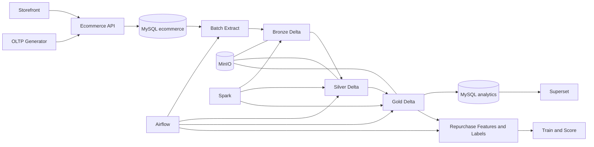

# PROJECT STRUCTURE — TLCN OLTP BATCH DATA LAKEHOUSE

## 1. Mục đích

Repository tổ chức toàn bộ Tiểu luận chuyên ngành trong một monorepo, gồm:

- website thương mại điện tử tối giản tạo dữ liệu OLTP;
- MySQL OLTP làm system of record;
- pipeline batch Bronze–Silver–Gold;
- data quality, quarantine, reconciliation và audit;
- MySQL analytics và Superset;
- bài toán dự đoán khả năng khách hàng mua lại từ dữ liệu OLTP.

Source phân tích duy nhất là 12 bảng nghiệp vụ được cho phép trong MySQL ecommerce. `customer_credentials` chỉ phục vụ đăng nhập và không được extract.

## 2. Kiến trúc tổng thể



Nguyên tắc dependency:

1. Storefront chỉ gọi Ecommerce API.
2. Ecommerce API chỉ ghi MySQL ecommerce trong transaction ngắn.
3. Generator tạo dữ liệu thông qua API hoặc source contract đã chốt.
4. Pipeline dùng DE reader chỉ có `SELECT` trên allowlist 12 bảng.
5. Airflow orchestration; Spark thực thi transformation.
6. Superset chỉ đọc MySQL analytics, không đọc primary OLTP.
7. ML chỉ đọc Gold publication đã reconciliation thành công.

## 3. Cây thư mục

```text
.
├── apps/
│   └── storefront/                       # Next.js customer/admin UI
├── services/
│   └── ecommerce-api/                    # FastAPI business API
│       ├── app/
│       │   ├── common/                   # Shared pagination/money helpers
│       │   ├── core/                     # Config, auth, errors, logging
│       │   ├── db/                       # Session, UoW and DB helpers
│       │   ├── models/                   # SQLAlchemy OLTP models
│       │   └── modules/                  # Auth, catalog, wishlist, cart, checkout, order, admin
│       └── tests/                         # API unit/integration tests
├── database/
│   ├── migrations/                       # Alembic schema versions
│   ├── seeds/                            # Deterministic master data
│   └── README.md                         # Ownership and reader policy
├── generator/
│   ├── configs/                          # Small/medium/large-local scenarios
│   ├── tests/                            # SQL export determinism tests
│   ├── master/                           # Catalog/opening inventory generation
│   ├── historical/                       # Historical OLTP transactions
│   ├── repurchase/                       # Repurchase history scenarios
│   ├── fixtures/                         # Extraction and DQ edge cases
│   └── src/tlcn_generator/               # Generator CLI
├── pipelines/
│   └── batch/
│       ├── config/                       # Layer paths and batch policy
│       ├── extract/                      # Initial/incremental MySQL extract
│       ├── bronze/                       # Raw rows and ingestion audit
│       ├── silver/                       # Typed merge, DQ and quarantine
│       ├── gold/                         # Facts, dimensions and marts
│       ├── reconcile/                    # Count and amount reconciliation
│       ├── publish/                      # Analytics staging/publish
│       ├── backfill/                     # Replay/backfill contracts
│       └── src/tlcn_pipeline/            # Pipeline CLI/stages
├── airflow/
│   ├── dags/                             # Core batch and repurchase ML DAGs
│   ├── config/                           # Airflow runtime config
│   └── logs/                             # Local operational logs
├── ml/
│   └── repurchase/
│       ├── configs/                      # Training/scoring config
│       ├── features/                     # Point-in-time features
│       ├── labels/                       # Closed-horizon labels
│       ├── training/                     # Temporal training flow
│       ├── scoring/                      # Batch scores
│       ├── reports/                      # Evaluation artifacts
│       └── src/repurchase_ml/            # ML CLI/stages
├── dashboards/
│   └── business-overview/                # Superset assets and exports
├── quality/
│   ├── rules/                            # Core and ML DQ rules
│   ├── fixtures/                         # Negative/edge fixtures
│   └── reports/                          # Generated quality reports
├── infrastructure/
│   ├── docker/                           # Airflow/Superset images
│   ├── mysql-ecommerce/                  # OLTP bootstrap
│   ├── mysql-analytics/                  # Serving DB bootstrap
│   ├── minio/                            # Object storage assets
│   ├── spark/                            # Spark assets
│   └── superset/                         # Superset config
├── docs/
│   ├── architecture/                     # Architecture decisions/diagrams
│   ├── data-dictionary/                  # Source/Silver/Gold definitions
│   ├── kpi/                              # KPI contracts
│   ├── runbook/                          # Setup and operation
│   ├── source-contracts/                 # OLTP extraction contracts
│   └── thesis/                           # Report/slide/demo artifacts
├── skills/
│   └── oltp-design.md                    # OLTP design principles
├── scripts/
│   ├── grant_de_reader.sh                # Table-level reader grants
│   ├── import_generated_sql.sh           # Import generated dataset
│   └── validate_structure.py             # Repository contract checks
├── remake.md                             # TLCN requirements and acceptance
├── schema.md                             # Logical OLTP schema/transactions
├── web-plan.md                           # Source website implementation plan
├── docker-compose.yml                    # Runtime profiles
├── pyproject.toml                        # uv workspace
└── uv.lock                               # Reproducible Python lockfile
```

## 4. Runtime profiles

| Profile | Thành phần | Vai trò |
|---|---|---|
| `core` | MySQL ecommerce, Ecommerce API, Storefront | Tạo dữ liệu OLTP |
| `tools` | OLTP generator | Sinh dữ liệu có seed/scenario |
| `batch` | MinIO, Spark, Airflow, PostgreSQL metadata | Bronze–Silver–Gold và ML batch |
| `bi` | MySQL analytics, Superset, PostgreSQL metadata | Serving và dashboard |

Thứ tự chạy:

```text
core → grant DE reader → tools (nếu cần) → batch → bi
```

## 5. Python workspace

Workspace `uv` gồm:

- `tlcn-ecommerce-api`;
- `tlcn-data-generator`;
- `tlcn-batch-pipeline`;
- `tlcn-repurchase-ml`.

`uv.lock` là lockfile duy nhất. Mọi Dockerfile Python dùng cùng phiên bản `uv` và cài package theo workspace lock.

## 6. Source application

### 6.1. Storefront

Storefront đảm nhiệm:

- auth UI;
- catalog search/filter/detail;
- wishlist;
- cart;
- checkout;
- order history/detail;
- admin console tối thiểu.

Storefront không truy cập database trực tiếp và không chứa business transaction logic.

### 6.2. Ecommerce API

API tổ chức theo module:

- `auth`;
- `catalog`;
- `wishlist`;
- `cart`;
- `checkout`;
- `orders`;
- `admin`.

Router xử lý HTTP/schema; service xử lý invariant và transaction; model biểu diễn persistence. Checkout kiểm tra tồn kho, tạo order/payment/item/history và giảm stock atomically.

## 7. Database ownership

MySQL ecommerce có 13 bảng logical. Pipeline chỉ đọc 12 bảng analytical source; `customer_credentials` bị loại khỏi source contract.

Quyền:

- Ecommerce API: read/write schema nghiệp vụ;
- DE reader: table-level `SELECT` trên allowlist 12 bảng;
- analytics publisher: read/write MySQL analytics;
- BI reader: chỉ đọc serving schema.

Order, payment, item và status history không hard delete. Customer PII không được publish nguyên bản sang Gold/serving.

## 8. OLTP generator

Generator có bốn mode:

- `seed_master`;
- `historical_transactions`;
- `repurchase_history`;
- `failure_fixtures`.

Mỗi run ghi seed, anchor time, scale, scenario ID và generator version để tái lập logical dataset. Lệnh `export-sql` sinh file MySQL transaction đầy đủ tại `data/generator/`; file giữ nguyên FK/CHECK và có một tài khoản demo.

## 9. Batch pipeline

Core DAG:

```text
capture high cursors
→ extract MySQL
→ write/validate Bronze
→ build/validate Silver
→ build Gold dimensions/facts/marts
→ reconcile source-to-Gold
→ publish analytics
→ commit cursors
→ publish audit
```

Các contract quan trọng:

- composite cursor `(timestamp, stable_pk)`;
- source high-watermark cố định theo run;
- idempotent theo source identity/run input;
- quarantine tách khỏi trusted Silver/Gold;
- cursor chỉ commit sau publication thành công;
- replay từ Bronze không cần đọc lại OLTP;
- backfill không làm thay đổi grain/KPI ngoài phạm vi chọn.

## 10. ML boundary

ML repurchase là downstream của Gold:

```text
Gold publication thành công
→ point-in-time features
→ closed 30-day labels
→ temporal split
→ train/evaluate
→ batch score
→ publish audit/artifacts
```

ML không truy cập OLTP trực tiếp. Feature, label, model và score đều có version, cutoff và lineage.

## 11. Testing

- API unit/schema/security tests.
- MySQL integration tests cho transaction và constraint.
- Checkout idempotency/concurrency tests.
- Generator reproducibility tests.
- Extraction cursor/high-watermark tests.
- Bronze/Silver/Gold grain và DQ tests.
- Reconciliation, rerun, replay và backfill tests.
- ML point-in-time, closed-horizon và leakage tests.
- Storefront production build và healthcheck.
- Docker Compose profile/config validation.

## 12. Tài liệu nguồn

Thứ tự ưu tiên:

1. `remake.md` — phạm vi và acceptance TLCN;
2. `schema.md` — logical OLTP schema và transaction catalogue;
3. `web-plan.md` — kế hoạch source website;
4. `PROJECT_STRUCTURE.md` — cấu trúc triển khai;
5. `skills/oltp-design.md` — nguyên tắc thiết kế tham khảo.
