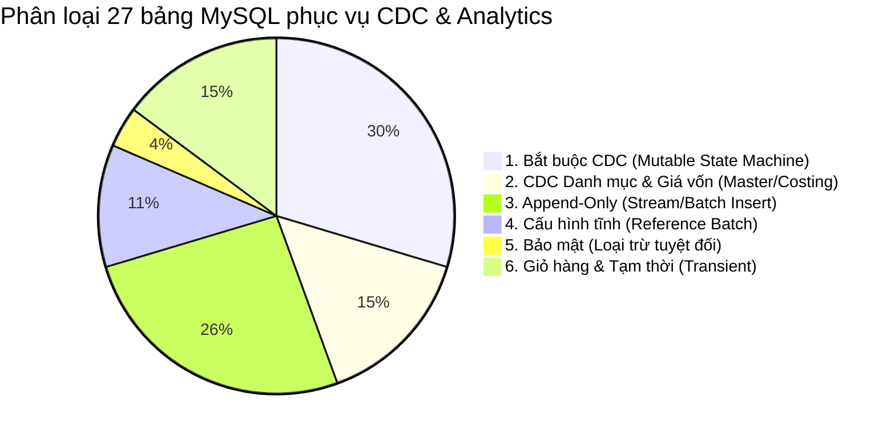

# TÀI LIỆU ĐẶC TẢ DỮ LIỆU CDC PHỤC VỤ HỆ THỐNG BI DASHBOARDS
## (Change Data Capture Requirements & Entity Mapping for Role-Based Dashboards)

> **Tài liệu thuộc đồ án:** D&K E-Commerce Hybrid Lakehouse Platform  
> **Phiên bản:** 1.0.0  
> **Trạng thái:** Chính thức (Approved Specification)

---

## 1. Tổng quan & Mục tiêu Kiến trúc (Overview & Context)

### 1.1. Vai trò của CDC trong hệ thống E-Commerce Lakehouse
Trong hệ thống **D&K E-Commerce**, cơ sở dữ liệu giao dịch nghiệp vụ (**MySQL 8.4 OLTP**) vận hành với 27 bảng dữ liệu. Nhằm đảm bảo hệ thống bán hàng không bị gián đoạn và quá tải bởi các truy vấn báo cáo phân tích phức tạp, toàn bộ dữ liệu phân tích được chuyển tiếp sang kiến trúc **Data Lakehouse (Apache Iceberg + Apache Trino)**.

**CDC (Change Data Capture)** là cơ chế kỹ thuật then chốt giúp bắt kịp thời mọi sự kiện biến động dữ liệu (`INSERT`, `UPDATE`, `DELETE`) từ MySQL Binary Log (Binlog) theo thời gian thực (Real-time / Near Real-time) và nạp vào tầng lưu trữ Iceberg.

```text
┌─────────────────┐       ┌─────────────────┐       ┌─────────────────┐       ┌───────────────────┐
│ MySQL 8.4 OLTP  │ Binlog│  CDC Engine     │ Kafka │ Lakehouse       │ Trino │ BI Analytics Hub  │
│ (27 Tables)     ├──────>│ (Debezium/Flink)├──────>│ (Iceberg Bronze ├──────>│ (/admin/analytics)│
│                 │       │                 │       │  Silver -> Gold)│       │ (7 Roles ECharts) │
└─────────────────┘       └─────────────────┘       └─────────────────┘       └───────────────────┘
```

### 1.2. Tại sao Dashboard bắt buộc cần dữ liệu CDC?
1. **Tách biệt tải hoàn toàn (Workload Isolation):** Tránh hiện tượng các câu lệnh `GROUP BY`, `SUM`, `COUNT` trên hàng triệu dòng đơn hàng khóa bảng hoặc làm chậm giao dịch thanh toán của khách hàng trên Web/Storefront.
2. **Nắm bắt toàn bộ vòng đời trạng thái (State-Machine Transitions):** Trong MySQL, khi đơn hàng đổi trạng thái từ `pending` sang `shipping` rồi `delivered`, bản ghi sẽ bị `UPDATE` đè lên. CDC cho phép lưu lại toàn bộ dòng lịch sử biến đổi (Audit Trail / Slowly Changing Dimension Type 2) để đo lường chính xác các SLA giao hàng và thời gian xử lý.
3. **Truy vấn phân tích tốc độ cao:** Dữ liệu sau khi CDC nạp vào Iceberg sẽ được chuyển đổi sang định dạng cột nén tối ưu (Parquet / ZSTD) và các bảng tổng hợp (Gold Marts), giúp Apache Trino trả về kết quả cho Dashboard chỉ trong vài chục mili-giây.

---

## 2. Phân loại thực thể dữ liệu MySQL theo nhu cầu CDC

Toàn bộ 27 bảng nghiệp vụ trong MySQL được phân chia thành 5 nhóm:



| Phân nhóm | Danh sách bảng | Tần suất & Hành vi | Phương thức nạp dữ liệu |
|---|---|---|---|
| **Nhóm 1: Bắt buộc CDC (Mutable State Machine)** | `orders`, `shipments`, `inventory`, `store_inventory`, `return_requests`, `return_items`, `refunds`, `customers` | Biến đổi liên tục (`UPDATE status`, số lượng tồn kho) | **CDC Stream (Debezium / Binlog)** |
| **Nhóm 2: CDC Danh mục & Giá vốn** | `product_variants`, `products`, `inbound_receipts`, `coupons` | Thay đổi giá bán, cập nhật giá vốn MWA, tạo lô may xưởng | **CDC Stream** |
| **Nhóm 3: Append-Only (Bất biến)** | `order_items`, `payments`, `order_status_history`, `inventory_transactions`, `inbound_receipt_items`, `coupon_redemptions`, `product_reviews` | Chỉ `INSERT`, không bao giờ `UPDATE` hay `DELETE` | **CDC Insert Stream hoặc Micro-Batch** |
| **Nhóm 4: Cấu hình tĩnh** | `cities`, `stores`, `categories` | Rất hiếm khi thay đổi (Metadata) | **Batch Ingestion / Cache** |
| **Nhóm 5: Loại trừ bảo mật** | `customer_credentials` | Chứa mật khẩu băm (`password_hash`) | **Loại trừ 100% khỏi Data Platform** |
| **Nhóm 6: Tạm thời (Transient)** | `carts`, `cart_items`, `wishlist_items` | Giỏ hàng tạm thời | **Batch Ingestion hoặc phân tích qua Clickstream** |

---

## 3. Đặc tả dữ liệu CDC chi tiết phục vụ 7 Role Dashboards

Dưới đây là đặc tả chi tiết từng chỉ số trên 7 màn hình Dashboard thuộc **BI Analytics Hub** (`/admin/analytics`), bảng dữ liệu MySQL nguồn và các trường (fields) bắt buộc CDC phải thu thập:

---

### 3.1. Dashboard Ban Giám Đốc (Executive / CEO View)
* **Mục tiêu quản trị:** Bức tranh toàn cảnh về sức khỏe tài chính, dòng tiền doanh thu, giá vốn, biên lợi nhuận và rủi ro vận hành toàn doanh nghiệp.
* **Tầng Data Mart tiêu thụ:** `lakehouse.gold.mart_sales_daily`, `lakehouse.gold.mart_product_returns`.

| Chỉ số KPI hiển thị | Công thức tính toán | Bảng MySQL nguồn | Các trường dữ liệu (Fields) CDC bắt buộc |
|---|---|---|---|
| **Tổng giá trị giao dịch (GMV)** | `SUM(total_vnd)` của toàn bộ đơn đặt thành công | `orders` | `order_id`, `status`, `total_vnd`, `channel`, `created_at` |
| **Doanh thu thuần (Net Revenue)** | `SUM(total_vnd)` của các đơn đã giao hoặc hoàn tất (`delivered`, `completed`) | `orders` | `order_id`, `status`, `total_vnd`, `completed_at` |
| **Giá vốn hàng bán (COGS)** | $\sum (\text{quantity} \times \text{cost\_price\_vnd})$ của các đơn hoàn tất | `orders`<br>`order_items` | `orders.order_id`, `orders.status`<br>`order_items.quantity`, `order_items.cost_price_vnd` |
| **Lợi nhuận gộp (Gross Profit)** | $\text{Gross Profit} = \text{Net Revenue} - \text{COGS}$ | `orders`<br>`order_items` | (Tính toán kết hợp từ 2 trường trên) |
| **Tỷ suất lợi nhuận gộp (Gross Margin %)** | $\frac{\text{Gross Profit}}{\text{Net Revenue}} \times 100\%$ | `orders`<br>`order_items` | (Tính toán tỷ lệ) |
| **Tổng số đơn hàng (Total Orders)** | `COUNT(DISTINCT order_id)` | `orders` | `order_id`, `status` |
| **Giá trị trung bình đơn (AOV)** | $\frac{\text{Net Revenue}}{\text{Total Completed Orders}}$ | `orders` | `order_id`, `total_vnd`, `status` |
| **Tỷ lệ boom hàng COD (Boom Rate %)** | $\frac{\text{Số đơn failed\_delivery}}{\text{Tổng đơn Online xuất kho}} \times 100\%$ | `orders`<br>`shipments` | `orders.channel = 'online'`, `orders.status`<br>`shipments.status = 'failed'` |
| **Tỷ lệ trả hàng (Return Rate %)** | $\frac{\text{Số đơn có return\_requests}}{\text{Tổng đơn đã giao}} \times 100\%$ | `orders`<br>`return_requests` | `orders.status = 'delivered'`<br>`return_requests.return_id`, `return_requests.status` |
| **Biểu đồ xu hướng Doanh thu & Lãi ngày** | Doanh thu, COGS, Lãi gộp nhóm theo `DATE(created_at)` trong 30 ngày | `orders`<br>`order_items` | `orders.created_at`, `orders.total_vnd`, `order_items.cost_price_vnd` |

---

### 3.2. Dashboard Kinh Doanh & Chiến Lược (Sales & Strategy View)
* **Mục tiêu quản trị:** Theo dõi tỷ trọng đóng góp doanh thu giữa kênh Online và các cửa hàng vật lý (POS), bảng xếp hạng sản phẩm bán chạy và cơ cấu danh mục.
* **Tầng Data Mart tiêu thụ:** `lakehouse.gold.mart_sales_daily`, `lakehouse.gold.fact_order_item`, `lakehouse.gold.dim_product`, `lakehouse.gold.dim_store`.

| Chỉ số KPI hiển thị | Công thức tính toán | Bảng MySQL nguồn | Các trường dữ liệu (Fields) CDC bắt buộc |
|---|---|---|---|
| **Đóng góp doanh thu theo kênh (Store Contributions)** | `SUM(total_vnd)` nhóm theo `channel` ('online' vs 'pos') và `store_id` | `orders`<br>`stores` | `orders.order_id`, `orders.store_id`, `orders.channel`, `orders.total_vnd`, `orders.status`<br>`stores.store_id`, `stores.store_name` |
| **Top 5 sản phẩm bán chạy nhất** | `SUM(quantity)` và `SUM(line_total_vnd)` nhóm theo `product_id` (đơn hợp lệ) | `orders`<br>`order_items`<br>`product_variants`<br>`products` | `orders.status IN ('paid','delivered','completed')`<br>`order_items.variant_id`, `order_items.quantity`, `order_items.line_total_vnd`<br>`product_variants.product_id`<br>`products.product_id`, `products.product_name` |
| **Cơ cấu doanh thu theo Danh mục (Category Share %)** | Tỷ trọng % doanh thu của từng ngành hàng (Áo, Quần, Phụ kiện...) | `orders`<br>`order_items`<br>`products`<br>`categories` | `products.category_id`<br>`categories.category_id`, `categories.category_name`<br>`order_items.line_total_vnd` |

---

### 3.3. Dashboard Quản Lý Cửa Hàng (Store Manager View - Row-Level Security)
* **Mục tiêu quản trị:** Giám sát doanh thu tại quầy POS, tiến độ bán hàng trong ngày và cảnh báo sản phẩm sắp hết hàng tại điểm bán cụ thể do quản lý phụ trách.
* **Tầng Data Mart tiêu thụ:** `lakehouse.gold.mart_sales_daily`, `lakehouse.gold.dim_store`.

| Chỉ số KPI hiển thị | Công thức tính toán | Bảng MySQL nguồn | Các trường dữ liệu (Fields) CDC bắt buộc |
|---|---|---|---|
| **Doanh thu cửa hàng hôm nay** | `SUM(total_vnd)` của cửa hàng với `DATE(created_at) = CURRENT_DATE` | `orders` | `orders.store_id`, `orders.channel = 'pos'`, `orders.total_vnd`, `orders.created_at`, `orders.status` |
| **Số đơn chốt tại quầy hôm nay** | `COUNT(order_id)` tại quầy hôm nay | `orders` | `orders.store_id`, `orders.channel = 'pos'`, `orders.created_at`, `orders.status` |
| **% Đạt chỉ tiêu doanh số ngày** | $\frac{\text{Doanh thu hôm nay}}{\text{Chỉ tiêu ngày (ví dụ 10,000,000đ)}} \times 100\%$ | `orders` | `orders.store_id`, `orders.total_vnd` |
| **Cảnh báo hàng sắp hết tại quầy** | Danh sách biến thể có `on_hand <= reorder_threshold` tại `store_id` | `store_inventory`<br>`product_variants`<br>`products` | `store_inventory.store_id`, `store_inventory.variant_id`, `store_inventory.on_hand`, `store_inventory.reorder_threshold`<br>`products.product_name`, `product_variants.sku`, `product_variants.size`, `product_variants.color` |

---

### 3.4. Dashboard Kho & Chuỗi Cung Ứng (Inventory & Supply Chain View)
* **Mục tiêu quản trị:** Định giá tài sản hàng tồn kho toàn chuỗi, phân bổ giữa Kho tổng và các cửa hàng, kiểm soát các đợt nhập xưởng may nội bộ và giám sát đứt hàng (Stockout).
* **Tầng Data Mart tiêu thụ:** `lakehouse.gold.mart_inventory_health`.

| Chỉ số KPI hiển thị | Công thức tính toán | Bảng MySQL nguồn | Các trường dữ liệu (Fields) CDC bắt buộc |
|---|---|---|---|
| **Tổng giá trị hàng tồn kho (VND)** | $\sum (\text{on\_hand} \times \text{cost\_price\_vnd})$ trên toàn bộ hệ thống | `inventory`<br>`store_inventory`<br>`product_variants` | `inventory.variant_id`, `inventory.on_hand`<br>`store_inventory.variant_id`, `store_inventory.on_hand`<br>`product_variants.variant_id`, `product_variants.cost_price_vnd` *(Giá vốn MWA)* |
| **Phân bổ tồn kho (Kho tổng vs Cửa hàng)** | Tổng số lượng sản phẩm tại Kho tổng so với tổng sản phẩm tại các chi nhánh | `inventory`<br>`store_inventory` | `inventory.on_hand` (Kho tổng)<br>`store_inventory.on_hand` (Cửa hàng) |
| **Số đợt nhập xưởng may nội bộ** | `COUNT(receipt_id)` phiếu nhập xưởng hoàn tất | `inbound_receipts` | `inbound_receipts.receipt_id`, `inbound_receipts.status = 'completed'`, `inbound_receipts.total_cost_vnd`, `inbound_receipts.created_at` |
| **Số lượng biến thể sắp hết hàng** | `COUNT(variant_id)` có `on_hand <= safety_stock` | `inventory` | `inventory.variant_id`, `inventory.on_hand`, `inventory.safety_stock` |
| **Số lượng biến thể hết hàng (Stockout)** | `COUNT(variant_id)` có `on_hand = 0` | `inventory` | `inventory.variant_id`, `inventory.on_hand` |

---

### 3.5. Dashboard Vận Hành Đơn & Giao Hàng (Operations & Logistics View)
* **Mục tiêu quản trị:** Giám sát tốc độ đóng gói đơn hàng, hiệu quả tài xế (Shipper), các vi phạm cam kết giao hàng (SLA) và xử lý sự cố hàng hoàn.
* **Tầng Data Mart tiêu thụ:** `lakehouse.gold.mart_logistics_performance`, `lakehouse.gold.mart_product_returns`.

| Chỉ số KPI hiển thị | Công thức tính toán | Bảng MySQL nguồn | Các trường dữ liệu (Fields) CDC bắt buộc |
|---|---|---|---|
| **Đơn chờ đóng gói & xuất kho** | `COUNT(order_id)` có trạng thái `paid` chưa xuất `shipment` | `orders`<br>`shipments` | `orders.order_id`, `orders.status = 'paid'`<br>`shipments.shipment_id` |
| **Vi phạm thời gian giao hàng (SLA Violations)** | `COUNT(shipment_id)` có `delivered_at - dispatched_at > SLA` (ví dụ > 48h) | `shipments` | `shipments.shipment_id`, `shipments.dispatched_at`, `shipments.delivered_at`, `shipments.status` |
| **Số vụ boom hàng COD (Failed Deliveries)** | `COUNT(shipment_id)` có `status = 'failed'` (giao thất bại $\ge 3$ lần) | `shipments` | `shipments.shipment_id`, `shipments.order_id`, `shipments.status`, `shipments.delivery_attempts`, `shipments.failure_reason` |
| **Yêu cầu đổi trả chờ thẩm định (Pending Returns)** | `COUNT(return_id)` có trạng thái `pending` | `return_requests` | `return_requests.return_id`, `return_requests.order_id`, `return_requests.status = 'pending'`, `return_requests.created_at` |
| **Chi phí hoàn tiền khách hàng** | `SUM(amount_vnd)` các khoản hoàn tiền thành công | `refunds` | `refunds.refund_id`, `refunds.amount_vnd`, `refunds.status = 'succeeded'` |

---

### 3.6. Dashboard Marketing & Phễu Chuyển Đổi (Marketing View)
* **Mục tiêu quản trị:** Đánh giá hiệu quả chiến dịch bán hàng, tỷ lệ chuyển đổi qua từng chặng mua sắm, hiệu quả mã giảm giá và mức độ hài lòng khách hàng.
* **Tầng Data Mart tiêu thụ:** `lakehouse.gold.mart_marketing_funnel_daily`, `lakehouse.gold.fact_web_events`.

> [!IMPORTANT]
> **Phân định ranh giới giữa Clickstream Streaming và CDC MySQL trên Phễu Marketing:**
> - **Tầng 1 (Product Views), Tầng 2 (Add to Cart), Tầng 3 (Initiate Checkout):** Do **Clickstream Event Streaming** (FastAPI $\rightarrow$ Kafka topic `ecommerce.access_logs` $\rightarrow$ Apache Flink) cung cấp theo thời gian thực từ hành vi lướt web của người dùng.
> - **Tầng 4 (Purchases - Đặt hàng thành công):** Do **CDC từ bảng `orders` của MySQL** cung cấp khi đơn hàng được ghi nhận và thanh toán.

| Chỉ số KPI hiển thị | Nguồn dữ liệu | Bảng MySQL cần CDC | Các trường dữ liệu (Fields) CDC bắt buộc |
|---|---|---|---|
| **Chốt đơn thành công (Purchases)** | MySQL CDC | `orders` | `orders.order_id`, `orders.status IN ('paid','delivered','completed')`, `orders.created_at` |
| **Lượt sử dụng Voucher giảm giá** | MySQL CDC | `coupon_redemptions`<br>`coupons` | `coupon_redemptions.redemption_id`, `coupon_redemptions.coupon_id`, `coupon_redemptions.order_id`, `coupon_redemptions.discount_amount_vnd`<br>`coupons.code`, `coupons.discount_type` |
| **Điểm hài lòng khách hàng (CSAT Rating)** | MySQL CDC | `product_reviews` | `product_reviews.review_id`, `product_reviews.product_id`, `product_reviews.rating` (1-5 sao), `product_reviews.status = 'approved'` |

---

### 3.7. Dashboard Kỹ Thuật & Đối Soát Dữ Liệu (System & Data Admin View)
* **Mục tiêu quản trị:** Giám sát tính toàn vẹn của Data Pipeline, độ trễ làm tươi dữ liệu (Data Freshness SLA) và đối soát độ lệch số liệu (Reconciliation Variance) giữa cơ sở dữ liệu tác nghiệp (MySQL) và hồ dữ liệu (Lakehouse).
* **Tầng Data Mart tiêu thụ:** `lakehouse.gold.mart_sales_daily`, `lakehouse.system.stack_smoke`.

| Chỉ số KPI hiển thị | Cơ chế so khớp | Bảng MySQL cần CDC | Các trường dữ liệu (Fields) CDC bắt buộc |
|---|---|---|---|
| **Độ lệch doanh thu (Revenue Variance %)** | $\frac{\lvert \text{OLTP Revenue} - \text{Lakehouse Revenue} \rvert}{\text{OLTP Revenue}} \times 100\%$ | `orders` | `orders.total_vnd`, `orders.status != 'cancelled'` |
| **Độ lệch tổng số đơn (Orders Variance %)** | $\frac{\lvert \text{OLTP Orders} - \text{Lakehouse Orders} \rvert}{\text{OLTP Orders}} \times 100\%$ | `orders` | `orders.order_id` |
| **Cam kết độ tươi dữ liệu (Data Freshness SLA)** | Thời gian chênh lệch giữa bản ghi mới nhất ở MySQL và Lakehouse ($\le 15$ phút) | Toàn bộ các bảng | Trường timestamp `updated_at`, `created_at` của từng bảng |

---

## 4. Chuẩn hóa định dạng CDC Event Payload (Debezium / Kafka Format)

Khi CDC Engine (như Debezium hoặc Flink CDC Connector) bắt sự kiện từ MySQL Binlog, mỗi event đẩy lên Kafka topic cần tuân thủ cấu trúc chuẩn (gồm giá trị trước `before` và giá trị sau `after`):

```json
{
  "schema": { ... },
  "payload": {
    "before": {
      "order_id": 10582,
      "status": "shipping",
      "updated_at": "2026-10-04T10:15:00Z"
    },
    "after": {
      "order_id": 10582,
      "status": "delivered",
      "updated_at": "2026-10-04T11:42:30Z"
    },
    "source": {
      "version": "2.5.0.Final",
      "connector": "mysql",
      "name": "ecommerce_cdc",
      "ts_ms": 1791114150000,
      "db": "ecommerce",
      "table": "orders",
      "server_id": 1,
      "file": "binlog.000042",
      "pos": 154820
    },
    "op": "u",
    "ts_ms": 1791114150500
  }
}
```

### Quy tắc xử lý các thao tác (`op`):
- `c` (Create / Insert): Nạp bản ghi mới vào Iceberg Bronze/Silver.
- `u` (Update): Thực hiện lệnh `MERGE INTO` trong Iceberg Silver dựa trên khóa chính (`PRIMARY KEY`) và so khớp `updated_at` để ghi nhận phiên bản mới nhất.
- `d` (Delete): Gắn cờ xóa mềm (`is_deleted = true`) hoặc xóa trong bảng Silver theo chính sách GDPR / Data Retention.

---

## 5. Ma trận tổng kết: Bảng MySQL $\rightarrow$ Tầng Iceberg $\rightarrow$ Dashboard Phục Vụ

| STT | Bảng MySQL Nguồn | Khóa chính (PK) | Trường con trỏ (Cursor) | Bảng đích Iceberg Silver | Dashboard tiêu thụ |
|:---:|---|---|---|---|---|
| 1 | `orders` | `order_id` | `updated_at` | `silver_orders` | Executive, Sales, Store, Operations, Marketing, System |
| 2 | `order_items` | `order_item_id` | `created_at` | `silver_order_items` | Executive, Sales, System |
| 3 | `inventory` | `variant_id` | `updated_at` | `silver_inventory` | Inventory |
| 4 | `store_inventory` | `store_inventory_id` | `updated_at` | `silver_store_inventory` | Store Manager, Inventory |
| 5 | `product_variants` | `variant_id` | `updated_at` | `silver_product_variants` | Executive, Sales, Inventory, Store |
| 6 | `products` | `product_id` | `updated_at` | `silver_products` | Sales, Inventory, Store |
| 7 | `categories` | `category_id` | `updated_at` | `silver_categories` | Sales, Inventory |
| 8 | `stores` | `store_id` | `updated_at` | `silver_stores` | Sales, Store Manager |
| 9 | `inbound_receipts` | `receipt_id` | `updated_at` | `silver_inbound_receipts` | Inventory, Executive |
| 10 | `inbound_receipt_items` | `item_id` | `created_at` | `silver_inbound_receipt_items` | Inventory |
| 11 | `shipments` | `shipment_id` | `updated_at` | `silver_shipments` | Operations, Executive |
| 12 | `return_requests` | `return_id` | `updated_at` | `silver_return_requests` | Operations, Executive |
| 13 | `return_items` | `return_item_id` | `updated_at` | `silver_return_items` | Operations, Executive |
| 14 | `refunds` | `refund_id` | `updated_at` | `silver_refunds` | Operations, Executive |
| 15 | `coupons` | `coupon_id` | `updated_at` | `silver_coupons` | Marketing |
| 16 | `coupon_redemptions` | `coupon_redemption_id` | `created_at` | `silver_coupon_redemptions` | Marketing |
| 17 | `product_reviews` | `review_id` | `updated_at` | `silver_product_reviews` | Marketing |
| 18 | `customers` | `customer_id` | `updated_at` | `silver_customers` | Operations (Chặn COD), Executive |

---
*Tài liệu được lưu trữ trực tiếp tại: [`docs/architecture/CDC_DASHBOARD_DATA_SPEC.md`](CDC_DASHBOARD_DATA_SPEC.md)*
