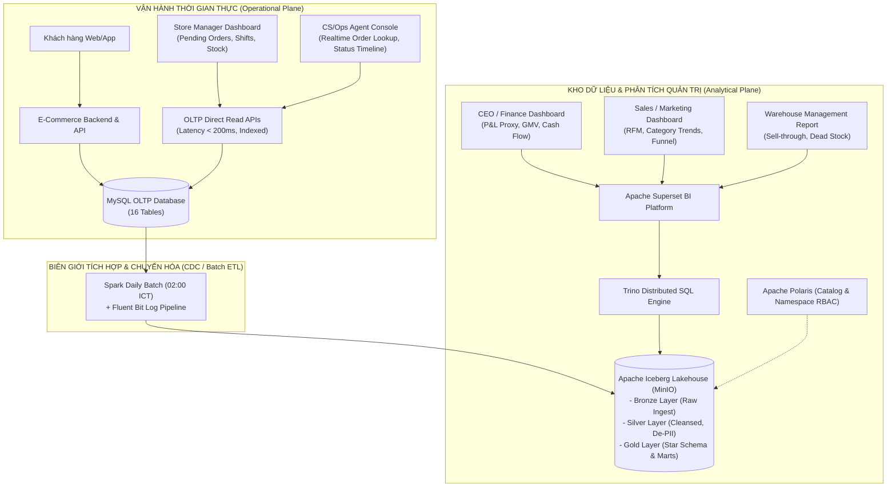
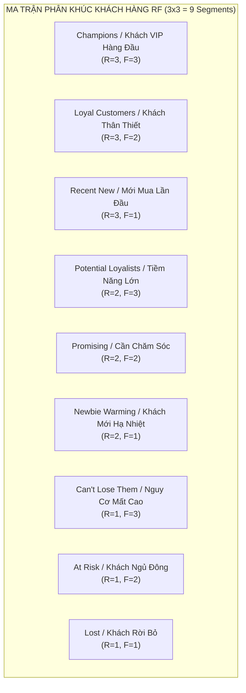
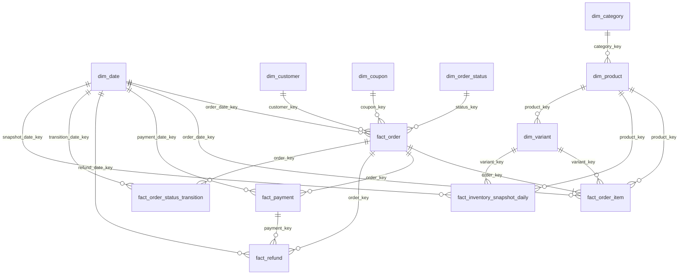
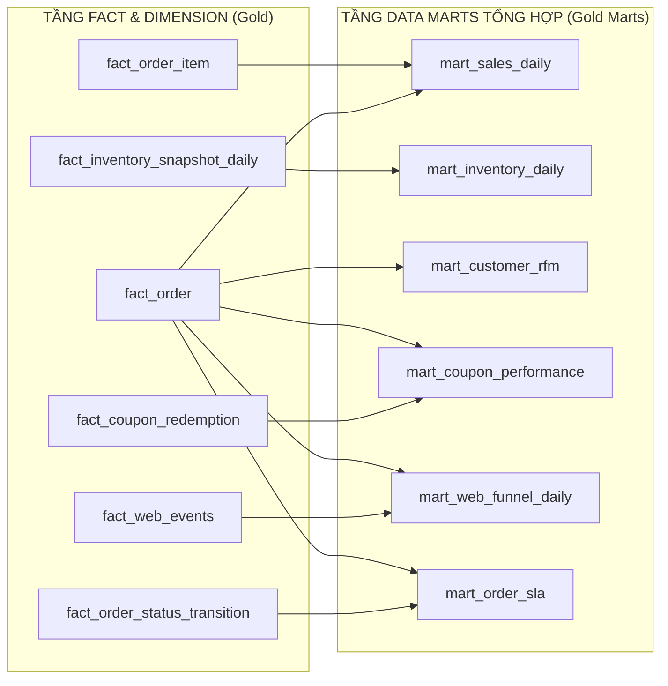
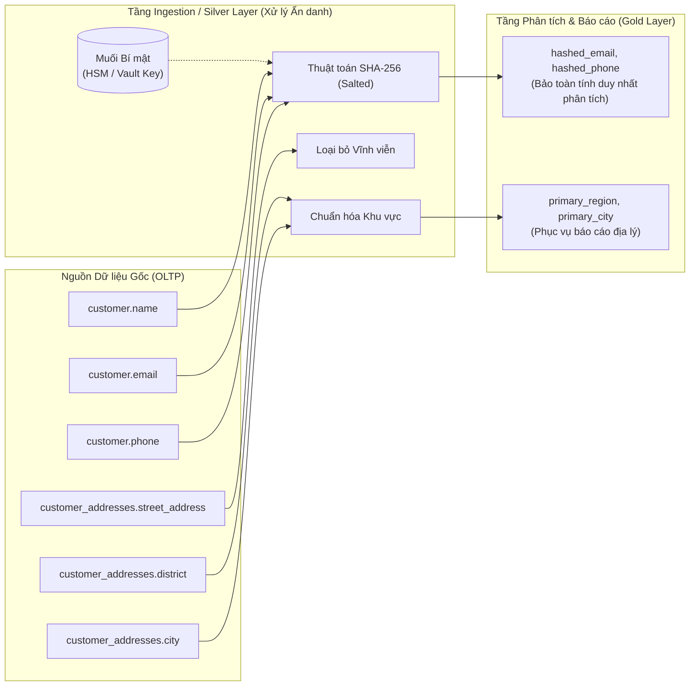
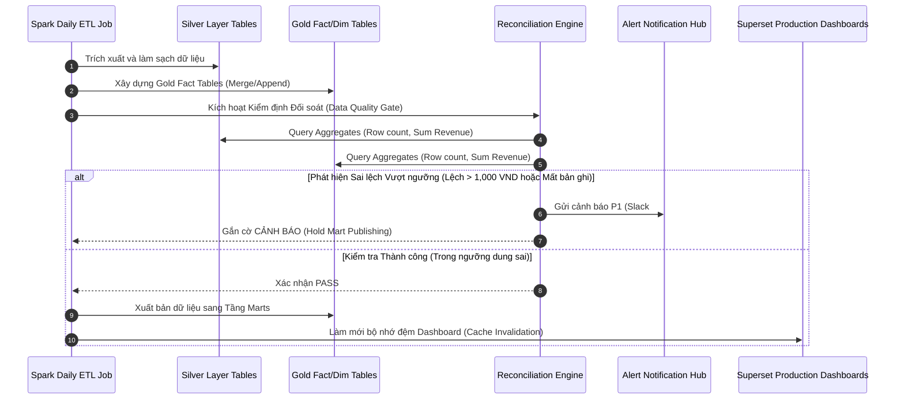
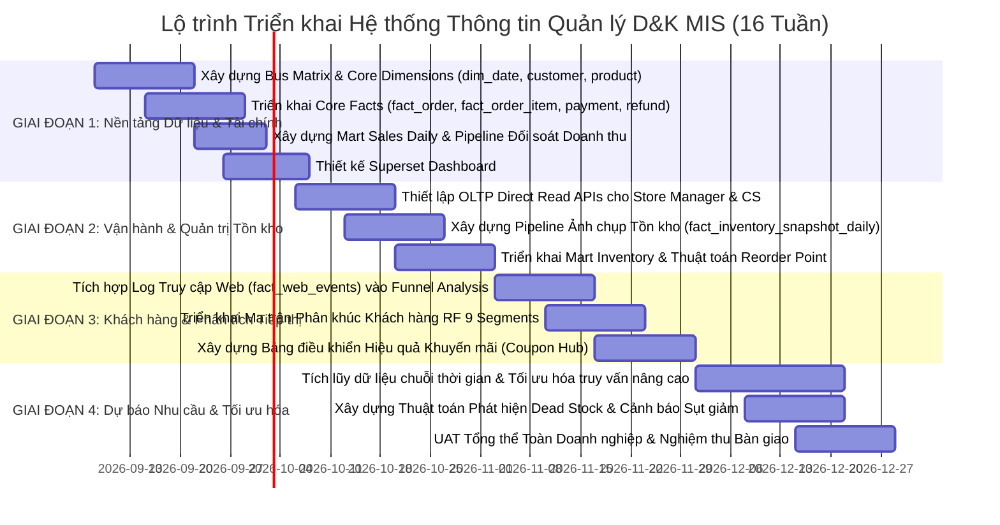
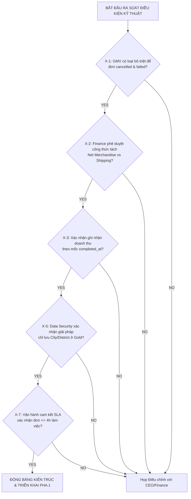

# TÀI LIỆU ĐẶC TẢ PHÂN TÍCH & THIẾT KẾ KỸ THUẬT: HỆ THỐNG THÔNG TIN QUẢN LÝ (MANAGEMENT INFORMATION SYSTEM - MIS)
## Nền Tảng D&K E-Commerce Lakehouse & Analytics Platform

**Mã tài liệu:** SPEC-ARCH-MIS-01  
**Phiên bản:** 1.0 (Tổng hợp chuẩn hóa từ Baseline v1.1)  
**Ngày phê duyệt:** 2026-09-07  
**Phân loại:** Tài liệu Kiến trúc & Thiết kế Hệ thống (System Analysis & Design Specification)  
**Tác giả:** Lead Data Architect / Senior Analytics Engineer  
**Tài liệu tham chiếu:** `MANAGEMENT_INFO_NEEDS.md`, `MANAGEMENT_INFO_REVIEW.md`, `SIGNOFF_RECOMMENDATIONS.md`, `OLTP_SCHEMA.md`, `ACCESS_LOG_DESIGN.md`

---

## MỤC LỤC

1. [TỔNG QUAN HỆ THỐNG & BỐI CẢNH KIẾN TRÚC](#1-tổng-quan-hệ-thống--bối-cảnh-kiến-trúc)
   - 1.1. Mục tiêu và Phạm vi Hệ thống
   - 1.2. Phân định Biên giới Kiến trúc: Operational Plane vs. Analytical Plane
   - 1.3. Luồng luân chuyển Dữ liệu Tổng thể (Data Flow & Topologies)
2. [PHÂN TÍCH NHU CẦU THÔNG TIN & TRACEABILITY MATRIX](#2-phân-tích-nhu-cầu-thông-tin--traceability-matrix)
   - 2.1. Ma trận Phân tích Nhu cầu theo Cấp bậc Quản trị (Stakeholder Requirements)
   - 2.2. Phân loại Phạm vi Triển khai (In-Scope Phase 1 vs. Descope/Deferred Phase 2)
   - 2.3. Ma trận Truy xuất Nguồn gốc (Traceability Matrix: Requirements → Data Objects)
3. [DANH MỤC CHỈ SỐ KỸ THUẬT CHUẨN HÓA (STANDARDIZED METRIC CATALOG)](#3-danh-mục-chỉ-số-kỹ-thuật-chuẩn-hóa-standardized-metric-catalog)
   - 3.1. Nhóm Chỉ số Doanh thu & Kế toán (Revenue & Financial Accounting)
   - 3.2. Nhóm Chỉ số Vận hành Đơn hàng & SLA (Order Lifecycle & SLA)
   - 3.3. Nhóm Chỉ số Quản trị Tồn kho & Cung ứng (Inventory & Replenishment)
   - 3.4. Nhóm Chỉ số Khách hàng & Tăng trưởng (Customer Intelligence & Growth)
   - 3.5. Nhóm Chỉ số Marketing & Khuyến mãi (Marketing & Promotion Efficiency)
4. [THIẾT KẾ MÔ HÌNH DỮ LIỆU CHI TIẾT (DETAILED DATA MODELING)](#4-thiết-kế-mô-hình-dữ-liệu-chi-tiết-detailed-data-modeling)
   - 4.1. Sơ đồ Quan hệ Thực thể Chiều (Dimensional Bus Matrix & Architecture)
   - 4.2. Đặc tả Chi tiết các Bảng Chiều (Dimension Tables Specification)
   - 4.3. Đặc tả Chi tiết các Bảng Sự kiện (Fact Tables Specification)
   - 4.4. Đặc tả Chi tiết các Bảng Tổng hợp Nghiệp vụ (Data Marts Specification)
5. [THIẾT KẾ PHI CHỨC NĂNG, BẢO MẬT & QUẢN TRỊ DỮ LIỆU](#5-thiết-kế-phi-chức-năng-bảo-mật--quản-trị-dữ-liệu)
   - 5.1. Cam kết Mức độ Dịch vụ Dữ liệu (Data Freshness & Processing SLAs)
   - 5.2. Tuân thủ Bảo vệ Dữ liệu Cá nhân (PII Protection & NĐ 13/2023/NĐ-CP)
   - 5.3. Mô hình Kiểm soát Truy cập Dữ liệu (Namespace-Level RBAC)
   - 5.4. Chuẩn hóa Không gian Thời gian (Timezone & Calendar Handling)
   - 5.5. Cổng Kiểm soát Chất lượng & Đối soát Dữ liệu Tự động (Reconciliation Gate)
6. [KẾ HOẠCH TRIỂN KHAI THEO GIAI ĐOẠN & SIGN-OFF GOVERNANCE](#6-kế-hoạch-triển-khai-theo-giai-đoạn--sign-off-governance)
   - 6.1. Lộ trình Triển khai 4 Giai đoạn (Phase Breakdown)
   - 6.2. Danh mục Quyết định Kỹ thuật Đã Sign-off (v1.1 Sign-off Decisions)
   - 6.3. Kế hoạch Kiểm tra Nghiệp vụ Còn Tồn Đọng (Business Verification Items)

---

## 1. TỔNG QUAN HỆ THỐNG & BỐI CẢNH KIẾN TRÚC

### 1.1. Mục tiêu và Phạm vi Hệ thống
Hệ thống Thông tin Quản lý D&K E-Commerce (D&K MIS) là nền tảng báo cáo phân tích toàn diện, được thiết kế nhằm đồng nhất hóa dữ liệu điều hành và ra quyết định chiến lược cho toàn thể doanh nghiệp. Hệ thống hợp nhất hai dòng dữ liệu cốt lõi:
1. **Dữ liệu giao dịch vận hành (OLTP):** 16 bảng quan hệ nghiệp vụ từ MySQL (Orders, Order Items, Customers, Payments, Refunds, Inventory, Coupons, Reviews, Wishlist, Audit Status History,...).
2. **Dữ liệu hành vi người dùng (Web Event Logs):** Dòng log truy cập cấu trúc chuẩn JSON thu thập qua Fluent Bit micro-batch từ gateway/web application.

Mục tiêu cốt lõi của tài liệu này là áp dụng phương pháp luận **Phân tích và Thiết kế Hệ thống (Systems Analysis & Design - SAD)** nhằm chuyển dịch các nhu cầu nghiệp vụ trừu tượng, phân mảnh thành một bản đặc tả kiến trúc kỹ thuật chuẩn mực, đảm bảo:
- **Độc lập và Chuẩn hóa:** Duy nhất một nguồn chân lý (Single Source of Truth) cho mỗi chỉ số (KPI/Metric), loại bỏ tình trạng sai lệch định nghĩa giữa các phòng ban.
- **Tính khả thi kỹ thuật:** Phân tách rõ ràng giữa năng lực dữ liệu hiện có ở Pha 1 và các yêu cầu phụ thuộc hệ thống ngoài được hoãn lại ở Pha 2.
- **Bảo mật và Tuân thủ:** Tự động hóa kiểm soát quyền riêng tư theo Nghị định 13/2023/NĐ-CP và kiểm định chất lượng đối soát (Reconciliation).

### 1.2. Phân định Biên giới Kiến trúc: Operational Plane vs. Analytical Plane
Một trong những khiếm khuyết phổ biến của các hệ thống BI là việc ép buộc tất cả người dùng đọc dữ liệu từ Data Warehouse (DWH), gây ra độ trễ lớn đối với các tác vụ vận hành thời gian thực. Kiến trúc D&K phân tách rõ rệt hai biên giới xử lý:



**Nguyên tắc kiến trúc cốt lõi:**
1. **Operational Plane:** Phục vụ Store Manager và Chăm sóc khách hàng (CS/Ops). Đọc trực tiếp từ OLTP Database qua API tối ưu hóa (độ trễ < 200ms). Không tải qua Spark/DWH vì chu kỳ chạy theo mẻ T+1 không thể đáp ứng việc xử lý đơn hàng hay can thiệp hủy tức thời.
2. **Analytical Plane:** Phục vụ Ban Lãnh đạo (CEO/Board), Tài chính (Finance), Kinh doanh (Sales), Marketing và Quản lý Kho. Dữ liệu được trích xuất, làm sạch, mô hình hóa theo hình sao (Star Schema) và tổng hợp thành các Data Marts trên nền tảng Apache Iceberg/Trino với chu kỳ mẻ hàng ngày (T+1 lúc 02:00 ICT).

### 1.3. Luồng luân chuyển Dữ liệu Tổng thể (Data Flow & Topologies)
Dữ liệu di chuyển qua các tầng kiến trúc theo quy chuẩn Huy chương (Medallion Architecture):
1. **Bronze Layer:** Lưu trữ nguyên bản (raw data) các bảng sao chép từ MySQL OLTP và JSON logs từ S3/MinIO Landing Zone.
2. **Silver Layer:**
   - Thực thi chuẩn hóa kiểu dữ liệu, giải quyết xung đột mã hóa UTF-8.
   - Ẩn danh hóa dữ liệu định danh cá nhân (PII pseudonymization) bằng thuật toán mã băm SHA-256 có muối (Salted Hash) đối với `customer_name`, `email`, `phone_number`.
   - Chuẩn hóa địa chỉ khách hàng: Chỉ trích xuất `region`, `city`, `district` đưa vào chiều phân tích; loại bỏ địa chỉ chi tiết (street address) khỏi kho phân tích.
3. **Gold Layer:**
   - Xây dựng hệ thống bảng Chiều (`dim_*`) và bảng Sự kiện (`fact_*`) theo chuẩn Inmon/Kimball.
   - Tổng hợp các Mart chuyên biệt (`mart_*`) phục vụ trực tiếp các truy vấn của Superset Dashboard.
   - Chạy quy trình đối soát dữ liệu (Reconciliation Gate) độc lập: Tự động so sánh tổng doanh thu, số lượng đơn hàng giữa Silver và Gold trước khi phát hành (publish) cho người dùng cuối.

---

## 2. PHÂN TÍCH NHU CẦU THÔNG TIN & TRACEABILITY MATRIX

### 2.1. Ma trận Phân tích Nhu cầu theo Cấp bậc Quản trị (Stakeholder Requirements)

Hệ thống phục vụ 7 nhóm đối tượng quản trị, mỗi nhóm có mục tiêu nghiệp vụ, độ ưu tiên dữ liệu và phương thức tiếp cận riêng:

| Nhóm Đối tượng | Trách nhiệm Nghiệp vụ Cốt lõi | Nhu cầu Thông tin Trọng yếu | Mức độ Ưu tiên (Doanh thu / Vận hành / KH) | Môi trường Truy xuất |
| :--- | :--- | :--- | :--- | :--- |
| **CEO / Ban Lãnh đạo** | Định hướng chiến lược, tăng trưởng quy mô, tối ưu lợi nhuận tổng thể | GMV, Doanh thu ròng, Tỷ lệ hoàn tiền, AOV, Xu hướng doanh thu theo kỳ, Tăng trưởng MoM/YoY | Doanh thu: ★★★<br>Tồn kho: ★☆☆<br>Khách hàng: ★★☆ | Analytical Plane (Superset) |
| **Tài chính / Kế toán (Finance)** | Ghi nhận doanh thu hợp chuẩn, dòng tiền, chiết khấu và đối soát thanh toán | Doanh thu xác nhận (`completed`), Chiết khấu coupon, Dòng tiền ước tính (Inflow/Outflow), Phân tích lý do hoàn tiền | Doanh thu: ★★★<br>Thanh toán: ★★★<br>Tồn kho: ★☆☆ | Analytical Plane (Superset) |
| **Quản lý Cửa hàng (Store Manager)** | Điều phối xử lý đơn hàng theo ca, giải phóng đơn nghẽn, cảnh báo kho cục bộ | Doanh thu hôm nay (Order Intake/Paid), Hàng đợi đơn cần xác nhận/giao, Tồn kho dưới ngưỡng an toàn, Top bán chạy | Vận hành: ★★★<br>Tồn kho: ★★★<br>Doanh thu: ★★☆ | Operational Plane (OLTP Direct APIs) |
| **Quản lý Bán hàng (Sales Manager)** | Tối ưu hóa danh mục, cơ cấu SKU, phân tích giá trị giỏ hàng và chu kỳ sống sản phẩm | Doanh thu theo danh mục 2 cấp, Tốc độ bán SKU (Velocity), Tác động hết hàng (Stock-out Impact), Phân khúc RF Score | Doanh thu: ★★★<br>Sản phẩm: ★★★<br>Khuyến mãi: ★★★ | Analytical Plane (Superset) |
| **Quản lý Kho (Warehouse Manager)** | Đảm bảo lượng hàng khả dụng, giảm thiểu thất thoát, tối ưu điểm đặt hàng lại | Tồn kho khả dụng (`on_hand`), Ước tính Sell-through, Nhận diện Dead Stock, Cảnh báo variant hết hàng | Tồn kho: ★★★<br>Vận hành: ★★☆<br>Doanh thu: ★☆☆ | Analytical Plane (Superset) + Alerts |
| **Marketing Manager** | Thu hút khách hàng mới, tối ưu hóa tỷ lệ chuyển đổi, đo lường hiệu quả khuyến mãi | Funnel truy cập → đơn hàng, Hiệu suất mã coupon (Efficiency Ratio), Cohort Retention, Phân tích Wishlist | Khách hàng: ★★★<br>Khuyến mãi: ★★★<br>Hành vi: ★★★ | Analytical Plane (Superset) |
| **Chăm sóc Khách hàng (CS/Ops)** | Giám sát chất lượng dịch vụ, xử lý khiếu nại, hỗ trợ tra cứu lịch sử đơn hàng | Tra cứu đơn hàng tức thời, Thời gian xử lý từng giai đoạn (SLA), Customer 360 View, Phân tích nguyên nhân hủy đơn | Vận hành: ★★★<br>Khách hàng: ★★★<br>Doanh thu: ★☆☆ | Operational Plane (Realtime Console) |

### 2.2. Phân loại Phạm vi Triển khai (In-Scope Phase 1 vs. Descope/Deferred Phase 2)

Dựa trên kết quả rà soát dữ liệu nguồn (`OLTP_TABLES.md`) và biên bản thống nhất (`SIGNOFF_RECOMMENDATIONS.md`), phạm vi chức năng được cấu trúc thành hai pha ranh giới minh bạch:

```mermaid
quadrantChart
    title Ma trận Đánh giá & Phân loại Phạm vi Kỹ thuật (SAD Scope Matrix)
    x-axis Độ sẵn sàng của Dữ liệu nguồn (Thấp --> Cao)
    y-axis Giá trị Chiến lược Nghiệp vụ (Thấp --> Cao)
    quadrant-1 "TRIỂN KHAI ƯU TIÊN PHA 1 (Core In-Scope)"
    quadrant-2 "HOÃN PHA 2 (Deferred - Needs System)"
    quadrant-3 "LOẠI BỎ / CẮT GIẢM (Descoped)"
    quadrant-4 "TRIỂN KHAI BỔ SUNG PHA 1 (Fast Follow)"
    "GMV, Net Revenue, AOV": [0.95, 0.95]
    "Star Schema Core (Orders, Items)": [0.90, 0.90]
    "Store Manager Realtime Direct": [0.85, 0.85]
    "Inventory Snapshot Daily": [0.80, 0.88]
    "RF Segmentation (9 Segments)": [0.75, 0.70]
    "Coupon Efficiency Ratio": [0.85, 0.65]
    "Reconciliation Gate (Row/Total)": [0.80, 0.75]
    "Full P&L (COGS, Shipping, Ads)": [0.15, 0.92]
    "Search Keyword & Zero-Result": [0.20, 0.75]
    "Campaign Tracking (UTM Dimension)": [0.25, 0.80]
    "Inventory Movement Audit Trail": [0.10, 0.85]
    "Seasonal Demand Forecasting": [0.30, 0.65]
    "Tax & VAT Ledger Detail": [0.10, 0.40]
```

#### Bảng Tổng hợp Hạng mục Cắt giảm / Hoãn lại (Descope & Deferred Backlog)

| Mã | Hạng mục Yêu cầu Gốc | Hiện trạng Dữ liệu Nguồn | Lý do Kỹ thuật Descope | Giải pháp Thay thế trong Pha 1 | Giai đoạn Thực thi |
| :--- | :--- | :--- | :--- | :--- | :--- |
| **D-1** | Phân tích Từ khóa Tìm kiếm (Top Keywords, Zero-result) | Log truy cập chỉ ghi nhận `ecommerce_action = 'search'`, khuyết thiếu `query_text` và `result_count`. | Không thể trích xuất ngữ nghĩa tìm kiếm nếu Gateway chưa ghi nhận vào payload log. | Đo lường tổng số lượt phát sinh hành động tìm kiếm (Search Events Volume). | Phase 2 (Yêu cầu Backend logging query string) |
| **D-2** | Phân tích Hiệu quả Chiến dịch (Campaign Tracking & UTMs) | Chưa có bảng `campaigns`, thiếu cơ chế map UTM parameters từ Web Log sang đơn hàng. | Thiếu dữ liệu chi phí quảng cáo (Ad Spend) từ Google/Facebook Ads. | Phân tích hiệu suất mã coupon (`dim_coupon`, `fact_coupon_redemption`). | Phase 2 (Xây dựng Campaign Module) |
| **D-3** | Kiểm toán Dòng dịch chuyển Kho (Inventory Movement Audit Trail) | OLTP chỉ có bảng `inventory` (lưu trữ số dư hiện tại), không có bảng ghi log xuất/nhập/điều chuyển kho. | Không có audit trail từng giao dịch vật lý tại thời điểm phát sinh. | Xây dựng bảng `fact_inventory_snapshot_daily` lúc 23:59:59 ICT để suy luận chênh lệch cuối ngày. | Phase 2 (Bổ sung bảng `inventory_movement` trong OLTP) |
| **D-4** | Dự báo Nhu cầu theo Mùa (Seasonal Demand Forecasting) | Dữ liệu lịch sử tích lũy < 12 tháng. | Các thuật toán chuỗi thời gian (ARIMA, Holt-Winters) không thể phát hiện chu kỳ mùa vụ nếu thiếu tối thiểu 2 chu kỳ năm. | Trực quan hóa đường xu hướng lịch sử (Historical Trend) và so sánh cùng kỳ ngắn hạn. | Phase 2 (Khi tích lũy đủ ≥ 12 tháng dữ liệu) |
| **D-5** | Báo cáo Lãi Lỗ Toàn diện (Full P&L Statement) | OLTP không chứa giá vốn (COGS), chi phí vận chuyển thực tế, chi phí tiếp thị và phí cổng thanh toán. | DWH nội bộ không thể giả định chi phí nếu thiếu tích hợp hệ sinh thái ERP/Kế toán. | Xây dựng Chỉ số Biên lợi nhuận Gộp Ước tính (Gross Margin Proxy = Doanh thu ròng - Giảm giá). | Phase 2 (Tích hợp nguồn chi phí kế toán ngoại vi) |
| **D-6** | Báo cáo Thuế Giá trị Gia tăng (VAT / Tax Ledger) | Schema OLTP không có các cột `tax_rate`, `tax_amount`. | Không có căn cứ phân rã đơn giá trước thuế và tiền thuế thực thu. | Giá bán trên đơn hàng mặc định được coi là giá thanh toán cuối cùng. | Phase 2 (Mở rộng trường thuế trong schema OLTP) |
| **D-7** | Phân tích Chuyển đổi Wishlist Lịch sử Chi tiết | Bảng `wishlist_items` chỉ lưu trạng thái cờ `is_present` hiện thời, thiếu log thời gian xóa. | Dữ liệu bị ghi đè (In-place update), làm mất lịch sử tương tác đa điểm chạm. | Đánh giá chuyển đổi cơ bản dựa trên thời điểm thêm đầu tiên (`first_added_at`) so với đơn mua. | Phase 2 (Xây dựng Event Sourcing cho Wishlist) |
| **D-8** | Ma trận RFM 27 Phân khúc Đầy đủ (3×3×3 Cells) | Chia 3 bậc cho cả 3 chiều dẫn tới 27 vi phân khúc, vượt quá năng lực điều phối chiến dịch marketing hiện tại. | Phân mảnh tập khách hàng quá nhỏ, gây nhiễu trong việc thiết lập kịch bản chăm sóc tự động. | Chuẩn hóa ma trận RF (3×3 = 9 segments), tách riêng Monetary thành cờ định danh khách VIP/Spender. | Phase 2 (Mở rộng RFM đa chiều động) |
| **D-9** | Doanh thu Chờ Thực hiện cho Đơn COD (Deferred Revenue) | Đơn COD chưa thu tiền thực tế bị gộp chung vào khái niệm "Deferred Revenue". | Vi phạm chuẩn mực kế toán: Doanh thu chờ thực hiện chỉ phát sinh khi đã nhận tiền của người mua nhưng chưa hoàn tất nghĩa vụ giao hàng. | Tách biệt thành hai thước đo: Deferred Revenue (Online Paid) và Open Order Value (COD Unpaid). | Phase 1 (Đã hoàn thiện chuẩn hóa định nghĩa) |

### 2.3. Ma trận Truy xuất Nguồn gốc (Traceability Matrix: Requirements → Data Objects)

| Yêu cầu Quản trị | Chỉ số Đo lường Kỹ thuật | Bảng Nguồn OLTP / Log | Bảng Silver / Gold DWH | Data Mart Đích | Bảng điều khiển (Dashboard) |
| :--- | :--- | :--- | :--- | :--- | :--- |
| **CEO: Giám sát Tăng trưởng** | GMV, Net Merchandise Revenue, Shipping Revenue | `orders`, `payments`, `refunds` | `fact_order`, `fact_payment`, `fact_refund` | `mart_sales_daily` | CEO Executive Overview |
| **CEO: Hiệu quả Đơn hàng** | AOV, Items per Order, Cancellation Rate | `orders`, `order_items` | `fact_order`, `fact_order_item` | `mart_sales_daily` | CEO Executive Overview |
| **Finance: Ghi nhận Doanh thu** | Confirmed Revenue, Deferred Revenue, Open Order Value | `orders`, `payments` | `fact_order`, `fact_payment` | `mart_sales_daily` | Finance Daily P&L |
| **Finance: Kiểm soát Hoàn tiền** | Refund Amount, Refund Rate by Reason | `refunds`, `orders` | `fact_refund`, `fact_order` | `mart_sales_daily` | Finance Daily P&L |
| **Finance: Dòng tiền Ước tính** | Cash Inflow Proxy, Cash Outflow Proxy, Net Cash Flow | `payments`, `refunds` | `fact_payment`, `fact_refund` | `mart_sales_daily` | Finance Cash Flow Monitor |
| **Store: Vận hành Đơn theo Ca** | Order Intake Today, Paid Today, Completed Today | `orders` (trực tiếp) | Không dùng DWH (Tránh độ trễ T+1) | OLTP Read Replicas | Store Ops Realtime Board |
| **Store: Cảnh báo Tắc nghẽn SLA** | Order Aging (>3 days), Unconfirmed Queue | `orders`, `order_status_history` | Không dùng DWH | OLTP Read Replicas | Store Ops Realtime Board |
| **Sales: Danh mục & SKU** | Category Revenue, SKU Velocity (7d/14d/30d) | `orders`, `order_items`, `products` | `fact_order_item`, `dim_product` | `mart_sales_daily` | Sales Category Performance |
| **Sales: Tác động Hết hàng** | Estimated Lost Revenue, Stock-out Duration | `inventory`, `order_items` | `fact_inventory_snapshot_daily` | `mart_inventory_daily` | Sales Opportunity Loss |
| **Sales: Phân khúc Khách hàng** | RF Score (9 Segments), High Spender Flag | `orders`, `customers` | `fact_order`, `dim_customer` | `mart_customer_rfm` | Customer Segmentation Hub |
| **Warehouse: Quản trị Bổ sung** | Velocity-based Reorder Point, Low Stock Alerts | `inventory`, `order_items` | `fact_inventory_snapshot_daily` | `mart_inventory_daily` | Warehouse Replenishment |
| **Warehouse: Hiệu suất Lưu kho** | Approximate Sell-through, Dead Stock Identification | `inventory`, `order_items` | `fact_inventory_snapshot_daily` | `mart_inventory_daily` | Warehouse Efficiency Report |
| **Marketing: Phân tích Kênh Phễu** | Funnel Conversion Rate (Visitor → Cart → Order) | `access_logs`, `orders` | `fact_web_events`, `fact_order` | `mart_web_funnel_daily` | Marketing Acquisition Funnel |
| **Marketing: Hiệu quả Khuyến mãi** | Coupon Usage Rate, Coupon Efficiency Ratio | `coupons`, `coupon_redemptions` | `fact_coupon_redemption`, `fact_order` | `mart_coupon_performance`| Coupon ROI & Promotion Hub |
| **CS/Ops: Đo lường Chu kỳ Đơn** | Stage Transition Duration, SLA Compliance % | `orders`, `order_status_history` | `fact_order_status_transition` | `mart_order_sla` | CS Operational Excellence |
| **CS/Ops: Đánh giá Không hài lòng**| Dissatisfaction Proxy (Cancel + Refund + Rating ≤ 2) | `orders`, `refunds`, `product_reviews` | `fact_order`, `fact_refund`, `fact_product_review` | `mart_order_sla` | Customer Feedback Analytics |

---

## 3. DANH MỤC CHỈ SỐ KỸ THUẬT CHUẨN HÓA (STANDARDIZED METRIC CATALOG)

Mọi chỉ số đều được chuẩn hóa theo quy tắc: **Duy nhất một công thức đại số, minh định rõ mốc thời gian đánh dấu sự kiện và điều kiện loại trừ trạng thái.**

### 3.1. Nhóm Chỉ số Doanh thu & Kế toán (Revenue & Financial Accounting)

#### M-01: Tổng Giá trị Giao dịch Hàng hóa (GMV - Gross Merchandise Value)
- **Bản chất nghiệp vụ:** Tổng giá trị niêm yết của toàn bộ hàng hóa được khách hàng đặt thành công qua hệ thống trong kỳ phân tích, trước khi áp dụng chiết khấu và phí vận chuyển.
- **Công thức đại số:**
  $$\text{GMV} = \sum (\text{orders.subtotal\_vnd})$$
- **Điều kiện lọc:**
  - `orders.status IN ('paid', 'confirmed', 'completed')`
  - `orders.created_at` nằm trong khoảng thời gian phân tích.
  - **LOẠI BỎ TRIỆT ĐỂ:** `status IN ('payment_failed', 'cancelled')`.
- **Ranh giới kế toán:** KHÔNG bao gồm phí vận chuyển (`shipping_fee_vnd`), KHÔNG trừ chiết khấu (`discount_amount_vnd`), KHÔNG trừ tiền hoàn (`refunds`).
- **Nguồn dữ liệu:** `fact_order` (Gold) / Partition by `order_date_key`.

#### M-02: Doanh thu Hàng hóa Ròng (Net Merchandise Revenue)
- **Bản chất nghiệp vụ:** Doanh thu thực tế phát sinh từ hàng hóa sau khi trừ tiền khuyến mãi/chiết khấu và trừ đi các khoản hoàn tiền hàng hóa thành công.
- **Công thức đại số:**
  $$\text{Net Merchandise Revenue} = \sum (\text{orders.subtotal\_vnd} - \text{orders.discount\_amount\_vnd}) - \sum (\text{merchandise\_refunds.amount\_vnd})$$
- **Điều kiện lọc:**
  - Orders: `status IN ('paid', 'confirmed', 'completed')`.
  - Refunds: `refund_status = 'succeeded'`.
- **Lưu ý phòng chống Double-counting:** Bảng `orders.total_vnd` trong OLTP đã bao gồm phép tính:
  $$\text{total\_vnd} = \text{subtotal\_vnd} - \text{discount\_amount\_vnd} + \text{shipping\_fee\_vnd}$$
  Do đó, khi tính toán Doanh thu Ròng Hàng hóa, phải bóc tách riêng cấu phần `subtotal - discount` thay vì lấy trực tiếp `total_vnd` rồi tiếp tục trừ chiết khấu lần thứ hai.

#### M-03: Doanh thu Vận chuyển (Shipping Revenue)
- **Bản chất nghiệp vụ:** Khoản phí vận chuyển thực thu từ khách hàng, dùng để đối soát độc lập với chi phí dịch vụ logistics 3PL.
- **Công thức đại số:**
  $$\text{Shipping Revenue} = \sum (\text{orders.shipping\_fee\_vnd}) - \sum (\text{shipping\_refunds.amount\_vnd})$$
- **Điều kiện lọc:** Đơn hàng có `status IN ('paid', 'confirmed', 'completed')`.

#### M-04: Doanh thu Xác nhận Kế toán (Confirmed / Recognized Revenue)
- **Bản chất nghiệp vụ:** Doanh thu chính thức được phép ghi nhận vào Báo cáo Kết quả Hoạt động Kinh doanh (P&L) theo nguyên tắc dồn tích của kế toán Việt Nam (chỉ ghi nhận khi hoàn tất chuyển giao rủi ro và quyền sở hữu hàng hóa).
- **Công thức đại số:**
  $$\text{Confirmed Revenue} = \sum (\text{orders.total\_vnd})$$
- **Điều kiện lọc:**
  - Bắt buộc `orders.status = 'completed'`.
  - Mốc thời gian hạch toán: Tính theo **`orders.completed_at`** (ngày khách nhận hàng thành công), tuyệt đối KHÔNG hạch toán theo `created_at`.

#### M-05: Doanh thu Chờ Thực hiện vs. Giá trị Đơn COD Đang luân chuyển
Nhằm loại trừ rủi ro phân loại sai lệch chuẩn mực kế toán tài chính, hệ thống bóc tách thành 2 chỉ tiêu riêng biệt:
1. **Doanh thu Chờ Thực hiện Thực sự (True Deferred Revenue):**
   - Giá trị các đơn hàng mà khách hàng **đã thanh toán trực tuyến thành công** nhưng doanh nghiệp chưa hoàn tất nghĩa vụ giao hàng.
   - Điều kiện: Đơn có thanh toán `payments.status = 'succeeded'` VÀ `orders.status IN ('paid', 'confirmed')` VÀ `orders.completed_at IS NULL`.
2. **Giá trị Đơn hàng COD Đang Mở (Open Order Value - COD):**
   - Giá trị hàng hóa đang được vận chuyển theo hình thức COD chưa thu tiền.
   - Điều kiện: Đơn thanh toán COD có `orders.status IN ('paid', 'confirmed')` VÀ chưa hoàn tất thanh toán/giao hàng. Tuyệt đối KHÔNG gộp vào tài khoản nợ phải trả / doanh thu hoãn lại.

#### M-06: Dòng tiền Thực thu / Thực chi Ước tính (Cash Flow Proxies)
- **Dòng tiền vào (Cash Inflow Proxy):** Tổng số tiền thanh toán thực tế thành công ghi nhận từ các cổng thanh toán/thu tiền trong kỳ:
  $$\text{Cash Inflow} = \sum (\text{payments.amount\_vnd}) \quad \text{WHERE } \text{status} = \text{'succeeded'} \text{ AND } \text{attempted\_at} \in \text{Kỳ}$$
- **Dòng tiền ra (Cash Outflow Proxy):** Tổng số tiền hoàn trả khách hàng đã giải ngân thành công trong kỳ:
  $$\text{Cash Outflow} = \sum (\text{refunds.amount\_vnd}) \quad \text{WHERE } \text{status} = \text{'succeeded'} \text{ AND } \text{created\_at} \in \text{Kỳ}$$
- **Dòng tiền thuần (Net Operating Cash Flow):** $\text{Net Cash Flow} = \text{Cash Inflow} - \text{Cash Outflow}$.

---

### 3.2. Nhóm Chỉ số Vận hành Đơn hàng & SLA (Order Lifecycle & SLA)

#### M-07: Bộ ba Chỉ số Doanh thu Vận hành Cửa hàng (Store Operational Revenue Triumvirate)
Để dập tắt hoàn toàn sự nhầm lẫn giữa mốc tạo đơn và mốc thu tiền tại cấp cửa hàng, hệ thống nghiêm cấm sử dụng một chỉ số mang tên chung "Daily Revenue", thay vào đó bắt buộc hiển thị 3 chỉ số độc lập:
1. **Giá trị Đơn Tiếp nhận Trong ngày (Order Intake Today):**
   - $\sum (\text{total\_vnd})$ của tất cả các đơn tạo mới trong ngày: `CAST(created_at AS DATE) = CURRENT_DATE(ICT)`.
2. **Giá trị Đơn Đã Thu tiền Trong ngày (Paid Today):**
   - $\sum (\text{total\_vnd})$ của các đơn hoàn tất thanh toán trong ngày: `CAST(paid_at AS DATE) = CURRENT_DATE(ICT)`.
3. **Giá trị Đơn Giao Hoàn tất Trong ngày (Completed Today):**
   - $\sum (\text{total\_vnd})$ của các đơn bàn giao thành công trong ngày: `CAST(completed_at AS DATE) = CURRENT_DATE(ICT)`.

#### M-08: Tuổi Đơn hàng & Thời gian Xử lý Tồn đọng (Order Aging)
- **Tổng tuổi thọ đơn hàng (Order Existence Age):**
  $$\text{Age}_{\text{total}} = \text{DATEDIFF}(\text{NOW}(), \text{orders.created\_at}) \quad [\text{Đơn vị: Giờ/Ngày}]$$
- **Tuổi đơn cần hành động vận hành (Actionable Backlog Age):**
  - Áp dụng cho các đơn ở trạng thái cần xử lý (`status = 'paid'` chờ xác nhận):
  $$\text{Age}_{\text{pending}} = \text{DATEDIFF}(\text{NOW}(), \text{orders.paid\_at})$$
  - Ngưỡng cảnh báo đỏ: $\text{Age}_{\text{pending}} > 4 \text{ giờ làm việc}$ (Khung giờ hành chính: 08:00 - 22:00 ICT).

#### M-09: Tỷ lệ Tuân thủ Thời gian Cam kết Dịch vụ (SLA Compliance Rate)
- **Ngưỡng SLA chuẩn hóa:**
  - Giai đoạn Xác nhận (Paid $\rightarrow$ Confirmed): $\le 4 \text{ giờ làm việc}$ (tính trong khoảng 08:00 - 22:00 ICT).
  - Giai đoạn Đóng gói & Bàn giao (Confirmed $\rightarrow$ Completed): $\le 72 \text{ giờ}$ (3 ngày lịch).
  - Giai đoạn Xử lý Khiếu nại & Hoàn tiền (Refund Requested $\rightarrow$ Succeeded): $\le 5 \text{ ngày làm việc}$.
- **Công thức tính:**
  $$\text{SLA Compliance \%} = \frac{\text{Số đơn thỏa mãn toàn bộ các mốc thời gian chuẩn}}{\text{Tổng số đơn hoàn tất}} \times 100$$

#### M-10: Chỉ số Bất mãn Khách hàng Tổng hợp (Customer Dissatisfaction Proxy)
Trong bối cảnh Pha 1 chưa tích hợp hệ thống tiếp nhận vé khiếu nại (Ticketing System), hệ thống đo lường mức độ không hài lòng thông qua công thức kết hợp 3 tín hiệu cảnh báo:
$$\text{Dissatisfaction Event} \iff (\text{Order status} = \text{'cancelled'}) \lor (\text{Has succeeded refund}) \lor (\text{Product review rating} \le 2)$$

---

### 3.3. Nhóm Chỉ số Quản trị Tồn kho & Cung ứng (Inventory & Replenishment)

#### M-11: Điểm Đặt Hàng Lại Động theo Tốc độ Bán (Velocity-based Dynamic Reorder Point)
Loại bỏ hoàn toàn ngưỡng cứng tĩnh (`on_hand < 10`), áp dụng mô hình định lượng chuỗi cung ứng:
$$\text{Reorder Point (ROP)} = (\text{Velocity}_{7d} \times \text{Lead Time}_{\text{default}}) + \text{Safety Stock}$$
Trong đó:
- $\text{Velocity}_{7d}$: Tốc độ tiêu thụ trung bình mỗi ngày của variant trong 7 ngày gần nhất:
  $$\text{Velocity}_{7d} = \frac{\sum_{t-7}^{t} \text{quantity\_sold}}{7}$$
- $\text{Lead Time}_{\text{default}}$: Thời gian bổ sung hàng mặc định ngành thời trang may mặc Việt Nam = $14 \text{ ngày}$ (7 ngày chốt hợp đồng & sản xuất + 3 ngày vận chuyển + 4 ngày kiểm kho).
- $\text{Safety Stock}$: Tồn kho an toàn dự phòng biến động = $10\% \times (\text{Velocity}_{30d} \times \text{Lead Time}_{\text{default}})$.
- **Ngưỡng sàn tuyệt đối (Absolute Floor):** Bất kể vận tốc bán, nếu $\text{on\_hand} \le 5$, hệ thống lập tức kích hoạt cờ cảnh báo nguy cấp.

#### M-12: Tỷ lệ Bán hết Ước tính (Approximate Sell-through Rate)
- **Đặc tả:** Phản ánh hiệu quả giải phóng hàng tồn của một variant/danh mục trong kỳ.
- **Công thức đại số:**
  $$\text{Approximate Sell-through \%} = \frac{\sum \text{quantity\_sold trong kỳ}}{\text{opening\_stock đầu kỳ}} \times 100$$
- **Điều kiện ràng buộc kỹ thuật (Technical Disclaimer):** Thước đo này được gán nhãn "Xấp xỉ (Approximate)" trong Pha 1 vì được tính toán dựa trên sự so sánh giữa bảng `fact_order_item` và `fact_inventory_snapshot_daily`. Công thức này chỉ phản ánh chính xác khi không có đột biến nhập kho lớn (Goods Receipts) hoặc điều chỉnh kiểm kê đột xuất trong kỳ.

#### M-13: Định danh Hàng Tồn Chết (Dead Stock Identification)
Một biến thể sản phẩm (SKU/Variant) bị hệ thống gắn cờ là "Hàng tồn chết" khi và chỉ khi thỏa mãn đồng thời 4 điều kiện:
1. `dim_variant.is_active = TRUE` (Sản phẩm vẫn đang mở bán trên hệ thống).
2. `inventory.on_hand > 0` (Thực tế vẫn còn đọng vốn lưu kho).
3. **Không phát sinh bất kỳ đơn hàng thành công nào trong vòng 90 ngày liên tục.**
4. **Không rơi vào trạng thái hết hàng liên tục trong 90 ngày** (loại trừ trường hợp không bán được do hết hàng từ trước).
*Lưu ý:* Loại bỏ điều kiện kiểm tra lưu lượng truy cập (Web Traffic), vì sản phẩm dù không có người xem nhưng còn tồn hàng vẫn là hàng ứ đọng vốn.

---

### 3.4. Nhóm Chỉ số Khách hàng & Tăng trưởng (Customer Intelligence & Growth)

#### M-14: Tỷ lệ Chuyển đổi Phễu Người dùng (Funnel Conversion Rate)
- **Công thức đại số:**
  $$\text{Conversion Rate \%} = \frac{\text{COUNT}(\text{DISTINCT } \text{order\_id}) \text{ có } \text{status} \in (\text{'paid', 'confirmed', 'completed'})}{\text{COUNT}(\text{DISTINCT } \text{session\_id}) \text{ có } \ge 1 \text{ sự kiện 'page\_view'}} \times 100$$
- **Cơ chế dự phòng (Fallback Mechanism):** Nếu tầng Web Log bị khuyết thiếu `session_id`, hệ thống tự động thay thế bằng định danh:
  $$\text{Synthetic Session Key} = \text{actor\_key (hoặc anonymous\_cookie)} + \text{CAST(event\_ts AS DATE)}$$

#### M-15: Phân khúc Khách hàng RF (RF Matrix 9 Segments)
Trong Pha 1, chiều Phân khúc RFM được chuẩn hóa thành ma trận 2 chiều độc lập:



- **Phân vị Recency (R - Số ngày kể từ đơn cuối):**
  - R = 3 (Gần đây): $\le 30 \text{ ngày}$
  - R = 2 (Trung bình): $31 - 90 \text{ ngày}$
  - R = 1 (Xa): $> 90 \text{ ngày}$
- **Phân vị Frequency (F - Số lượng đơn completed trong 12 tháng):**
  - F = 3 (Mua thường xuyên): $\ge 4 \text{ đơn}$
  - F = 2 (Mua lặp lại): $2 - 3 \text{ đơn}$
  - F = 1 (Mua một lần): $1 \text{ đơn}$
- **Cờ Giá trị Tiền tệ Độc lập (Monetary Flag - M):**
  - `is_high_spender = TRUE`: Nếu tổng chi tiêu tích lũy $\ge 5,000,000 \text{ VND}$ (top 10% khách chi tiêu cao nhất). Cờ này dùng để lọc danh sách ưu tiên đặc quyền VIP mà không làm vỡ 9 ô ma trận vận hành.

#### M-16: Giá trị Vòng đời Khách hàng Lịch sử (Historical CLV)
- **Công thức đại số:**
  $$\text{Historical CLV} = \frac{\sum (\text{orders.total\_vnd}) \quad [\text{status} = \text{'completed'}]}{\text{COUNT}(\text{DISTINCT } \text{customers có } \ge 1 \text{ completed order})}$$
- **Phân định rõ:** Đây là giá trị chi tiêu thực tế trong quá khứ, không phải là giá trị dự đoán tương lai (Predictive CLV).

---

### 3.5. Nhóm Chỉ số Marketing & Khuyến mãi (Marketing & Promotion Efficiency)

#### M-17: Tỷ số Hiệu quả Mã Khuyến mãi (Coupon Efficiency Ratio)
- **Chuẩn hóa danh xưng:** Không gọi là "Coupon ROI" do không thể tách biệt chính xác doanh thu tăng thêm tự nhiên (organic incremental revenue) nếu thiếu nhóm đối chứng (Control Group A/B testing).
- **Công thức đại số:**
  $$\text{Coupon Efficiency Ratio} = \frac{\text{Net Merchandise Revenue từ các đơn có áp dụng Coupon}}{\sum (\text{discount\_amount\_vnd})}$$
- **Ý nghĩa:** Mỗi 1 đồng giảm giá tạo ra bao nhiêu đồng doanh thu ròng. Tỷ số $> 5.0$ được coi là chiến dịch hiệu quả trong ngành bán lẻ thời trang.

#### M-18: Tỷ lệ Thu hồi Giải phóng Mã (Coupon Release Rate)
- **Công thức:**
  $$\text{Coupon Release Rate \%} = \frac{\text{COUNT}(\text{redemptions có } \text{status} = \text{'released'})}{\text{COUNT}(\text{redemptions có } \text{status} \in (\text{'redeemed', 'released'}))} \times 100$$
- **Ý nghĩa:** Đo lường tỷ lệ lãng phí ngân sách hoặc tỷ lệ khách áp mã nhưng hủy đơn hàng.

---

## 4. THIẾT KẾ MÔ HÌNH DỮ LIỆU CHI TIẾT (DETAILED DATA MODELING)

Mô hình dữ liệu Gold Layer được thiết kế theo cấu trúc Ngôi sao (Kimball Star Schema) với Bus Matrix rõ ràng, phục vụ tối ưu cho công cụ truy vấn phân tán Trino và trực quan hóa Apache Superset.

### 4.1. Sơ đồ Quan hệ Thực thể Chiều (Dimensional Bus Matrix & Architecture)



### 4.2. Đặc tả Chi tiết các Bảng Chiều (Dimension Tables Specification)

#### Bảng `dim_date` (Trục Thời gian Tiêu chuẩn Doanh nghiệp)
- **Mục tiêu:** Bảng chiều tĩnh, định chuẩn toàn bộ các mốc ngày, tuần, tháng, quý tài chính, loại bỏ việc dùng hàm thời gian động khi query.
- **Hạt dữ liệu (Grain):** 1 dòng tương ứng với 1 ngày lịch.

| Tên Cột | Kiểu Dữ liệu | Nullable | Ràng buộc / Khóa | Mô tả Kỹ thuật & Giá trị |
| :--- | :--- | :--- | :--- | :--- |
| `date_key` | INT | NO | Primary Key | Định dạng khóa số nguyên: `YYYYMMDD` (Ví dụ: `20260907`) |
| `full_date` | DATE | NO | Unique | Ngày dương lịch tương ứng (`2026-09-07`) |
| `year` | INT | NO | | Năm (`2026`) |
| `quarter` | INT | NO | | Quý trong năm (1, 2, 3, 4) |
| `month` | INT | NO | | Tháng trong năm (1 đến 12) |
| `month_name` | VARCHAR(20) | NO | | Tên tháng tiếng Anh (`September`) |
| `week_of_year` | INT | NO | | Tuần thứ bao nhiêu trong năm theo chuẩn ISO-8601 (1 đến 53) |
| `day_of_month` | INT | NO | | Ngày trong tháng (1 đến 31) |
| `day_of_week` | INT | NO | | Ngày trong tuần (1 = Chủ Nhật, 2 = Thứ Hai, ..., 7 = Thứ Bảy) |
| `day_name` | VARCHAR(20) | NO | | Tên ngày (`Monday`, `Tuesday`,...) |
| `is_weekend` | BOOLEAN | NO | | Cờ ngày cuối tuần (`TRUE` nếu là Thứ Bảy hoặc Chủ Nhật) |
| `is_holiday` | BOOLEAN | NO | | Cờ ngày lễ quốc gia Việt Nam (`TRUE` nếu là Tết, 30/4, 1/5, 2/9,...) |
| `fiscal_year` | INT | NO | | Năm tài chính (Theo chuẩn kế toán VN: Bằng năm lịch dương) |
| `fiscal_quarter` | INT | NO | | Quý tài chính (Q1: T1-T3, Q2: T4-T6, Q3: T7-T9, Q4: T10-T12) |

---

#### Bảng `dim_customer` (Khách hàng Ẩn danh Tuân thủ)
- **Mục tiêu:** Lưu trữ hồ sơ định danh phân tích khách hàng, đã bóc tách hoàn toàn PII nhạy cảm.
- **Hạt dữ liệu (Grain):** 1 dòng tương ứng với 1 tài khoản khách hàng.

| Tên Cột | Kiểu Dữ liệu | Nullable | Ràng buộc / Khóa | Mô tả Kỹ thuật & Giá trị |
| :--- | :--- | :--- | :--- | :--- |
| `customer_key` | BIGINT | NO | Primary Key | Khóa đại diện thay thế (Surrogate Key) tự sinh |
| `customer_id` | BIGINT | NO | Natural Key | Khóa tự nhiên từ bảng `customers.id` của OLTP |
| `public_id` | VARCHAR(36) | NO | | Mã UUID công khai của khách hàng (`customers.public_id`) |
| `hashed_email` | VARCHAR(64) | NO | Index | Băm SHA-256 có Salt bí mật từ địa chỉ email |
| `hashed_phone` | VARCHAR(64) | YES | Index | Băm SHA-256 có Salt bí mật từ số điện thoại |
| `status` | VARCHAR(30) | NO | | Trạng thái tài khoản (`active`, `suspended`, `deleted`) |
| `role` | VARCHAR(20) | NO | | Vai trò (`customer`, `admin`, `staff`) |
| `acquisition_date_key` | INT | NO | Foreign Key | Khóa ngày khách hàng đăng ký tài khoản $\rightarrow$ `dim_date` |
| `first_order_date_key` | INT | YES | Foreign Key | Khóa ngày phát sinh đơn hàng đầu tiên |
| `latest_order_date_key` | INT | YES | Foreign Key | Khóa ngày phát sinh đơn hàng gần nhất |
| `primary_region` | VARCHAR(100) | YES | | Vùng miền mặc định giao dịch (Ví dụ: Miền Nam, Miền Bắc) |
| `primary_city` | VARCHAR(100) | YES | | Tỉnh / Thành phố giao dịch chính (Ví dụ: TP. Hồ Chí Minh) |
| `created_at` | TIMESTAMP | NO | | Thời điểm tạo bản ghi nguồn (UTC) |
| `updated_at` | TIMESTAMP | NO | | Thời điểm cập nhật cuối cùng (UTC) |

---

#### Bảng `dim_product` (Danh mục Sản phẩm)
- **Mục tiêu:** Quản lý thông tin cấp sản phẩm gốc (Parent Product/Style).
- **Hạt dữ liệu (Grain):** 1 dòng tương ứng với 1 sản phẩm.

| Tên Cột | Kiểu Dữ liệu | Nullable | Ràng buộc / Khóa | Mô tả Kỹ thuật & Giá trị |
| :--- | :--- | :--- | :--- | :--- |
| `product_key` | BIGINT | NO | Primary Key | Surrogate Key tự sinh |
| `product_id` | BIGINT | NO | Natural Key | `products.id` từ OLTP |
| `public_id` | VARCHAR(36) | NO | | UUID của sản phẩm |
| `product_name` | VARCHAR(255) | NO | | Tên sản phẩm chính thức |
| `slug` | VARCHAR(255) | NO | | Đường dẫn URL thân thiện của sản phẩm |
| `category_key` | BIGINT | NO | Foreign Key | Tham chiếu khóa danh mục $\rightarrow$ `dim_category` |
| `is_active` | BOOLEAN | NO | | Cờ trạng thái kinh doanh (`TRUE` = đang bán, `FALSE` = ngừng bán) |
| `is_archived` | BOOLEAN | NO | | Cờ lưu trữ lịch sử (`TRUE` = đã đưa vào kho lưu trữ) |
| `created_date_key` | INT | NO | Foreign Key | Ngày tạo sản phẩm trên hệ thống $\rightarrow$ `dim_date` |
| `launch_date_key` | INT | YES | Foreign Key | Ngày chính thức mở bán (nếu có) $\rightarrow$ `dim_date` |
| `first_order_date_key` | INT | YES | Foreign Key | Ngày phát sinh đơn hàng đầu tiên trong lịch sử |

---

#### Bảng `dim_category` (Phân cấp Danh mục 2 Cấp)
- **Mục tiêu:** Chuẩn hóa cây phân cấp hàng hóa 2 cấp độ (Level 1: Nhóm ngành, Level 2: Loại sản phẩm).
- **Hạt dữ liệu (Grain):** 1 dòng tương ứng với 1 danh mục.

| Tên Cột | Kiểu Dữ liệu | Nullable | Ràng buộc / Khóa | Mô tả Kỹ thuật & Giá trị |
| :--- | :--- | :--- | :--- | :--- |
| `category_key` | BIGINT | NO | Primary Key | Surrogate Key |
| `category_id` | BIGINT | NO | Natural Key | `categories.id` từ OLTP |
| `category_code` | VARCHAR(50) | NO | | Mã danh mục (`MEN_TSHIRT`, `WOMEN_DRESS`,...) |
| `category_name` | VARCHAR(100) | NO | | Tên hiển thị của danh mục |
| `parent_category_key`| BIGINT | YES | Foreign Key | Tự tham chiếu cấp cha $\rightarrow$ `dim_category.category_key` |
| `level` | INT | NO | | Cấp bậc danh mục (1 = Cấp cao nhất, 2 = Cấp sản phẩm trực tiếp) |
| `is_active` | BOOLEAN | NO | | Cờ hiệu lực của danh mục |

---

#### Bảng `dim_variant` (Biến thể SKU Hàng hóa)
- **Mục tiêu:** Quản lý chi tiết từng đơn vị lưu kho (SKU) với kích thước và màu sắc.
- **Hạt dữ liệu (Grain):** 1 dòng tương ứng với 1 SKU variant.

| Tên Cột | Kiểu Dữ liệu | Nullable | Ràng buộc / Khóa | Mô tả Kỹ thuật & Giá trị |
| :--- | :--- | :--- | :--- | :--- |
| `variant_key` | BIGINT | NO | Primary Key | Surrogate Key |
| `variant_id` | BIGINT | NO | Natural Key | `product_variants.id` từ OLTP |
| `product_key` | BIGINT | NO | Foreign Key | Tham chiếu sản phẩm cha $\rightarrow$ `dim_product` |
| `sku` | VARCHAR(100) | NO | Unique Index | Mã định danh lưu kho duy nhất (SKU code) |
| `size_code` | VARCHAR(20) | NO | | Mã kích cỡ (`S`, `M`, `L`, `XL`, `XXL`,...) |
| `color_code` | VARCHAR(30) | NO | | Mã hoặc tên màu (`BLACK`, `WHITE`, `NAVY`,...) |
| `price_vnd` | BIGINT | NO | | Giá niêm yết hiện thời (VND) |
| `is_active` | BOOLEAN | NO | | Trạng thái khả dụng |

---

#### Bảng `dim_coupon` (Chương trình Khuyến mãi / Mã Giảm giá)
- **Mục tiêu:** Quản lý thông số các mã chiết khấu.
- **Hạt dữ liệu (Grain):** 1 dòng tương ứng với 1 mã coupon.

| Tên Cột | Kiểu Dữ liệu | Nullable | Ràng buộc / Khóa | Mô tả Kỹ thuật & Giá trị |
| :--- | :--- | :--- | :--- | :--- |
| `coupon_key` | BIGINT | NO | Primary Key | Surrogate Key |
| `coupon_id` | BIGINT | NO | Natural Key | `coupons.id` từ OLTP |
| `coupon_code` | VARCHAR(50) | NO | Index | Mã hiển thị (`SUMMER2026`, `VIP10`,...) |
| `discount_type` | VARCHAR(20) | NO | | Loại giảm giá (`percentage`, `fixed_amount`) |
| `discount_value` | BIGINT | NO | | Giá trị chiết khấu (% hoặc số tiền VND) |
| `min_subtotal_vnd` | BIGINT | NO | | Giá trị đơn tối thiểu để thỏa điều kiện áp dụng |
| `starts_at` | TIMESTAMP | NO | | Thời điểm hiệu lực (UTC) |
| `ends_at` | TIMESTAMP | NO | | Thời điểm hết hạn (UTC) |
| `total_usage_limit` | INT | YES | | Giới hạn số lần dùng tối đa toàn hệ thống (NULL = Không giới hạn) |
| `per_customer_limit`| INT | NO | | Giới hạn số lần dùng trên mỗi tài khoản khách |
| `is_active` | BOOLEAN | NO | | Cờ trạng thái kích hoạt |

---

#### Bảng `dim_order_status` (Bảng Chiều Trạng thái Đơn hàng Chuẩn)
- **Mục tiêu:** Chuẩn hóa các trạng thái vòng đời đơn hàng, hỗ trợ gom nhóm trạng thái cho báo cáo cấp cao.
- **Hạt dữ liệu (Grain):** 1 dòng tương ứng với 1 mã trạng thái.

| Tên Cột | Kiểu Dữ liệu | Nullable | Ràng buộc / Khóa | Mô tả Kỹ thuật & Giá trị |
| :--- | :--- | :--- | :--- | :--- |
| `status_key` | INT | NO | Primary Key | Mã khóa số đại diện |
| `status_code` | VARCHAR(30) | NO | Unique | Mã nghiệp vụ (`paid`, `confirmed`, `completed`, `cancelled`,...) |
| `status_name_vi`| VARCHAR(50) | NO | | Tên tiếng Việt hiển thị trên báo cáo |
| `status_group` | VARCHAR(30) | NO | | Gom nhóm cấp cao (`OPEN`, `FULFILLED`, `TERMINATED`) |
| `is_revenue_eligible`| BOOLEAN | NO | | Cờ cho phép tính GMV (`TRUE` cho paid, confirmed, completed) |

---

### 4.3. Đặc tả Chi tiết các Bảng Sự kiện (Fact Tables Specification)

#### Bảng `fact_order` (Sự kiện Đơn hàng Tổng hợp Cấp Header)
- **Hạt dữ liệu (Grain):** 1 dòng tương ứng với 1 đơn hàng (`order_id`).
- **Chiến lược Phân vùng (Partitioning):** Phân vùng theo `order_date_key` (gom nhóm theo Tháng: `YYYYMM`).
- **Chế độ ghi (Write Mode):** `MERGE INTO` (Hỗ trợ cập nhật trạng thái đơn hàng khi chuyển dịch vòng đời).

| Tên Cột | Kiểu Dữ liệu | Nullable | Ràng buộc / Khóa | Ý nghĩa Nghiệp vụ & Nguồn Dữ liệu |
| :--- | :--- | :--- | :--- | :--- |
| `order_key` | BIGINT | NO | Primary Key | Surrogate Key tự sinh |
| `order_id` | BIGINT | NO | Natural Key | `orders.id` từ OLTP |
| `order_number` | VARCHAR(50) | NO | Index | Mã số đơn hiển thị với khách (`orders.order_number`) |
| `order_date_key` | INT | NO | FK / Partition | Ngày tạo đơn `created_at` $\rightarrow$ `dim_date.date_key` |
| `paid_date_key` | INT | YES | Foreign Key | Ngày thanh toán thành công $\rightarrow$ `dim_date` |
| `completed_date_key`| INT | YES | Foreign Key | Ngày giao hàng thành công $\rightarrow$ `dim_date` |
| `customer_key` | BIGINT | NO | Foreign Key | Tham chiếu khách hàng $\rightarrow$ `dim_customer.customer_key` |
| `coupon_key` | BIGINT | YES | Foreign Key | Tham chiếu mã coupon $\rightarrow$ `dim_coupon.coupon_key` |
| `status_key` | INT | NO | Foreign Key | Trạng thái hiện thời $\rightarrow$ `dim_order_status.status_key` |
| `subtotal_vnd` | BIGINT | NO | Measure | Tổng tiền hàng trước chiết khấu (`orders.subtotal_vnd`) |
| `discount_amount_vnd`| BIGINT | NO | Measure | Tiền chiết khấu coupon (`orders.discount_amount_vnd`) |
| `shipping_fee_vnd` | BIGINT | NO | Measure | Phí vận chuyển thu của khách (`orders.shipping_fee_vnd`) |
| `total_vnd` | BIGINT | NO | Measure | Tổng tiền phải thu trên hóa đơn (`orders.total_vnd`) |
| `item_count` | INT | NO | Measure | Tổng số lượng mặt hàng trong đơn |
| `is_paid` | BOOLEAN | NO | Flag | Cờ đơn đã thanh toán thành công |
| `is_cancelled` | BOOLEAN | NO | Flag | Cờ đơn đã bị hủy bỏ |
| `created_at` | TIMESTAMP | NO | | Thời điểm phát sinh đơn hàng (UTC) |
| `paid_at` | TIMESTAMP | YES | | Thời điểm thanh toán ghi nhận (UTC) |
| `confirmed_at` | TIMESTAMP | YES | | Thời điểm nhân viên xác nhận đơn (UTC) |
| `completed_at` | TIMESTAMP | YES | | Thời điểm bàn giao hoàn tất (UTC) |
| `cancelled_at` | TIMESTAMP | YES | | Thời điểm hủy đơn (UTC) |

---

#### Bảng `fact_order_item` (Sự kiện Dòng Sản phẩm Đơn hàng - Line Item)
- **Hạt dữ liệu (Grain):** 1 dòng tương ứng với 1 SKU trong 1 đơn hàng.
- **Chiến lược Phân vùng:** Phân vùng theo `order_date_key` (Tháng).
- **Chế độ ghi:** `APPEND-ONLY` (Dòng chi tiết không sửa đổi sau khi tạo).

| Tên Cột | Kiểu Dữ liệu | Nullable | Ràng buộc / Khóa | Ý nghĩa Nghiệp vụ & Nguồn Dữ liệu |
| :--- | :--- | :--- | :--- | :--- |
| `order_item_key` | BIGINT | NO | Primary Key | Surrogate Key tự sinh |
| `order_item_id` | BIGINT | NO | Natural Key | `order_items.id` từ OLTP |
| `order_key` | BIGINT | NO | Foreign Key | Tham chiếu đơn hàng cha $\rightarrow$ `fact_order` |
| `order_date_key` | INT | NO | FK / Partition | Ngày đặt đơn $\rightarrow$ `dim_date` |
| `product_key` | BIGINT | NO | Foreign Key | Tham chiếu sản phẩm $\rightarrow$ `dim_product` |
| `variant_key` | BIGINT | NO | Foreign Key | Tham chiếu biến thể $\rightarrow$ `dim_variant` |
| `unit_price_vnd` | BIGINT | NO | Measure | Đơn giá bán tại thời điểm mua (Snapshot Price) |
| `quantity` | INT | NO | Measure | Số lượng sản phẩm mua |
| `line_total_vnd` | BIGINT | NO | Measure | Thành tiền: `unit_price_vnd * quantity` |
| `allocated_discount_vnd`| BIGINT | NO | Measure | Tiền chiết khấu phân bổ theo tỷ lệ dòng |
| `product_name_snapshot`| VARCHAR(255) | NO | | Tên sản phẩm lưu vết tại thời điểm xuất hóa đơn |
| `sku_snapshot` | VARCHAR(100) | NO | | Mã SKU lưu vết tại thời điểm xuất hóa đơn |

*Nguyên tắc phân bổ chiết khấu (Discount Allocation Rule):*
$$\text{allocated\_discount\_vnd} = \text{order.discount\_amount\_vnd} \times \left( \frac{\text{line\_total\_vnd}}{\text{order.subtotal\_vnd}} \right)$$

---

#### Bảng `fact_inventory_snapshot_daily` (Sự kiện Ảnh chụp Tồn kho Cuối ngày)
- **Hạt dữ liệu (Grain):** 1 dòng tương ứng với cặp `(snapshot_date_key, variant_key)`.
- **Chiến lược Phân vùng:** Phân vùng theo `snapshot_date_key` (Tháng).
- **Chế độ ghi:** `APPEND-ONLY` (Chạy định kỳ cuối ngày).
- **Thời điểm chốt dữ liệu (Cutoff Time):** Chính xác **23:59:59 ICT** (tương đương 16:59:59 UTC). Khóa ngày `snapshot_date_key` được gắn theo ngày kinh doanh ICT.

| Tên Cột | Kiểu Dữ liệu | Nullable | Ràng buộc / Khóa | Ý nghĩa Nghiệp vụ & Nguồn Dữ liệu |
| :--- | :--- | :--- | :--- | :--- |
| `snapshot_key` | BIGINT | NO | Primary Key | Surrogate Key tự sinh |
| `snapshot_date_key`| INT | NO | FK / Partition | Khóa ngày chốt ảnh chụp tồn kho $\rightarrow$ `dim_date` |
| `variant_key` | BIGINT | NO | Foreign Key | Tham chiếu biến thể $\rightarrow$ `dim_variant` |
| `product_key` | BIGINT | NO | Foreign Key | Tham chiếu sản phẩm $\rightarrow$ `dim_product` |
| `on_hand` | INT | NO | Measure | Tồn kho thực tế khả dụng lúc 23:59:59 ICT |
| `opening_on_hand`| INT | NO | Measure | Tồn kho mở đầu ngày (bằng `on_hand` ngày D-1) |
| `daily_units_sold`| INT | NO | Measure | Tổng số đơn vị đã bán xuất kho trong ngày |
| `is_out_of_stock` | BOOLEAN | NO | Flag | Cờ hết hàng (`TRUE` khi `on_hand = 0`) |
| `velocity_7d` | DECIMAL(10,2)| NO | Measure | Tốc độ tiêu thụ trung bình/ngày trong 7 ngày |
| `estimated_days_left`| INT | YES | Measure | Dự báo số ngày còn hàng: `on_hand / velocity_7d` |

---

#### Bảng `fact_payment` (Sự kiện Giao dịch Thanh toán)
- **Hạt dữ liệu (Grain):** 1 dòng tương ứng với 1 nỗ lực thanh toán (`payment attempt`).
- **Chiến lược Phân vùng:** Phân vùng theo `payment_date_key` (Tháng).
- **Chế độ ghi:** `APPEND-ONLY`.

| Tên Cột | Kiểu Dữ liệu | Nullable | Ràng buộc / Khóa | Ý nghĩa Nghiệp vụ & Nguồn Dữ liệu |
| :--- | :--- | :--- | :--- | :--- |
| `payment_key` | BIGINT | NO | Primary Key | Surrogate Key tự sinh |
| `payment_id` | BIGINT | NO | Natural Key | `payments.id` từ OLTP |
| `order_key` | BIGINT | NO | Foreign Key | Tham chiếu đơn hàng $\rightarrow$ `fact_order` |
| `payment_date_key`| INT | NO | FK / Partition | Ngày thực hiện giao dịch $\rightarrow$ `dim_date` |
| `payment_method` | VARCHAR(50) | NO | | Phương thức thanh toán (`COD`, `VNPay`, `Momo`, `CreditCard`) |
| `payment_status` | VARCHAR(30) | NO | Index | Trạng thái giao dịch (`succeeded`, `failed`, `pending`) |
| `amount_vnd` | BIGINT | NO | Measure | Số tiền thực hiện giao dịch (VND) |
| `attempted_at` | TIMESTAMP | NO | | Thời điểm người dùng gửi yêu cầu thanh toán |

---

#### Bảng `fact_refund` (Sự kiện Hoàn tiền)
- **Hạt dữ liệu (Grain):** 1 dòng tương ứng với 1 bản ghi hoàn tiền thành công hoặc thất bại.
- **Chiến lược Phân vùng:** Phân vùng theo `refund_date_key` (Tháng).
- **Chế độ ghi:** `APPEND-ONLY`.

| Tên Cột | Kiểu Dữ liệu | Nullable | Ràng buộc / Khóa | Ý nghĩa Nghiệp vụ & Nguồn Dữ liệu |
| :--- | :--- | :--- | :--- | :--- |
| `refund_key` | BIGINT | NO | Primary Key | Surrogate Key tự sinh |
| `refund_id` | BIGINT | NO | Natural Key | `refunds.id` từ OLTP |
| `order_key` | BIGINT | NO | Foreign Key | Tham chiếu đơn hàng $\rightarrow$ `fact_order` |
| `payment_key` | BIGINT | NO | Foreign Key | Tham chiếu giao dịch gốc $\rightarrow$ `fact_payment` |
| `refund_date_key` | INT | NO | FK / Partition | Ngày ghi nhận hoàn tiền $\rightarrow$ `dim_date` |
| `refund_status` | VARCHAR(30) | NO | | Trạng thái hoàn tiền (`succeeded`, `failed`, `processing`) |
| `reason_code` | VARCHAR(50) | NO | | Mã lý do chuẩn (`customer_return`, `damaged`, `lost`,...) |
| `reason_detail` | TEXT | YES | | Chi tiết nguyên nhân hoàn tiền |
| `amount_vnd` | BIGINT | NO | Measure | Số tiền hoàn lại cho khách (VND) |
| `created_at` | TIMESTAMP | NO | | Thời điểm phát sinh yêu cầu hoàn tiền (UTC) |

---

#### Bảng `fact_order_status_transition` (Sự kiện Dịch chuyển Trạng thái Đơn hàng)
- **Hạt dữ liệu (Grain):** 1 dòng tương ứng với 1 lần thay đổi trạng thái đơn hàng.
- **Chiến lược Phân vùng:** Phân vùng theo `transition_date_key` (Tháng).
- **Chế độ ghi:** `APPEND-ONLY`.

| Tên Cột | Kiểu Dữ liệu | Nullable | Ràng buộc / Khóa | Ý nghĩa Nghiệp vụ & Nguồn Dữ liệu |
| :--- | :--- | :--- | :--- | :--- |
| `transition_key` | BIGINT | NO | Primary Key | Surrogate Key |
| `order_key` | BIGINT | NO | Foreign Key | Tham chiếu đơn hàng $\rightarrow$ `fact_order` |
| `transition_date_key`| INT | NO | FK / Partition | Ngày xảy ra chuyển trạng thái $\rightarrow$ `dim_date` |
| `from_status` | VARCHAR(30) | NO | | Trạng thái nguồn |
| `to_status` | VARCHAR(30) | NO | Index | Trạng thái đích |
| `transition_source`| VARCHAR(30) | NO | | Tác nhân (`customer`, `admin_portal`, `cron_job`, `system`) |
| `duration_from_previous_seconds`| BIGINT | YES | Measure | Số giây đã trôi qua kể từ lần chuyển trạng thái trước |
| `transitioned_at`| TIMESTAMP | NO | | Thời điểm chính xác xảy ra chuyển đổi (UTC) |

---

#### Bảng `fact_coupon_redemption` (Sự kiện Kích hoạt & Giải phóng Mã Giảm giá)
- **Hạt dữ liệu (Grain):** 1 dòng tương ứng với 1 lần áp dụng mã trên 1 đơn hàng.
- **Chế độ ghi:** `MERGE INTO` (Trạng thái có thể chuyển từ `redeemed` sang `released` nếu đơn hủy).

| Tên Cột | Kiểu Dữ liệu | Nullable | Ràng buộc / Khóa | Ý nghĩa Nghiệp vụ & Nguồn Dữ liệu |
| :--- | :--- | :--- | :--- | :--- |
| `redemption_key` | BIGINT | NO | Primary Key | Surrogate Key |
| `coupon_key` | BIGINT | NO | Foreign Key | Tham chiếu mã coupon $\rightarrow$ `dim_coupon` |
| `order_key` | BIGINT | NO | Foreign Key | Tham chiếu đơn hàng $\rightarrow$ `fact_order` |
| `customer_key` | BIGINT | NO | Foreign Key | Tham chiếu khách hàng $\rightarrow$ `dim_customer` |
| `redemption_date_key`| INT | NO | Foreign Key | Ngày sử dụng mã $\rightarrow$ `dim_date` |
| `redemption_status`| VARCHAR(30) | NO | Index | `redeemed` (Đang sử dụng) hoặc `released` (Đã hoàn lại mã) |
| `discount_applied_vnd`| BIGINT | NO | Measure | Số tiền chiết khấu thực tế đã giảm trên đơn |
| `redeemed_at` | TIMESTAMP | NO | | Thời điểm áp mã thành công |
| `released_at` | TIMESTAMP | YES | | Thời điểm hoàn trả mã (nếu đơn hủy) |

---

#### Bảng `fact_product_review` (Sự kiện Đánh giá Sản phẩm)
- **Hạt dữ liệu (Grain):** 1 dòng tương ứng với 1 đánh giá của khách hàng cho 1 sản phẩm.
- **Chế độ ghi:** `MERGE INTO` (Cập nhật trạng thái duyệt).

| Tên Cột | Kiểu Dữ liệu | Nullable | Ràng buộc / Khóa | Ý nghĩa Nghiệp vụ & Nguồn Dữ liệu |
| :--- | :--- | :--- | :--- | :--- |
| `review_key` | BIGINT | NO | Primary Key | Surrogate Key |
| `review_id` | BIGINT | NO | Natural Key | `product_reviews.id` từ OLTP |
| `product_key` | BIGINT | NO | Foreign Key | Tham chiếu sản phẩm $\rightarrow$ `dim_product` |
| `customer_key` | BIGINT | NO | Foreign Key | Tham chiếu khách hàng $\rightarrow$ `dim_customer` |
| `review_date_key` | INT | NO | Foreign Key | Ngày gửi đánh giá $\rightarrow$ `dim_date` |
| `rating` | INT | NO | Measure | Điểm số đánh giá (Từ 1 đến 5 sao) |
| `review_status` | VARCHAR(20) | NO | | `approved` (Hiển thị công khai), `rejected` (Bị ẩn) |
| `is_negative_alert`| BOOLEAN | NO | Flag | Đánh dấu cảnh báo chất lượng (`TRUE` nếu `rating <= 2`) |

---

### 4.4. Đặc tả Chi tiết các Bảng Tổng hợp Nghiệp vụ (Data Marts Specification)

Các bảng Marts được tạo sẵn dưới dạng Aggregate Tables / Materialized Tables nhằm đảm bảo thời gian tải bảng điều khiển (Dashboard query latency) luôn $\le 1.5 \text{ giây}$.



#### 1. `mart_sales_daily` (Doanh thu Tổng hợp Ngày theo Sản phẩm & Danh mục)
- **Hạt dữ liệu (Grain):** 1 dòng tương ứng với bộ `(date_key, product_key, category_key)`.
- **Cột đo lường:** `gmv_vnd`, `net_merchandise_revenue_vnd`, `total_discount_vnd`, `units_sold`, `order_count`, `cancelled_units_count`.

#### 2. `mart_inventory_daily` (Báo cáo Tổng hợp Tồn kho Hàng ngày)
- **Hạt dữ liệu (Grain):** 1 dòng tương ứng với bộ `(date_key, variant_key)`.
- **Cột đo lường:** `closing_on_hand`, `opening_on_hand`, `daily_velocity_7d`, `reorder_point`, `is_below_reorder_point`, `is_out_of_stock`, `approximate_sell_through_rate`.

#### 3. `mart_customer_rfm` (Phân khúc Khách hàng RF Định kỳ)
- **Hạt dữ liệu (Grain):** 1 dòng tương ứng với 1 `customer_key`.
- **Tần suất làm mới:** Chạy hàng tuần hoặc hàng ngày (theo lịch mẻ T+1).
- **Cột đo lường:** `recency_days`, `r_score` (1-3), `frequency_orders_12m`, `f_score` (1-3), `monetary_total_spend`, `is_high_spender`, `rf_segment_name`.

#### 4. `mart_coupon_performance` (Đo lường Hiệu quả Mã Khuyến mãi)
- **Hạt dữ liệu (Grain):** 1 dòng tương ứng với bộ `(date_key, coupon_key)`.
- **Cột đo lường:** `total_redeemed_count`, `total_released_count`, `total_discount_granted_vnd`, `attributed_net_revenue_vnd`, `coupon_efficiency_ratio`.

#### 5. `mart_web_funnel_daily` (Hiệu quả Chuyển đổi Phễu Trực tuyến)
- **Hạt dữ liệu (Grain):** 1 dòng tương ứng với 1 `date_key`.
- **Cột đo lường:** `unique_visitors_count`, `page_view_events_count`, `cart_addition_events_count`, `checkout_init_events_count`, `paid_orders_count`, `visitor_to_paid_conversion_rate`.

#### 6. `mart_order_sla` (Hiệu suất Xử lý Đơn hàng & Cam kết Dịch vụ)
- **Hạt dữ liệu (Grain):** 1 dòng tương ứng với 1 `order_key`.
- **Cột đo lường:** `confirm_duration_hours`, `fulfill_duration_hours`, `total_cycle_hours`, `is_confirm_sla_violated`, `is_fulfill_sla_violated`, `is_overall_sla_compliant`.

---

## 5. THIẾT KẾ PHI CHỨC NĂNG, BẢO MẬT & QUẢN TRỊ DỮ LIỆU

### 5.1. Cam kết Mức độ Dịch vụ Dữ liệu (Data Freshness & Processing SLAs)

| Vùng Chức năng | Đối tượng Người dùng | Yêu cầu Độ trễ Dữ liệu (Freshness) | Phương thức Kỹ thuật Thực thi | Cơ chế Giám sát |
| :--- | :--- | :--- | :--- | :--- |
| **Vận hành Cửa hàng** | Store Manager, Nhân viên kho | Realtime ($\le 200\text{ms}$) | Đọc trực tiếp Read Replicas của MySQL OLTP | APM Gateway, Prometheus MySQL Exporter |
| **Hỗ trợ Khách hàng (CS)** | Nhân viên CS/Ops | Realtime ($\le 5\text{ giây}$) | Đọc trực tiếp OLTP qua micro-services API | API Gateway Latency Metrics |
| **Phân tích Quản trị (BI)** | CEO, Finance, Sales, Marketing | Batch T+1 (Hoàn tất trước 06:00 ICT) | Spark Daily Ingestion Pipeline (02:00 ICT) | Airflow SLA Miss Alerts qua Slack |
| **Cảnh báo Tồn kho Nguy cấp**| Warehouse Manager | Near-Realtime ($\le 15\text{ phút}$) | Event CDC từ bảng `inventory` khi `on_hand = 0` | Webhook thông báo kênh `#warehouse-alerts` |

### 5.2. Tuân thủ Bảo vệ Dữ liệu Cá nhân (PII Protection & NĐ 13/2023/NĐ-CP)

Nhằm tuân thủ tuyệt đối quy định của pháp luật Việt Nam theo Nghị định số 13/2023/NĐ-CP về Bảo vệ Dữ liệu Cá nhân, kiến trúc dữ liệu áp dụng nguyên tắc **Bảo mật theo Thiết kế (Privacy by Design)**:



1. **Phân loại Dữ liệu:**
   - Dữ liệu định danh cá nhân cơ bản: Họ tên, Email, Số điện thoại.
   - Dữ liệu định danh cá nhân nhạy cảm: Địa chỉ nhà chi tiết (Street address), vị trí cư trú cụ thể.
2. **Kỹ thuật Ẩn danh hóa (Pseudonymization):**
   - Áp dụng thuật toán băm mật mã học SHA-256 kết hợp chuỗi khóa muối ngẫu nhiên (Salted SHA-256) được quản lý trong Secret Manager/Vault. Tuyệt đối không lưu chuỗi băm đơn thuần (đề phòng tấn công dò bảng Rainbow Table).
   - Áp dụng ẩn danh ngay tại bước làm sạch từ Bronze sang Silver.
3. **Chính sách Lưu trữ Địa chỉ Khách hàng:**
   - **Tầng Gold / Superset:** Nghiêm cấm trích xuất trường địa chỉ cụ thể (`street_address`). Chỉ lưu giữ thông tin hành chính cấp vĩ mô: `region` (Khu vực/Vùng miền), `city` (Tỉnh/Thành phố), và `district` (Quận/Huyện) để phục vụ phân tích mật độ giao hàng.
   - **Tầng OLTP:** Địa chỉ chi tiết chỉ được lưu trong database vận hành và phân quyền nghiêm ngặt chỉ có vai trò Admin/CS được phép mở ra để phục vụ việc in nhãn giao hàng (Shipping Label).

### 5.3. Mô hình Kiểm soát Truy cập Dữ liệu (Namespace-Level RBAC)

Quản trị phân quyền được thực thi tập trung qua Catalog Apache Polaris, áp dụng chính sách Kiểm soát Truy cập Dựa trên Vai trò (Role-Based Access Control - RBAC) tại cấp độ Không gian Tên (Namespace):

| Vai trò Hệ thống (Role) | Không gian tên `bronze` | Không gian tên `silver` | Không gian tên `gold` | Ghi chú Ràng buộc An toàn |
| :--- | :--- | :--- | :--- | :--- |
| **Data Platform Engineers** | Toàn quyền (Read/Write) | Toàn quyền (Read/Write) | Toàn quyền (Read/Write) | Chịu trách nhiệm bảo trì pipeline và cấu trúc schema |
| **Analytics Engineers** | Chỉ đọc (Read-only) | Toàn quyền (Read/Write) | Toàn quyền (Read/Write) | Xây dựng mô hình biến đổi dbt/Spark |
| **BI Analysts / Data Consumers**| Không có quyền (No Access) | Không có quyền (No Access) | Chỉ đọc (Read-only) | Kết nối Trino/Superset để lập báo cáo nghiệp vụ |
| **Finance / Business Users** | Không có quyền (No Access) | Không có quyền (No Access) | Xem Marts tương ứng | Truy cập dashboard Superset qua tài khoản cấp quyền |

### 5.4. Chuẩn hóa Không gian Thời gian (Timezone & Calendar Handling)

Nhằm triệt tiêu tận gốc các sai lệch số liệu khi so sánh giữa hệ thống backend và giao diện người dùng:
1. **Lưu trữ Hạ tầng (Storage Standard):** Toàn bộ các mốc thời gian (`timestamps`) trong hệ thống cơ sở dữ liệu MySQL, Iceberg Bronze, Silver và Gold Fact tables đều được lưu trữ theo chuẩn phối hợp quốc tế **UTC (Coordinated Universal Time)**.
2. **Trình diễn Giao diện (Presentation Standard):**
   - Công cụ BI Apache Superset và các ứng dụng bảng điều khiển phía máy trạm tự động định dạng và chuyển đổi múi giờ sang **Giờ Đông Dương (ICT - Indochina Time: UTC+7)** trước khi hiển thị cho người dùng cuối.
   - Bảng chiều `dim_date` xây dựng lịch kinh doanh căn cứ theo ranh giới 00:00:00 đến 23:59:59 của múi giờ ICT.
   - Ảnh chụp tồn kho `fact_inventory_snapshot_daily` chốt số liệu tại mốc 23:59:59 ICT $\equiv$ 16:59:59 UTC.

### 5.5. Cổng Kiểm soát Chất lượng & Đối soát Dữ liệu Tự động (Reconciliation Gate)

Quy trình ETL Spark hàng ngày bắt buộc phải vượt qua "Cổng đối soát dữ liệu" (Reconciliation Gate) trước khi cấp quyền truy cập dữ liệu mới cho tầng Marts. Nếu phát hiện vi phạm vượt ngưỡng dung sai (Tolerance Threshold), hệ thống sẽ kích hoạt quy trình dừng mẻ và gửi cảnh báo khẩn cấp:



#### Ma trận Kiểm tra Đối soát Tự động (Automated Reconciliation Rules):

| Mã Kiểm tra | Phạm vi Đối chiếu | Quy tắc Kỹ thuật (Validation Logic) | Ngưỡng Dung sai (Tolerance) | Hành động khi Vi phạm |
| :--- | :--- | :--- | :--- | :--- |
| **REC-01** | Đối soát Doanh thu | $|\sum(\text{orders.total\_vnd})_{\text{Silver}} - \sum(\text{fact\_order.total\_vnd})_{\text{Gold}}|$ | $\le 1,000 \text{ VND}$ (Dung sai làm tròn số) | Gửi cảnh báo High Alert, điều tra sai lệch tỷ giá/làm tròn |
| **REC-02** | Khớp bản ghi Đơn | $\text{Count}(\text{orders})_{\text{Silver}} - \text{Count}(\text{fact\_order})_{\text{Gold}}$ | $= 0 \text{ bản ghi}$ (Sau mốc Cutoff) | Dừng phát hành Marts, kích hoạt cảnh báo Critical |
| **REC-03** | Khóa Chính Toàn vẹn | $\text{Count}(\text{Rows WHERE PK IS NULL}) + \text{Count}(\text{Duplicates})$ | $= 0$ Tuyệt đối | Hủy mẻ (Fail Job), rollback snapshot Iceberg |
| **REC-04** | Toàn vẹn Tham chiếu | Số bản ghi Fact có Foreign Key mồ côi (Orphan FKs không tồn tại trong Dim) | $= 0$ Tuyệt đối | Tự động gán về khóa mặc định `-1 (Unknown)`, ghi log audit |
| **REC-05** | Tồn kho Nguồn - Đích| $|\text{inventory.on\_hand}_{\text{OLTP}} - \text{snapshot.on\_hand}_{\text{Gold latest}}|$ | $= 0$ Tuyệt đối | Cảnh báo đội Vận hành kiểm tra xung đột ghi đè tồn kho |

---

## 6. KẾ HOẠCH TRIỂN KHAI THEO GIAI ĐOẠN & SIGN-OFF GOVERNANCE

### 6.1. Lộ trình Triển khai 4 Giai đoạn (Phase Breakdown)



#### Chi tiết Mục tiêu Từng Giai đoạn:
1. **Giai đoạn 1: Nền tảng Dữ liệu Bắt buộc & Báo cáo Lãnh đạo/Tài chính (Tuần 1 - 4)**
   - Trọng tâm: Xây dựng toàn bộ các bảng chiều cốt lõi (`dim_date`, `dim_customer`, `dim_product`, `dim_category`, `dim_variant`, `dim_coupon`, `dim_order_status`) và các bảng sự kiện tài chính (`fact_order`, `fact_order_item`, `fact_payment`, `fact_refund`).
   - Deliverable: Hoàn thành `mart_sales_daily`, triển khai 2 bảng điều khiển chính thức trên Superset: **CEO Executive Overview** và **Finance Cash & Revenue Report**.
2. **Giai đoạn 2: Bảng điều khiển Vận hành & Tồn kho Hàng ngày (Tuần 5 - 8)**
   - Trọng tâm: Triển khai API đọc trực tiếp từ OLTP cho Store Manager/CS. Xây dựng job Spark chạy 23:59:59 ICT tạo `fact_inventory_snapshot_daily`.
   - Deliverable: Thuật toán Reorder Point động, Dashboard Store Manager và Báo cáo Hiệu suất Kho.
3. **Giai đoạn 3: Phân tích Khách hàng & Tối ưu Hóa Marketing (Tuần 9 - 12)**
   - Trọng tâm: Hợp nhất Web Access Logs vào Lakehouse. Xây dựng ma trận RF 9 phân khúc và phân tích dòng phễu người dùng (Funnel).
   - Deliverable: `mart_customer_rfm`, `mart_coupon_performance`, `mart_web_funnel_daily`.
4. **Giai đoạn 4: Tối ưu Hóa Chuỗi Cung ứng & Dự báo Nâng cao (Tuần 13 - 16)**
   - Trọng tâm: Khi hệ sinh thái tích lũy đủ dữ liệu hoạt động, kích hoạt mô hình đánh giá Dead Stock chuyên sâu, ước tính thất thoát doanh thu do đứt hàng (Stock-out Impact) và tinh chỉnh hiệu năng truy vấn.

### 6.2. Danh mục Quyết định Kỹ thuật Đã Sign-off (v1.1 Sign-off Decisions)

Bảng tổng hợp các quyết định then chốt đã được phê duyệt làm cơ sở cố định mã nguồn (Hardcode Architecture Baseline):

| Nhóm Nghiệp vụ | Quyết định Kỹ thuật Đã Duyệt | Rationale (Cơ sở Kỹ thuật & Nghiệp vụ) |
| :--- | :--- | :--- |
| **Doanh thu GMV** | Chỉ tính đơn có `status IN ('paid', 'confirmed', 'completed')`. Dùng `orders.subtotal_vnd` (trước chiết khấu, không gồm ship). | Loại bỏ đơn rác thanh toán ảo (`payment_failed`) và đơn hủy hoàn hàng (`cancelled`). Giữ nguyên chuẩn quốc tế. |
| **Doanh thu Ròng** | Tách riêng: Doanh thu Hàng hóa Ròng vs. Doanh thu Vận chuyển. Bóc tách discount đúng tỷ lệ. | Ngăn chặn triệt để lỗi trừ chiết khấu hai lần (Double-counting) do bản chất cột `total_vnd` đã trừ discount. |
| **Ghi nhận Kế toán**| Ghi nhận doanh thu chính thức căn cứ theo mốc `completed_at` (giao thành công). | Đảm bảo tính thận trọng của kế toán dồn tích và thực tiễn thương mại điện tử Việt Nam (tỷ lệ COD cao). |
| **Vận hành Cửa hàng**| Tách thành 3 metric riêng biệt: `Order Intake Today`, `Paid Today`, `Completed Today`. | Tránh gây tranh cãi và hiểu sai số liệu giữa ca sáng, ca tối khi xem báo cáo tiến độ kinh doanh. |
| **Phân khúc Khách hàng**| Áp dụng Ma trận RF (3×3 = 9 segments). Tách chỉ số chi tiêu Monetary thành cờ lọc VIP độc lập. | 9 phân khúc là ngưỡng tối ưu cho đội ngũ Marketing thực thi kịch bản nuôi dưỡng (Automation Workflow). |
| **Cảnh báo Tồn kho**| Áp dụng Điểm Đặt Hàng Lại Động theo vận tốc bán 7 ngày ($\text{Lead Time} = 14 \text{ ngày}$). Bỏ ngưỡng cứng 10. | Phản ánh chính xác nhu cầu của từng biến thể sản phẩm theo mức độ tiêu thụ thực tế. |
| **Bảo vệ Định danh**| Ẩn danh hóa SHA-256 có muối với Email, SĐT. Tầng Gold chỉ lưu `region`, `city`, `district`. | Tuân thủ nghiêm ngặt Nghị định 13/2023/NĐ-CP, hạn chế tối đa rủi ro rò rỉ thông tin khách hàng. |
| **Chuẩn Múi giờ** | DWH lưu trữ UTC nguyên bản. Giao diện Superset và ngày nghiệp vụ chốt theo ICT (UTC+7). | Thống nhất dữ liệu hạ tầng phân tán nhưng bảo toàn trải nghiệm tự nhiên cho người dùng nội địa. |

### 6.3. Kế hoạch Kiểm tra Nghiệp vụ Còn Tồn Đọng (Business Verification Items)

Các câu hỏi cần xác nhận lần cuối cùng các bên liên quan (Stakeholders) trong buổi Workshop Kỹ thuật trước khi đóng băng mã nguồn triển khai Pha 1:



1. **[X-1] Thống nhất GMV:** Xác nhận không có ngoại lệ nào yêu cầu đưa đơn hủy (`cancelled`) vào GMV báo cáo quản trị. (Đề xuất mặc định: **Loại bỏ hoàn toàn**).
2. **[X-2] Phân định Doanh thu Vận chuyển:** Xác nhận phòng Tài chính muốn theo dõi Doanh thu Vận chuyển riêng biệt trên Dashboard hay gộp chung vào Báo cáo Doanh thu Toàn diện. (Đề xuất mặc định: **Tách riêng thành 2 line item**).
3. **[X-3] Điểm ghi nhận Doanh thu Kế toán:** Xác nhận việc ghi nhận theo `completed_at` đã đáp ứng hoàn toàn yêu cầu kiểm toán nội bộ của năm tài chính hiện tại. (Đề xuất mặc định: **Ghi nhận theo `completed_at`**).
4. **[X-5] Phê chuẩn Cơ chế Bảo mật Địa chỉ Khách hàng:** Xác nhận với Cán bộ Bảo vệ Dữ liệu (DPO) rằng việc chỉ lưu giữ `region`, `city`, `district` tại tầng Gold là hoàn toàn đáp ứng Nghị định 13/2023/NĐ-CP. (Đề xuất mặc định: **Thực thi như thiết kế**).
5. **[X-7] Ngưỡng Cam kết SLA Vận hành:** Xác nhận với Quản lý Vận hành rằng mốc $4 \text{ giờ làm việc}$ cho khâu `paid -> confirmed` là thực tế và có thể đo đạc làm KPI nhân viên. (Đề xuất mặc định: **Áp dụng $\le 4 \text{ giờ làm việc}$ khung giờ 08:00 - 22:00 ICT**).

---

## 7. TÀI LIỆU KẾ THỪA & LIÊN KẾT HỆ THỐNG

Tài liệu này là căn cứ kiến trúc tối cao định hình mã nguồn cho các thành phần:
- Kịch bản tạo bảng Gold Iceberg DDL: `infra/spark/jobs/gold_ddl.py`
- Bộ điều phối luồng xử lý mẻ Airflow DAG: `dags/dag_oltp_gold_daily.py`
- Tệp cấu hình phân quyền truy cập Polaris Catalog: `infra/polaris/rbac_policies.json`
- Kho từ điển siêu dữ liệu đo lường số liệu Superset Datasets.

---
*Tài liệu được ban hành chính thức dưới sự giám sát của Kiến trúc sư Dữ liệu Nền tảng (Lead Data Platform Architect).*
