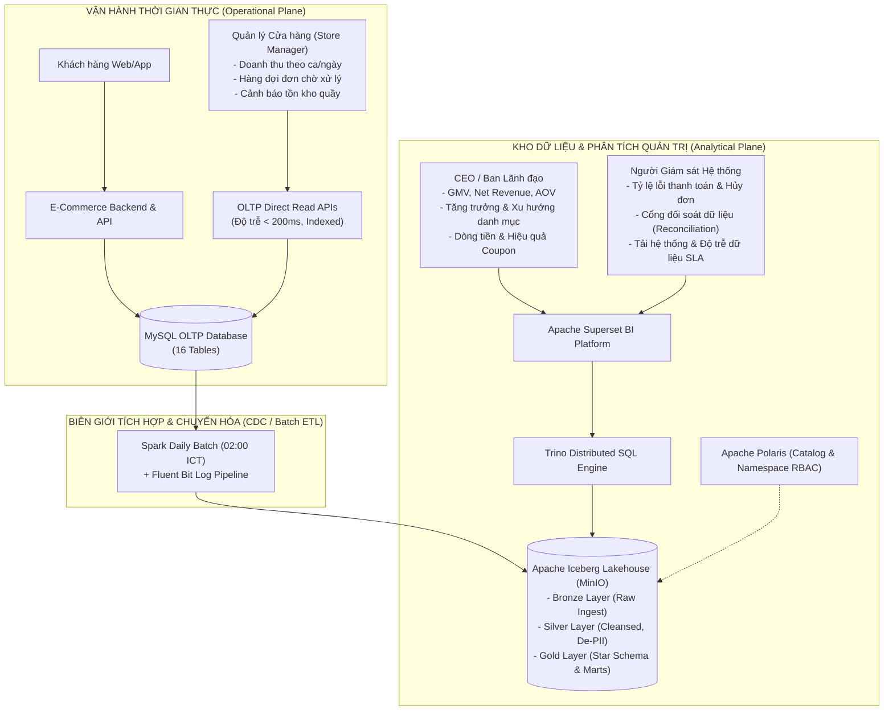
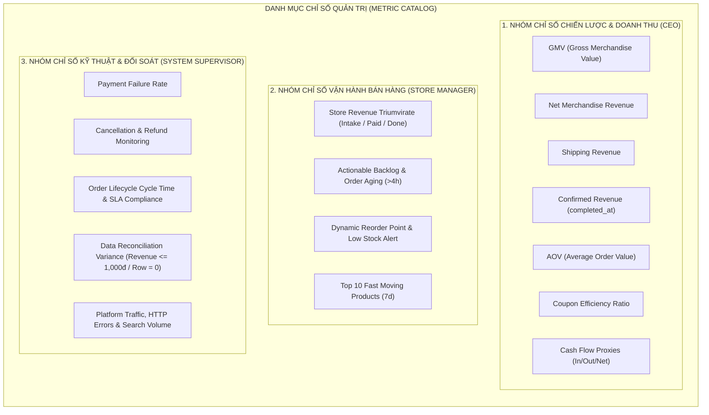
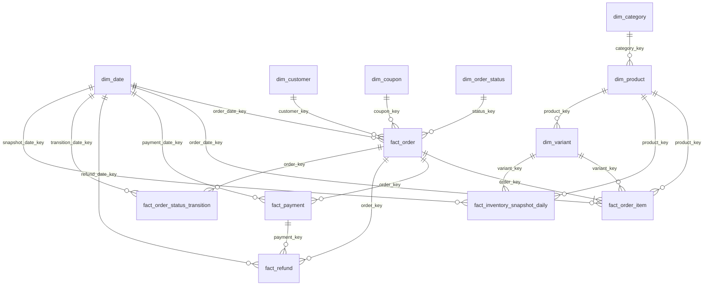
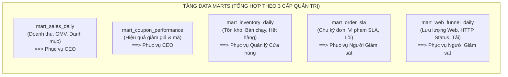
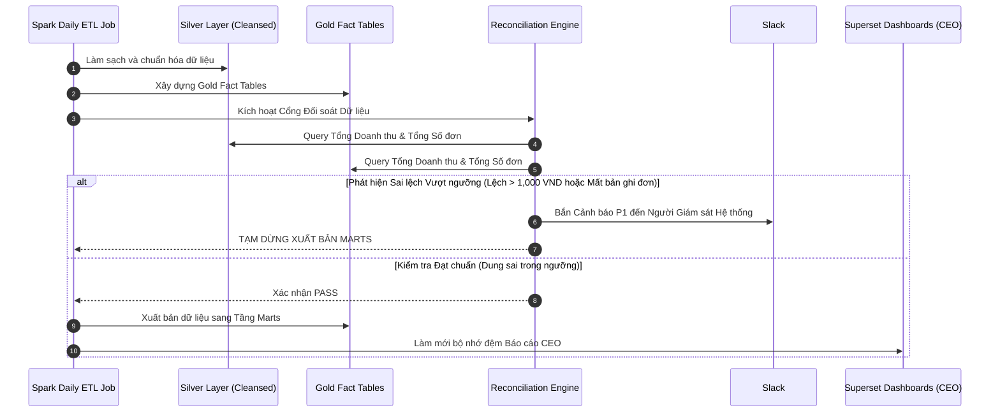
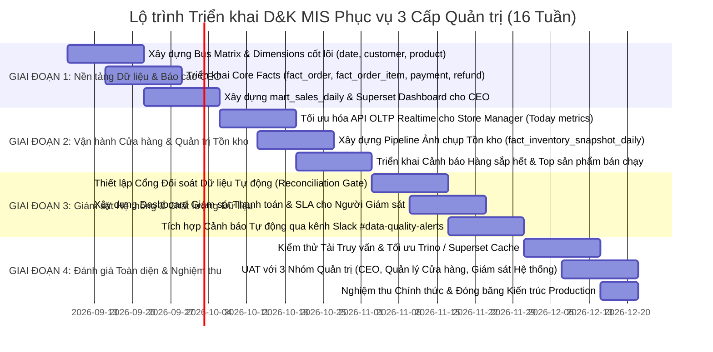

# TÀI LIỆU ĐẶC TẢ PHÂN TÍCH & THIẾT KẾ KỸ THUẬT: HỆ THỐNG THÔNG TIN QUẢN LÝ (MANAGEMENT INFORMATION SYSTEM - MIS)
## Nền Tảng D&K E-Commerce Lakehouse & Analytics Platform

**Mã tài liệu:** SPEC-ARCH-MIS-01  
**Phiên bản:** 1.1 (Tinh gọn theo 3 Cấp Quản trị Trọng yếu)  
**Ngày cập nhật:** 2026-09-08  
**Phân loại:** Tài liệu Kiến trúc & Thiết kế Hệ thống (System Analysis & Design Specification)  
**Tác giả:** Lead Data Architect / Senior Analytics Engineer  
**Tài liệu tham chiếu:** `MANAGEMENT_INFO_NEEDS.md`, `MANAGEMENT_INFO_REVIEW.md`, `SIGNOFF_RECOMMENDATIONS.md`, `OLTP_SCHEMA.md`, `ACCESS_LOG_DESIGN.md`

---

## MỤC LỤC

1. [TỔNG QUAN HỆ THỐNG & BỐI CẢNH KIẾN TRÚC](#1-tổng-quan-hệ-thống--bối-cảnh-kiến-trúc)
   - 1.1. Mục tiêu và Phạm vi Hệ thống
   - 1.2. Phân định Biên giới Kiến trúc: Operational Plane vs. Analytical Plane
   - 1.3. Luồng luân chuyển Dữ liệu Tổng thể (Data Flow & Topologies)
2. [PHÂN TÍCH NHU CẦU THÔNG TIN THEO 3 CẤP QUẢN TRỊ & TRACEABILITY MATRIX](#2-phân-tích-nhu-cầu-thông-tin-theo-3-cấp-quản-trị--traceability-matrix)
   - 2.1. Nhu cầu Thông tin Cốt lõi của 3 Cấp Quản trị
   - 2.2. Phân loại Phạm vi Triển khai (In-Scope Phase 1 vs. Descope/Deferred Phase 2)
   - 2.3. Ma trận Truy xuất Nguồn gốc (Traceability Matrix: 3 Nhóm Quản trị → Data Objects)
3. [DANH MỤC CHỈ SỐ KỸ THUẬT CHUẨN HÓA (STANDARDIZED METRIC CATALOG)](#3-danh-mục-chỉ-số-kỹ-thuật-chuẩn-hóa-standardized-metric-catalog)
   - 3.1. Nhóm Chỉ số Chiến lược & Doanh thu Cấp cao (Dành cho CEO / Ban Lãnh đạo)
   - 3.2. Nhóm Chỉ số Vận hành Bán hàng & Xử lý Đơn hàng (Dành cho Quản lý Cửa hàng)
   - 3.3. Nhóm Chỉ số Kỹ thuật, Giao dịch & Toàn vẹn Dữ liệu (Dành cho Người Giám sát Hệ thống)
4. [THIẾT KẾ MÔ HÌNH DỮ LIỆU CHI TIẾT (DETAILED DATA MODELING)](#4-thiết-kế-mô-hình-dữ-liệu-chi-tiết-detailed-data-modeling)
   - 4.1. Sơ đồ Quan hệ Thực thể Chiều (Dimensional Bus Matrix & Architecture)
   - 4.2. Đặc tả Chi tiết các Bảng Chiều (Dimension Tables Specification)
   - 4.3. Đặc tả Chi tiết các Bảng Sự kiện (Fact Tables Specification)
   - 4.4. Đặc tả Chi tiết các Bảng Tổng hợp Nghiệp vụ (Data Marts Specification)
5. [THIẾT KẾ PHI CHỨC NĂNG, BẢO MẬT & QUẢN TRỊ DỮ LIỆU](#5-thiết-kế-phi-chức-năng-bảo-mật--quản-trị-dữ-liệu)
   - 5.1. Cam kết Mức độ Dịch vụ Dữ liệu (Data Freshness & Processing SLAs)
   - 5.2. Tuân thủ Bảo vệ Dữ liệu Cá nhân (PII Protection & NĐ 13/2023/NĐ-CP)
   - 5.3. Mô hình Phân quyền Dữ liệu 3 Cấp (Namespace-Level RBAC)
   - 5.4. Chuẩn hóa Không gian Thời gian (Timezone & Cutoff Logic)
   - 5.5. Cổng Kiểm soát Chất lượng & Đối soát Tự động (Reconciliation Gate)
6. [KẾ HOẠCH TRIỂN KHAI THEO GIAI ĐOẠN & SIGN-OFF GOVERNANCE](#6-kế-hoạch-triển-khai-theo-giai-đoạn--sign-off-governance)
   - 6.1. Lộ trình Triển khai 4 Giai đoạn (Phase Breakdown)
   - 6.2. Danh mục Quyết định Kỹ thuật Đã Sign-off (Baseline Decisions)
   - 6.3. Kế hoạch Kiểm tra Nghiệp vụ với 3 Cấp Quản trị (Business Verification Items)

---

## 1. TỔNG QUAN HỆ THỐNG & BỐI CẢNH KIẾN TRÚC

### 1.1. Mục tiêu và Phạm vi Hệ thống
Hệ thống Thông tin Quản lý D&K E-Commerce (D&K MIS) là nền tảng báo cáo phân tích toàn diện, được thiết kế nhằm đồng nhất hóa dữ liệu điều hành và ra quyết định chiến lược. Hệ thống hợp nhất hai dòng dữ liệu cốt lõi:
1. **Dữ liệu giao dịch vận hành (OLTP):** 16 bảng quan hệ nghiệp vụ từ MySQL (Orders, Order Items, Customers, Payments, Refunds, Inventory, Coupons, Reviews, Wishlist, Audit Status History,...).
2. **Dữ liệu hành vi người dùng (Web Event Logs):** Dòng log truy cập cấu trúc chuẩn JSON thu thập qua Fluent Bit micro-batch từ gateway/web application.

Áp dụng phương pháp luận **Phân tích và Thiết kế Hệ thống (Systems Analysis & Design - SAD)**, tài liệu này chuẩn hóa toàn bộ nhu cầu thông tin xoay quanh **3 cấp bậc quản trị then chốt**:
- **Tổng Giám đốc (CEO / Ban Lãnh đạo):** Người nắm giữ chiến lược tăng trưởng, doanh thu, lợi nhuận, hiệu quả kinh doanh tổng thể.
- **Quản lý Cửa hàng (Store Manager):** Người trực tiếp điều phối vận hành ca bán hàng, giải phóng hàng đợi đơn, theo dõi hàng bán chạy và kiểm soát tồn kho khả dụng tại quầy.
- **Người Giám sát Hệ thống (System Supervisor / Data & Platform Lead):** Người chịu trách nhiệm về tính liên tục, ổn định của dịch vụ thanh toán, phát hiện bất thường giao dịch (hủy/hoàn tiền), độ trễ dữ liệu và kiểm soát toàn vẹn dữ liệu (Reconciliation Gate).

### 1.2. Phân định Biên giới Kiến trúc: Operational Plane vs. Analytical Plane
Kiến trúc D&K phân tách rõ rệt hai biên giới xử lý nhằm đảm bảo tính kịp thời cho vận hành và sự tối ưu hóa cho phân tích chuyên sâu:



**Nguyên tắc phân định ranh giới:**
1. **Operational Plane (Phục vụ Quản lý Cửa hàng):** Truy vấn trực tiếp từ bản sao đọc (Read Replica) của MySQL OLTP qua API tối ưu hóa (độ trễ $< 200\text{ms}$). Đảm bảo nhân viên cửa hàng can thiệp đơn hàng tức thời, không bị trễ theo chu kỳ mẻ DWH.
2. **Analytical Plane (Phục vụ CEO và Người Giám sát Hệ thống):** Truy vấn trên nền tảng Lakehouse (Apache Iceberg/Trino/Superset) với chu kỳ mẻ hàng ngày (T+1 lúc 02:00 ICT). Phục vụ các báo cáo xu hướng lịch sử nhiều chiều, tổng hợp tài chính và kiểm toán toàn vẹn dữ liệu.

### 1.3. Luồng luân chuyển Dữ liệu Tổng thể (Data Flow & Topologies)
1. **Bronze Layer:** Lưu trữ nguyên bản (raw data) các bảng sao chép từ MySQL OLTP và JSON logs từ S3/MinIO Landing Zone.
2. **Silver Layer:** Chuẩn hóa kiểu dữ liệu, giải quyết xung đột mã hóa UTF-8. Ẩn danh hóa dữ liệu định danh cá nhân (Salted SHA-256 đối với Email, Phone). Bóc tách địa chỉ để chỉ lưu `region`, `city`, `district` phục vụ phân tích vùng.
3. **Gold Layer:** Xây dựng hệ thống bảng Chiều (`dim_*`), bảng Sự kiện (`fact_*`) và các bảng Tổng hợp nghiệp vụ (`mart_*`).
4. **Reconciliation Gate:** Tự động đối chiếu số liệu Silver và Gold trước khi xuất bản báo cáo cho CEO và Người Giám sát Hệ thống.

---

## 2. PHÂN TÍCH NHU CẦU THÔNG TIN THEO 3 CẤP QUẢN TRỊ & TRACEABILITY MATRIX

### 2.1. Nhu cầu Thông tin Cốt lõi của 3 Cấp Quản trị

Mô hình quản trị của D&K E-Commerce tập trung vào 3 trụ cột: **Chiến lược (CEO)** – **Thực thi Vận hành (Store Manager)** – **Hạ tầng & Chất lượng (Người Giám sát Hệ thống)**:

| Cấp bậc Quản trị | Mục tiêu & Trách nhiệm Cốt lõi | Nhu cầu Thông tin Trọng yếu | Công cụ / Môi trường Truy xuất |
| :--- | :--- | :--- | :--- |
| **1. Tổng Giám đốc (CEO / Ban Lãnh đạo)** | - Tăng trưởng quy mô doanh số & thị phần.<br>- Tối ưu hóa hiệu quả kinh doanh & dòng tiền.<br>- Đánh giá sức khỏe danh mục sản phẩm & khách hàng. | - **Doanh thu:** GMV, Doanh thu hàng hóa ròng, Doanh thu xác nhận (`completed`), Doanh thu vận chuyển.<br>- **Quy mô đơn:** AOV (Giá trị đơn trung bình), Số món/đơn.<br>- **Xu hướng:** Tăng trưởng MoM/YoY, Hiệu suất danh mục 2 cấp.<br>- **Hiệu quả khuyến mãi:** Tỷ số hiệu quả mã Coupon (Coupon Efficiency Ratio), Tổng ngân sách giảm giá.<br>- **Sức khỏe tài chính:** Dòng tiền ước tính (Inflow/Outflow proxy). | **Analytical Plane**<br>(Superset Executive Dashboard) |
| **2. Quản lý Cửa hàng (Store Manager)** | - Điều phối xử lý đơn hàng trong ca trực.<br>- Giảm thiểu tồn đọng và tắc nghẽn khâu đóng gói/giao hàng.<br>- Theo dõi sản phẩm bán chạy và bổ sung hàng kịp thời tại quầy. | - **Doanh thu trong ngày:** Bộ ba chỉ số *Order Intake Today*, *Paid Today*, *Completed Today* (theo ngày ICT).<br>- **Hàng đợi xử lý:** Số lượng đơn chờ xác nhận (`paid`), đơn đang đóng gói (`confirmed`), đơn mới bị hủy.<br>- **Cảnh báo tuổi đơn:** Đơn chờ xác nhận quá thời gian cam kết ($> 4 \text{ giờ làm việc}$).<br>- **Sản phẩm & Tồn kho:** Top 10 sản phẩm bán chạy nhất trong 7 ngày, danh sách SKU sắp hết hàng (`on_hand` dưới ngưỡng an toàn). | **Operational Plane**<br>(Storefront Admin Portal / OLTP Realtime APIs) |
| **3. Người Giám sát Hệ thống (System Supervisor)** | - Bảo đảm tính liên tục và ổn định của cổng thanh toán.<br>- Giám sát bất thường giao dịch và chất lượng vận hành.<br>- Kiểm soát tính toàn vẹn và độ tin cậy của dữ liệu phân tích.<br>- Giám sát tải hệ thống và tuân thủ an toàn thông tin. | - **Chất lượng giao dịch:** Tỷ lệ thanh toán thất bại (Payment Failure Rate), Tỷ lệ hủy đơn, Tỷ lệ hoàn tiền.<br>- **Hiệu suất chu kỳ đơn:** Thời gian trung chuyển trạng thái đơn (Cycle time) và Tỷ lệ vi phạm SLA.<br>- **Đối soát dữ liệu (Reconciliation):** Lệch doanh thu giữa OLTP và DWH ($\le 1,000\text{ VND}$), Lệch số dòng đơn hàng ($= 0$).<br>- **Tải hệ thống & Log:** Lưu lượng truy cập (Web Events Volume), Lỗi hệ thống HTTP 5xx, Tỷ lệ tra cứu không có kết quả (Zero-result search).<br>- **Bảo mật:** Tuân thủ ẩn danh hóa dữ liệu PII theo Nghị định 13/2023/NĐ-CP. | **Analytical Plane & Alerts**<br>(Superset System Monitor, Slack Webhook Alerts) |

### 2.2. Phân loại Phạm vi Triển khai (In-Scope Phase 1 vs. Descope/Deferred Phase 2)

Nhằm tối ưu hóa nguồn lực và đảm bảo tính khả thi kỹ thuật, phạm vi dữ liệu được chuẩn hóa minh bạch:

```mermaid
quadrantChart
    title Ma trận Phân bổ Phạm vi Kỹ thuật theo 3 Nhóm Quản trị
    x-axis Độ sẵn sàng Dữ liệu Nguồn (Thấp --> Cao)
    y-axis Giá trị Tác động Nghiệp vụ (Thấp --> Cao)
    quadrant-1 "ƯU TIÊN TRIỂN KHAI PHA 1 (In-Scope)"
    quadrant-2 "HOÃN TRIỂN KHAI PHA 2 (Deferred)"
    quadrant-3 "LOẠI BỎ KHỎI DWH (Descoped)"
    quadrant-4 "MỞ RỘNG BỔ SUNG PHA 1 (Fast-Follow)"
    "CEO: GMV, Net Revenue, AOV": [0.95, 0.95]
    "Store: Realtime Order Queue": [0.90, 0.92]
    "Supervisor: Reconciliation Gate": [0.85, 0.88]
    "Supervisor: Payment Failure Rate": [0.90, 0.85]
    "Store: Today Intake / Paid / Done": [0.85, 0.82]
    "Store: Inventory Snapshot Daily": [0.80, 0.80]
    "CEO: Coupon Efficiency Ratio": [0.85, 0.70]
    "CEO: Full P&L (COGS, Shipping Cost)": [0.15, 0.90]
    "Supervisor: Movement Audit Trail": [0.10, 0.85]
    "Supervisor: Search Keyword & Zero-Result": [0.25, 0.75]
    "CEO: Seasonal Demand Forecast": [0.30, 0.65]
    "CEO: Chi tiết Kê khai Thuế VAT": [0.10, 0.40]
```

#### Bảng Tổng hợp Hạng mục Hoãn / Giản lược (Descope & Deferred Backlog)

| Mã | Hạng mục Yêu cầu Gốc | Cấp Quản trị Ảnh hưởng | Hiện trạng Dữ liệu Nguồn & Lý do Kỹ thuật | Giải pháp Thay thế trong Pha 1 | Kế hoạch Thực thi |
| :--- | :--- | :--- | :--- | :--- | :--- |
| **D-1** | Phân tích Từ khóa & Zero-Result Search | Người Giám sát Hệ thống / CEO | Log truy cập ghi nhận hành động search nhưng chưa ghi số kết quả trả về (`result_count`). | Giám sát tổng số lượt phát sinh hành động tìm kiếm (Search Events Volume). | Phase 2 (Cập nhật router API trả về count) |
| **D-2** | Phân tích Chiến dịch Tiếp thị (UTM Mapping) | CEO | Chưa có bảng `campaigns`, chưa có cơ chế bắt UTM parameters từ URL vào đơn hàng. | Đánh giá hiệu quả khuyến mãi tập trung vào mã Coupon (`dim_coupon`). | Phase 2 (Xây dựng Campaign Tracking Module) |
| **D-3** | Kiểm toán Dòng chuyển Kho (Movement Audit) | Người Giám sát Hệ thống / Quản lý Kho | OLTP chỉ lưu số dư `inventory.on_hand`, không có bảng ghi log xuất/nhập/điều chuyển kho vật lý. | Xây dựng bảng `fact_inventory_snapshot_daily` chốt lúc 23:59:59 ICT để theo dõi chênh lệch tồn cuối ngày. | Phase 2 (Bổ sung bảng `inventory_movements` trong OLTP) |
| **D-4** | Dự báo Nhu cầu theo Mùa (Seasonal Forecast) | CEO | Dữ liệu giao dịch lịch sử tích lũy < 12 tháng, chưa đủ chu kỳ năm để chạy thuật toán chuỗi thời gian. | Trực quan hóa đường xu hướng lịch sử và so sánh cùng kỳ ngắn hạn. | Phase 2 (Khi tích lũy đủ $\ge 12$ tháng data) |
| **D-5** | Báo cáo Lãi Lỗ Đầy đủ (Full P&L: COGS, Chi phí Vận hành) | CEO | OLTP không có giá vốn hàng bán (COGS), chi phí marketing thực tế và phí cổng thanh toán. | Giới hạn ở Doanh thu ròng, Giảm giá và Hoàn tiền (Gross Margin Proxy). | Phase 2 (Tích hợp nguồn dữ liệu kế toán/ERP ngoài) |
| **D-6** | Báo cáo Thuế Giá trị Gia tăng (VAT Ledger) | CEO | Schema OLTP không có cột `tax_rate`, `tax_amount`. | Giá bán trên đơn mặc định được coi là giá thanh toán cuối cùng. | Phase 2 (Mở rộng schema đơn hàng) |

### 2.3. Ma trận Truy xuất Nguồn gốc (Traceability Matrix: 3 Nhóm Quản trị → Data Objects)

| Cấp Quản trị | Chỉ số Nghiệp vụ Trọng yếu | Bảng Nguồn OLTP / Log | Bảng Silver / Gold DWH | Data Mart Đích | Bảng điều khiển / Kênh Cảnh báo |
| :--- | :--- | :--- | :--- | :--- | :--- |
| **CEO / Ban Lãnh đạo** | GMV, Net Merchandise Revenue, Shipping Revenue | `orders`, `payments`, `refunds` | `fact_order`, `fact_payment`, `fact_refund` | `mart_sales_daily` | **Superset:** CEO Executive Overview |
| **CEO / Ban Lãnh đạo** | Confirmed Revenue (Doanh thu ghi nhận) | `orders` (`completed`) | `fact_order` | `mart_sales_daily` | **Superset:** CEO Executive Overview |
| **CEO / Ban Lãnh đạo** | AOV, Items per Order, Cancellation Rate | `orders`, `order_items` | `fact_order`, `fact_order_item` | `mart_sales_daily` | **Superset:** CEO Executive Overview |
| **CEO / Ban Lãnh đạo** | Doanh thu theo Danh mục 2 cấp | `orders`, `order_items`, `products`, `categories` | `fact_order_item`, `dim_product`, `dim_category` | `mart_sales_daily` | **Superset:** Category Performance Hub |
| **CEO / Ban Lãnh đạo** | Coupon Efficiency Ratio, Ngân sách Giảm giá | `orders`, `coupons`, `coupon_redemptions` | `fact_order`, `fact_coupon_redemption` | `mart_coupon_performance` | **Superset:** Promotion & Discount Report |
| **CEO / Ban Lãnh đạo** | Cash Inflow / Outflow / Net Cash Flow Proxy | `payments`, `refunds` | `fact_payment`, `fact_refund` | `mart_sales_daily` | **Superset:** Financial Cash Flow Proxy |
| **Quản lý Cửa hàng** | Order Intake Today, Paid Today, Completed Today | `orders` (trực tiếp) | *Không đọc DWH (Độ trễ <200ms)* | MySQL Read Replica | **Storefront Admin:** Overview Dashboard |
| **Quản lý Cửa hàng** | Hàng đợi đơn cần xác nhận (`paid`), đơn đang giao | `orders` (trực tiếp) | *Không đọc DWH* | MySQL Read Replica | **Storefront Admin:** Order Processing Queue |
| **Quản lý Cửa hàng** | Đơn chờ xác nhận quá hạn SLA ($> 4 \text{h}$ làm việc) | `orders`, `order_status_history` | *Không đọc DWH* | MySQL Read Replica | **Storefront Admin:** Actionable Backlog Alert |
| **Quản lý Cửa hàng** | Cảnh báo Variant sắp hết hàng & Hết hàng tại quầy | `inventory`, `product_variants` | *Không đọc DWH* | MySQL Read Replica | **Storefront Admin:** Low Stock Panel |
| **Quản lý Cửa hàng** | Top 10 sản phẩm bán chạy nhất trong 7 ngày | `order_items`, `orders` | `fact_order_item` (Daily) / OLTP | `mart_sales_daily` | **Storefront Admin:** Fast Moving Products |
| **Người Giám sát Hệ thống**| Tỷ lệ Thanh toán Thất bại (Payment Failure Rate) | `payments` | `fact_payment` | `mart_order_sla` | **Superset:** System & Payment Health |
| **Người Giám sát Hệ thống**| Tỷ lệ Hủy đơn & Phân loại Lý do Hủy | `orders`, `order_status_history` | `fact_order`, `fact_order_status_transition` | `mart_order_sla` | **Superset:** System & Payment Health |
| **Người Giám sát Hệ thống**| Thời gian chu kỳ đơn (Cycle Time) & Vi phạm SLA | `order_status_history` | `fact_order_status_transition` | `mart_order_sla` | **Superset:** Operational SLA Monitor |
| **Người Giám sát Hệ thống**| Đối soát Doanh thu ($\le 1,000\text{ VND}$) & Số đơn ($= 0$) | `orders` vs `fact_order` | `silver_orders` vs `fact_order` | Reconciliation View | **Alert Hub:** Slack `#data-quality-alerts` |
| **Người Giám sát Hệ thống**| Lưu lượng Web Events, Lỗi HTTP 5xx & Search Volume | `access_logs` | `fact_web_events` | `mart_web_funnel_daily` | **Superset:** Platform Traffic & Logs |
| **Người Giám sát Hệ thống**| Tuân thủ Bảo vệ Dữ liệu PII (Mã hóa Salted Hash) | `customers`, `customer_credentials`| `silver_customers`, `dim_customer` | Data Governance | **Polaris / Audit:** Compliance Report |

---

## 3. DANH MỤC CHỈ SỐ KỸ THUẬT CHUẨN HÓA (STANDARDIZED METRIC CATALOG)

Mọi chỉ số đều được chuẩn hóa theo quy tắc: **Một định nghĩa đại số duy nhất, minh định rõ mốc thời gian đánh dấu sự kiện và phân quyền sử dụng theo đúng 3 cấp quản trị.**



### 3.1. Nhóm Chỉ số Chiến lược & Doanh thu Cấp cao (Dành cho CEO / Ban Lãnh đạo)

#### M-01: Tổng Giá trị Giao dịch Hàng hóa (GMV - Gross Merchandise Value)
- **Bản chất nghiệp vụ:** Tổng giá trị niêm yết của hàng hóa được khách hàng đặt thành công trong kỳ phân tích, phản ánh quy mô tổng thể của sàn thương mại điện tử.
- **Công thức đại số:**
  $$\text{GMV} = \sum (\text{orders.subtotal\_vnd})$$
- **Điều kiện lọc:**
  - `orders.status IN ('paid', 'confirmed', 'completed')`
  - `orders.created_at` nằm trong khoảng thời gian phân tích.
  - **LOẠI BỎ TUYỆT ĐỐI:** `status IN ('payment_failed', 'cancelled')`.
- **Ranh giới tài chính:** KHÔNG bao gồm phí vận chuyển (`shipping_fee_vnd`), KHÔNG trừ chiết khấu (`discount_amount_vnd`), KHÔNG trừ tiền hoàn trả (`refunds`).
- **Tần suất cập nhật:** Batch hàng ngày (T+1 lúc 02:00 ICT) trên Superset.

#### M-02: Doanh thu Hàng hóa Ròng (Net Merchandise Revenue)
- **Bản chất nghiệp vụ:** Doanh thu thực nhận từ hàng hóa sau khi đã trừ chiết khấu khuyến mãi và các khoản hoàn tiền hàng hóa.
- **Công thức đại số:**
  $$\text{Net Merchandise Revenue} = \sum (\text{orders.subtotal\_vnd} - \text{orders.discount\_amount\_vnd}) - \sum (\text{refunds.amount\_vnd})$$
- **Lưu ý phòng chống Double-counting:** Trong OLTP, `orders.total_vnd` đã tự động trừ `discount_amount_vnd`. Do đó, khi tính doanh thu ròng hàng hóa, bắt buộc lấy từ cấu phần `subtotal - discount` thay vì lấy `total_vnd` rồi trừ discount thêm lần nữa.

#### M-03: Doanh thu Vận chuyển (Shipping Revenue)
- **Bản chất nghiệp vụ:** Doanh thu thu hộ/dịch vụ vận chuyển từ khách hàng, dùng để đối chiếu độc lập với hóa đơn thanh toán của các đối tác vận chuyển (3PL).
- **Công thức đại số:**
  $$\text{Shipping Revenue} = \sum (\text{orders.shipping\_fee\_vnd}) \quad [\text{orders.status IN ('paid','confirmed','completed')}]$$

#### M-04: Doanh thu Xác nhận Kế toán (Confirmed Revenue)
- **Bản chất nghiệp vụ:** Doanh thu chính thức đủ điều kiện hạch toán vào báo cáo kết quả hoạt động kinh doanh theo nguyên tắc kế toán dồn tích (chỉ ghi nhận khi khách đã nhận hàng thành công).
- **Công thức đại số:**
  $$\text{Confirmed Revenue} = \sum (\text{orders.total\_vnd}) \quad [\text{status} = \text{'completed'}]$$
- **Quy tắc mốc thời gian:** Bắt buộc tính theo **`orders.completed_at`**, tuyệt đối KHÔNG tính theo `created_at` hay `paid_at`.

#### M-05: Giá trị Đơn hàng Trung bình (AOV - Average Order Value)
- **Công thức:**
  $$\text{AOV} = \frac{\sum (\text{orders.total\_vnd})}{\text{COUNT}(\text{DISTINCT } \text{orders.order\_id})} \quad [\text{status IN ('paid','confirmed','completed')}]$$

#### M-06: Tỷ số Hiệu quả Khuyến mãi (Coupon Efficiency Ratio)
- **Công thức:**
  $$\text{Coupon Efficiency Ratio} = \frac{\text{Doanh thu ròng phát sinh từ các đơn có áp mã Coupon}}{\sum (\text{orders.discount\_amount\_vnd})}$$
- **Ý nghĩa:** Mỗi 1 đồng giảm giá đem lại bao nhiêu đồng doanh thu ròng. Tỷ số $> 5.0$ được coi là chiến dịch khuyến mãi có hiệu quả cao.

#### M-07: Dòng tiền Ước tính (Cash Flow Proxies)
- **Dòng tiền vào (Cash Inflow):** $\sum (\text{payments.amount\_vnd})$ có `status = 'succeeded'` trong kỳ.
- **Dòng tiền ra (Cash Outflow):** $\sum (\text{refunds.amount\_vnd})$ có `status = 'succeeded'` trong kỳ.
- **Dòng tiền hoạt động thuần:** $\text{Net Cash Flow} = \text{Cash Inflow} - \text{Cash Outflow}$.

---

### 3.2. Nhóm Chỉ số Vận hành Bán hàng & Xử lý Đơn hàng (Dành cho Quản lý Cửa hàng)

*Lưu ý kỹ thuật:* Toàn bộ nhóm chỉ số này được truy vấn **thời gian thực (Realtime)** trực tiếp từ MySQL OLTP API, phục vụ nhân viên cửa hàng xử lý trong ca trực.

#### M-08: Bộ ba Chỉ số Doanh thu Vận hành Trong ngày (Store Revenue Triumvirate)
Loại bỏ hoàn toàn tên gọi chung "Doanh thu hôm nay" để tránh hiểu nhầm giữa các ca trực:
1. **Giá trị Tiếp nhận Trong ngày (Order Intake Today):**
   - $\sum (\text{total\_vnd})$ của các đơn tạo mới trong ngày: `CAST(created_at AS DATE) = CURRENT_DATE(ICT)`.
2. **Giá trị Đã Thanh toán Trong ngày (Paid Today):**
   - $\sum (\text{total\_vnd})$ của các đơn đã thanh toán trong ngày: `CAST(paid_at AS DATE) = CURRENT_DATE(ICT)`.
3. **Giá trị Bàn giao Hoàn tất Trong ngày (Completed Today):**
   - $\sum (\text{total\_vnd})$ của các đơn giao thành công trong ngày: `CAST(completed_at AS DATE) = CURRENT_DATE(ICT)`.

#### M-09: Hàng đợi Cần Xử lý & Tuổi Đơn Tồn đọng (Actionable Backlog & Order Aging)
- **Hàng đợi cần xử lý ngay:** Số đơn có trạng thái `paid` (chờ xác nhận đóng gói) và `confirmed` (chờ bàn giao đơn vị vận chuyển).
- **Tuổi đơn cần hành động (Actionable Backlog Age):**
  $$\text{Pending Age} = \text{DATEDIFF}(\text{NOW}(), \text{orders.paid\_at}) \quad [\text{Đơn vị: Giờ làm việc}]$$
- **Ngưỡng báo động đỏ:** $\text{Pending Age} > 4 \text{ giờ làm việc}$ (tính trong khung giờ hoạt động cửa hàng 08:00 - 22:00 ICT).

#### M-10: Cảnh báo Tồn kho Quầy & Điểm Đặt Hàng Lại Động (Dynamic Reorder Point)
- **Điểm đặt hàng lại:**
  $$\text{ROP} = (\text{Velocity}_{7d} \times 14 \text{ ngày}) + \text{Safety Stock}$$
- **Ngưỡng sàn nguy cấp tại quầy (Absolute Floor):** Biến thể sản phẩm (Variant) có $\text{inventory.on\_hand} \le 5$ hoặc $= 0$ được đưa ngay vào danh sách cảnh báo đỏ trên trang quản trị.

#### M-11: Top 10 Sản phẩm Bán chạy Trong 7 Ngày (Fast Moving Products)
- Danh sách 10 SKU có tổng số lượng bán ra (`SUM(order_items.quantity)`) cao nhất trong 7 ngày gần nhất, giúp quản lý cửa hàng ưu tiên trưng bày và kiểm đếm số lượng thực tế.

---

### 3.3. Nhóm Chỉ số Kỹ thuật, Giao dịch & Toàn vẹn Dữ liệu (Dành cho Người Giám sát Hệ thống)

#### M-12: Tỷ lệ Thanh toán Thất bại (Payment Failure Rate)
- **Bản chất nghiệp vụ:** Giám sát chất lượng kỹ thuật của các cổng thanh toán tích hợp (VNPAY, Momo, Cổng thẻ).
- **Công thức đại số:**
  $$\text{Payment Failure Rate \%} = \frac{\text{COUNT}(\text{DISTINCT } \text{order\_id có } \ge 1 \text{ giao dịch payment failed})}{\text{COUNT}(\text{DISTINCT } \text{order\_id có nỗ lực thanh toán})} \times 100$$
- **Ngưỡng cảnh báo (Threshold):** $> 5\%$ trong vòng 1 giờ $\rightarrow$ Kích hoạt cảnh báo hệ thống kiểm tra kết nối cổng thanh toán.

#### M-13: Giám sát Tỷ lệ Hủy đơn & Hoàn tiền (Cancellation & Refund Monitoring)
- **Tỷ lệ Hủy đơn (Cancellation Rate):**
  $$\text{Cancellation Rate \%} = \frac{\text{COUNT}(\text{orders có status} = \text{'cancelled'})}{\text{COUNT}(\text{orders có status} \ne \text{'payment\_failed'})} \times 100$$
  *Ngưỡng cảnh báo:* $> 10\%$ trong ngày.
- **Tỷ lệ Hoàn tiền (Refund Rate):**
  $$\text{Refund Rate \%} = \frac{\sum (\text{refunds.amount\_vnd})}{\text{Net Merchandise Revenue}} \times 100$$
  *Ngưỡng cảnh báo:* $> 5\%$.

#### M-14: Chu kỳ Xử lý Đơn hàng & Tỷ lệ Tuân thủ Cam kết Dịch vụ (Order SLA Compliance)
- **Thời gian trung chuyển trạng thái:**
  - Thời gian Xác nhận: $\text{paid\_at} \rightarrow \text{confirmed\_at}$ (Chuẩn: $\le 4 \text{ giờ làm việc}$).
  - Thời gian Đóng gói & Bàn giao: $\text{confirmed\_at} \rightarrow \text{completed\_at}$ (Chuẩn: $\le 72 \text{ giờ}$).
  - Thời gian Hoàn tiền: $\text{refund requested} \rightarrow \text{refund completed}$ (Chuẩn: $\le 5 \text{ ngày làm việc}$).
- **Tỷ lệ Tuân thủ SLA tổng thể:**
  $$\text{SLA Compliance \%} = \frac{\text{Số đơn thỏa mãn toàn bộ các mốc thời gian chuẩn}}{\text{Tổng số đơn hoàn tất}} \times 100$$

#### M-15: Chỉ số Đối soát Toàn vẹn Dữ liệu (Reconciliation Variances)
Chỉ số kiểm soát tự động chạy mỗi ngày lúc 02:30 ICT sau khi hoàn tất xây dựng tầng Gold:
1. **Lệch Doanh thu Tuyệt đối (Revenue Variance):**
   $$\Delta_{\text{Rev}} = |\sum(\text{orders.total\_vnd})_{\text{Silver}} - \sum(\text{fact\_order.total\_vnd})_{\text{Gold}}| \le 1,000 \text{ VND}$$
2. **Lệch Số lượng Bản ghi Đơn hàng (Row Count Discrepancy):**
   $$\Delta_{\text{Rows}} = \text{Count}(\text{orders})_{\text{Silver}} - \text{Count}(\text{fact\_order})_{\text{Gold}} = 0 \text{ bản ghi}$$
3. **Lệch Tồn kho Khả dụng (Inventory Discrepancy):**
   $$\Delta_{\text{Stock}} = |\text{inventory.on\_hand}_{\text{OLTP}} - \text{fact\_inventory\_snapshot\_daily.on\_hand}| = 0$$

#### M-16: Lưu lượng Web Events, Lỗi 5xx & Tần suất Tìm kiếm (Platform Traffic & Logs)
- **Tổng lượng sự kiện Web (Web Events Volume):** Đo lường số lượt request theo giờ từ access logs.
- **Tỷ lệ lỗi máy chủ (Server Error Rate):** $\text{COUNT}(\text{status\_code} \ge 500) / \text{COUNT}(\text{total requests}) \times 100$. Ngưỡng cảnh báo: $> 1\%$.
- **Lưu lượng tìm kiếm (Search Volume):** Số lượng sự kiện `ecommerce_action = 'catalog_search'` để theo dõi tải tìm kiếm sản phẩm.

---

## 4. THIẾT KẾ MÔ HÌNH DỮ LIỆU CHI TIẾT (DETAILED DATA MODELING)

Mô hình dữ liệu Gold Layer được thiết kế theo cấu trúc Ngôi sao (Kimball Star Schema) với Bus Matrix rõ ràng, phục vụ tối ưu cho công cụ truy vấn phân tán Trino và trực quan hóa Apache Superset.

### 4.1. Sơ đồ Quan hệ Thực thể Chiều (Dimensional Bus Matrix & Architecture)



### 4.2. Đặc tả Chi tiết các Bảng Chiều (Dimension Tables Specification)

#### Bảng `dim_date` (Trục Thời gian Tiêu chuẩn)
- **Hạt dữ liệu (Grain):** 1 dòng tương ứng với 1 ngày lịch dương.
- **Khóa chính:** `date_key` (INT YYYYMMDD).
- **Các cột chính:** `full_date`, `year`, `quarter`, `month`, `month_name`, `week_of_year`, `day_of_month`, `day_of_week`, `day_name`, `is_weekend`, `is_holiday`, `fiscal_year`, `fiscal_quarter`.
- **Mục đích:** Phục vụ cắt lớp thời gian cho báo cáo CEO và phân tích độ trễ cho Người Giám sát Hệ thống.

#### Bảng `dim_customer` (Khách hàng Ẩn danh Tuân thủ)
- **Hạt dữ liệu (Grain):** 1 dòng tương ứng với 1 tài khoản khách hàng.
- **Khóa chính:** `customer_key` (BIGINT Surrogate Key).
- **Các cột chính:** `customer_id` (Natural Key), `public_id` (UUID), `hashed_email` (Salted SHA-256), `hashed_phone` (Salted SHA-256), `status`, `role`, `acquisition_date_key`, `primary_region`, `primary_city`, `created_at`, `updated_at`.
- **Bảo mật:** Không lưu trữ tên thật, email rõ, số điện thoại hay số nhà chi tiết nhằm tuân thủ tuyệt đối NĐ 13/2023.

#### Bảng `dim_product` (Danh mục Sản phẩm Gốc)
- **Hạt dữ liệu (Grain):** 1 dòng tương ứng với 1 sản phẩm (Parent Product).
- **Khóa chính:** `product_key` (BIGINT Surrogate Key).
- **Các cột chính:** `product_id`, `public_id`, `product_name`, `slug`, `category_key` ($\rightarrow$ `dim_category`), `is_active`, `is_archived`, `created_date_key`.

#### Bảng `dim_category` (Phân cấp Danh mục 2 Cấp)
- **Hạt dữ liệu (Grain):** 1 dòng tương ứng với 1 danh mục hàng hóa.
- **Khóa chính:** `category_key` (BIGINT).
- **Các cột chính:** `category_id`, `category_code`, `category_name`, `parent_category_key` (Tự tham chiếu cấp cha), `level` (1 = Ngành hàng lớn, 2 = Phân loại cụ thể), `is_active`.

#### Bảng `dim_variant` (Biến thể SKU Hàng hóa)
- **Hạt dữ liệu (Grain):** 1 dòng tương ứng với 1 tổ hợp (Màu - Size) của sản phẩm.
- **Khóa chính:** `variant_key` (BIGINT).
- **Các cột chính:** `variant_id`, `product_key`, `sku` (Unique Business Key), `size_code`, `color_code`, `price_vnd`, `is_active`.

#### Bảng `dim_coupon` (Mã Khuyến mãi & Chiết khấu)
- **Hạt dữ liệu (Grain):** 1 dòng tương ứng với 1 mã ưu đãi.
- **Khóa chính:** `coupon_key` (BIGINT).
- **Các cột chính:** `coupon_id`, `coupon_code`, `discount_type`, `discount_value`, `min_subtotal_vnd`, `starts_at`, `ends_at`, `total_usage_limit`, `is_active`.

#### Bảng `dim_order_status` (Trạng thái Vòng đời Đơn hàng)
- **Hạt dữ liệu (Grain):** 1 dòng tương ứng với 1 mã trạng thái.
- **Khóa chính:** `status_key` (INT).
- **Các cột chính:** `status_code` (`paid`, `confirmed`, `completed`, `cancelled`,...), `status_name_vi`, `status_group` (`OPEN`, `FULFILLED`, `TERMINATED`), `is_revenue_eligible` (Cờ cho phép tính GMV).

---

### 4.3. Đặc tả Chi tiết các Bảng Sự kiện (Fact Tables Specification)

#### Bảng `fact_order` (Sự kiện Đơn hàng Tổng hợp Header)
- **Hạt dữ liệu (Grain):** 1 dòng / 1 đơn hàng (`order_id`). Phân vùng theo `order_date_key` (Tháng). Write mode: `MERGE INTO`.
- **Foreign Keys:** `order_date_key`, `paid_date_key`, `completed_date_key`, `customer_key`, `coupon_key`, `status_key`.
- **Measures:** `subtotal_vnd`, `discount_amount_vnd`, `shipping_fee_vnd`, `total_vnd`, `item_count`.
- **Mục đích:** Cung cấp nguồn tính GMV, Doanh thu ròng cho CEO và là bảng đối soát trọng tâm cho Người Giám sát Hệ thống.

#### Bảng `fact_order_item` (Sự kiện Dòng Sản phẩm Đơn hàng)
- **Hạt dữ liệu (Grain):** 1 dòng / 1 SKU trong 1 đơn hàng. Phân vùng theo `order_date_key` (Tháng). Write mode: `APPEND-ONLY`.
- **Foreign Keys:** `order_key`, `order_date_key`, `product_key`, `variant_key`.
- **Measures:** `unit_price_vnd`, `quantity`, `line_total_vnd`, `allocated_discount_vnd`.
- **Mục đích:** Phân tích doanh số theo danh mục cho CEO và xác định Top sản phẩm bán chạy cho Quản lý Cửa hàng.

#### Bảng `fact_inventory_snapshot_daily` (Ảnh chụp Tồn kho Cuối ngày)
- **Hạt dữ liệu (Grain):** 1 dòng / cặp `(snapshot_date_key, variant_key)`. Chốt lúc **23:59:59 ICT** (16:59:59 UTC). Write mode: `APPEND-ONLY`.
- **Foreign Keys:** `snapshot_date_key`, `variant_key`, `product_key`.
- **Measures:** `on_hand`, `opening_on_hand`, `daily_units_sold`, `velocity_7d`, `is_out_of_stock`.
- **Mục đích:** Báo cáo tồn kho cuối ngày cho Quản lý Cửa hàng và kiểm toán chênh lệch kho cho Người Giám sát Hệ thống.

#### Bảng `fact_payment` (Sự kiện Giao dịch Thanh toán)
- **Hạt dữ liệu (Grain):** 1 dòng / 1 nỗ lực thanh toán. Write mode: `APPEND-ONLY`.
- **Foreign Keys:** `order_key`, `payment_date_key`.
- **Attributes & Measures:** `payment_method`, `payment_status` (`succeeded`, `failed`), `amount_vnd`, `attempted_at`.
- **Mục đích:** Tính Dòng tiền cho CEO và theo dõi Tỷ lệ lỗi cổng thanh toán cho Người Giám sát Hệ thống.

#### Bảng `fact_refund` (Sự kiện Hoàn tiền)
- **Hạt dữ liệu (Grain):** 1 dòng / 1 bản ghi hoàn tiền. Write mode: `APPEND-ONLY`.
- **Foreign Keys:** `order_key`, `payment_key`, `refund_date_key`.
- **Attributes & Measures:** `refund_status`, `reason_code`, `amount_vnd`, `created_at`.
- **Mục đích:** Tính Doanh thu ròng cho CEO và phát hiện bất thường hoàn tiền cho Người Giám sát Hệ thống.

#### Bảng `fact_order_status_transition` (Sự kiện Dịch chuyển Trạng thái Đơn hàng)
- **Hạt dữ liệu (Grain):** 1 dòng / 1 lần chuyển trạng thái đơn. Write mode: `APPEND-ONLY`.
- **Foreign Keys:** `order_key`, `transition_date_key`.
- **Attributes & Measures:** `from_status`, `to_status`, `transition_source`, `duration_from_previous_seconds`, `transitioned_at`.
- **Mục đích:** Tính toán tuổi đơn tồn đọng cho Quản lý Cửa hàng và giám sát vi phạm SLA chu kỳ đơn cho Người Giám sát Hệ thống.

#### Bảng `fact_web_events` (Sự kiện Nhật ký Truy cập Web)
- **Hạt dữ liệu (Grain):** 1 dòng / 1 HTTP request đã làm sạch từ access log.
- **Attributes:** `event_id`, `event_ts`, `actor_key`, `http_route`, `http_status`, `ecommerce_action`, `duration_ms`.
- **Mục đích:** Phục vụ Người Giám sát Hệ thống theo dõi tải lưu lượng, lỗi HTTP 5xx và khối lượng tìm kiếm.

---

### 4.4. Đặc tả Chi tiết các Bảng Tổng hợp Nghiệp vụ (Data Marts Specification)

Các bảng Marts được tổng hợp sẵn định kỳ nhằm tối ưu hóa thời gian tải dashboard $\le 1.5\text{s}$, phân bổ theo đúng 3 nhóm đối tượng:



1. **`mart_sales_daily` (Phục vụ CEO / Ban Lãnh đạo):**
   - Hạt dữ liệu: `(date_key, product_key, category_key)`.
   - Cột đo lường: `gmv_vnd`, `net_merchandise_revenue_vnd`, `shipping_revenue_vnd`, `confirmed_revenue_vnd`, `total_discount_vnd`, `units_sold`, `order_count`.
2. **`mart_coupon_performance` (Phục vụ CEO / Ban Lãnh đạo):**
   - Hạt dữ liệu: `(date_key, coupon_key)`.
   - Cột đo lường: `redeemed_count`, `released_count`, `total_discount_granted_vnd`, `attributed_net_revenue_vnd`, `coupon_efficiency_ratio`.
3. **`mart_inventory_daily` (Phục vụ Quản lý Cửa hàng):**
   - Hạt dữ liệu: `(date_key, variant_key)`.
   - Cột đo lường: `closing_on_hand`, `opening_on_hand`, `velocity_7d`, `reorder_point`, `is_below_reorder_point`, `is_out_of_stock`.
4. **`mart_order_sla` (Phục vụ Người Giám sát Hệ thống):**
   - Hạt dữ liệu: `(order_key)`.
   - Cột đo lường: `confirm_duration_hours`, `fulfill_duration_hours`, `total_cycle_hours`, `is_confirm_sla_violated`, `is_fulfill_sla_violated`, `is_overall_sla_compliant`.
5. **`mart_web_funnel_daily` (Phục vụ Người Giám sát Hệ thống):**
   - Hạt dữ liệu: `(date_key)`.
   - Cột đo lường: `total_requests_count`, `http_5xx_errors_count`, `search_actions_count`, `visitor_count`, `server_error_rate`.

---

## 5. THIẾT KẾ PHI CHỨC NĂNG, BẢO MẬT & QUẢN TRỊ DỮ LIỆU

### 5.1. Cam kết Mức độ Dịch vụ Dữ liệu (Data Freshness & Processing SLAs)

| Cấp Quản trị | Kênh Truy xuất | Yêu cầu Độ tươi mới (Data Freshness) | Phương thức Kỹ thuật |
| :--- | :--- | :--- | :--- |
| **Quản lý Cửa hàng** | Web Admin Storefront | Thời gian thực (Độ trễ $\le 200\text{ms}$) | API đọc trực tiếp Read Replica của MySQL OLTP |
| **CEO / Ban Lãnh đạo** | Superset BI Platform | Mẻ hàng ngày (T+1, hoàn tất trước 06:00 ICT) | Spark Daily Batch Pipeline chạy lúc 02:00 ICT |
| **Người Giám sát Hệ thống** | Superset & Slack Alerts | - Báo cáo chất lượng: Daily T+1 (02:30 ICT)<br>- Cảnh báo lỗi cổng thanh toán: Gần thời gian thực ($\le 15\text{ phút}$) | Event triggers từ Spark ETL & Script kiểm tra lỗi tự động |

### 5.2. Tuân thủ Bảo vệ Dữ liệu Cá nhân (PII Protection & NĐ 13/2023/NĐ-CP)
Hệ thống tuân thủ nghiêm ngặt nguyên tắc bảo mật thông tin khách hàng:
1. **Ẩn danh hóa tại Silver Layer:** Email và Số điện thoại được băm mật mã học bằng thuật toán SHA-256 kết hợp chuỗi khóa muối ngẫu nhiên (Salted Hash). Chuỗi muối được bảo vệ trong Secret Manager.
2. **Loại bỏ địa chỉ chi tiết:** Tầng Gold và các báo cáo Superset tuyệt đối không lưu địa chỉ nhà chi tiết (`street_address`). Chỉ trích xuất thông tin hành chính cấp vĩ mô: `region`, `city`, `district` để phân tích mật độ đơn hàng.
3. **Phân quyền xem PII:** Chỉ vai trò Quản lý Cửa hàng / Admin vận hành mới được xem thông tin người nhận trên giao diện OLTP để in phiếu giao hàng. CEO và Người Giám sát Hệ thống chỉ xem dữ liệu đã được ẩn danh hóa.

### 5.3. Mô hình Phân quyền Dữ liệu 3 Cấp (Namespace-Level RBAC)

Cấu hình phân quyền trên Apache Polaris Catalog và hệ thống BI:

| Nhóm Người dùng | Không gian tên `bronze` | Không gian tên `silver` | Không gian tên `gold` | Bảng điều khiển / Quyền hạn |
| :--- | :--- | :--- | :--- | :--- |
| **CEO / Ban Lãnh đạo** | Không truy cập | Không truy cập | Chỉ đọc (Read-only) | Truy cập toàn quyền các Dashboard Chiến lược, Doanh thu, Khách hàng trên Superset |
| **Quản lý Cửa hàng** | Không truy cập | Không truy cập | Không truy cập DWH | Truy cập cổng Storefront Admin, thao tác xác nhận/hủy đơn và xem hàng tồn quầy |
| **Người Giám sát Hệ thống** | Toàn quyền (Read/Write)| Toàn quyền (Read/Write)| Toàn quyền (Read/Write)| Truy cập Dashboard Giám sát SLA, Cổng đối soát, Cấu hình kiểm tra chất lượng dữ liệu |

### 5.4. Chuẩn hóa Không gian Thời gian (Timezone & Cutoff Logic)
1. **Lưu trữ chuẩn:** Toàn bộ cơ sở dữ liệu MySQL và bảng Iceberg lưu trữ thời gian ở chuẩn **UTC**.
2. **Trình diễn chuẩn:** Giao diện Superset và trang Storefront Admin tự động chuyển đổi sang múi giờ **ICT (UTC+7)** khi hiển thị.
3. **Chốt mốc ngày kinh doanh:** Bảng `dim_date` và ảnh chụp tồn kho `fact_inventory_snapshot_daily` chốt số liệu tại mốc **23:59:59 ICT** (tương ứng 16:59:59 UTC cùng ngày).

### 5.5. Cổng Kiểm soát Chất lượng & Đối soát Tự động (Reconciliation Gate)

Quy trình đối soát tự động chạy ngay sau mẻ Gold (02:30 ICT), là công cụ trọng yếu của **Người Giám sát Hệ thống**:



#### Quy tắc Đối soát Tự động:
- **REC-01 (Lệch Doanh thu):** $|\sum(\text{orders.total\_vnd})_{\text{Silver}} - \sum(\text{fact\_order.total\_vnd})_{\text{Gold}}| \le 1,000 \text{ VND}$ (Chấp nhận sai số làm tròn).
- **REC-02 (Lệch Bản ghi Đơn):** $\text{Count}(\text{orders})_{\text{Silver}} - \text{Count}(\text{fact\_order})_{\text{Gold}} = 0$ bản ghi.
- **REC-03 (Khóa chính Toàn vẹn):** Không có giá trị NULL trên khóa chính hoặc bản ghi trùng lặp.
- **REC-04 (Khóa ngoại Mồ côi):** Bản ghi sự kiện mồ côi (Orphan FK) tự động gán về `-1 (Unknown)` và gửi cảnh báo log.

---

## 6. KẾ HOẠCH TRIỂN KHAI THEO GIAI ĐOẠN & SIGN-OFF GOVERNANCE

### 6.1. Lộ trình Triển khai 4 Giai đoạn (Phase Breakdown)



### 6.2. Danh mục Quyết định Kỹ thuật Đã Sign-off (Baseline Decisions)

| Hạng mục Quyết định | Nội dung Kỹ thuật Đã Phê duyệt | Cấp Quản trị Thụ hưởng |
| :--- | :--- | :--- |
| **Định nghĩa GMV** | Chỉ tính đơn có `status IN ('paid','confirmed','completed')`. Tính trên `subtotal_vnd` trước chiết khấu, loại trừ phí ship. | CEO / Ban Lãnh đạo |
| **Ghi nhận Doanh thu** | Doanh thu chính thức ghi nhận căn cứ theo mốc `completed_at` (khách nhận hàng thành công). | CEO / Ban Lãnh đạo |
| **Doanh thu Vận hành** | Tách bạch 3 chỉ số độc lập: *Order Intake Today*, *Paid Today*, *Completed Today*. Không dùng tên chung "Daily Revenue". | Quản lý Cửa hàng |
| **Cảnh báo Tồn kho** | Áp dụng Điểm đặt hàng lại động ROP theo vận tốc bán 7 ngày và Lead time 14 ngày. Cảnh báo nguy cấp khi `on_hand <= 5`. | Quản lý Cửa hàng |
| **Đối soát Tự động** | Kiểm tra chênh lệch doanh thu giữa Silver và Gold ($\le 1,000\text{ VND}$) và lệch số dòng đơn ($= 0$). Báo động nếu vi phạm. | Người Giám sát Hệ thống |
| **Bảo mật PII** | Băm Salted SHA-256 đối với Email/SĐT. Tầng Gold chỉ lưu `region`, `city`, `district` cho phân tích địa lý. | Người Giám sát Hệ thống |
| **Chuẩn Múi giờ** | DWH lưu trữ UTC nguyên bản. Giao diện báo cáo và thời điểm chốt ngày kinh doanh tính theo giờ ICT (UTC+7). | Cả 3 Cấp Quản trị |

### 6.3. Kế hoạch Kiểm tra Nghiệp vụ với 3 Cấp Quản trị (Business Verification Items)

Các câu hỏi chốt chặn cuối cùng cần làm việc với đại diện 3 nhóm trước khi đóng băng mã nguồn:
1. **Làm việc với CEO / Ban Lãnh đạo:** Xác nhận việc tách riêng Doanh thu Hàng hóa và Doanh thu Vận chuyển trên Báo cáo Tổng quan đã đáp ứng mục tiêu quản trị tài chính.
2. **Làm việc với Quản lý Cửa hàng:** Xác nhận ngưỡng cảnh báo tuổi đơn chờ xác nhận $> 4 \text{ giờ làm việc}$ trong khung giờ 08:00 - 22:00 ICT là phù hợp với thực tế ca làm việc.
3. **Làm việc với Người Giám sát Hệ thống:** Xác nhận kênh nhận cảnh báo đối soát tự động (Slack `#data-quality-alerts` và Email phụ trách) cùng ngưỡng dung sai 1,000 VND cho đối soát doanh thu.

---

## 7. TÀI LIỆU KẾ THỪA & LIÊN KẾT HỆ THỐNG

Tài liệu này là căn cứ kiến trúc tối cao định hình mã nguồn cho các thành phần:
- Kịch bản tạo bảng Gold Iceberg DDL: `infra/spark/jobs/gold_ddl.py`
- Bộ điều phối luồng xử lý mẻ Airflow DAG: `dags/dag_oltp_gold_daily.py`
- Tệp cấu hình phân quyền truy cập Polaris Catalog: `infra/polaris/rbac_policies.json`
- Kho từ điển siêu dữ liệu đo lường số liệu Superset Datasets.

---
*Tài liệu được ban hành chính thức dưới sự giám sát của Kiến trúc sư Dữ liệu Nền tảng (Lead Data Platform Architect).*
