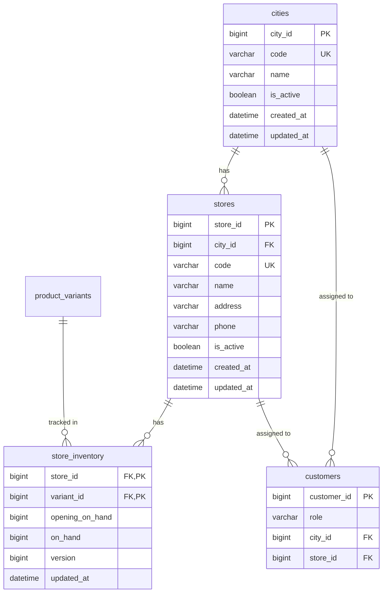

# Multi-City & Store-Level Inventory Architecture

> **Status:** Implemented  
> **Date:** 2026-09-09  
> **Last Updated:** 2026-09-15  
> **Spec:** [MANAGEMENT_INFO_TECHNICAL_SPEC.md](./MANAGEMENT_INFO_TECHNICAL_SPEC.md)

---

## Mục tiêu

Triển khai tính năng **Multi-City & Store-Level Inventory** kiểu CellphoneS:
- Khách hàng xem tồn kho theo cửa hàng/thành phố
- Store Manager quản lý kho 1 cửa hàng
- City Planner quản lý kho tất cả cửa hàng trong thành phố

---

## Kiến trúc tổng quan

```
┌─────────────────────────────────────────────────────────────────┐
│                        Storefront (Next.js)                     │
│  ┌──────────────┐  ┌──────────────┐  ┌───────────────────────┐ │
│  │ CitySelector │  │ Product Page │  │ StoreAvailabilityBox  │ │
│  │   (Header)   │  │              │  │   (CellphoneS-style)  │ │
│  └──────┬───────┘  └──────┬───────┘  └───────────┬───────────┘ │
└─────────┼─────────────────┼───────────────────────┼─────────────┘
          │                 │                       │
          ▼                 ▼                       ▼
┌─────────────────────────────────────────────────────────────────┐
│                     FastAPI Backend                              │
│  ┌─────────────────┐  ┌─────────────────┐  ┌─────────────────┐ │
│  │ Location Router │  │ Catalog Router  │  │   Admin Router  │ │
│  │  /locations/*   │  │ /products/*     │  │ /branch-inventory│ │
│  └────────┬────────┘  └────────┬────────┘  └────────┬────────┘ │
│           │                    │                     │          │
│           ▼                    ▼                     ▼          │
│  ┌─────────────────────────────────────────────────────────┐   │
│  │              Location Service                           │   │
│  │  - list_active_cities()                                 │   │
│  │  - list_stores_by_city()                                │   │
│  │  - get_product_availability()                           │   │
│  │  - check_store_inventory_permission()                   │   │
│  └─────────────────────────────────────────────────────────┘   │
└─────────────────────────────────┬───────────────────────────────┘
                                  │
                                  ▼
┌─────────────────────────────────────────────────────────────────┐
│                        MySQL 8.4                                 │
│  ┌──────────┐  ┌──────────┐  ┌────────────────┐  ┌──────────┐ │
│  │  cities  │  │  stores  │  │ store_inventory │  │ customers│ │
│  └──────────┘  └──────────┘  └────────────────┘  └──────────┘ │
└─────────────────────────────────────────────────────────────────┘
```

---

## Data Model

### Entity Relationship



### Business Rules

| Rule | Constraint |
|------|------------|
| `on_hand >= 0` | Không âm tồn kho |
| `opening_on_hand >= 0` | Opening không âm |
| `on_hand <= opening_on_hand` | Không thể bán超过 opening |
| `version` | Optimistic locking (future) |

---

## Role-Based Access Control

| Role | Scope | Inventory Access | Notes |
|------|-------|------------------|-------|
| `admin` | All cities, all stores | Full CRUD | System administrator |
| `city_planner` | 1 assigned city | Read all stores, Update within city | City-level management |
| `store_manager` | 1 assigned store | Read city pool (read-only), Update own store | Store-level management |
| `customer` | Selected city | Read availability only | End user |

---

## API Endpoints

### Public Endpoints (No Auth Required)

| Method | Path | Description |
|--------|------|-------------|
| `GET` | `/api/v1/locations/cities` | List active cities with store count |
| `GET` | `/api/v1/locations/cities/{city_code}/stores` | List stores in city |
| `GET` | `/api/v1/catalog/products/{slug}/availability?city_code=...` | Product availability per store |

### Admin Endpoints (Staff Auth Required)

| Method | Path | Description | Permission |
|--------|------|-------------|------------|
| `GET` | `/api/v1/admin/branch-inventory` | List inventory (scoped) | admin, city_planner, store_manager |
| `PATCH` | `/api/v1/admin/branch-inventory` | Update store stock | Scoped by role |

---

## Implementation Tasks

### Task 1: Database Migration

**Files:**
- Create: `database/migrations/versions/0010_multi_city_stores_inventory.py`
- Test: `services/ecommerce-api/tests/test_migration_0010_schema.py`

**Changes:**
1. Create `cities` table
2. Create `stores` table (FK → cities)
3. Create `store_inventory` table (composite PK: store_id + variant_id)
4. Alter `customers`: add `city_id`, `store_id`, expand role check

**Test:**
```python
def test_location_tables_and_roles_metadata():
    from app.models.location import City, Store, StoreInventory
    from app.models.customer import Customer

    assert hasattr(City, "code")
    assert hasattr(Store, "city_id")
    assert hasattr(StoreInventory, "store_id")
    assert hasattr(StoreInventory, "variant_id")
    assert hasattr(Customer, "store_id")
    assert hasattr(Customer, "city_id")
```

---

### Task 2: SQLAlchemy Models

**Files:**
- Create: `services/ecommerce-api/app/models/location.py`
- Modify: `services/ecommerce-api/app/models/customer.py`
- Modify: `services/ecommerce-api/app/models/__init__.py`

**Models:**
- `City`: city_id, code, name, is_active, timestamps
- `Store`: store_id, city_id, code, name, address, phone, is_active, timestamps
- `StoreInventory`: store_id + variant_id (composite PK), opening_on_hand, on_hand, version, updated_at

**Customer Updates:**
- Add `city_id` FK (nullable, SET NULL on delete)
- Add `store_id` FK (nullable, SET NULL on delete)
- Expand check constraint: `role in ('customer','admin','store_manager','city_planner')`

---

### Task 3: Public Location & Availability API

**Files:**
- Create: `services/ecommerce-api/app/modules/location/schemas.py`
- Create: `services/ecommerce-api/app/modules/location/service.py`
- Create: `services/ecommerce-api/app/modules/location/router.py`
- Modify: `services/ecommerce-api/app/api/router.py`
- Test: `services/ecommerce-api/tests/test_location_api.py`

**Endpoints:**

1. **List Cities**
   ```python
   def list_active_cities(db: Session) -> list[CityResponse]:
       # JOIN stores, COUNT store_id, GROUP BY city
   ```

2. **List Stores by City**
   ```python
   def list_stores_by_city(db: Session, city_code: str) -> list[StoreResponse]:
       # Filter by city_code, is_active=True
   ```

3. **Product Availability**
   ```python
   def get_product_availability(db: Session, slug: str, city_code: str) -> ProductAvailabilityResponse:
       # Get city → stores → variants → inventory
       # Calculate city_pool_total = SUM(on_hand) across all stores
   ```

**Response Schema:**
```python
class ProductAvailabilityResponse(BaseModel):
    product_slug: str
    city_code: str
    city_name: str
    city_pool_total: int
    stores: list[StoreResponse]
    variant_availability: dict[str, list[StoreStock]]
```

---

### Task 4: Staff Scoped Branch Inventory Management

**Files:**
- Create: `services/ecommerce-api/app/modules/admin/branch_inventory_schemas.py`
- Modify: `services/ecommerce-api/app/db/deps.py`
- Modify: `services/ecommerce-api/app/modules/admin/router.py`
- Modify: `services/ecommerce-api/app/modules/admin/service.py`
- Test: `services/ecommerce-api/tests/test_staff_permissions.py`

**Permission Logic:**
```python
def check_store_inventory_permission(actor: Customer, target_store_id: int, target_city_id: int) -> None:
    if actor.role == "admin":
        return  # Admin: full access
    if actor.role == "city_planner":
        if actor.city_id != target_city_id:
            raise forbidden("City planner can only manage stores in assigned city")
        return
    if actor.role == "store_manager":
        if actor.store_id != target_store_id:
            raise forbidden("Store manager can only update own store inventory")
        return
    raise forbidden("No inventory edit permission")
```

**Tests:**
```python
def test_store_manager_cannot_edit_other_store():
    manager = Customer(role="store_manager", store_id=1, city_id=1)
    with pytest.raises(AppError) as excinfo:
        check_store_inventory_permission(manager, target_store_id=2, target_city_id=1)
    assert excinfo.value.status_code == 403

def test_city_planner_can_edit_store_in_same_city():
    planner = Customer(role="city_planner", store_id=None, city_id=1)
    check_store_inventory_permission(planner, target_store_id=2, target_city_id=1)

def test_city_planner_cannot_edit_store_in_other_city():
    planner = Customer(role="city_planner", store_id=None, city_id=1)
    with pytest.raises(AppError) as excinfo:
        check_store_inventory_permission(planner, target_store_id=3, target_city_id=2)
    assert excinfo.value.status_code == 403
```

---

### Task 5: Storefront - Location Context & City Selector

**Files:**
- Create: `apps/storefront/src/components/LocationContext.tsx`
- Create: `apps/storefront/src/components/CitySelector.tsx`
- Modify: `apps/storefront/src/app/layout.tsx`
- Test: `npm run typecheck`

**LocationContext:**
```typescript
interface LocationContextType {
  selectedCity: CityOption | null;
  cities: CityOption[];
  setSelectedCity: (city: CityOption | null) => void;
  isLoading: boolean;
}
```

- Persist selection to `localStorage` (`dk_selected_city_code`)
- Default to HCM if available, otherwise first city

**CitySelector:**
- Dropdown in header
- Shows city name + store count
- Updates context on selection

---

### Task 6: Storefront - Store Availability Box

**Files:**
- Create: `apps/storefront/src/components/StoreAvailabilityBox.tsx`
- Modify: `apps/storefront/src/app/products/[slug]/page.tsx`
- Test: `npm run typecheck`

**Features:**
- CellphoneS-style stock lookup
- City selector dropdown
- Store list with stock status:
  - "Còn X sản phẩm" (green)
  - "Tạm hết hàng" (gray)
- Shows store address

**Behavior:**
- Fetches `/api/v1/catalog/products/{slug}/availability?city_code=...`
- Updates when variant or city changes
- Shows total city pool count

---

### Task 7: Seed Data

**Files:**
- Create: `database/seeds/vietnam_locations.py`
- Test: `services/ecommerce-api/tests/test_location_seed.py`

**Seed Data (Đã implement):**
| City | Code | Stores |
|------|------|--------|
| TP. Hồ Chí Minh | HCM | Trung tâm Sài Gòn, Cửa hàng Thủ Đức |
| Hà Nội | HN | Cửa hàng Hoàn Kiếm |
| Đà Nẵng | DN | Cửa hàng Sơn Trà |
| Cần Thơ | CT | Cửa hàng Ninh Kiều |
| Hải Phòng | HP | Cửa hàng Hồng Bàng |

**5 cities, 6 stores** theo dữ liệu thực tế sau migration 0010.

**Test:**
```python
def test_vietnam_cities_seeded():
    with SessionLocal() as db:
        cities = db.execute(select(City)).scalars().all()
        codes = {c.code for c in cities}
        assert "HCM" in codes
        assert "HN" in codes
        assert "DN" in codes
        assert len(cities) >= 3

def test_stores_seeded():
    with SessionLocal() as db:
        stores = db.execute(select(Store)).scalars().all()
        assert len(stores) >= 5
```

---

## Testing Commands

| Component | Command |
|-----------|---------|
| Backend tests | `uv run --project services/ecommerce-api pytest <test_file> -v` |
| Frontend typecheck | `cd apps/storefront && npm run typecheck` |
| Full backend | `uv run --project services/ecommerce-api pytest` |

---

## Deferred Items

1. **Optimistic Locking**: `version` column exists but not used in UPDATE yet
   - Add `WHERE version = ?` check in update logic
   - Return 409 Conflict if version mismatch

2. **Inventory History**: Track stock changes over time
   - Add `store_inventory_history` table
   - Log every stock adjustment

3. **Bulk Import**: CSV/Excel import for store inventory
   - Admin can upload bulk stock updates
   - Validate and process in batch

---

## Files Changed Summary

| Task | Files Created | Files Modified |
|------|---------------|----------------|
| 1 | 1 | 0 |
| 2 | 1 | 2 |
| 3 | 3 | 1 |
| 4 | 1 | 3 |
| 5 | 2 | 1 |
| 6 | 1 | 1 |
| 7 | 1 | 0 |
| **Total** | **10** | **8** |
