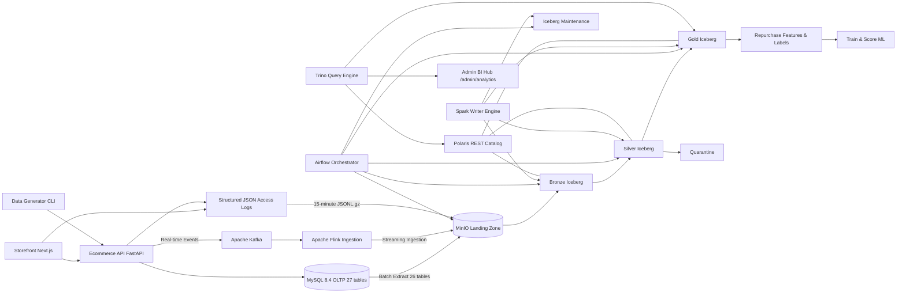

# Project Structure and Architecture

This document describes the repository structure, component architecture, and dependency rules for the D&K E-Commerce Data Platform. The project is organized as a monorepo containing the operational e-commerce application, lakehouse infrastructure, batch ingestion pipelines, and deterministic data generation tooling.

## 1. System Architecture

The following diagram illustrates the data flow and system boundaries:



### 1.1. Dependency Rules

1. **Presentation Boundary:** The Storefront communicates exclusively with the Ecommerce API via HTTP/JSON.
2. **Short Transactions:** The Ecommerce API writes to the MySQL OLTP database via short transactions and emits structured JSON access logs to stdout and domain events to Apache Kafka.
3. **Read-Only Ingestion:** The Data Engineering (DE) extractor uses a read-only account scoped strictly to the 26 allowed analytical tables (excluding `customer_credentials`).
4. **Single Writer Principal:** Apache Airflow orchestrates workflows; Apache Spark executes the batch ingestion, transformations, and Iceberg commits. Spark is the primary Iceberg batch writer, working alongside Apache Flink for streaming ingestion.
5. **Catalog Decoupling:** Apache Polaris manages table metadata, namespaces, and RBAC privileges. It does not perform compute or store data files.
6. **Read-Only Query Engine:** Trino is the distributed SQL engine reading Iceberg tables via Polaris. The Storefront Admin BI Hub connects to Trino for analytical dashboards and native Apache ECharts visualizations.
7. **Isolation of Operational DB:** Analytical dashboards, feature engineering, and ML pipelines never read directly from the primary OLTP database.

---

## 2. Directory Layout

```text
.
├── apps/
│   └── storefront/                       # Next.js 15 customer storefront, POS, and 7-Role BI Hub (/admin/analytics)
├── services/
│   └── ecommerce-api/                    # FastAPI backend (27 tables, 15 modules, 200 pytest tests)
├── database/
│   ├── alembic.ini                       # Alembic migration configuration
│   ├── migrations/                       # Alembic schema versions (0001 to 0017)
│   └── seeds/                            # Master catalog and multi-role demo scenarios seeds
├── generator/
│   ├── configs/                          # Dataset scale scenarios (small, medium, large)
│   ├── src/generator/                    # Deterministic data generator CLI package (v0.6.0)
│   └── tests/                            # Generator distribution & SQL tests (55 tests)
├── pipelines/
│   ├── config/                           # Lakehouse table configurations (default.yml - 26 tables)
│   ├── src/jobs/                         # Spark batch jobs organized by domain (jobs/logs/, jobs/oltp/)
│   ├── src/lakehouse/                    # Core library and domain logic (lakehouse/logs/, lakehouse/oltp/, common)
│   └── tests/                            # Pipeline, bronze, silver & gold financial tests (106 tests)
├── airflow/
│   ├── dags/                             # Airflow DAGs (lakehouse_logs_pipeline.py, ingest_oltp_batch.py, ingest_oltp_landing_to_bronze.py, ingest_oltp_silver.py)
│   └── logs/                             # Airflow operational logs
├── infrastructure/
│   ├── docker/                           # Custom images (Airflow, Flink, Spark)
│   ├── polaris/                          # Idempotent Polaris catalog bootstrap script
│   ├── postgres/                         # Multi-database init scripts (polaris, airflow)
│   ├── spark/                            # Spark Dockerfile, credentials script & conf
│   └── trino/                            # Trino Iceberg REST catalog configuration
├── docs/                                 # Architecture specs, data contracts, and runbooks
│   ├── architecture/                     # Project structure, OLTP schema, access logs, management info specs
│   ├── contracts/                        # JSON schema contracts
│   ├── design-system/                    # UI design tokens and component guidelines
│   ├── pipelines/                        # Batch pipeline implementation guides
│   ├── project/                          # Scope, Lakehouse design plan, Web design plan
│   └── runbook/                          # Setup, startup flow, and operational runbooks
├── scripts/                              # Utility shell scripts and traffic simulator
├── tests/                                # Monorepo cross-component testing guides
├── docker-compose.yml                    # Multi-profile Docker compose stack
├── pyproject.toml                        # Workspace root pyproject configuration
└── uv.lock                               # Pinned dependencies lockfile
```

---

## 3. Python Workspace Configuration

The monorepo uses [`uv`](https://docs.astral.sh/uv/) as the package manager and workspace orchestrator. The workspace consists of three packages sharing a single `uv.lock` file:

- **`ecommerce-api`** (`services/ecommerce-api`): FastAPI, SQLAlchemy 2.0, Alembic, PyMySQL, Argon2, PyJWT (200 tests).
- **`data-generator`** (`generator`): Faker, PyYAML, Argon2, HTTPX (55 tests).
- **`batch-pipeline`** (`pipelines`): PyYAML, PyMySQL, Boto3, PyArrow (106 tests).

Infrastructure components (Trino, LibreDB Studio, Polaris, MinIO, Spark, Kafka, Flink) are pinned via standard container images or custom Dockerfiles and do not interact with the Python host workspace.

---

## 4. Docker Runtime Profiles

The platform uses Docker Compose profiles to isolate service lifecycles:

| Profile | Services | Purpose |
|---|---|---|
| *(Default)* | `mysql`, `postgres`, `minio`, `minio-init`, `polaris-bootstrap`, `polaris`, `polaris-init`, `polaris-console`, `trino`, `libredb-studio` | Core storage, PostgreSQL metadata, Polaris REST catalog, Trino SQL query engine, and LibreDB Studio SQL IDE |
| `batch` | `spark-master`, `spark-worker`, `spark-client`, `airflow-init`, `airflow-webserver`, `airflow-scheduler` | Log collection, Spark standalone compute cluster, and Airflow workflow orchestration |
| `streaming` | `kafka`, `flink-jobmanager`, `flink-taskmanager` | Distributed event streaming (Kafka) and real-time streaming ingestion into Iceberg (Flink) |
| `core` | `ecommerce-api`, `storefront` | Operational e-commerce web application, POS, and customer storefront |
| `lakehouse-tools` | `spark-client` | Ad-hoc Spark CLI verification and SQL smoke tests |

### Service Port Allocations

| Service | Port | Protocol | Description |
|---|---|---|---|
| **Storefront** | `3000` | HTTP | Customer web store & operator console |
| **Admin BI Hub** | `3000` | HTTP | 7-Role executive and operational BI Hub (`/admin/analytics`) |
| **MySQL** | `3306` | TCP | OLTP relational database (27 business tables) |
| **Ecommerce API** | `8000` | HTTP | FastAPI REST endpoints & Swagger docs (`/docs`) |
| **LibreDB Studio (SQL IDE)** | `3001` | HTTP | Web-based SQL editor for MySQL, PostgreSQL, and Trino |
| **Airflow Webserver** | `8080` | HTTP | Pipeline DAG execution & monitoring UI |
| **Spark Master UI** | `8082` | HTTP | Spark standalone cluster overview |
| **Spark Master RPC** | `7077` | Spark RPC | Spark cluster submission endpoint |
| **Spark Worker UI** | `8083` | HTTP | Spark worker node status |
| **Trino Query Engine** | `8084` | HTTP | Trino web UI and JDBC/REST query port |
| **Flink Dashboard** | `8085` | HTTP | Apache Flink streaming engine job manager UI |
| **MinIO S3 API** | `9000` | HTTP (S3) | Object storage API endpoint |
| **MinIO Web Console** | `9001` | HTTP | Web management console for S3 buckets |
| **Apache Kafka Broker** | `9092, 9094` | TCP | Distributed event streaming backbone |
| **Polaris REST Catalog** | `8181` | HTTP | Iceberg REST catalog API |
| **Polaris Management** | `8182` | HTTP | Polaris health and management API |
| **Polaris Console** | `8183` | HTTP | Web UI for Iceberg catalog & RBAC |
| **PostgreSQL** | `5432` | TCP | Metadata database for Polaris and Airflow |

---

## 5. Implementation Progress

### Infrastructure (All Done)

| Component | Version | Status |
|---|---|---|
| MinIO (S3 storage) | RELEASE.2025-09-07 | Done |
| Polaris (Iceberg catalog) | 1.6.0 | Done |
| Spark (compute) | 3.5.9 + Iceberg 1.10.1 | Done |
| Apache Kafka | 3.7 | Done |
| Apache Flink | 1.19 | Done |
| Trino (query engine) | v483 | Done |
| Airflow (orchestration) | 2.10.5 | Done |
| MySQL (OLTP source) | 8.4.5 (27 tables) | Done |
| LibreDB Studio (SQL IDE) | latest | Done |
| Apache ECharts (Native BI) | 5.5 | Done |
| E-Commerce API + Storefront | 0.1.0 (200 tests) | Done |

### Lakehouse Pipelines

| Layer | OLTP | Logs |
|---|---|---|
| Landing → Bronze | Done (26/26 analytical tables) | Done (`web_events`) |
| Bronze → Silver | Done (26/26 analytical tables) | Done (`silver_logs`) |
| Silver → Gold | Done (`dim_*`, `fact_*`, `mart_sales_daily`, `mart_inventory_daily` with COGS & margin) | Done (`fact_web_events`, `mart_hourly_route_metrics`, `mart_daily_product_demand`) |

### Airflow DAGs

| DAG | Status | Schedule | Description |
|---|---|---|---|
| `lakehouse_logs_pipeline` | Done | Every 2 hours | Unified Master Logs DAG: Staging → Bronze → Silver → Gold |
| `ingest_oltp_batch` | Done | Hourly | MySQL OLTP extraction to MinIO Landing Zone (26 tables) |
| `ingest_oltp_landing_to_bronze` | Done | Daily 2 AM | Landing Parquet ingestion to Iceberg Bronze tables |
| `ingest_oltp_bronze_to_silver` | Done | Daily 2 AM | Bronze to Silver MERGE, PII pseudonymization & quarantine |
| `ingest_oltp_silver_to_gold` | Done | Daily 2 AM | Star schema (`dim_*`, `fact_*`), sales marts with financial COGS |
