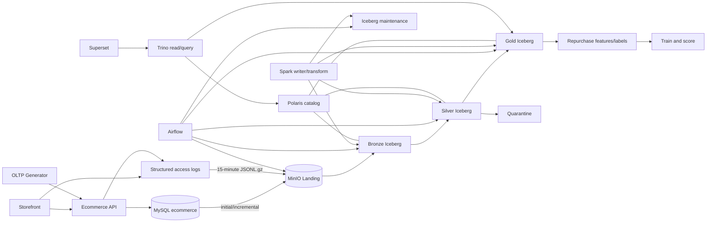

# Kiến trúc và cấu trúc repository

## 1. Mục đích

Repository tổ chức toàn bộ Tiểu luận chuyên ngành trong một monorepo, gồm:

- website thương mại điện tử tối giản tạo dữ liệu OLTP và structured access log;
- MySQL OLTP làm system of record cho nghiệp vụ;
- MinIO Landing cho OLTP extract và rotated log files;
- pipeline Spark batch Bronze–Silver–Gold trên Apache Iceberg;
- Apache Polaris làm catalog và Trino làm query layer;
- data quality, quarantine, reconciliation, replay và maintenance;
- Superset dashboard;
- bài toán dự đoán khả năng khách hàng mua lại từ OLTP-derived Gold data.

Nguồn phân tích TLCN gồm 16 bảng MySQL allowlist và structured access log. `customer_credentials` không được extract; clickstream event được hoãn khỏi TLCN.

## 2. Kiến trúc tổng thể



Dependency rules:

1. Storefront chỉ gọi Ecommerce API.
2. Ecommerce API chỉ ghi MySQL trong transaction ngắn và structured log ngoài transaction boundary.
3. Generator tạo dữ liệu qua API hoặc source contract đã chốt.
4. OLTP extractor dùng DE reader chỉ có `SELECT` trên allowlist 16 bảng.
5. Airflow chỉ orchestration; Spark thực thi ingestion/transform/maintenance.
6. Spark là Iceberg writer duy nhất trong TLCN.
7. Polaris quản lý catalog/namespace; không xử lý transform hoặc BI query.
8. Trino là read/query engine; Superset chỉ kết nối Trino.
9. Dashboard không đọc primary OLTP.
10. ML chỉ đọc Gold snapshot đã reconciliation thành công.

## 3. Cây thư mục mục tiêu

```text
.
├── apps/
│   └── storefront/                       # Next.js customer/admin UI
├── services/
│   └── ecommerce-api/                    # FastAPI business API + structured logging
│       ├── app/
│       │   ├── common/                   # Shared pagination/money helpers
│       │   ├── core/                     # Config, auth, errors, JSON logging
│       │   ├── db/                       # Session, UoW and DB helpers
│       │   ├── models/                   # SQLAlchemy OLTP models
│       │   └── modules/                  # Auth, catalog, wishlist, cart, checkout, order, admin
│       └── tests/                         # API unit/integration tests
├── database/
│   ├── migrations/                       # Alembic schema versions
│   ├── seeds/                            # Deterministic master data
│   └── README.md                         # Ownership and database notes
├── generator/
│   ├── configs/                          # Dataset scale/scenario
│   ├── tests/                            # SQL export & log export tests
│   └── src/generator/                    # Generator CLI package
├── pipelines/
│   ├── config/                           # 16-table ingestion & lakehouse configs
│   ├── src/lakehouse/                    # Spark session, landing, manifest & config validation
│   ├── src/jobs/                         # Spark batch jobs (extract_oltp, ...)
│   └── tests/                            # Pipeline unit tests
├── airflow/
│   ├── dags/                             # Orchestration DAGs (ingest_oltp_batch.py)
│   └── logs/                             # Airflow operational logs only
├── infrastructure/
│   ├── docker/                           # Custom images (Airflow, Superset)
│   ├── fluent-bit/                       # Real-time access log collector config
│   ├── postgres/                         # Multi-database init scripts
│   ├── spark/                            # Spark + Iceberg runtime assets & smoke test
│   ├── polaris/                          # Idempotent catalog/RBAC bootstrap
│   ├── trino/                            # Iceberg REST/Polaris reader config & startup
│   └── superset/                         # Superset config & datasources
├── docs/
│   ├── architecture/                     # Structure, OLTP schema and diagrams
│   ├── design-system/                    # UI design tokens and components
│   ├── pipelines/                        # Pipeline implementation notes
│   ├── project/                          # Scope and plans
│   └── runbook/                          # Setup and operation
├── skills/
│   └── oltp-design/SKILL.md              # OLTP design principles
├── scripts/
│   ├── import_generated_sql.sh           # Import generated dataset into MySQL
│   ├── lakehouse_smoke.sh                # End-to-end Spark write -> Polaris -> Trino read smoke test
│   ├── upload_generated_logs.sh          # Upload synthetic access logs to MinIO
│   └── simulate_web_traffic.py           # Web traffic simulator
├── tests/                                # Cross-component tests
├── .env.example
├── README.md
├── docker-compose.yml
├── pyproject.toml
└── uv.lock
```

## 4. Runtime profiles mục tiêu

| Profile | Thành phần | Vai trò |
|---|---|---|
| `core` | MySQL, Ecommerce API, Storefront | Tạo OLTP data và access log |
| `batch` | Fluent Bit, MinIO, PostgreSQL, Polaris, Polaris Console, Spark và Airflow | Landing, Iceberg Medallion, DQ và orchestration |
| `bi` | Trino, PostgreSQL và Superset | Query serving và dashboard |
| `lakehouse-tools` | Spark SQL client | Smoke test writer/reader integration |

Thứ tự chạy:

```text
core → Sinh & nạp dữ liệu bằng generator CLI trên host (nếu cần)
     → batch: Ingestion/transform/catalog
     → bi: Trino/Superset
```

## 5. Python workspace

Workspace `uv` gồm 3 members:

- `ecommerce-api` (`services/ecommerce-api`);
- `data-generator` (`generator`);
- `batch-pipeline` (`pipelines`).

`uv.lock` là lockfile duy nhất. Dockerfile Python dùng cùng phiên bản `uv` và cài package theo workspace lock. Trino, Polaris, MinIO và Superset được pin bằng container image/config riêng, không đưa vào Python workspace.

## 6. Source application

### 6.1. Storefront

Storefront đảm nhiệm auth, catalog search/filter/detail, wishlist, cart, checkout, order history/detail và admin console tối thiểu. Storefront không truy cập database trực tiếp và không chứa business transaction logic.

### 6.2. Ecommerce API

API tổ chức theo module nghiệp vụ. Router xử lý HTTP/schema; service xử lý invariant/transaction; model biểu diễn persistence. Checkout và cancel giữ transaction boundary theo [`oltp-schema.md`](oltp-schema.md).

### 6.3. Structured access log

Web/API phát một JSON record cho mỗi completed HTTP request, có `request_id`, UTC time, service, method, canonical route, status, latency và optional actor/product/search/filter metadata.

- Log writer rotate mỗi 15 phút và nén `gzip`.
- Không ghi secret, token, cookie, authorization header hoặc checkout body.
- Raw IP/actor reference phải pseudonymize trước trusted Silver.
- Clickstream event không thuộc TLCN.

## 7. Ownership và quyền

MySQL ecommerce có 17 bảng logical. Pipeline chỉ đọc 16 bảng analytical source; `customer_credentials` bị loại khỏi source contract.

Quyền tối thiểu:

- Ecommerce API: read/write schema nghiệp vụ;
- DE reader: table-level `SELECT` trên 16 bảng;
- Spark writer: ghi Landing/warehouse và commit Iceberg qua Polaris;
- Trino reader: đọc trusted Silver/Gold qua Polaris;
- Superset reader: chỉ query Gold marts/curated facts qua Trino.

Order, payment, item và status history không hard delete. Customer PII, raw IP và secret không được publish vào Gold/ML.

## 8. Storage, catalog và query boundary

- MinIO giữ Landing objects và Iceberg data/metadata files.
- Iceberg quản lý snapshot, schema, partition và table commit.
- Polaris quản lý catalog/namespace và phân giải table metadata.
- Spark là writer/transform engine.
- Trino là read/query engine.
- Superset là presentation layer.

Không thao tác thủ công file bên dưới Iceberg warehouse. Không publish Gold sang MySQL analytics trong kiến trúc mới.

## 9. Batch pipeline

Các DAG chính:

```text
ingest_oltp_batch
ingest_access_logs
build_gold
maintain_iceberg_tables
repurchase_ml_batch
```

Các contract bắt buộc:

- OLTP composite cursor `(timestamp, stable_pk)` và fixed high watermark;
- log source-file checksum, closed-file marker và `request_id` dedup;
- Landing manifest trước Bronze commit;
- idempotent theo source/input identity;
- quarantine tách khỏi trusted Silver/Gold;
- replay từ Bronze không đọc lại nguồn;
- Gold publication theo fixed input snapshots;
- Superset chỉ nhìn publication đã pass gate;
- maintenance không đổi logical result.

Chi tiết tại [`../project/lakehouse-plan.md`](../project/lakehouse-plan.md).

## 10. ML boundary

ML repurchase chỉ dùng OLTP-derived Gold data:

```text
Gold publication thành công
→ point-in-time features
→ closed 30-day labels
→ temporal split
→ train/evaluate
→ batch score
→ artifact manifest
```

Access-log feature không dùng cho model chính trong TLCN. Feature, label, model và score đều có Gold snapshot, cutoff và run lineage.

## 11. Testing

- API/MySQL transaction, idempotency và concurrency tests.
- Generator reproducibility tests.
- Log schema, rotation, privacy và duplicate-file tests.
- OLTP cursor/high-watermark và Landing manifest tests.
- Bronze/Silver/Gold Iceberg grain và DQ tests.
- Spark writer–Polaris catalog–Trino reader compatibility tests.
- Reconciliation, rerun, replay, backfill và compaction tests.
- ML point-in-time/closed-horizon/leakage tests.
- Storefront build/healthcheck và Docker Compose validation.

## 12. Tài liệu nguồn

Thứ tự ưu tiên:

1. [`../project/scope.md`](../project/scope.md) — phạm vi và acceptance TLCN;
2. [`../project/lakehouse-plan.md`](../project/lakehouse-plan.md) — kiến trúc Lakehouse chi tiết;
3. [`oltp-schema.md`](oltp-schema.md) — logical OLTP schema và transaction catalogue;
4. [`../project/web-plan.md`](../project/web-plan.md) — kế hoạch source website;
5. [`project-structure.md`](project-structure.md) — cấu trúc triển khai;
6. [`../../skills/oltp-design/SKILL.md`](../../skills/oltp-design/SKILL.md) — nguyên tắc thiết kế tham khảo.
