# OOSAD Analysis - D&K E-Commerce Data Platform

> **Phương pháp:** Object-Oriented Systems Analysis and Design (OOSAD) - Alan Dennis  
> **Hệ thống:** D&K E-Commerce Data Platform  
> **Mục tiêu:** Phân tích và thiết kế hệ thống cho báo cáo Khóa luận tốt nghiệp  
> **Cấu trúc:** 2 Phần (Web OLTP + Data Lakehouse) + Kiểm tra tính nhất quán

---

## MỤC LỤC

### PHẦN I: WEB OLTP SYSTEM (Customer/Admin/Staff)
1. [Actors](#11-xác-định-actors)
2. [Use-Case Diagrams](#12-use-case-diagrams)
3. [Detailed Use-Case Descriptions (SVDPI)](#13-detailed-use-case-descriptions)
4. [Activity Diagrams](#14-activity-diagrams)
5. [System Sequence Diagrams](#15-system-sequence-diagrams)
6. [Class Diagrams](#16-class-diagrams)

### PHẦN II: DATA LAKEHOUSE (DE/DA)
1. [Actors](#21-xác-định-actors)
2. [System Use-Case Diagrams](#22-system-use-case-diagrams)
3. [Component Diagrams](#23-component-diagrams)
4. [Data Flow Diagrams](#24-data-flow-diagrams)
5. [Activity Diagrams](#25-activity-diagrams)
6. [Sequence Diagrams](#26-sequence-diagrams)

### PHẦN III: KIỂM TRA TÍNH NHẤT QUÁN
1. [Balancing Matrix](#31-balancing-matrix)
2. [Coverage Verification](#32-coverage-verification)

---

# PHẦN I: WEB OLTP SYSTEM

> **Phạm vi:** Hệ thống thương mại điện tử trực tuyến  
> **Actors:** Customer, Admin, Store Manager, City Planner  
> **Stack:** Next.js 15, FastAPI, MySQL 8.4, SQLAlchemy, Alembic

---

## 1.1 Xác định Actors

### Bảng tổng hợp Actors (OLTP)

| Actor | Vai trò | Mô tả | Giao diện |
|-------|---------|-------|-----------|
| **Customer** | Khách hàng | Người dùng cuối mua sắm trên nền tảng | Next.js Storefront (Port 3000) |
| **Admin** | Quản trị viên | Quản lý cửa hàng, sản phẩm, đơn hàng tổng quát | Next.js Admin Console (Port 3000/admin) |
| **Store Manager** | Quản lý cửa hàng | Quản lý tồn kho tại cửa hàng được phân công | Next.js Admin Console (Port 3000/admin) |
| **City Planner** | Quản lý thành phố | Quản lý tất cả cửa hàng trong thành phố được phân công | Next.js Admin Console (Port 3000/admin) |

### Actor Relationship Diagram

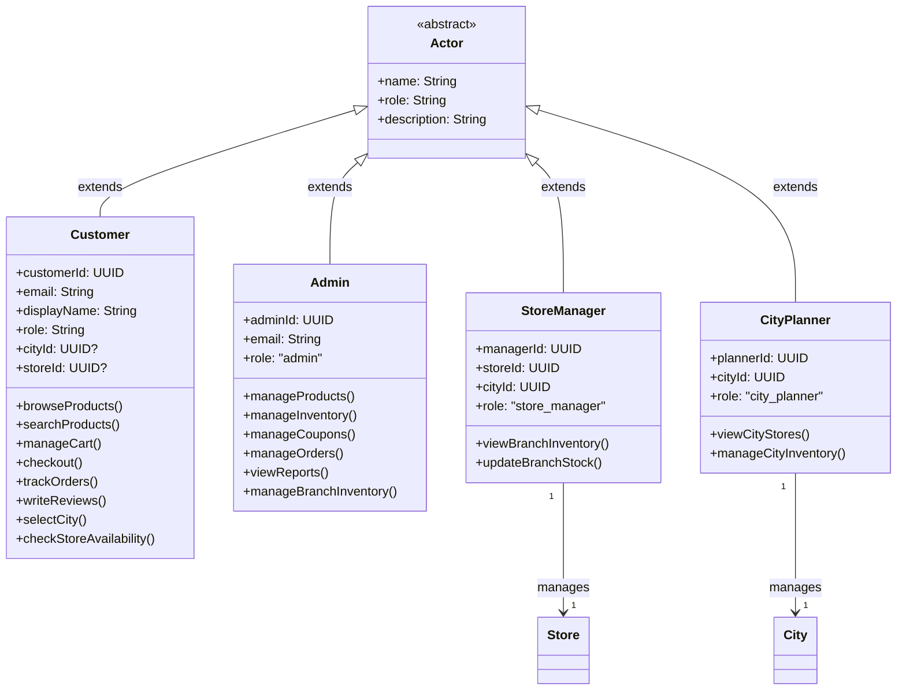
```mermaid
classDiagram
    class Actor {
        <<abstract>>
        +name: String
        +role: String
        +description: String
    }
    
    class Customer {
        +customerId: UUID
        +email: String
        +displayName: String
        +role: String
        +cityId: UUID?
        +storeId: UUID?
        +browseProducts()
        +searchProducts()
        +manageCart()
        +checkout()
        +trackOrders()
        +writeReviews()
        +selectCity()
        +checkStoreAvailability()
    }
    
    class Admin {
        +adminId: UUID
        +email: String
        +role: "admin"
        +manageProducts()
        +manageInventory()
        +manageCoupons()
        +manageOrders()
        +viewReports()
        +manageBranchInventory()
    }
    
    class StoreManager {
        +managerId: UUID
        +storeId: UUID
        +cityId: UUID
        +role: "store_manager"
        +viewBranchInventory()
        +updateBranchStock()
    }
    
    class CityPlanner {
        +plannerId: UUID
        +cityId: UUID
        +role: "city_planner"
        +viewCityStores()
        +manageCityInventory()
    }
    
    Actor <|-- Customer : extends
    Actor <|-- Admin : extends
    Actor <|-- StoreManager : extends
    Actor <|-- CityPlanner : extends
    
    StoreManager "1" --> "1" Store : manages
    CityPlanner "1" --> "1" City : manages
```

---

## 1.2 Use-Case Diagrams

### 1.2.1 Customer Domain

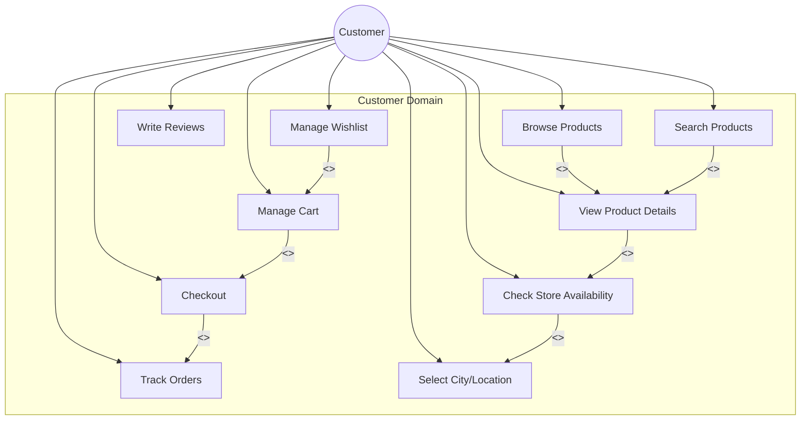
```mermaid
graph TB
    subgraph "Customer Domain"
        UC1[Browse Products]
        UC2[Search Products]
        UC3[View Product Details]
        UC4[Manage Cart]
        UC5[Checkout]
        UC6[Track Orders]
        UC7[Write Reviews]
        UC8[Manage Wishlist]
        UC15[Select City/Location]
        UC16[Check Store Availability]
    end
    
    Customer((Customer))
    
    Customer --> UC1
    Customer --> UC2
    Customer --> UC3
    Customer --> UC4
    Customer --> UC5
    Customer --> UC6
    Customer --> UC7
    Customer --> UC8
    Customer --> UC15
    Customer --> UC16
    
    UC4 -->|<<include>>| UC5
    UC5 -->|<<include>>| UC6
    UC1 -->|<<extend>>| UC3
    UC2 -->|<<extend>>| UC3
    UC8 -->|<<extend>>| UC4
    UC16 -->|<<include>>| UC15
    UC3 -->|<<extend>>| UC16
```

### 1.2.2 Admin Domain (with Staff Roles)

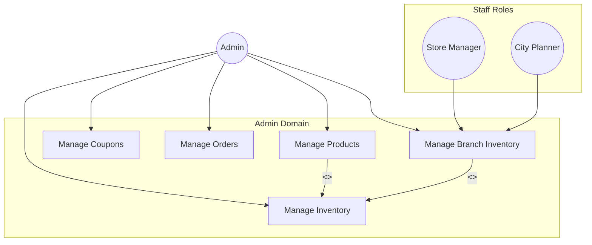
```mermaid
graph TB
    subgraph "Admin Domain"
        UC9[Manage Products]
        UC11[Manage Inventory]
        UC12[Manage Coupons]
        UC13[Manage Orders]
        UC17[Manage Branch Inventory]
    end
    
    subgraph "Staff Roles"
        StoreManager((Store Manager))
        CityPlanner((City Planner))
    end
    
    Admin((Admin))
    
    Admin --> UC9
    Admin --> UC11
    Admin --> UC12
    Admin --> UC13
    Admin --> UC17
    
    StoreManager --> UC17
    CityPlanner --> UC17
    
    UC9 -->|<<include>>| UC11
    UC17 -->|<<extend>>| UC11
```

---

## 1.3 Detailed Use-Case Descriptions

### UC1: Browse Products

| Field | Description |
|-------|-------------|
| **Use-Case ID** | UC1 |
| **Use-Case Name** | Browse Products |
| **Actor(s)** | Customer |
| **Description** | Customer browses product catalog by category |
| **Precondition** | System has products in database |
| **Postcondition** | Products displayed to customer |
| **Priority** | High |

#### Flow of Events (SVDPI)

| Step | Actor | System | SVDPI Statement |
|------|-------|--------|-----------------|
| 1 | Customer | System | Customer **selects** category **from** navigation menu |
| 2 | - | System | System **retrieves** products **from** database |
| 3 | - | System | System **displays** product list **to** customer |
| 4 | Customer | System | Customer **applies** filters **to** product list |
| 5 | - | System | System **filters** products **by** criteria |
| 6 | Customer | System | Customer **paginates** through results |
| 7 | - | System | System **returns** paginated results **to** customer |

---

### UC2: Search Products

| Field | Description |
|-------|-------------|
| **Use-Case ID** | UC2 |
| **Use-Case Name** | Search Products |
| **Actor(s)** | Customer |
| **Description** | Customer searches for products by keyword |
| **Precondition** | System has products in database |
| **Postcondition** | Search results displayed |
| **Priority** | High |

#### Flow of Events (SVDPI)

| Step | Actor | System | SVDPI Statement |
|------|-------|--------|-----------------|
| 1 | Customer | System | Customer **enters** search keyword **into** search box |
| 2 | - | System | System **processes** search query **using** full-text search |
| 3 | - | System | System **ranks** results **by** relevance |
| 4 | - | System | System **displays** search results **to** customer |
| 5 | Customer | System | Customer **clicks** on product **from** results |
| 6 | - | System | System **logs** search event **to** access stream |

---

### UC3: View Product Details

| Field | Description |
|-------|-------------|
| **Use-Case ID** | UC3 |
| **Use-Case Name** | View Product Details |
| **Actor(s)** | Customer |
| **Description** | Customer views detailed product information |
| **Precondition** | Product exists in database |
| **Postcondition** | Product details displayed |
| **Priority** | High |

#### Flow of Events (SVDPI)

| Step | Actor | System | SVDPI Statement |
|------|-------|--------|-----------------|
| 1 | Customer | System | Customer **selects** product **from** list |
| 2 | - | System | System **retrieves** product details **from** database |
| 3 | - | System | System **loads** product images **from** CDN |
| 4 | - | System | System **displays** product page **to** customer |
| 5 | - | System | System **shows** related products **to** customer |
| 6 | - | System | System **logs** product view **to** access stream |

---

### UC4: Manage Cart

| Field | Description |
|-------|-------------|
| **Use-Case ID** | UC4 |
| **Use-Case Name** | Manage Cart |
| **Actor(s)** | Customer |
| **Description** | Customer adds, updates, or removes items from cart |
| **Precondition** | Customer is logged in |
| **Postcondition** | Cart updated with changes |
| **Priority** | High |

#### Flow of Events (SVDPI)

| Step | Actor | System | SVDPI Statement |
|------|-------|--------|-----------------|
| 1 | Customer | System | Customer **adds** product **to** cart |
| 2 | - | System | System **validates** stock availability **for** product |
| 3 | - | System | System **creates** cart item **in** database |
| 4 | - | System | System **updates** cart total |
| 5 | Customer | System | Customer **updates** quantity **in** cart |
| 6 | - | System | System **validates** new quantity **against** stock |
| 7 | - | System | System **recalculates** cart total |
| 8 | Customer | System | Customer **removes** item **from** cart |
| 9 | - | System | System **deletes** cart item **from** database |
| 10 | - | System | System **logs** cart changes **to** access stream |

---

### UC5: Checkout

| Field | Description |
|-------|-------------|
| **Use-Case ID** | UC5 |
| **Use-Case Name** | Checkout |
| **Actor(s)** | Customer |
| **Description** | Customer completes purchase of items in cart |
| **Precondition** | Customer is logged in, cart is not empty, items are in stock |
| **Postcondition** | Order created, payment processed, inventory updated |
| **Priority** | High |
| **Business Rule** | Checkout is atomic - single transaction |

#### Flow of Events (SVDPI)

| Step | Actor | System | SVDPI Statement |
|------|-------|--------|-----------------|
| 1 | Customer | System | Customer **selects** items **from** cart **for** checkout |
| 2 | - | System | System **validates** stock availability **for** each item |
| 3 | - | System | System **calculates** total price **including** shipping fee |
| 4 | - | System | System **displays** order summary **to** customer |
| 5 | Customer | System | Customer **enters** structured address **into** form (province, ward, street) |
| 6 | Customer | System | Customer **applies** coupon **to** order (optional) |
| 7 | - | System | System **calculates** discount **from** coupon |
| 8 | Customer | System | Customer **confirms** order **to** system |
| 9 | - | System | System **creates** order record **in** MySQL database |
| 10 | - | System | System **creates** order items **in** MySQL database |
| 11 | - | System | System **creates** payment record **as** succeeded (simulated) |
| 12 | - | System | System **decrements** inventory levels **for** purchased items |
| 13 | - | System | System **marks** cart **as** checked_out |
| 14 | - | System | System **logs** transaction details **to** access log stream |

#### Alternative Flows

| Alt Step | Condition | SVDPI Statement |
|----------|-----------|-----------------|
| 2a | Stock unavailable | System **notifies** customer **about** out-of-stock items |
| 6a | Coupon invalid | System **notifies** customer **about** coupon error |

---

### UC6: Track Orders

| Field | Description |
|-------|-------------|
| **Use-Case ID** | UC6 |
| **Use-Case Name** | Track Orders |
| **Actor(s)** | Customer |
| **Description** | Customer views order history and status |
| **Precondition** | Customer is logged in, has orders |
| **Postcondition** | Order list displayed |
| **Priority** | Medium |

#### Flow of Events (SVDPI)

| Step | Actor | System | SVDPI Statement |
|------|-------|--------|-----------------|
| 1 | Customer | System | Customer **accesses** order history page |
| 2 | - | System | System **retrieves** orders **from** database |
| 3 | - | System | System **displays** order list **to** customer |
| 4 | Customer | System | Customer **selects** order **from** list |
| 5 | - | System | System **retrieves** order details **from** database |
| 6 | - | System | System **displays** order details **to** customer |

---

### UC7: Write Reviews

| Field | Description |
|-------|-------------|
| **Use-Case ID** | UC7 |
| **Use-Case Name** | Write Reviews |
| **Actor(s)** | Customer |
| **Description** | Customer writes review for purchased product |
| **Precondition** | Customer has completed order containing product |
| **Postcondition** | Review saved to database |
| **Priority** | Medium |

#### Flow of Events (SVDPI)

| Step | Actor | System | SVDPI Statement |
|------|-------|--------|-----------------|
| 1 | Customer | System | Customer **selects** product **from** order |
| 2 | - | System | System **verifies** purchase history **for** customer |
| 3 | Customer | System | Customer **writes** review content **into** form |
| 4 | Customer | System | Customer **selects** rating **from** star options |
| 5 | Customer | System | Customer **submits** review **to** system |
| 6 | - | System | System **validates** review content |
| 7 | - | System | System **saves** review **to** database |
| 8 | - | System | System **logs** review event **to** access stream |

---

### UC8: Manage Wishlist

| Field | Description |
|-------|-------------|
| **Use-Case ID** | UC8 |
| **Use-Case Name** | Manage Wishlist |
| **Actor(s)** | Customer |
| **Description** | Customer adds or removes products from wishlist |
| **Precondition** | Customer is logged in |
| **Postcondition** | Wishlist updated |
| **Priority** | Low |

#### Flow of Events (SVDPI)

| Step | Actor | System | SVDPI Statement |
|------|-------|--------|-----------------|
| 1 | Customer | System | Customer **adds** product **to** wishlist |
| 2 | - | System | System **creates** wishlist item **in** database |
| 3 | Customer | System | Customer **views** wishlist page |
| 4 | - | System | System **retrieves** wishlist items **from** database |
| 5 | - | System | System **displays** wishlist **to** customer |
| 6 | Customer | System | Customer **removes** product **from** wishlist |
| 7 | - | System | System **deletes** wishlist item **from** database |

---

### UC9: Manage Products (Admin)

| Field | Description |
|-------|-------------|
| **Use-Case ID** | UC9 |
| **Use-Case Name** | Manage Products |
| **Actor(s)** | Admin |
| **Description** | Admin creates, updates, or archives products |
| **Precondition** | Admin is authenticated |
| **Postcondition** | Product changes saved to database |
| **Priority** | High |

#### Flow of Events (SVDPI)

| Step | Actor | System | SVDPI Statement |
|------|-------|--------|-----------------|
| 1 | Admin | System | Admin **navigates** to product management page |
| 2 | - | System | System **displays** product list **to** admin |
| 3 | Admin | System | Admin **clicks** add product button |
| 4 | - | System | System **displays** product form **to** admin |
| 5 | Admin | System | Admin **enters** product details **into** form |
| 6 | Admin | System | Admin **uploads** product images **to** system |
| 7 | Admin | System | Admin **saves** product **to** system |
| 8 | - | System | System **validates** product data |
| 9 | - | System | System **creates** product record **in** database |
| 10 | - | System | System **logs** admin action **to** audit trail |

---

### UC10: Manage Categories (Admin)

| Field | Description |
|-------|-------------|
| **Use-Case ID** | UC10 |
| **Use-Case Name** | Manage Categories |
| **Actor(s)** | Admin |
| **Description** | Admin creates, updates, or deletes product categories |
| **Precondition** | Admin is authenticated |
| **Postcondition** | Category changes saved |
| **Priority** | High |

#### Flow of Events (SVDPI)

| Step | Actor | System | SVDPI Statement |
|------|-------|--------|-----------------|
| 1 | Admin | System | Admin **navigates** to category management page |
| 2 | - | System | System **displays** category tree **to** admin |
| 3 | Admin | System | Admin **adds** new category **to** tree |
| 4 | - | System | System **validates** category name |
| 5 | - | System | System **creates** category record **in** database |
| 6 | Admin | System | Admin **updates** category details |
| 7 | - | System | System **saves** category changes |

---

### UC11: Manage Inventory (Admin)

| Field | Description |
|-------|-------------|
| **Use-Case ID** | UC11 |
| **Use-Case Name** | Manage Inventory |
| **Actor(s)** | Admin |
| **Description** | Admin updates product inventory levels |
| **Precondition** | Admin is authenticated, products exist |
| **Postcondition** | Inventory levels updated |
| **Priority** | High |

#### Flow of Events (SVDPI)

| Step | Actor | System | SVDPI Statement |
|------|-------|--------|-----------------|
| 1 | Admin | System | Admin **navigates** to inventory page |
| 2 | - | System | System **displays** inventory levels **to** admin |
| 3 | Admin | System | Admin **selects** product variant |
| 4 | Admin | System | Admin **enters** new stock quantity |
| 5 | Admin | System | Admin **confirms** inventory update |
| 6 | - | System | System **validates** quantity change |
| 7 | - | System | System **updates** inventory record **in** database |
| 8 | - | System | System **logs** inventory change **to** audit trail |

---

### UC12: Manage Coupons (Admin)

| Field | Description |
|-------|-------------|
| **Use-Case ID** | UC12 |
| **Use-Case Name** | Manage Coupons |
| **Actor(s)** | Admin |
| **Description** | Admin creates or deactivates promotional coupons |
| **Precondition** | Admin is authenticated |
| **Postcondition** | Coupon changes saved |
| **Priority** | Medium |

#### Flow of Events (SVDPI)

| Step | Actor | System | SVDPI Statement |
|------|-------|--------|-----------------|
| 1 | Admin | System | Admin **navigates** to coupon management page |
| 2 | - | System | System **displays** coupon list **to** admin |
| 3 | Admin | System | Admin **creates** new coupon |
| 4 | Admin | System | Admin **sets** coupon parameters **in** form |
| 5 | - | System | System **validates** coupon rules |
| 6 | - | System | System **creates** coupon record **in** database |
| 7 | Admin | System | Admin **deactivates** existing coupon |
| 8 | - | System | System **marks** coupon as inactive |

---

### UC13: Manage Orders (Admin)

| Field | Description |
|-------|-------------|
| **Use-Case ID** | UC13 |
| **Use-Case Name** | Manage Orders |
| **Actor(s)** | Admin |
| **Description** | Admin views and processes customer orders |
| **Precondition** | Admin is authenticated, orders exist |
| **Postcondition** | Order status updated |
| **Priority** | High |

#### Flow of Events (SVDPI)

| Step | Actor | System | SVDPI Statement |
|------|-------|--------|-----------------|
| 1 | Admin | System | Admin **navigates** to order management page |
| 2 | - | System | System **displays** order list **to** admin |
| 3 | Admin | System | Admin **filters** orders **by** status |
| 4 | Admin | System | Admin **selects** order **from** list |
| 5 | - | System | System **displays** order details **to** admin |
| 6 | Admin | System | Admin **updates** order status |
| 7 | - | System | System **validates** status transition |
| 8 | - | System | System **saves** status change **to** database |
| 9 | - | System | System **records** transition **in** order_status_history |

---

### UC14: View Dashboard (Admin)

| Field | Description |
|-------|-------------|
| **Use-Case ID** | UC14 |
| **Use-Case Name** | View Dashboard |
| **Actor(s)** | Admin |
| **Description** | Admin views overview dashboard with key metrics |
| **Precondition** | Admin is authenticated |
| **Postcondition** | Dashboard displayed |
| **Priority** | Medium |

#### Flow of Events (SVDPI)

| Step | Actor | System | SVDPI Statement |
|------|-------|--------|-----------------|
| 1 | Admin | System | Admin **navigates** to dashboard page |
| 2 | - | System | System **retrieves** revenue data **from** database |
| 3 | - | System | System **retrieves** order counts **from** database |
| 4 | - | System | System **retrieves** product/customer counts **from** database |
| 5 | - | System | System **identifies** low stock items **from** database |
| 6 | - | System | System **displays** dashboard **to** admin |

---

### UC15: Select City/Location

| Field | Description |
|-------|-------------|
| **Use-Case ID** | UC15 |
| **Use-Case Name** | Select City/Location |
| **Actor(s)** | Customer |
| **Description** | Customer selects their city to view location-specific product availability |
| **Precondition** | System has cities and stores configured |
| **Postcondition** | Selected city saved to localStorage; product availability filtered by city |
| **Priority** | High |

#### Flow of Events (SVDPI)

| Step | Actor | System | SVDPI Statement |
|------|-------|--------|-----------------|
| 1 | Customer | System | Customer **clicks** city selector **in** header |
| 2 | - | System | System **fetches** active cities **from** /api/v1/locations/cities |
| 3 | - | System | System **displays** city list **with** store count **to** customer |
| 4 | Customer | System | Customer **selects** city **from** dropdown |
| 5 | - | System | System **saves** selected city code **to** localStorage |
| 6 | - | System | System **refreshes** product availability **for** selected city |

---

### UC16: Check Store Availability

| Field | Description |
|-------|-------------|
| **Use-Case ID** | UC16 |
| **Use-Case Name** | Check Store Availability |
| **Actor(s)** | Customer |
| **Description** | Customer views product availability breakdown by store in selected city |
| **Precondition** | Customer has selected a city; product exists |
| **Postcondition** | Store-level availability displayed to customer |
| **Priority** | High |

#### Flow of Events (SVDPI)

| Step | Actor | System | SVDPI Statement |
|------|-------|--------|-----------------|
| 1 | - | System | System **loads** product detail page |
| 2 | - | System | System **fetches** availability **from** /api/v1/catalog/products/{slug}/availability |
| 3 | - | System | System **displays** city pool total **to** customer |
| 4 | - | System | System **lists** each store **with** stock quantity |
| 5 | Customer | System | Customer **views** per-store availability **in** StoreAvailabilityBox |

---

### UC17: Manage Branch Inventory (Staff)

| Field | Description |
|-------|-------------|
| **Use-Case ID** | UC17 |
| **Use-Case Name** | Manage Branch Inventory |
| **Actor(s)** | Admin, Store Manager, City Planner |
| **Description** | Staff updates inventory quantities at stores within their permission scope |
| **Precondition** | Staff is authenticated with appropriate role |
| **Postcondition** | Inventory levels updated with permission check |
| **Priority** | High |

#### Flow of Events (SVDPI)

| Step | Actor | System | SVDPI Statement |
|------|-------|--------|-----------------|
| 1 | Staff | System | Staff **navigates** to branch inventory page |
| 2 | - | System | System **checks** role permissions **for** staff |
| 3 | - | System | System **filters** stores **by** permission scope |
| 4 | - | System | System **displays** inventory list **to** staff |
| 5 | Staff | System | Staff **selects** product variant |
| 6 | Staff | System | Staff **enters** new stock quantity |
| 7 | Staff | System | Staff **confirms** inventory update |
| 8 | - | System | System **validates** permission **for** target store |
| 9 | - | System | System **updates** store_inventory record **in** database |
| 10 | - | System | System **increments** version **for** optimistic locking |

#### Permission Rules

| Role | Scope | Can Edit |
|------|-------|----------|
| **Admin** | All stores | Full access |
| **City Planner** | Stores in assigned city | City-scoped |
| **Store Manager** | Assigned store only | Store-scoped |
| **Customer** | None | No access |

---

### UC18: POS Transaction (Staff)

| Field | Description |
|-------|-------------|
| **Use-Case ID** | UC18 |
| **Use-Case Name** | POS Transaction |
| **Actor(s)** | Admin, Store Manager, City Planner |
| **Description** | Staff sells products at store counter using Point of Sale terminal |
| **Precondition** | Staff is authenticated with appropriate role, store assigned |
| **Postcondition** | Order created as completed, both global and store inventory decremented |
| **Priority** | High |
| **Business Rule** | POS creates completed order immediately, deducts dual inventory atomically |

#### Flow of Events (SVDPI)

| Step | Actor | System | SVDPI Statement |
|------|-------|--------|-----------------|
| 1 | Staff | System | Staff **navigates** to POS page **at** /admin/pos |
| 2 | - | System | System **displays** search input **to** staff |
| 3 | Staff | System | Staff **enters** product keyword **into** search box |
| 4 | - | System | System **searches** products **by** SKU prefix or name |
| 5 | - | System | System **returns** up to 8 results **with** store stock |
| 6 | Staff | System | Staff **selects** product **from** results |
| 7 | Staff | System | Staff **enters** quantity **for** product |
| 8 | Staff | System | Staff **adds** product **to** cart |
| 9 | Staff | System | Staff **repeats** steps 3-8 **for** additional products |
| 10 | - | System | System **displays** cart **with** items and total |
| 11 | Staff | System | Staff **confirms** transaction **to** system |
| 12 | - | System | System **validates** store inventory **for** each item |
| 13 | - | System | System **creates** order **with** channel='pos', status='completed' |
| 14 | - | System | System **creates** payment record **as** succeeded |
| 15 | - | System | System **decrements** store_inventory **for** each item |
| 16 | - | System | System **decrements** inventory **for** each item |
| 17 | - | System | System **displays** success message **with** order number |

#### Alternative Flows

| Alt Step | Condition | SVDPI Statement |
|----------|-----------|-----------------|
| 12a | Insufficient store stock | System **notifies** staff **about** out-of-stock items |

#### Permission Rules

| Role | Scope | Can POS |
|------|-------|---------|
| **Admin** | All stores | Yes |
| **City Planner** | Stores in assigned city | Yes |
| **Store Manager** | Assigned store only | Yes |
| **Customer** | None | No access |

---

### 1.4.1 UC1: Browse Products

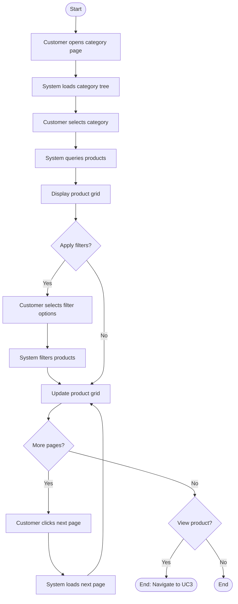
```mermaid
flowchart TD
    Start([Start]) --> A[Customer opens category page]
    A --> B[System loads category tree]
    B --> C[Customer selects category]
    C --> D[System queries products]
    D --> E[Display product grid]
    E --> F{Apply filters?}
    F -->|Yes| G[Customer selects filter options]
    G --> H[System filters products]
    H --> I[Update product grid]
    F -->|No| I
    I --> J{More pages?}
    J -->|Yes| K[Customer clicks next page]
    K --> L[System loads next page]
    L --> I
    J -->|No| M{View product?}
    M -->|Yes| N([End: Navigate to UC3])
    M -->|No| O([End])
```

### 1.4.2 UC2: Search Products

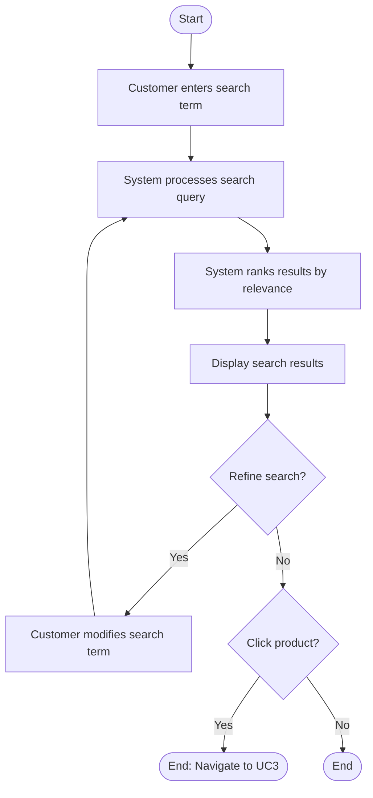
```mermaid
flowchart TD
    Start([Start]) --> A[Customer enters search term]
    A --> B[System processes search query]
    B --> C[System ranks results by relevance]
    C --> D[Display search results]
    D --> E{Refine search?}
    E -->|Yes| F[Customer modifies search term]
    F --> B
    E -->|No| G{Click product?}
    G -->|Yes| H([End: Navigate to UC3])
    G -->|No| I([End])
```

### 1.4.3 UC3: View Product Details

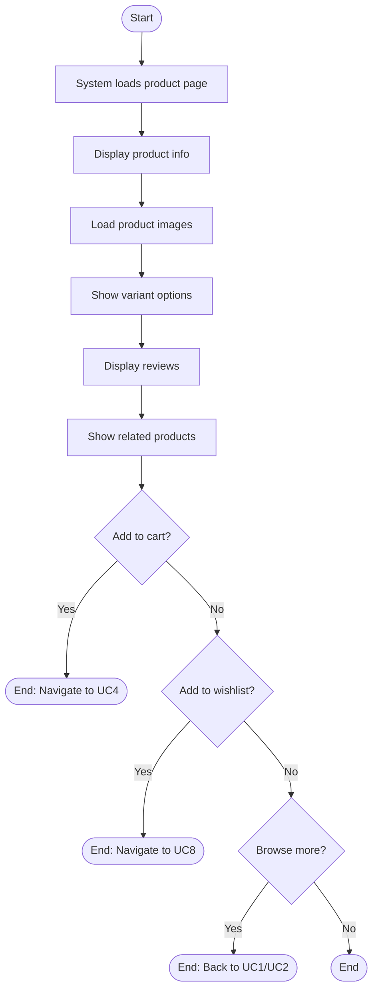
```mermaid
flowchart TD
    Start([Start]) --> A[System loads product page]
    A --> B[Display product info]
    B --> C[Load product images]
    C --> D[Show variant options]
    D --> E[Display reviews]
    E --> F[Show related products]
    F --> G{Add to cart?}
    G -->|Yes| H([End: Navigate to UC4])
    G -->|No| I{Add to wishlist?}
    I -->|Yes| J([End: Navigate to UC8])
    I -->|No| K{Browse more?}
    K -->|Yes| L([End: Back to UC1/UC2])
    K -->|No| M([End])
```

### 1.4.4 UC4: Manage Cart

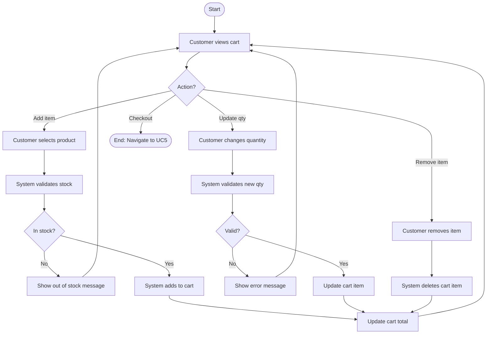
```mermaid
flowchart TD
    Start([Start]) --> A[Customer views cart]
    A --> B{Action?}
    
    B -->|Add item| C[Customer selects product]
    C --> D[System validates stock]
    D --> E{In stock?}
    E -->|No| F[Show out of stock message]
    F --> A
    E -->|Yes| G[System adds to cart]
    G --> H[Update cart total]
    H --> A
    
    B -->|Update qty| I[Customer changes quantity]
    I --> J[System validates new qty]
    J --> K{Valid?}
    K -->|No| L[Show error message]
    L --> A
    K -->|Yes| M[Update cart item]
    M --> H
    
    B -->|Remove item| N[Customer removes item]
    N --> O[System deletes cart item]
    O --> H
    
    B -->|Checkout| P([End: Navigate to UC5])
```

### 1.4.5 UC5: Checkout

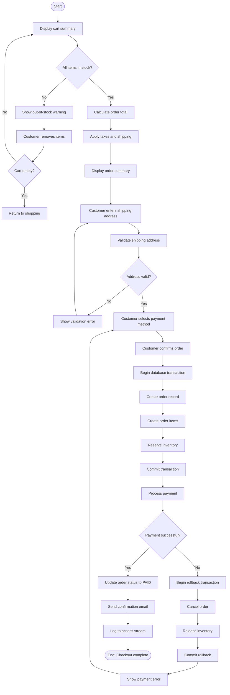
```mermaid
flowchart TD
    Start([Start]) --> A[Display cart summary]
    A --> B{All items in stock?}
    
    B -->|No| C[Show out-of-stock warning]
    C --> D[Customer removes items]
    D --> E{Cart empty?}
    E -->|Yes| F[Return to shopping]
    E -->|No| A
    
    B -->|Yes| G[Calculate order total]
    G --> H[Apply taxes and shipping]
    H --> I[Display order summary]
    
    I --> J[Customer enters shipping address]
    J --> K[Validate shipping address]
    K --> L{Address valid?}
    L -->|No| M[Show validation error]
    M --> J
    L -->|Yes| N[Customer selects payment method]
    
    N --> O[Customer confirms order]
    O --> P[Begin database transaction]
    P --> Q[Create order record]
    Q --> R[Create order items]
    R --> S[Reserve inventory]
    S --> T[Commit transaction]
    
    T --> U[Process payment]
    U --> V{Payment successful?}
    
    V -->|No| W[Begin rollback transaction]
    W --> X[Cancel order]
    X --> Y[Release inventory]
    Y --> Z[Commit rollback]
    Z --> AA[Show payment error]
    AA --> N
    
    V -->|Yes| AB[Update order status to PAID]
    AB --> AC[Send confirmation email]
    AC --> AD[Log to access stream]
    AD --> End([End: Checkout complete])
```

### 1.4.6 UC6: Track Orders

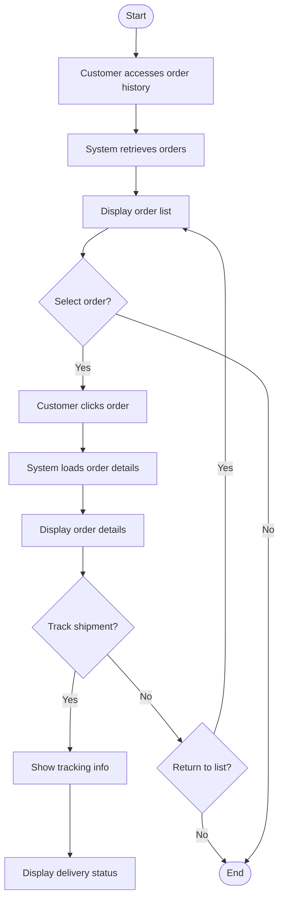
```mermaid
flowchart TD
    Start([Start]) --> A[Customer accesses order history]
    A --> B[System retrieves orders]
    B --> C[Display order list]
    C --> D{Select order?}
    D -->|Yes| E[Customer clicks order]
    E --> F[System loads order details]
    F --> G[Display order details]
    G --> H{Track shipment?}
    H -->|Yes| I[Show tracking info]
    I --> J[Display delivery status]
    H -->|No| K{Return to list?}
    K -->|Yes| C
    K -->|No| L([End])
    D -->|No| L
```

### 1.4.7 UC7: Write Reviews

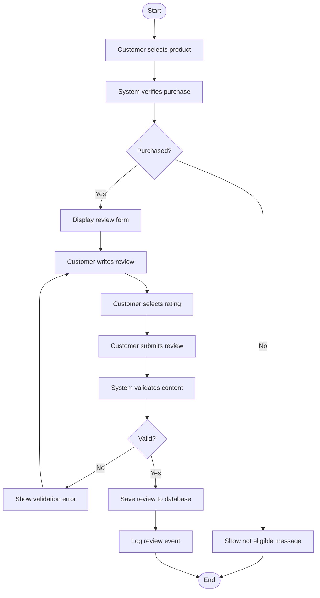
```mermaid
flowchart TD
    Start([Start]) --> A[Customer selects product]
    A --> B[System verifies purchase]
    B --> C{Purchased?}
    C -->|No| D[Show not eligible message]
    D --> End([End])
    C -->|Yes| E[Display review form]
    E --> F[Customer writes review]
    F --> G[Customer selects rating]
    G --> H[Customer submits review]
    H --> I[System validates content]
    I --> J{Valid?}
    J -->|No| K[Show validation error]
    K --> F
    J -->|Yes| L[Save review to database]
    L --> M[Log review event]
    M --> End
```

### 1.4.8 UC8: Manage Wishlist

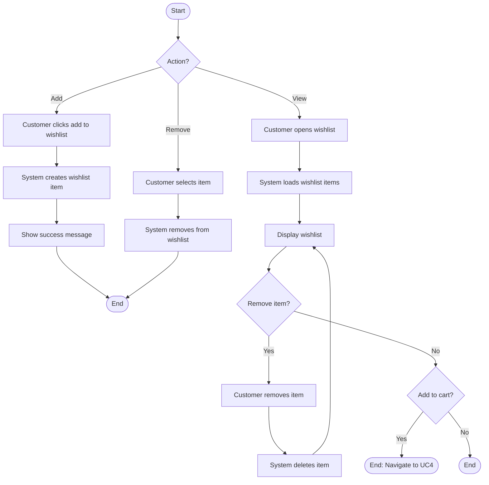
```mermaid
flowchart TD
    Start([Start]) --> A{Action?}
    
    A -->|Add| B[Customer clicks add to wishlist]
    B --> C[System creates wishlist item]
    C --> D[Show success message]
    D --> End([End])
    
    A -->|View| E[Customer opens wishlist]
    E --> F[System loads wishlist items]
    F --> G[Display wishlist]
    G --> H{Remove item?}
    H -->|Yes| I[Customer removes item]
    I --> J[System deletes item]
    J --> G
    H -->|No| K{Add to cart?}
    K -->|Yes| L([End: Navigate to UC4])
    K -->|No| M([End])
    
    A -->|Remove| N[Customer selects item]
    N --> O[System removes from wishlist]
    O --> End
```

### 1.4.9 UC9: Manage Products (Admin)

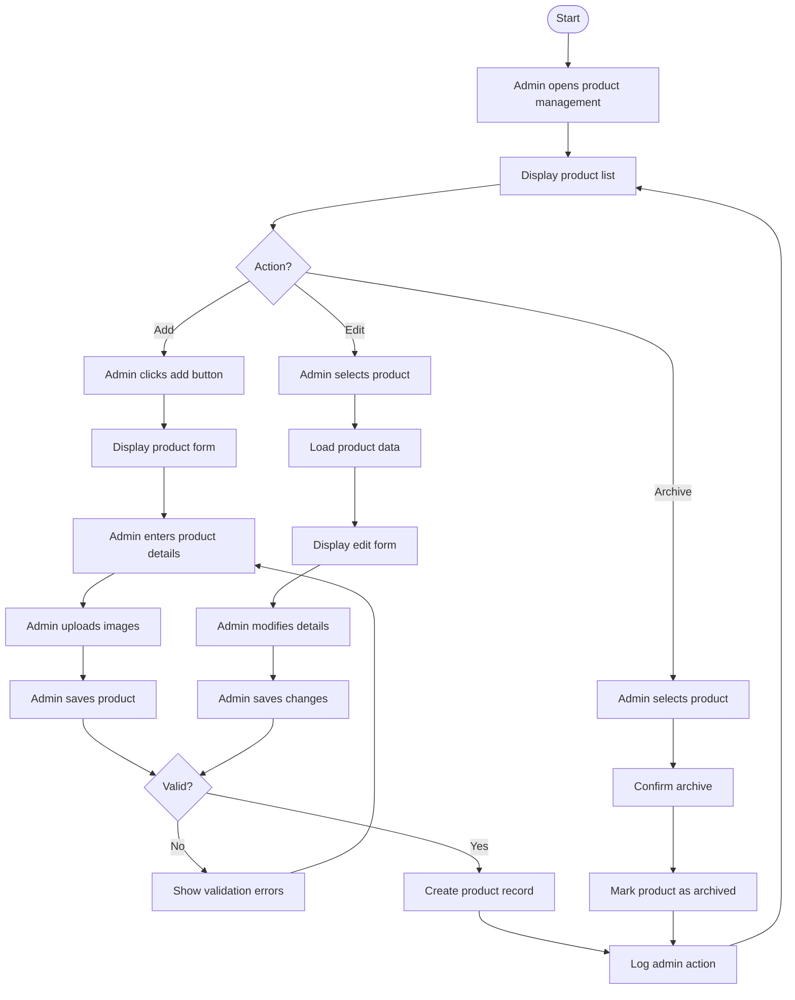
```mermaid
flowchart TD
    Start([Start]) --> A[Admin opens product management]
    A --> B[Display product list]
    B --> C{Action?}
    
    C -->|Add| D[Admin clicks add button]
    D --> E[Display product form]
    E --> F[Admin enters product details]
    F --> G[Admin uploads images]
    G --> H[Admin saves product]
    H --> I{Valid?}
    I -->|No| J[Show validation errors]
    J --> F
    I -->|Yes| K[Create product record]
    K --> L[Log admin action]
    L --> B
    
    C -->|Edit| M[Admin selects product]
    M --> N[Load product data]
    N --> O[Display edit form]
    O --> P[Admin modifies details]
    P --> Q[Admin saves changes]
    Q --> I
    
    C -->|Archive| R[Admin selects product]
    R --> S[Confirm archive]
    S --> T[Mark product as archived]
    T --> L
```

### 1.4.10 UC10: Manage Categories (Admin)

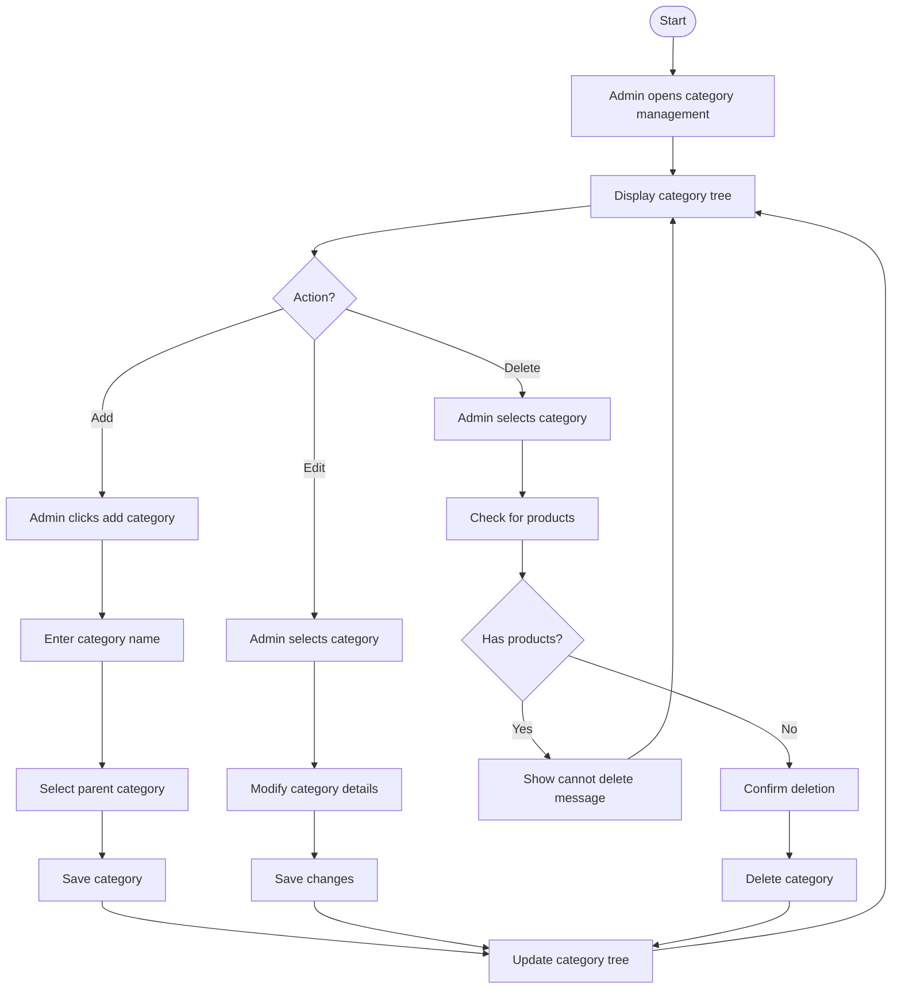
```mermaid
flowchart TD
    Start([Start]) --> A[Admin opens category management]
    A --> B[Display category tree]
    B --> C{Action?}
    
    C -->|Add| D[Admin clicks add category]
    D --> E[Enter category name]
    E --> F[Select parent category]
    F --> G[Save category]
    G --> H[Update category tree]
    H --> B
    
    C -->|Edit| I[Admin selects category]
    I --> J[Modify category details]
    J --> K[Save changes]
    K --> H
    
    C -->|Delete| L[Admin selects category]
    L --> M[Check for products]
    M --> N{Has products?}
    N -->|Yes| O[Show cannot delete message]
    O --> B
    N -->|No| P[Confirm deletion]
    P --> Q[Delete category]
    Q --> H
```

### 1.4.11 UC11: Manage Inventory (Admin)

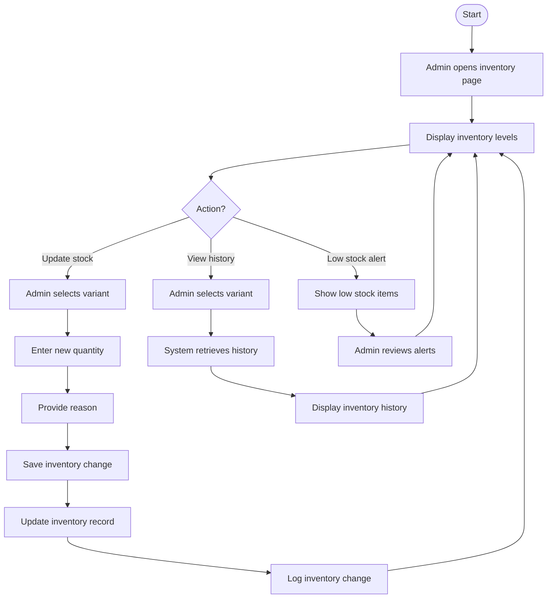
```mermaid
flowchart TD
    Start([Start]) --> A[Admin opens inventory page]
    A --> B[Display inventory levels]
    B --> C{Action?}
    
    C -->|Update stock| D[Admin selects variant]
    D --> E[Enter new quantity]
    E --> F[Provide reason]
    F --> G[Save inventory change]
    G --> H[Update inventory record]
    H --> I[Log inventory change]
    I --> B
    
    C -->|View history| J[Admin selects variant]
    J --> K[System retrieves history]
    K --> L[Display inventory history]
    L --> B
    
    C -->|Low stock alert| M[Show low stock items]
    M --> N[Admin reviews alerts]
    N --> B
```

### 1.4.12 UC12: Manage Coupons (Admin)

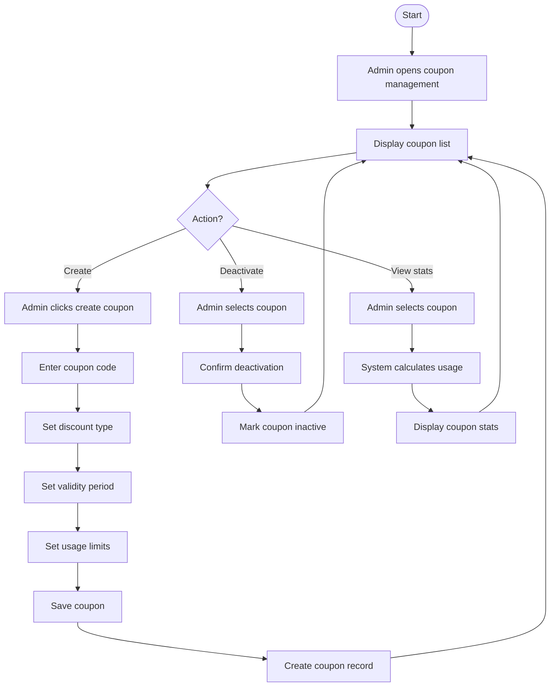
```mermaid
flowchart TD
    Start([Start]) --> A[Admin opens coupon management]
    A --> B[Display coupon list]
    B --> C{Action?}
    
    C -->|Create| D[Admin clicks create coupon]
    D --> E[Enter coupon code]
    E --> F[Set discount type]
    F --> G[Set validity period]
    G --> H[Set usage limits]
    H --> I[Save coupon]
    I --> J[Create coupon record]
    J --> B
    
    C -->|Deactivate| K[Admin selects coupon]
    K --> L[Confirm deactivation]
    L --> M[Mark coupon inactive]
    M --> B
    
    C -->|View stats| N[Admin selects coupon]
    N --> O[System calculates usage]
    O --> P[Display coupon stats]
    P --> B
```

### 1.4.13 UC13: Manage Orders (Admin)

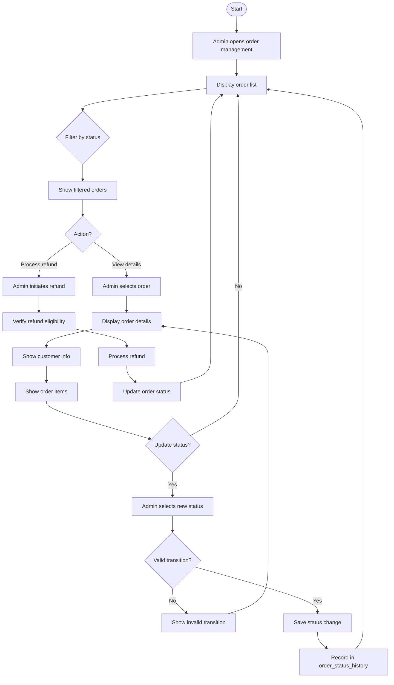
```mermaid
flowchart TD
    Start([Start]) --> A[Admin opens order management]
    A --> B[Display order list]
    B --> C{Filter by status}
    C --> D[Show filtered orders]
    D --> E{Action?}
    
    E -->|View details| F[Admin selects order]
    F --> G[Display order details]
    G --> H[Show customer info]
    H --> I[Show order items]
    I --> J{Update status?}
    J -->|Yes| K[Admin selects new status]
    K --> L{Valid transition?}
    L -->|No| M[Show invalid transition]
    M --> G
    L -->|Yes| N[Save status change]
    N --> O[Record in order_status_history]
    O --> B
    J -->|No| B
    
    E -->|Process refund| P[Admin initiates refund]
    P --> Q[Verify refund eligibility]
    Q --> R[Process refund]
    R --> S[Update order status]
    S --> B
```

### 1.4.14 UC14: View Dashboard (Admin)

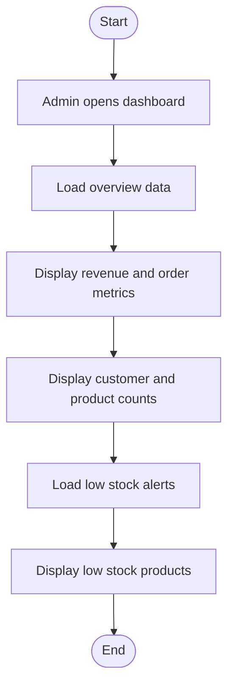
```mermaid
flowchart TD
    Start([Start]) --> A[Admin opens dashboard]
    A --> B[Load overview data]
    B --> C[Display revenue and order metrics]
    C --> D[Display customer and product counts]
    D --> E[Load low stock alerts]
    E --> F[Display low stock products]
    F --> End([End])
```

### 1.4.15 UC15: Select City/Location

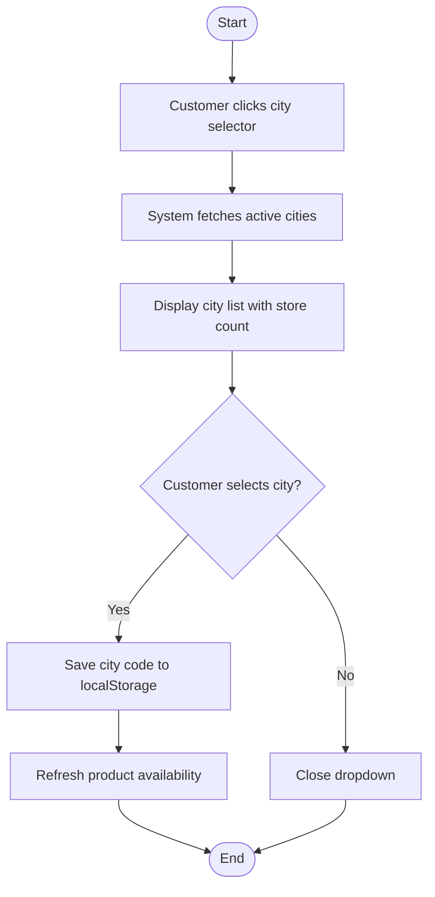
```mermaid
flowchart TD
    Start([Start]) --> A[Customer clicks city selector]
    A --> B[System fetches active cities]
    B --> C[Display city list with store count]
    C --> D{Customer selects city?}
    D -->|Yes| E[Save city code to localStorage]
    E --> F[Refresh product availability]
    F --> End([End])
    D -->|No| G[Close dropdown]
    G --> End
```

### 1.4.16 UC16: Check Store Availability

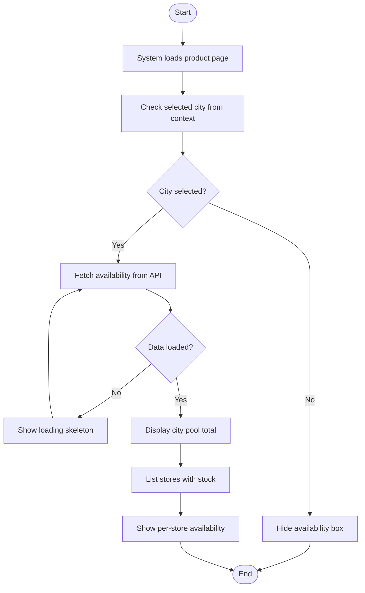
```mermaid
flowchart TD
    Start([Start]) --> A[System loads product page]
    A --> B[Check selected city from context]
    B --> C{City selected?}
    C -->|No| D[Hide availability box]
    D --> End([End])
    C -->|Yes| E[Fetch availability from API]
    E --> F{Data loaded?}
    F -->|No| G[Show loading skeleton]
    G --> E
    F -->|Yes| H[Display city pool total]
    H --> I[List stores with stock]
    I --> J[Show per-store availability]
    J --> End
```

### 1.4.17 UC17: Manage Branch Inventory

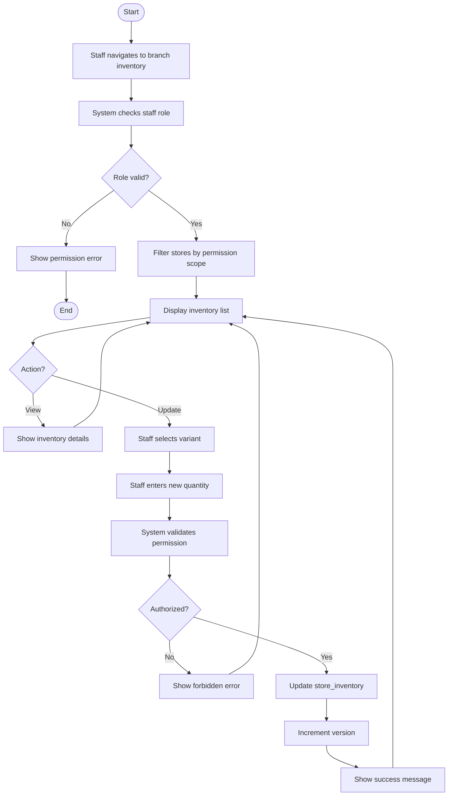
```mermaid
flowchart TD
    Start([Start]) --> A[Staff navigates to branch inventory]
    A --> B[System checks staff role]
    B --> C{Role valid?}
    C -->|No| D[Show permission error]
    D --> End([End])
    C -->|Yes| E[Filter stores by permission scope]
    E --> F[Display inventory list]
    F --> G{Action?}
    
    G -->|View| H[Show inventory details]
    H --> F
    
    G -->|Update| I[Staff selects variant]
    I --> J[Staff enters new quantity]
    J --> K[System validates permission]
    K --> L{Authorized?}
    L -->|No| M[Show forbidden error]
    M --> F
    L -->|Yes| N[Update store_inventory]
    N --> O[Increment version]
    O --> P[Show success message]
    P --> F
```

### 1.4.18 UC18: POS Transaction

```mermaid
flowchart TD
    Start([Start]) --> A[Staff navigates to POS page]
    A --> B[System checks staff role]
    B --> C{Role valid?}
    C -->|No| D[Show permission error]
    D --> End([End])
    C -->|Yes| E[Display search input]
    E --> F[Staff enters product keyword]
    F --> G[System searches by SKU or name]
    G --> H{Results found?}
    H -->|No| I[Show no results message]
    I --> F
    H -->|Yes| J[Display results with store stock]
    J --> K{Staff selects product?}
    K -->|No| F
    K -->|Yes| L[Staff enters quantity]
    L --> M[System checks store inventory]
    M --> N{Sufficient stock?}
    N -->|No| O[Show insufficient stock error]
    O --> J
    N -->|Yes| P[Add product to cart]
    P --> Q{Add more products?}
    Q -->|Yes| F
    Q -->|No| R[Display cart with total]
    R --> S[Staff confirms transaction]
    S --> T[System validates store inventory]
    T --> U{All items available?}
    U -->|No| V[Show out of stock error]
    V --> R
    U -->|Yes| W[Create order - channel=pos]
    W --> X[Create payment - succeeded]
    X --> Y[Deduct store_inventory]
    Y --> Z[Deduct inventory]
    Z --> AA[Show success with order number]
    AA --> End([End])
```

---

## 1.5 System Sequence Diagrams

### 1.5.1 UC1: Browse Products Sequence

```mermaid
sequenceDiagram
    autonumber
    participant C as Customer
    participant FE as Next.js Storefront
    participant API as FastAPI Backend
    participant DB as MySQL Database
    
    C->>FE: Click category
    FE->>API: GET /categories/{id}/products
    API->>DB: SELECT products WHERE category_id = ?
    DB-->>API: products[]
    API-->>FE: ProductListResponse
    FE-->>C: Display product grid
    
    C->>FE: Apply filter (price range)
    FE->>API: GET /products?category=X&min_price=Y&max_price=Z
    API->>DB: SELECT products WITH filters
    DB-->>API: filteredProducts[]
    API-->>FE: FilteredProductList
    FE-->>C: Update product grid
```

### 1.5.2 UC2: Search Products Sequence

```mermaid
sequenceDiagram
    autonumber
    participant C as Customer
    participant FE as Next.js Storefront
    participant API as FastAPI Backend
    participant DB as MySQL Database
    
    C->>FE: Enter search term
    FE->>API: GET /products/search?q=keyword
    API->>DB: SELECT MATCHES against keyword
    DB-->>API: searchResults[]
    API->>API: Rank by relevance
    API-->>FE: SearchResultsResponse
    FE-->>C: Display search results
    
    Note over C,DB: Log search event
    API->>API: Log to access stream
```

### 1.5.3 UC3: View Product Details Sequence

```mermaid
sequenceDiagram
    autonumber
    participant C as Customer
    participant FE as Next.js Storefront
    participant API as FastAPI Backend
    participant DB as MySQL Database
    
    C->>FE: Click product
    FE->>API: GET /products/{id}
    API->>DB: SELECT product WITH variants
    DB-->>API: productDetails
    API->>DB: SELECT reviews WHERE product_id = ?
    DB-->>API: reviews[]
    API->>DB: SELECT related products
    DB-->>API: relatedProducts[]
    API-->>FE: ProductDetailResponse
    FE-->>C: Display product page
    
    Note over C,DB: Log product view
    API->>API: Log to access stream
```

### 1.5.4 UC4: Manage Cart Sequence

```mermaid
sequenceDiagram
    autonumber
    participant C as Customer
    participant FE as Next.js Storefront
    participant API as FastAPI Backend
    participant DB as MySQL Database
    
    C->>FE: Add product to cart
    FE->>API: POST /cart/items
    API->>DB: SELECT inventory WHERE variant_id = ?
    DB-->>API: stockLevel
    
    alt In stock
        API->>DB: INSERT cart_item
        API->>DB: UPDATE cart total
        DB-->>API: success
        API-->>FE: CartItemAdded
        FE-->>C: Show success message
    else Out of stock
        API-->>FE: OutOfStockError
        FE-->>C: Show out of stock message
    end
```

### 1.5.5 UC5: Checkout Sequence

```mermaid
sequenceDiagram
    autonumber
    participant C as Customer
    participant FE as Next.js Storefront
    participant API as FastAPI Backend
    participant DB as MySQL Database
    
    C->>FE: Proceed to checkout
    FE->>API: GET /cart/{cartId}
    API->>DB: SELECT cart_items JOIN products
    DB-->>API: cartItems[]
    API-->>FE: CartResponse
    FE-->>C: Display cart summary
    
    C->>FE: Enter structured address (province, ward, street)
    C->>FE: Confirm order
    FE->>API: POST /orders/checkout
    Note over API,DB: Begin Transaction
    API->>DB: INSERT orders (with address text)
    API->>DB: INSERT order_items
    API->>DB: INSERT payments (status=succeeded)
    API->>DB: UPDATE inventory
    API->>DB: UPDATE carts SET status=checked_out
    DB-->>API: Transaction committed
    
    API->>API: Log to access stream
    API-->>FE: OrderConfirmation
    FE-->>C: Display confirmation
```

### 1.5.6 UC6: Track Orders Sequence

```mermaid
sequenceDiagram
    autonumber
    participant C as Customer
    participant FE as Next.js Storefront
    participant API as FastAPI Backend
    participant DB as MySQL Database
    
    C->>FE: Access order history
    FE->>API: GET /orders
    API->>DB: SELECT orders WHERE customer_id = ?
    DB-->>API: orders[]
    API-->>FE: OrderListResponse
    FE-->>C: Display order list
    
    C->>FE: Select order
    FE->>API: GET /orders/{id}
    API->>DB: SELECT order WITH items
    DB-->>API: orderDetails
    API->>DB: SELECT status_history
    DB-->>API: statusHistory[]
    API-->>FE: OrderDetailResponse
    FE-->>C: Display order details
```

### 1.5.7 UC7: Write Reviews Sequence

```mermaid
sequenceDiagram
    autonumber
    participant C as Customer
    participant FE as Next.js Storefront
    participant API as FastAPI Backend
    participant DB as MySQL Database
    
    C->>FE: Select product to review
    FE->>API: GET /orders/{orderId}/items/{itemId}/review eligibility
    API->>DB: SELECT order WHERE customer_id = ? AND status = 'completed'
    DB-->>API: orderExists
    
    alt Eligible
        API-->>FE: EligibleResponse
        FE-->>C: Display review form
        C->>FE: Submit review
        FE->>API: POST /reviews
        API->>DB: INSERT product_review
        DB-->>API: reviewId
        API-->>FE: ReviewCreated
        FE-->>C: Show success message
    else Not eligible
        API-->>FE: NotEligibleError
        FE-->>C: Show not eligible message
    end
```

### 1.5.8 UC8: Manage Wishlist Sequence

```mermaid
sequenceDiagram
    autonumber
    participant C as Customer
    participant FE as Next.js Storefront
    participant API as FastAPI Backend
    participant DB as MySQL Database
    
    C->>FE: Add to wishlist
    FE->>API: POST /wishlist
    API->>DB: INSERT wishlist_item
    DB-->>API: success
    API-->>FE: WishlistItemAdded
    FE-->>C: Show success message
    
    C->>FE: View wishlist
    FE->>API: GET /wishlist
    API->>DB: SELECT wishlist_items WITH products
    DB-->>API: wishlistItems[]
    API-->>FE: WishlistResponse
    FE-->>C: Display wishlist
    
    C->>FE: Remove from wishlist
    FE->>API: DELETE /wishlist/{itemId}
    API->>DB: DELETE wishlist_item
    DB-->>API: success
    API-->>FE: WishlistItemRemoved
    FE-->>C: Update wishlist display
```

### 1.5.9 UC9: Manage Products (Admin) Sequence

```mermaid
sequenceDiagram
    autonumber
    participant A as Admin
    participant FE as Next.js Admin
    participant API as FastAPI Backend
    participant DB as MySQL Database
    
    A->>FE: Navigate to products
    FE->>API: GET /admin/products
    API->>DB: SELECT products
    DB-->>API: products[]
    API-->>FE: ProductListResponse
    FE-->>A: Display product list
    
    A->>FE: Click add product
    FE-->>A: Display product form
    
    A->>FE: Submit new product
    FE->>API: POST /admin/products
    API->>DB: INSERT product
    DB-->>API: productId
    API-->>FE: ProductCreated
    FE-->>A: Show success message
```

### 1.5.10 UC10: Manage Categories (Admin) Sequence

```mermaid
sequenceDiagram
    autonumber
    participant A as Admin
    participant FE as Next.js Admin
    participant API as FastAPI Backend
    participant DB as MySQL Database
    
    A->>FE: Navigate to categories
    FE->>API: GET /admin/categories
    API->>DB: SELECT categories
    DB-->>API: categories[]
    API-->>FE: CategoryTreeResponse
    FE-->>A: Display category tree
    
    A->>FE: Add category
    FE->>API: POST /admin/categories
    API->>DB: INSERT category
    DB-->>API: categoryId
    API-->>FE: CategoryCreated
    FE-->>A: Update category tree
```

### 1.5.11 UC11: Manage Inventory (Admin) Sequence

```mermaid
sequenceDiagram
    autonumber
    participant A as Admin
    participant FE as Next.js Admin
    participant API as FastAPI Backend
    participant DB as MySQL Database
    
    A->>FE: Navigate to inventory
    FE->>API: GET /admin/inventory
    API->>DB: SELECT inventory WITH variants
    DB-->>API: inventoryLevels[]
    API-->>FE: InventoryResponse
    FE-->>A: Display inventory levels
    
    A->>FE: Update stock quantity
    FE->>API: PUT /admin/inventory/{variantId}
    API->>DB: UPDATE inventory SET quantity = ?
    API->>DB: INSERT inventory_history
    DB-->>API: success
    API-->>FE: InventoryUpdated
    FE-->>A: Show updated levels
```

### 1.5.12 UC12: Manage Coupons (Admin) Sequence

```mermaid
sequenceDiagram
    autonumber
    participant A as Admin
    participant FE as Next.js Admin
    participant API as FastAPI Backend
    participant DB as MySQL Database
    
    A->>FE: Navigate to coupons
    FE->>API: GET /admin/coupons
    API->>DB: SELECT coupons
    DB-->>API: coupons[]
    API-->>FE: CouponListResponse
    FE-->>A: Display coupon list
    
    A->>FE: Create coupon
    FE->>API: POST /admin/coupons
    API->>DB: INSERT coupon
    DB-->>API: couponId
    API-->>FE: CouponCreated
    FE-->>A: Show success message
```

### 1.5.13 UC13: Manage Orders (Admin) Sequence

```mermaid
sequenceDiagram
    autonumber
    participant A as Admin
    participant FE as Next.js Admin
    participant API as FastAPI Backend
    participant DB as MySQL Database
    
    A->>FE: Navigate to orders
    FE->>API: GET /admin/orders
    API->>DB: SELECT orders
    DB-->>API: orders[]
    API-->>FE: OrderListResponse
    FE-->>A: Display order list
    
    A->>FE: Update order status
    FE->>API: PUT /admin/orders/{orderId}/status
    API->>DB: UPDATE orders SET status = ?
    API->>DB: INSERT order_status_history
    DB-->>API: success
    API-->>FE: OrderStatusUpdated
    FE-->>A: Show updated status
```

### 1.5.14 UC14: View Dashboard (Admin) Sequence

```mermaid
sequenceDiagram
    autonumber
    participant A as Admin
    participant FE as Next.js Admin
    participant API as FastAPI Backend
    participant DB as MySQL Database
    
    A->>FE: Navigate to dashboard
    FE->>API: GET /admin/dashboard/overview
    API->>DB: SELECT revenue/orders/customers/products
    DB-->>API: overviewData
    API-->>FE: OverviewResponse
    FE-->>A: Display dashboard with key metrics
    
    FE->>API: GET /admin/dashboard/low-stock
    API->>DB: SELECT products WHERE on_hand <= 5
    DB-->>API: lowStockProducts[]
    API-->>FE: LowStockResponse
    FE-->>A: Display low stock alerts
```

### 1.5.15 UC18: POS Transaction Sequence

```mermaid
sequenceDiagram
    autonumber
    participant S as Staff
    participant FE as Next.js Admin
    participant API as FastAPI Backend
    participant DB as MySQL Database
    
    S->>FE: Navigate to POS page
    FE->>API: GET /auth/me
    API-->>FE: staffId, storeId
    
    S->>FE: Enter search keyword
    FE->>API: GET /pos/products?q={keyword}&store_id={storeId}
    API->>DB: SELECT products WHERE (sku LIKE 'keyword%' OR name LIKE 'keyword%')
    API->>DB: JOIN store_inventory WHERE store_id = ?
    DB-->>API: productsWithStock[]
    API-->>FE: ProductSearchResponse (up to 8)
    FE-->>S: Display results with store stock
    
    S->>FE: Select product and enter quantity
    S->>FE: Click add to cart
    FE-->>S: Show in cart
    
    S->>FE: Confirm transaction
    FE->>API: POST /pos/transactions
    Note over API,DB: Begin Transaction
    API->>DB: INSERT orders (channel=pos, status=completed, staff_id, store_id)
    API->>DB: INSERT order_items
    API->>DB: INSERT payments (status=succeeded)
    API->>DB: UPDATE store_inventory SET on_hand = on_hand - qty
    API->>DB: UPDATE inventory SET on_hand = on_hand - qty
    DB-->>API: Transaction committed
    
    API-->>FE: OrderCreatedResponse
    FE-->>S: Show success with order number
```

### 1.5.16 UC15: Select City/Location Sequence

```mermaid
sequenceDiagram
    autonumber
    participant C as Customer
    participant FE as Next.js Storefront
    participant API as FastAPI Backend
    participant DB as MySQL Database
    
    C->>FE: Click city selector
    FE->>API: GET /api/v1/locations/cities
    API->>DB: SELECT cities WHERE is_active = true
    DB-->>API: cities[]
    API-->>FE: CityResponse[]
    FE-->>C: Display city list
    
    C->>FE: Select city
    FE->>FE: Save to localStorage(dk_selected_city_code)
    FE->>FE: Update LocationContext
    FE-->>C: City selected, availability refreshed
```

### 1.5.16 UC16: Check Store Availability Sequence

```mermaid
sequenceDiagram
    autonumber
    participant C as Customer
    participant FE as Next.js Storefront
    participant API as FastAPI Backend
    participant DB as MySQL Database
    
    C->>FE: View product detail page
    FE->>FE: Get selectedCity from LocationContext
    
    alt City selected
        FE->>API: GET /api/v1/catalog/products/{slug}/availability?city_code={code}
        API->>DB: SELECT cities WHERE code = ?
        DB-->>API: city
        API->>DB: SELECT stores WHERE city_id = ?
        DB-->>API: stores[]
        API->>DB: SELECT store_inventory JOIN variants
        DB-->>API: inventory[]
        API-->>FE: ProductAvailabilityResponse
        FE-->>C: Display StoreAvailabilityBox
    else No city selected
        FE-->>C: Hide availability box
    end
```

### 1.5.17 UC17: Manage Branch Inventory Sequence

```mermaid
sequenceDiagram
    autonumber
    participant S as Staff (Admin/Manager/Planner)
    participant FE as Next.js Admin
    participant API as FastAPI Backend
    participant DB as MySQL Database
    
    S->>FE: Navigate to branch inventory
    FE->>API: GET /api/v1/admin/branch-inventory
    API->>DB: SELECT store_inventory JOIN stores JOIN variants
    DB-->>API: inventory[]
    API-->>FE: BranchInventoryItem[]
    FE-->>S: Display inventory list
    
    S->>FE: Update stock quantity
    FE->>API: PATCH /api/v1/admin/branch-inventory
    API->>API: check_store_inventory_permission(actor, store_id)
    
    alt Authorized
        API->>DB: UPDATE store_inventory SET on_hand = ?, version = version + 1
        DB-->>API: success
        API-->>FE: 204 No Content
        FE-->>S: Stock updated
    else Forbidden
        API-->>FE: 403 Forbidden
        FE-->>S: Permission error
    end
```

---

## 1.6 Class Diagrams

### 1.6.1 Domain Model - Core Entities

```mermaid
classDiagram
    class Customer {
        +customerId: BIGINT UNSIGNED
        +publicId: UUID
        +email: String
        +displayName: String
        +passwordHash: String
        +role: customer|admin|store_manager|city_planner
        +status: active|disabled
        +cityId: BIGINT UNSIGNED?
        +storeId: BIGINT UNSIGNED?
        +dataOrigin: manual|synthetic
        +createdAt: DateTime
        +updatedAt: DateTime
        +register()
        +updateProfile()
        +getOrders()
    }
    
    class Category {
        +categoryId: BIGINT UNSIGNED
        +publicId: UUID
        +code: String
        +name: String
        +parentCategoryId: BIGINT UNSIGNED?
        +isActive: Boolean
        +createdAt: DateTime
        +updatedAt: DateTime
    }
    
    class Product {
        +productId: BIGINT UNSIGNED
        +publicId: UUID
        +name: String
        +slug: String
        +description: String?
        +imageUrl: String?
        +categoryId: BIGINT UNSIGNED
        +isActive: Boolean
        +archivedAt: DateTime?
        +createdAt: DateTime
        +updatedAt: DateTime
    }
    
    class ProductVariant {
        +variantId: BIGINT UNSIGNED
        +publicId: UUID
        +productId: BIGINT UNSIGNED
        +sku: String
        +sizeCode: String
        +colorCode: String
        +priceVnd: Integer
        +isActive: Boolean
        +createdAt: DateTime
        +updatedAt: DateTime
    }
    
    class Cart {
        +cartId: UUID
        +customerId: UUID
        +createdAt: DateTime
        +addItem()
        +removeItem()
        +updateQuantity()
        +getTotal()
    }
    
    class CartItem {
        +cartItemId: UUID
        +cartId: UUID
        +variantId: UUID
        +quantity: Integer
        +createdAt: DateTime
    }
    
    class Order {
        +orderId: UUID
        +customerId: UUID
        +status: OrderStatus
        +totalAmount: Integer
        +shippingAddress: JSON
        +createdAt: DateTime
        +create()
        +updateStatus()
        +cancel()
    }
    
    class OrderItem {
        +orderItemId: UUID
        +orderId: UUID
        +variantId: UUID
        +quantity: Integer
        +unitPrice: Integer
    }
    
    class Payment {
        +paymentId: UUID
        +orderId: UUID
        +amount: Integer
        +method: String
        +status: PaymentStatus
        +processedAt: DateTime
    }
    
    Customer "1" --> "*" Cart : has
    Customer "1" --> "*" Order : places
    Category "1" --> "*" Product : contains
    Category "0..1" --> "*" Category : parent
    Product "1" --> "*" ProductVariant : has
    Cart "1" --> "*" CartItem : contains
    CartItem "*" --> "1" ProductVariant : references
    Order "1" --> "*" OrderItem : contains
    Order "1" --> "0..1" Payment : has
    OrderItem "*" --> "1" ProductVariant : references
```

### 1.6.2 Enumeration Types

```mermaid
classDiagram
    class CustomerRole {
        <<enumeration>>
        customer
        admin
        store_manager
        city_planner
    }
    
    class OrderStatus {
        <<enumeration>>
        paid
        confirmed
        completed
        cancelled
    }
    
    class PaymentStatus {
        <<enumeration>>
        succeeded
        failed
    }
    
    class CouponType {
        <<enumeration>>
        percentage
        fixed_amount
    }
    
    class CustomerStatus {
        <<enumeration>>
        active
        inactive
    }
```

### 1.6.3 Supporting Entities

```mermaid
classDiagram
    class Order {
        <<implemented>>
        +orderId: BIGINT UNSIGNED
        +customerId: BIGINT UNSIGNED
        +orderNumber: String
        +subtotal: BIGINT UNSIGNED
        +shippingFee: BIGINT UNSIGNED
        +discount: BIGINT UNSIGNED
        +total: BIGINT UNSIGNED
        +status: OrderStatus
        +channel: OrderChannel
        +storeId: BIGINT UNSIGNED?
        +staffId: BIGINT UNSIGNED?
        +fullName: String
        +phone: String
        +addressText: String
        +createdAt: DateTime
        +updatedAt: DateTime
    }
    
    class OrderItem {
        <<implemented>>
        +orderItemId: BIGINT UNSIGNED
        +orderId: BIGINT UNSIGNED
        +variantId: BIGINT UNSIGNED
        +quantity: Integer
        +unitPrice: BIGINT UNSIGNED
    }
    
    class OrderStatusHistory {
        <<implemented>>
        +historyId: BIGINT UNSIGNED
        +orderId: BIGINT UNSIGNED
        +status: OrderStatus
        +changedAt: DateTime
        +changedBy: String?
        +notes: String?
    }
    
    class Payment {
        <<implemented>>
        +paymentId: BIGINT UNSIGNED
        +orderId: BIGINT UNSIGNED
        +method: String
        +amount: BIGINT UNSIGNED
        +status: String
        +transactionId: String?
    }
    
    class Cart {
        <<implemented>>
        +cartId: BIGINT UNSIGNED
        +customerId: BIGINT UNSIGNED
        +createdAt: DateTime
        +updatedAt: DateTime
    }
    
    class CartItem {
        <<implemented>>
        +cartItemId: BIGINT UNSIGNED
        +cartId: BIGINT UNSIGNED
        +variantId: BIGINT UNSIGNED
        +quantity: Integer
    }
    
    class Coupon {
        <<implemented>>
        +couponId: BIGINT UNSIGNED
        +code: String
        +discountType: String
        +discountValue: BIGINT UNSIGNED
        +minOrderAmount: BIGINT UNSIGNED
        +maxUsageCount: Integer
        +currentUsageCount: Integer
        +validFrom: DateTime
        +validUntil: DateTime
        +isActive: Boolean
    }
    
    class CouponRedemption {
        <<implemented>>
        +redemptionId: BIGINT UNSIGNED
        +couponId: BIGINT UNSIGNED
        +orderId: BIGINT UNSIGNED
    }
    
    class ProductReview {
        <<implemented>>
        +reviewId: BIGINT UNSIGNED
        +productId: BIGINT UNSIGNED
        +customerId: BIGINT UNSIGNED
        +rating: Integer
        +comment: String?
        +createdAt: DateTime
    }
    
    class WishlistItem {
        <<implemented>>
        +wishlistItemId: BIGINT UNSIGNED
        +customerId: BIGINT UNSIGNED
        +productId: BIGINT UNSIGNED
        +createdAt: DateTime
    }
    
    class Inventory {
        <<implemented>>
        +variantId: BIGINT UNSIGNED
        +onHand: BIGINT UNSIGNED
        +reserved: BIGINT UNSIGNED
        +available: BIGINT UNSIGNED
        +version: BIGINT UNSIGNED
    }
    
    Order "1" --> "*" OrderItem : contains
    Order "1" --> "1" Payment : has
    Order "1" --> "*" OrderStatusHistory : tracks
    Cart "1" --> "*" CartItem : contains
    Coupon "1" --> "*" CouponRedemption : tracks
    ProductReview "*" --> "1" Customer : written by
    ProductReview "*" --> "1" Product : for
    WishlistItem "*" --> "1" Customer : belongs to
    WishlistItem "*" --> "1" Product : references
    Inventory "1" --> "1" ProductVariant : for
```

### 1.6.4 Multi-City & Store Entities

```mermaid
classDiagram
    class City {
        +cityId: BIGINT UNSIGNED
        +code: String(32)
        +name: String(120)
        +isActive: Boolean
        +createdAt: DateTime
        +updatedAt: DateTime
    }
    
    class Store {
        +storeId: BIGINT UNSIGNED
        +cityId: BIGINT UNSIGNED
        +code: String(32)
        +name: String(120)
        +address: String(500)
        +phone: String(32)
        +isActive: Boolean
        +createdAt: DateTime
        +updatedAt: DateTime
    }
    
    class StoreInventory {
        +storeId: BIGINT UNSIGNED
        +variantId: BIGINT UNSIGNED
        +onHand: BIGINT UNSIGNED
        +openingOnHand: BIGINT UNSIGNED
        +version: BIGINT UNSIGNED
        +updatedAt: DateTime
    }
    
    class Customer {
        <<updated>>
        +cityId: BIGINT UNSIGNED?
        +storeId: BIGINT UNSIGNED?
        +role: customer|admin|store_manager|city_planner
    }
    
    City "1" --> "*" Store : contains
    Store "1" --> "*" StoreInventory : tracks
    ProductVariant "1" --> "*" StoreInventory : has
    Customer "0..1" --> "1" City : assigned to
    Customer "0..1" --> "1" Store : works at
```

---

# PHẦN II: DATA LAKEHOUSE

> **Phạm vi:** Nền tảng dữ liệu phân tích  
> **Actors:** Data Engineer, Data Analyst  
> **Stack:** Apache Spark, Iceberg, Polaris, Airflow, Trino, Superset, MinIO

---

## 2.1 Xác định Actors

### Bảng tổng hợp Actors (Data Platform)

| Actor | Vai trò | Mô tả | Giao diện |
|-------|---------|-------|-----------|
| **Data Engineer** | Kỹ sư dữ liệu | Quản lý ETL pipeline, data quality, catalog | Airflow, Spark CLI, Polaris Console |
| **Data Analyst** | Phân tích dữ liệu | Truy vấn, tạo dashboard, build ML features | Trino/Hue, Superset, Jupyter |

---

## 2.2 System Use-Case Diagrams

### 2.2.1 Data Platform Domain

```mermaid
graph TB
    subgraph "Data Platform Domain"
        UC15[Configure ETL Pipeline]
        UC16[Monitor Data Ingestion]
        UC17[Manage Iceberg Catalog]
        UC18[Query Analytical Data]
        UC19[Create BI Dashboards]
        UC20[Generate ML Features]
        UC21[Run Batch Jobs]
        UC22[Validate Data Quality]
        UC23[Troubleshoot Failures]
    end
    
    DE((Data Engineer))
    DA((Data Analyst))
    
    DE --> UC15
    DE --> UC16
    DE --> UC17
    DE --> UC21
    DE --> UC22
    DE --> UC23
    
    DA --> UC18
    DA --> UC19
    DA --> UC20
    
    UC15 -->|<<include>>| UC21
    UC16 -->|<<include>>| UC22
    UC18 -->|<<extend>>| UC19
    UC18 -->|<<extend>>| UC20
    UC22 -->|<<extend>>| UC23
```

### 2.2.2 Data Pipeline Flow

```mermaid
graph LR
    subgraph "OLTP Sources"
        MySQL[(MySQL 8.4)]
        FastAPI[(FastAPI Logs)]
    end
    
    subgraph "Landing Zone"
        MinIO[(MinIO S3)]
    end
    
    subgraph "Medallion Layers"
        Bronze[(Bronze Layer)]
        Silver[(Silver Layer)]
        Gold[(Gold Layer)]
    end
    
    subgraph "Serving Layer"
        Trino[(Trino)]
        Superset[(Superset)]
        ML[(ML Features)]
    end
    
    MySQL -->|Extract| MinIO
    FastAPI -->|Fluent Bit| MinIO
    MinIO -->|Ingest| Bronze
    Bronze -->|Transform| Silver
    Silver -->|Aggregate| Gold
    Gold -->|Query| Trino
    Trino -->|Visualize| Superset
    Gold -->|Engineer| ML
```

---

## 2.3 Component Diagrams

### 2.3.1 System Architecture Overview

```mermaid
graph TB
    subgraph "Data Ingestion Layer"
        AF[Airflow 2.10.5]
        SP[Spark 3.5.9]
        FB[Fluent Bit 4.2.3]
    end
    
    subgraph "Storage Layer"
        S3[(MinIO S3)]
        POL[Polaris 1.6.0]
    end
    
    subgraph "Processing Layer"
        ICE[(Iceberg 1.10.1)]
    end
    
    subgraph "Query Layer"
        TR[Trino 483]
    end
    
    subgraph "Presentation Layer"
        SU[Superset 4.1.2]
        HU[Hue 4.11.0]
    end
    
    AF --> SP
    SP --> S3
    FB --> S3
    S3 --> ICE
    POL --> ICE
    ICE --> TR
    TR --> SU
    TR --> HU
```

### 2.3.2 ETL Component Diagram

```mermaid
graph TB
    subgraph "Airflow DAGs"
        D1[ingest_oltp_batch]
        D2[ingest_oltp_landing_to_bronze]
        D3[ingest_oltp_silver]
        D4[logs_pipeline]
    end
    
    subgraph "Spark Jobs"
        J1[extract_oltp.py]
        J2[ingest_oltp_to_bronze.py]
        J3[ingest_oltp_silver.py]
        J4[ingest_logs_to_bronze.py]
        J5[ingest_logs_silver.py]
        J6[build_logs_gold.py]
    end
    
    subgraph "Shared Libraries"
        L1[spark.py]
        L2[config.py]
        L3[landing.py]
        L4[validate.py]
    end
    
    D1 --> J1
    D2 --> J2
    D3 --> J3
    D4 --> J4
    D4 --> J5
    D4 --> J6
    
    J1 --> L1
    J1 --> L2
    J1 --> L3
    J2 --> L1
    J3 --> L1
    J3 --> L4
```

---

## 2.4 Data Flow Diagrams

### 2.4.1 Medallion Architecture Flow

```mermaid
flowchart TB
    subgraph "Landing Zone"
        L1[OLTP Parquet Files]
        L2[Access Log JSONL.gz]
    end
    
    subgraph "Bronze Layer - Raw"
        B1[Read Parquet files]
        B2[Parse JSONL files]
        B3[Add lineage metadata]
        B4[Append to Bronze tables]
        B5[Quarantine corrupt records]
    end
    
    subgraph "Silver Layer - Cleansed"
        S1[Deduplicate by PK]
        S2[Standardize timestamps]
        S3[Parse JSON fields]
        S4[UPSERT/MERGE mutable tables]
        S5[Pseudonymize PII]
        S6[Validate business rules]
        S7[Quarantine invalid records]
    end
    
    subgraph "Gold Layer - Business"
        G1[Build dimension tables]
        G2[Build fact tables]
        G3[Build summary marts]
        G4[Run reconciliation checks]
        G5[Publish Gold tables]
    end
    
    L1 --> B1
    L2 --> B2
    B1 --> B3
    B2 --> B3
    B3 --> B4
    B3 --> B5
    
    B4 --> S1
    S1 --> S2
    S2 --> S3
    S3 --> S4
    S4 --> S5
    S5 --> S6
    S6 --> S7
    
    S6 --> G1
    S6 --> G2
    G1 --> G3
    G2 --> G3
    G3 --> G4
    G4 --> G5
```

### 2.4.2 OLTP Extraction Flow

```mermaid
flowchart TD
    Start([Start: DAG triggered]) --> A[Load table configurations]
    A --> B[Read cursor state]
    B --> C[Connect to MySQL]
    C --> D{Connected?}
    
    D -->|No| E[Log error]
    E --> F[Alert engineer]
    F --> End1([End: Failed])
    
    D -->|Yes| G[Build incremental query]
    G --> H[Execute query]
    H --> I{Data returned?}
    
    I -->|No| J[Log no changes]
    J --> End2([End: No changes])
    
    I -->|Yes| L[Convert to DataFrame]
    L --> M[Write Parquet to MinIO]
    M --> N{Write success?}
    
    N -->|No| O[Retry up to 3 times]
    O --> P{Retries exhausted?}
    P -->|Yes| Q[Log failure]
    Q --> F
    P -->|No| M
    
    N -->|Yes| R[Generate MD5 manifest]
    R --> S[Upload manifest]
    S --> T[Update cursor state]
    T --> U[Validate manifest]
    U --> V{Valid?}
    
    V -->|No| W[Quarantine files]
    W --> F
    V -->|Yes| X[Log success]
    X --> End3([End: Success])
```

### 2.4.3 Access Log Ingestion Flow

```mermaid
flowchart TD
    Start([Start]) --> A[FluentBit tails Docker logs]
    A --> B[Buffer log entries]
    B --> C{Buffer full or timer?}
    C -->|No| B
    C -->|Yes| D[Compress as gzip]
    D --> E[Generate S3 path]
    E --> F[Upload to MinIO]
    F --> G{Upload success?}
    G -->|No| H[Retry upload]
    H --> F
    G -->|Yes| I[Clear buffer]
    I --> B
```

---

## 2.5 Activity Diagrams

### 2.5.1 UC15: Configure ETL Pipeline

```mermaid
flowchart TD
    Start([Start]) --> A[Data Engineer opens config]
    A --> B[Edit table configurations]
    B --> C[Set cursor fields]
    C --> D[Define primary keys]
    D --> E[Configure schedule]
    E --> F[Save config]
    F --> G[Validate config]
    G --> H{Valid?}
    H -->|No| I[Show errors]
    I --> B
    H -->|Yes| J[Deploy to Airflow]
    J --> End([End])
```

### 2.5.2 UC16: Monitor Data Ingestion

```mermaid
flowchart TD
    Start([Start]) --> A[Open Airflow dashboard]
    A --> B[Check DAG status]
    B --> C{Any failures?}
    C -->|Yes| D[View error logs]
    D --> E[Identify failed task]
    E --> F[Retry or fix]
    C -->|No| G[Check task durations]
    G --> H[Review data volumes]
    H --> I[Check latency metrics]
    I --> End([End])
```

### 2.5.3 UC21: Run Batch Jobs

```mermaid
flowchart TD
    Start([Start]) --> A[Navigate to DAGs page]
    A --> B[Display DAG list]
    B --> C{Action?}
    
    C -->|Trigger| D[Select DAG]
    D --> E[Configure parameters]
    E --> F[Trigger DAG run]
    F --> G[Monitor execution]
    G --> H{Success?}
    H -->|Yes| I[Log completion]
    H -->|No| J[View error logs]
    J --> K[Troubleshoot issue]
    K --> L([End: Navigate to UC23])
    
    C -->|View history| M[Select DAG]
    M --> N[Display run history]
    N --> O[Show task durations]
    O --> B
    
    C -->|Pause/Resume| P[Toggle DAG state]
    P --> B
    
    I --> B
```

### 2.5.4 UC22: Validate Data Quality

```mermaid
flowchart TD
    Start([Start]) --> A[Select target layer]
    A --> B[Read data statistics]
    B --> C[Check null ratios]
    C --> D[Validate data types]
    D --> E[Verify integrity]
    E --> F[Generate quality score]
    F --> G{Score acceptable?}
    
    G -->|No| H[Generate detailed report]
    H --> I[Alert data engineer]
    I --> End1([End: Issues found])
    
    G -->|Yes| J[Log quality metrics]
    J --> End2([End: Passed])
```

---

## 2.6 Sequence Diagrams

### 2.6.1 UC15: Configure ETL Pipeline Sequence

```mermaid
sequenceDiagram
    autonumber
    participant DE as Data Engineer
    participant CLI as Spark CLI
    participant YML as YAML Config
    participant MN as MinIO S3
    
    DE->>CLI: Run config command
    CLI->>YML: Read current config
    YML-->>CLI: configData
    CLI-->>DE: Display config
    
    DE->>CLI: Update config
    CLI->>YML: Write new config
    CLI->>MN: Upload to S3
    MN-->>CLI: uploadSuccess
    CLI-->>DE: Config updated
```

### 2.6.2 UC16: Monitor Data Ingestion Sequence

```mermaid
sequenceDiagram
    autonumber
    participant DE as Data Engineer
    participant AF as Apache Airflow
    participant SP as Apache Spark
    participant MN as MinIO S3
    
    DE->>AF: Access web UI
    AF-->>DE: DAG dashboard
    
    DE->>AF: Click DAG
    AF->>AF: Load DAG runs
    AF-->>DE: Run history
    
    DE->>AF: View task logs
    AF->>SP: Get task output
    SP-->>AF: taskLogs
    AF-->>DE: Display logs
```

### 2.6.3 UC18: Query Analytical Data Sequence

```mermaid
sequenceDiagram
    autonumber
    participant DA as Data Analyst
    participant TR as Trino
    participant PC as Polaris Catalog
    participant IC as Iceberg Tables
    
    DA->>TR: Submit SQL query
    TR->>TR: Parse query
    TR->>TR: Generate execution plan
    TR->>PC: Resolve table locations
    PC-->>TR: tableMetadata
    TR->>IC: Read data files
    IC-->>TR: queryResults
    TR->>TR: Aggregate results
    TR-->>DA: ResultSet
```

### 2.6.4 UC19: Create BI Dashboards Sequence

```mermaid
sequenceDiagram
    autonumber
    participant DA as Data Analyst
    participant SU as Apache Superset
    participant TR as Trino
    
    DA->>SU: Create new dashboard
    SU-->>DA: Dashboard canvas
    
    DA->>SU: Add chart widget
    SU-->>DA: Chart configuration
    
    DA->>SU: Select Trino data source
    DA->>SU: Write SQL query
    SU->>TR: Execute query
    TR-->>SU: Query results
    SU->>SU: Render visualization
    SU-->>DA: Chart preview
    
    DA->>SU: Save dashboard
    SU->>SU: Store configuration
```

### 2.6.5 UC20: Generate ML Features Sequence

```mermaid
sequenceDiagram
    autonumber
    participant DA as Data Analyst
    participant SP as Apache Spark
    participant IC as Iceberg Tables
    participant FS as Feature Store
    
    DA->>SP: Trigger feature job
    SP->>IC: Read Gold snapshots
    IC-->>SP: transactionData
    
    SP->>SP: Calculate purchase history
    SP->>SP: Calculate product features
    SP->>SP: Generate time features
    SP->>SP: Generate repurchase labels
    
    SP->>FS: Write features
    FS-->>SP: writeSuccess
    SP->>SP: Validate distributions
    SP->>DA: Job completed
```

### 2.6.6 UC23: Troubleshoot Failures Sequence

```mermaid
sequenceDiagram
    autonumber
    participant DE as Data Engineer
    participant AF as Apache Airflow
    participant SP as Apache Spark
    
    AF->>DE: Send failure alert
    DE->>AF: Access error logs
    AF-->>DE: errorLogs
    
    DE->>DE: Analyze error
    DE->>SP: Check Spark UI
    SP-->>DE: jobMetrics
    
    DE->>DE: Identify root cause
    DE->>AF: Retry failed task
    AF->>SP: Re-execute task
    
    alt Success
        SP->>AF: Task completed
        AF->>DE: Resolution notification
    else Still failing
        SP->>AF: Task failed again
        AF->>DE: Escalation required
    end
```

---

# PHẦN III: KIỂM TRA TÍNH NHẤT QUÁN

## 3.1 Balancing Matrix

| Functional Element | Actors | Use Cases | Activities | Sequences |
|-------------------|--------|-----------|------------|-----------|
| **Customer** | ✅ | UC1-UC8 | ✅ UC1-UC8 | ✅ UC1-UC8 |
| **Admin** | ✅ | UC9-UC14 | ✅ UC9-UC14 | ✅ UC9-UC14 |
| **Staff (POS)** | ✅ | UC18 | ✅ UC18 | ✅ UC18 |

---

## 3.2 Coverage Verification

### Web OLTP Coverage

| Check | Status | Notes |
|-------|--------|-------|
| All actors have use cases | ✅ | Customer: 8 UCs, Admin: 7 UCs, Staff: 1 UC |
| All use cases have actors | ✅ | No orphan use cases |
| Use case flows use SVDPI | ✅ | All 15 flows verified |
| Activity diagrams match use cases | ✅ | All 15 activity diagrams |
| Sequence diagrams match use cases | ✅ | All 15 sequence diagrams |
| Class diagrams cover domain | ✅ | Core entities + enums + Inventory |
| Include/Extend relationships valid | ✅ | No circular dependencies |

### Data Lakehouse Coverage

| Check | Status | Notes |
|-------|--------|-------|
| All actors have use cases | ✅ | DE: 6 UCs, DA: 3 UCs |
| All use cases have actors | ✅ | No orphan use cases |
| Use case flows use SVDPI | ✅ | All 9 flows verified |
| Component diagrams show architecture | ✅ | System + ETL components |
| Data flow diagrams show pipeline | ✅ | Medallion + Extraction flows |
| Activity diagrams match use cases | ✅ | 4 main activity diagrams |
| Sequence diagrams match use cases | ✅ | 6 sequence diagrams |

### Diagram Count Summary

| Diagram Type | Web OLTP | Data Lakehouse | Total |
|--------------|----------|----------------|-------|
| Use-Case Diagrams | 2 | 2 | 4 |
| Use-Case Descriptions | 15 | 9 | 24 |
| Activity Diagrams | 15 | 4 | 19 |
| Sequence Diagrams | 15 | 6 | 21 |
| Class Diagrams | 3 | - | 3 |
| Component Diagrams | - | 2 | 2 |
| Data Flow Diagrams | - | 3 | 3 |
| **Total** | **50** | **26** | **76** |

---

> **Kết thúc phân tích OOSAD**  
> **Hệ thống:** D&K E-Commerce Data Platform  
> **Phương pháp:** Object-Oriented Systems Analysis and Design (Alan Dennis)
