# Phân tích OOSAD - Nền tảng Dữ liệu Thương mại Điện tử D&K

> **Phương pháp:** Phân tích và Thiết kế Hệ thống Hướng đối tượng (OOSAD) - Alan Dennis  
> **Hệ thống:** Nền tảng Dữ liệu Thương mại Điện tử D&K (D&K E-Commerce Data Platform)  
> **Mục tiêu:** Phân tích và thiết kế hệ thống cho báo cáo Khóa luận tốt nghiệp  
> **Cấu trúc:** 2 Phần chính (Web OLTP + Data Lakehouse) + Kiểm tra tính nhất quán

---

## MỤC LỤC

### PHẦN I: HỆ THỐNG WEB OLTP (Khách hàng / Quản trị viên / Nhân viên)
1. [Xác định Actors](#11-xác-định-actors)
2. [Sơ đồ Use-Case (Use-Case Diagrams)](#12-use-case-diagrams)
3. [Mô tả chi tiết Use-Case (Đặc tả SVDPI)](#13-detailed-use-case-descriptions)
4. [Sơ đồ hoạt động (Activity Diagrams)](#14-activity-diagrams)
5. [Sơ đồ tuần tự hệ thống (System Sequence Diagrams)](#15-system-sequence-diagrams)
6. [Sơ đồ lớp (Class Diagrams)](#16-class-diagrams)

### PHẦN II: NỀN TẢNG DATA LAKEHOUSE (Kỹ sư Dữ liệu / Chuyên viên Phân tích)
1. [Xác định Actors](#21-xác-định-actors)
2. [Sơ đồ Use-Case hệ thống (System Use-Case Diagrams)](#22-system-use-case-diagrams)
3. [Sơ đồ thành phần (Component Diagrams)](#23-component-diagrams)
4. [Sơ đồ luồng dữ liệu (Data Flow Diagrams)](#24-data-flow-diagrams)
5. [Sơ đồ hoạt động (Activity Diagrams)](#25-activity-diagrams)
6. [Sơ đồ tuần tự (Sequence Diagrams)](#26-sequence-diagrams)

### PHẦN III: KIỂM TRA TÍNH NHẤT QUÁN
1. [Ma trận cân bằng (Balancing Matrix)](#31-balancing-matrix)
2. [Kiểm tra độ bao phủ (Coverage Verification)](#32-coverage-verification)

---

# PHẦN I: HỆ THỐNG WEB OLTP

> **Phạm vi:** Hệ thống thương mại điện tử trực tuyến  
> **Tác nhân (Actors):** Customer (Khách hàng), Admin (Quản trị viên), Store Manager (Quản lý cửa hàng)  
> **Ngăn xếp công nghệ (Stack):** Next.js 15, FastAPI, MySQL 8.4, SQLAlchemy, Alembic

---

## 1.1 Xác định Actors

### Bảng tổng hợp Actors (OLTP)

| Actor (Tác nhân) | Vai trò | Mô tả | Giao diện |
|-------|---------|-------|-----------|
| **Customer** | Khách hàng | Người dùng cuối duyệt xem và mua sắm sản phẩm trên nền tảng | Next.js Storefront (Cổng 3000) |
| **Admin** | Quản trị viên | Quản lý toàn diện sản phẩm, danh mục, đơn hàng, tồn kho và mã giảm giá | Next.js Admin Console (Cổng 3000/admin) |
| **Store Manager** | Quản lý cửa hàng | Bán hàng POS tại quầy, quản lý đơn hàng và kiểm soát tồn kho tại cửa hàng phụ trách | Next.js Store Console (Cổng 3000/store) |

### Sơ đồ mối quan hệ giữa các Actors (Actor Relationship Diagram)

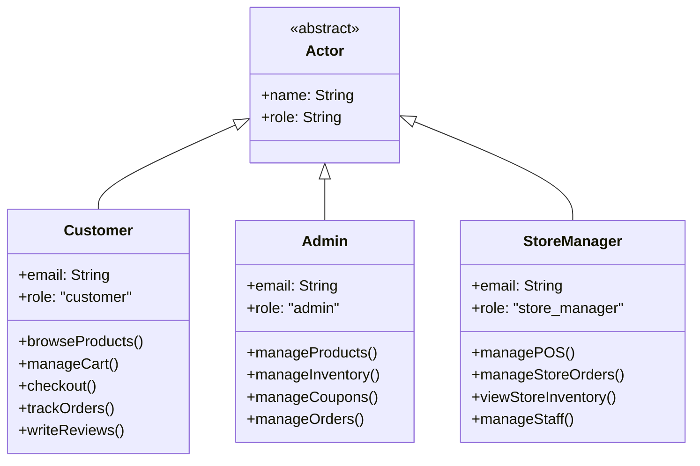

---

## 1.2 Use-Case Diagrams

### 1.2.1 Phân hệ Khách hàng (Customer Domain)

```mermaid
graph LR
    C(["👤 Khách hàng (Customer)"])

    subgraph SYS["Hệ thống Thương mại Điện tử"]
        UC1(["Duyệt sản phẩm"])
        UC2(["Tìm kiếm sản phẩm"])
        UC3(["Xem chi tiết sản phẩm"])
        UC4(["Quản lý giỏ hàng"])
        UC5(["Thanh toán"])
        UC6(["Theo dõi đơn hàng"])
        UC7(["Viết đánh giá"])
        UC8(["Quản lý danh sách yêu thích"])
        UC15(["Chọn thành phố"])
        UC16(["Kiểm tra tồn kho cửa hàng"])
    end

    C --- UC1
    C --- UC2
    C --- UC3
    C --- UC4
    C --- UC5
    C --- UC6
    C --- UC7
    C --- UC8
    C --- UC15
    C --- UC16

    UC4 -. "include" .-> UC5
    UC5 -. "include" .-> UC6
    UC1 -. "extend" .-> UC3
    UC2 -. "extend" .-> UC3
    UC8 -. "extend" .-> UC4
    UC16 -. "include" .-> UC15
    UC3 -. "extend" .-> UC16

    style C fill:none,stroke:none,color:#000,font-size:14px
    style SYS fill:#f5f5f5,stroke:#333,stroke-width:2px
```

### 1.2.2 Phân hệ Quản trị viên / Quản lý cửa hàng / Quản lý thành phố

```mermaid
graph LR
    A(["👤 Quản trị viên (Admin)"])
    SM(["👤 Quản lý cửa hàng (Store Manager)"])

    subgraph ADM["Phân hệ Quản trị viên (Admin)"]
        UC9(["Quản lý sản phẩm"])
        UC11(["Quản lý tồn kho"])
        UC12(["Quản lý mã giảm giá"])
        UC13(["Quản lý đơn hàng"])
    end

    subgraph STM["Phân hệ Quản lý cửa hàng (Store Manager)"]
        UC20(["Bán hàng tại quầy POS"])
        UC21(["Quản lý đơn hàng cửa hàng"])
        UC22(["Xem tồn kho cửa hàng"])
        UC23(["Quản lý nhân viên"])
    end

    A --- UC9
    A --- UC11
    A --- UC12
    A --- UC13

    SM --- UC20
    SM --- UC21
    SM --- UC22
    SM --- UC23

    UC9 -. "include" .-> UC11

    style A fill:none,stroke:none,color:#000,font-size:14px
    style SM fill:none,stroke:none,color:#000,font-size:14px
    style ADM fill:#f5f5f5,stroke:#333,stroke-width:2px
    style STM fill:#f5f5f5,stroke:#333,stroke-width:2px
```

---

## 1.3 Detailed Use-Case Descriptions

### UC1: Duyệt sản phẩm (Browse Products)

| Thuộc tính | Mô tả tóm tắt |
|-------|-------------|
| **Mã use case** | UC1 |
| **Tên use case** | Duyệt sản phẩm (Browse Products) |
| **Tác nhân (Actors)** | Khách hàng (Customer) |
| **Mô tả tóm tắt** | Khách hàng duyệt xem danh mục sản phẩm theo từng thể loại ngành hàng thời trang |
| **Tiền điều kiện** | Hệ thống đã có dữ liệu sản phẩm trong cơ sở dữ liệu |
| **Hậu điều kiện** | Danh sách sản phẩm được hiển thị trực quan cho khách hàng |
| **Mức độ ưu tiên** | Cao (High) |

#### Luồng sự kiện chính (SVDPI)

| Bước | Tác nhân | Hệ thống | Phát biểu SVDPI |
|------|-------|--------|-----------------|
| 1 | Khách hàng | Hệ thống | Khách hàng **chọn** danh mục **từ** menu điều hướng |
| 2 | - | Hệ thống | Hệ thống **truy xuất** danh sách sản phẩm **từ** cơ sở dữ liệu |
| 3 | - | Hệ thống | Hệ thống **hiển thị** danh sách sản phẩm **cho** khách hàng |
| 4 | Khách hàng | Hệ thống | Khách hàng **áp dụng** bộ lọc **lên** danh sách sản phẩm |
| 5 | - | Hệ thống | Hệ thống **lọc** các sản phẩm **theo** tiêu chí đã chọn |
| 6 | Khách hàng | Hệ thống | Khách hàng **chuyển trang** qua các kết quả sản phẩm |
| 7 | - | Hệ thống | Hệ thống **trả về** kết quả phân trang **cho** khách hàng |

---

### UC2: Tìm kiếm sản phẩm (Search Products)

| Thuộc tính | Mô tả tóm tắt |
|-------|-------------|
| **Mã use case** | UC2 |
| **Tên use case** | Tìm kiếm sản phẩm (Search Products) |
| **Tác nhân (Actors)** | Khách hàng (Customer) |
| **Mô tả tóm tắt** | Khách hàng tìm kiếm sản phẩm thông qua từ khóa |
| **Tiền điều kiện** | Hệ thống đã có dữ liệu sản phẩm trong cơ sở dữ liệu |
| **Hậu điều kiện** | Danh sách kết quả tìm kiếm phù hợp được hiển thị |
| **Mức độ ưu tiên** | Cao (High) |

#### Luồng sự kiện chính (SVDPI)

| Bước | Tác nhân | Hệ thống | Phát biểu SVDPI |
|------|-------|--------|-----------------|
| 1 | Khách hàng | Hệ thống | Khách hàng **nhập** từ khóa tìm kiếm **vào** ô tìm kiếm |
| 2 | - | Hệ thống | Hệ thống **xử lý** truy vấn tìm kiếm **bằng** cơ chế tìm kiếm toàn văn (full-text search) |
| 3 | - | Hệ thống | Hệ thống **xếp hạng** kết quả **theo** mức độ liên quan |
| 4 | - | Hệ thống | Hệ thống **hiển thị** kết quả tìm kiếm **cho** khách hàng |
| 5 | Khách hàng | Hệ thống | Khách hàng **nhấp chọn** sản phẩm **từ** danh sách kết quả |
| 6 | - | Hệ thống | Hệ thống **ghi nhật ký** sự kiện tìm kiếm **vào** luồng sự kiện truy cập (access stream) |

---

### UC3: Xem chi tiết sản phẩm (View Product Details)

| Thuộc tính | Mô tả tóm tắt |
|-------|-------------|
| **Mã use case** | UC3 |
| **Tên use case** | Xem chi tiết sản phẩm (View Product Details) |
| **Tác nhân (Actors)** | Khách hàng (Customer) |
| **Mô tả tóm tắt** | Khách hàng xem thông tin chi tiết của một sản phẩm (hình ảnh, giá, mô tả, biến thể kích thước/màu sắc) |
| **Tiền điều kiện** | Sản phẩm tồn tại và đang kích hoạt trong cơ sở dữ liệu |
| **Hậu điều kiện** | Trang chi tiết sản phẩm được hiển thị đầy đủ |
| **Mức độ ưu tiên** | Cao (High) |

#### Luồng sự kiện chính (SVDPI)

| Bước | Tác nhân | Hệ thống | Phát biểu SVDPI |
|------|-------|--------|-----------------|
| 1 | Khách hàng | Hệ thống | Khách hàng **chọn** sản phẩm **từ** danh sách |
| 2 | - | Hệ thống | Hệ thống **truy xuất** thông tin chi tiết sản phẩm **từ** cơ sở dữ liệu |
| 3 | - | Hệ thống | Hệ thống **tải** hình ảnh sản phẩm **từ** CDN / kho lưu trữ |
| 4 | - | Hệ thống | Hệ thống **hiển thị** trang chi tiết sản phẩm **cho** khách hàng |
| 5 | - | Hệ thống | Hệ thống **hiển thị** các sản phẩm liên quan **cho** khách hàng |
| 6 | - | Hệ thống | Hệ thống **ghi nhật ký** sự kiện xem sản phẩm **vào** luồng truy cập |

---

### UC4: Quản lý giỏ hàng (Manage Cart)

| Thuộc tính | Mô tả tóm tắt |
|-------|-------------|
| **Mã use case** | UC4 |
| **Tên use case** | Quản lý giỏ hàng (Manage Cart) |
| **Tác nhân (Actors)** | Khách hàng (Customer) |
| **Mô tả tóm tắt** | Khách hàng thêm sản phẩm, cập nhật số lượng hoặc xóa sản phẩm khỏi giỏ hàng |
| **Tiền điều kiện** | Khách hàng đã đăng nhập vào hệ thống |
| **Hậu điều kiện** | Giỏ hàng được cập nhật chính xác trạng thái mới nhất |
| **Mức độ ưu tiên** | Cao (High) |

#### Luồng sự kiện chính (SVDPI)

| Bước | Tác nhân | Hệ thống | Phát biểu SVDPI |
|------|-------|--------|-----------------|
| 1 | Khách hàng | Hệ thống | Khách hàng **thêm** sản phẩm **vào** giỏ hàng |
| 2 | - | Hệ thống | Hệ thống **kiểm tra** tính khả dụng của tồn kho **cho** sản phẩm |
| 3 | - | Hệ thống | Hệ thống **tạo** mục giỏ hàng (cart item) **trong** cơ sở dữ liệu |
| 4 | - | Hệ thống | Hệ thống **cập nhật** tổng số tiền giỏ hàng |
| 5 | Khách hàng | Hệ thống | Khách hàng **cập nhật** số lượng sản phẩm **trong** giỏ hàng |
| 6 | - | Hệ thống | Hệ thống **xác thực** số lượng mới **so với** lượng hàng tồn |
| 7 | - | Hệ thống | Hệ thống **tính lại** tổng giá trị giỏ hàng |
| 8 | Khách hàng | Hệ thống | Khách hàng **xóa** sản phẩm **khỏi** giỏ hàng |
| 9 | - | Hệ thống | Hệ thống **xóa** mục giỏ hàng **khỏi** cơ sở dữ liệu |
| 10 | - | Hệ thống | Hệ thống **ghi nhật ký** thay đổi giỏ hàng **vào** luồng sự kiện |

---

### UC5: Thanh toán (Checkout)

| Thuộc tính | Mô tả tóm tắt |
|-------|-------------|
| **Mã use case** | UC5 |
| **Tên use case** | Thanh toán (Checkout) |
| **Tác nhân (Actors)** | Khách hàng (Customer) |
| **Mô tả tóm tắt** | Khách hàng hoàn tất việc mua các mặt hàng trong giỏ hàng |
| **Tiền điều kiện** | Khách hàng đã đăng nhập, giỏ hàng không trống và các sản phẩm còn hàng |
| **Hậu điều kiện** | Đơn hàng được tạo, thanh toán thành công, tồn kho được trừ tự động |
| **Mức độ ưu tiên** | Cao (High) |
| **Quy tắc kinh doanh** | Quá trình thanh toán phải đảm bảo tính nguyên tử (Atomic) - thực thi trong một giao dịch cơ sở dữ liệu duy nhất |

#### Luồng sự kiện chính (SVDPI)

| Bước | Tác nhân | Hệ thống | Phát biểu SVDPI |
|------|-------|--------|-----------------|
| 1 | Khách hàng | Hệ thống | Khách hàng **chọn** các sản phẩm **từ** giỏ hàng **để** thanh toán |
| 2 | - | Hệ thống | Hệ thống **kiểm tra** tồn kho thực tế **cho** từng sản phẩm |
| 3 | - | Hệ thống | Hệ thống **tính toán** tổng số tiền **bao gồm** phí vận chuyển |
| 4 | - | Hệ thống | Hệ thống **hiển thị** bảng tóm tắt đơn hàng **cho** khách hàng |
| 5 | Khách hàng | Hệ thống | Khách hàng **nhập** thông tin địa chỉ giao hàng **vào** biểu mẫu (tỉnh/thành, phường/xã, địa chỉ cụ thể) |
| 6 | Khách hàng | Hệ thống | Khách hàng **áp dụng** mã giảm giá **vào** đơn hàng (tùy chọn) |
| 7 | - | Hệ thống | Hệ thống **tính toán** số tiền giảm giá **từ** mã khuyến mãi |
| 8 | Khách hàng | Hệ thống | Khách hàng **xác nhận** đặt hàng **với** hệ thống |
| 9 | - | Hệ thống | Hệ thống **tạo** bản ghi đơn hàng (orders) **trong** cơ sở dữ liệu MySQL |
| 10 | - | Hệ thống | Hệ thống **tạo** các mục chi tiết đơn hàng (order_items) **trong** cơ sở dữ liệu MySQL |
| 11 | - | Hệ thống | Hệ thống **tạo** bản ghi thanh toán (payments) **với** trạng thái thành công (succeeded) |
| 12 | - | Hệ thống | Hệ thống **trừ** số lượng tồn kho **cho** các sản phẩm đã mua |
| 13 | - | Hệ thống | Hệ thống **đánh dấu** giỏ hàng **ở trạng thái** đã thanh toán (checked_out) |
| 14 | - | Hệ thống | Hệ thống **ghi nhật ký** chi tiết giao dịch **vào** luồng sự kiện truy cập |

#### Luồng ngoại lệ

| Bước ngoại lệ | Điều kiện | Phát biểu SVDPI |
|----------|-----------|-----------------|
| 2a | Sản phẩm hết hàng | Hệ thống **thông báo** tới khách hàng **về** sản phẩm đã hết hàng trong kho |
| 6a | Mã giảm giá không hợp lệ | Hệ thống **thông báo** tới khách hàng **về** lỗi áp dụng mã khuyến mãi |

---

### UC6: Theo dõi đơn hàng (Track Orders)

| Thuộc tính | Mô tả tóm tắt |
|-------|-------------|
| **Mã use case** | UC6 |
| **Tên use case** | Theo dõi đơn hàng (Track Orders) |
| **Tác nhân (Actors)** | Khách hàng (Customer) |
| **Mô tả tóm tắt** | Khách hàng xem lịch sử đơn hàng và tiến trình xử lý, giao nhận của đơn |
| **Tiền điều kiện** | Khách hàng đã đăng nhập và đã có ít nhất một đơn hàng |
| **Hậu điều kiện** | Lịch sử và thông tin chi tiết đơn hàng được hiển thị |
| **Mức độ ưu tiên** | Trung bình (Medium) |

#### Luồng sự kiện chính (SVDPI)

| Bước | Tác nhân | Hệ thống | Phát biểu SVDPI |
|------|-------|--------|-----------------|
| 1 | Khách hàng | Hệ thống | Khách hàng **truy cập** trang lịch sử đơn hàng |
| 2 | - | Hệ thống | Hệ thống **truy xuất** danh sách đơn hàng **từ** cơ sở dữ liệu |
| 3 | - | Hệ thống | Hệ thống **hiển thị** danh sách đơn hàng **cho** khách hàng |
| 4 | Khách hàng | Hệ thống | Khách hàng **chọn** một đơn hàng cụ thể **từ** danh sách |
| 5 | - | Hệ thống | Hệ thống **truy xuất** thông tin chi tiết đơn hàng **từ** cơ sở dữ liệu |
| 6 | - | Hệ thống | Hệ thống **hiển thị** chi tiết đơn hàng và lịch sử trạng thái **cho** khách hàng |

---

### UC7: Viết đánh giá (Write Reviews)

| Thuộc tính | Mô tả tóm tắt |
|-------|-------------|
| **Mã use case** | UC7 |
| **Tên use case** | Viết đánh giá (Write Reviews) |
| **Tác nhân (Actors)** | Khách hàng (Customer) |
| **Mô tả tóm tắt** | Khách hàng viết đánh giá và xếp hạng sao cho sản phẩm đã mua thành công |
| **Tiền điều kiện** | Khách hàng có đơn hàng đã hoàn thành (completed) chứa sản phẩm đó |
| **Hậu điều kiện** | Đánh giá được lưu vào cơ sở dữ liệu và hiển thị |
| **Mức độ ưu tiên** | Trung bình (Medium) |

#### Luồng sự kiện chính (SVDPI)

| Bước | Tác nhân | Hệ thống | Phát biểu SVDPI |
|------|-------|--------|-----------------|
| 1 | Khách hàng | Hệ thống | Khách hàng **chọn** sản phẩm **từ** đơn hàng đã hoàn tất |
| 2 | - | Hệ thống | Hệ thống **xác minh** quyền đánh giá dựa trên lịch sử mua hàng **cho** khách hàng |
| 3 | Khách hàng | Hệ thống | Khách hàng **nhập** nội dung nhận xét **vào** biểu mẫu |
| 4 | Khách hàng | Hệ thống | Khách hàng **chọn** điểm đánh giá **từ** các tùy chọn số sao (1-5 sao) |
| 5 | Khách hàng | Hệ thống | Khách hàng **gửi** đánh giá **lên** hệ thống |
| 6 | - | Hệ thống | Hệ thống **kiểm tra tính hợp lệ** của nội dung đánh giá |
| 7 | - | Hệ thống | Hệ thống **lưu** đánh giá **vào** cơ sở dữ liệu |
| 8 | - | Hệ thống | Hệ thống **ghi nhật ký** sự kiện đánh giá **vào** luồng truy cập |

---

### UC8: Quản lý danh sách yêu thích (Manage Wishlist)

| Thuộc tính | Mô tả tóm tắt |
|-------|-------------|
| **Mã use case** | UC8 |
| **Tên use case** | Quản lý danh sách yêu thích (Manage Wishlist) |
| **Tác nhân (Actors)** | Khách hàng (Customer) |
| **Mô tả tóm tắt** | Khách hàng lưu trữ hoặc loại bỏ các sản phẩm yêu thích để mua sau |
| **Tiền điều kiện** | Khách hàng đã đăng nhập vào hệ thống |
| **Hậu điều kiện** | Danh sách yêu thích được cập nhật |
| **Mức độ ưu tiên** | Thấp (Low) |

#### Luồng sự kiện chính (SVDPI)

| Bước | Tác nhân | Hệ thống | Phát biểu SVDPI |
|------|-------|--------|-----------------|
| 1 | Khách hàng | Hệ thống | Khách hàng **thêm** sản phẩm **vào** danh sách yêu thích |
| 2 | - | Hệ thống | Hệ thống **tạo** mục yêu thích **trong** cơ sở dữ liệu |
| 3 | Khách hàng | Hệ thống | Khách hàng **truy cập** trang danh sách yêu thích |
| 4 | - | Hệ thống | Hệ thống **truy xuất** các mục yêu thích **từ** cơ sở dữ liệu |
| 5 | - | Hệ thống | Hệ thống **hiển thị** danh sách yêu thích **cho** khách hàng |
| 6 | Khách hàng | Hệ thống | Khách hàng **xóa** sản phẩm **khỏi** danh sách yêu thích |
| 7 | - | Hệ thống | Hệ thống **xóa** mục yêu thích **khỏi** cơ sở dữ liệu |

---

### UC9: Quản lý sản phẩm (Manage Products - Admin)

| Thuộc tính | Mô tả tóm tắt |
|-------|-------------|
| **Mã use case** | UC9 |
| **Tên use case** | Quản lý sản phẩm (Manage Products) |
| **Tác nhân (Actors)** | Quản trị viên (Admin) |
| **Mô tả tóm tắt** | Quản trị viên thêm mới, chỉnh sửa thông tin hoặc lưu trữ/ẩn sản phẩm |
| **Tiền điều kiện** | Quản trị viên đã xác thực quyền Admin |
| **Hậu điều kiện** | Thông tin sản phẩm được lưu thay đổi vào cơ sở dữ liệu |
| **Mức độ ưu tiên** | Cao (High) |

#### Luồng sự kiện chính (SVDPI)

| Bước | Tác nhân | Hệ thống | Phát biểu SVDPI |
|------|-------|--------|-----------------|
| 1 | Quản trị viên | Hệ thống | Quản trị viên **truy cập** trang quản lý sản phẩm |
| 2 | - | Hệ thống | Hệ thống **hiển thị** danh sách sản phẩm **cho** quản trị viên |
| 3 | Quản trị viên | Hệ thống | Quản trị viên **nhấp chọn** nút thêm sản phẩm mới |
| 4 | - | Hệ thống | Hệ thống **hiển thị** biểu mẫu nhập sản phẩm **cho** quản trị viên |
| 5 | Quản trị viên | Hệ thống | Quản trị viên **nhập** chi tiết thông tin sản phẩm **vào** biểu mẫu |
| 6 | Quản trị viên | Hệ thống | Quản trị viên **tải lên** hình ảnh sản phẩm **lên** hệ thống |
| 7 | Quản trị viên | Hệ thống | Quản trị viên **lưu** sản phẩm **vào** hệ thống |
| 8 | - | Hệ thống | Hệ thống **xác thực** dữ liệu sản phẩm |
| 9 | - | Hệ thống | Hệ thống **tạo** bản ghi sản phẩm **trong** cơ sở dữ liệu |
| 10 | - | Hệ thống | Hệ thống **ghi nhật ký** hành động của quản trị viên **vào** nhật ký kiểm toán (audit trail) |

---

### UC10: Quản lý danh mục (Manage Categories - Admin)

| Thuộc tính | Mô tả tóm tắt |
|-------|-------------|
| **Mã use case** | UC10 |
| **Tên use case** | Quản lý danh mục (Manage Categories) |
| **Tác nhân (Actors)** | Quản trị viên (Admin) |
| **Mô tả tóm tắt** | Quản trị viên thêm, sửa hoặc xóa cây phân cấp danh mục ngành hàng |
| **Tiền điều kiện** | Quản trị viên đã xác thực quyền Admin |
| **Hậu điều kiện** | Cấu trúc danh mục được cập nhật |
| **Mức độ ưu tiên** | Cao (High) |

#### Luồng sự kiện chính (SVDPI)

| Bước | Tác nhân | Hệ thống | Phát biểu SVDPI |
|------|-------|--------|-----------------|
| 1 | Quản trị viên | Hệ thống | Quản trị viên **truy cập** trang quản lý danh mục |
| 2 | - | Hệ thống | Hệ thống **hiển thị** cây danh mục phân cấp **cho** quản trị viên |
| 3 | Quản trị viên | Hệ thống | Quản trị viên **thêm** danh mục mới **vào** cây danh mục |
| 4 | - | Hệ thống | Hệ thống **kiểm tra** tên và mã danh mục hợp lệ |
| 5 | - | Hệ thống | Hệ thống **tạo** bản ghi danh mục **trong** cơ sở dữ liệu |
| 6 | Quản trị viên | Hệ thống | Quản trị viên **cập nhật** thông tin chi tiết danh mục |
| 7 | - | Hệ thống | Hệ thống **lưu** các thay đổi danh mục vào cơ sở dữ liệu |

---

### UC11: Quản lý tồn kho (Manage Inventory - Admin)

| Thuộc tính | Mô tả tóm tắt |
|-------|-------------|
| **Mã use case** | UC11 |
| **Tên use case** | Quản lý tồn kho (Manage Inventory) |
| **Tác nhân (Actors)** | Quản trị viên (Admin) |
| **Mô tả tóm tắt** | Quản trị viên theo dõi và cập nhật số lượng tồn kho tổng thể của từng biến thể |
| **Tiền điều kiện** | Quản trị viên đã xác thực, sản phẩm và biến thể đã tồn tại |
| **Hậu điều kiện** | Số lượng tồn kho được điều chỉnh chính xác |
| **Mức độ ưu tiên** | Cao (High) |

#### Luồng sự kiện chính (SVDPI)

| Bước | Tác nhân | Hệ thống | Phát biểu SVDPI |
|------|-------|--------|-----------------|
| 1 | Quản trị viên | Hệ thống | Quản trị viên **truy cập** trang quản lý tồn kho |
| 2 | - | Hệ thống | Hệ thống **hiển thị** mức tồn kho hiện tại **cho** quản trị viên |
| 3 | Quản trị viên | Hệ thống | Quản trị viên **chọn** biến thể sản phẩm cần điều chỉnh |
| 4 | Quản trị viên | Hệ thống | Quản trị viên **nhập** số lượng tồn kho mới |
| 5 | Quản trị viên | Hệ thống | Quản trị viên **xác nhận** cập nhật tồn kho |
| 6 | - | Hệ thống | Hệ thống **xác thực** tính hợp lệ của số lượng thay đổi |
| 7 | - | Hệ thống | Hệ thống **cập nhật** bản ghi tồn kho **trong** cơ sở dữ liệu |
| 8 | - | Hệ thống | Hệ thống **ghi nhật ký** biến động tồn kho **vào** nhật ký kiểm toán |

---

### UC12: Quản lý mã giảm giá (Manage Coupons - Admin)

| Thuộc tính | Mô tả tóm tắt |
|-------|-------------|
| **Mã use case** | UC12 |
| **Tên use case** | Quản lý mã giảm giá (Manage Coupons) |
| **Tác nhân (Actors)** | Quản trị viên (Admin) |
| **Mô tả tóm tắt** | Quản trị viên tạo mới, sửa đổi hạn dùng hoặc vô hiệu hóa các mã khuyến mãi |
| **Tiền điều kiện** | Quản trị viên đã xác thực quyền Admin |
| **Hậu điều kiện** | Thông tin mã giảm giá được lưu trữ và kích hoạt |
| **Mức độ ưu tiên** | Trung bình (Medium) |

#### Luồng sự kiện chính (SVDPI)

| Bước | Tác nhân | Hệ thống | Phát biểu SVDPI |
|------|-------|--------|-----------------|
| 1 | Quản trị viên | Hệ thống | Quản trị viên **truy cập** trang quản lý mã giảm giá |
| 2 | - | Hệ thống | Hệ thống **hiển thị** danh sách coupon hiện có **cho** quản trị viên |
| 3 | Quản trị viên | Hệ thống | Quản trị viên **tạo** một mã coupon mới |
| 4 | Quản trị viên | Hệ thống | Quản trị viên **thiết lập** các thông số giảm giá **trong** biểu mẫu |
| 5 | - | Hệ thống | Hệ thống **kiểm tra** các điều kiện và ràng buộc của coupon |
| 6 | - | Hệ thống | Hệ thống **tạo** bản ghi coupon **trong** cơ sở dữ liệu |
| 7 | Quản trị viên | Hệ thống | Quản trị viên **vô hiệu hóa** mã coupon đang hoạt động |
| 8 | - | Hệ thống | Hệ thống **đánh dấu** trạng thái coupon là không kích hoạt |

---

### UC13: Quản lý đơn hàng (Manage Orders - Admin)

| Thuộc tính | Mô tả tóm tắt |
|-------|-------------|
| **Mã use case** | UC13 |
| **Tên use case** | Quản lý đơn hàng (Manage Orders) |
| **Tác nhân (Actors)** | Quản trị viên (Admin) |
| **Mô tả tóm tắt** | Quản trị viên xem xét và xử lý chuyển đổi trạng thái của đơn hàng |
| **Tiền điều kiện** | Quản trị viên đã xác thực, đơn hàng đã phát sinh trong hệ thống |
| **Hậu điều kiện** | Trạng thái đơn hàng được cập nhật và lưu vết lịch sử |
| **Mức độ ưu tiên** | Cao (High) |

#### Luồng sự kiện chính (SVDPI)

| Bước | Tác nhân | Hệ thống | Phát biểu SVDPI |
|------|-------|--------|-----------------|
| 1 | Quản trị viên | Hệ thống | Quản trị viên **truy cập** trang quản lý đơn hàng |
| 2 | - | Hệ thống | Hệ thống **hiển thị** danh sách đơn hàng **cho** quản trị viên |
| 3 | Quản trị viên | Hệ thống | Quản trị viên **lọc** đơn hàng **theo** trạng thái |
| 4 | Quản trị viên | Hệ thống | Quản trị viên **chọn** một đơn hàng **từ** danh sách |
| 5 | - | Hệ thống | Hệ thống **hiển thị** chi tiết đơn hàng **cho** quản trị viên |
| 6 | Quản trị viên | Hệ thống | Quản trị viên **cập nhật** trạng thái đơn hàng (xác nhận, hoàn tất, hủy) |
| 7 | - | Hệ thống | Hệ thống **kiểm tra** tính hợp lệ của luồng chuyển đổi trạng thái |
| 8 | - | Hệ thống | Hệ thống **lưu** thay đổi trạng thái **vào** cơ sở dữ liệu |
| 9 | - | Hệ thống | Hệ thống **ghi lại** sự kiện chuyển đổi **trong** bảng order_status_history |

---

### UC14: Xem bảng điều khiển (View Dashboard - Admin)

| Thuộc tính | Mô tả tóm tắt |
|-------|-------------|
| **Mã use case** | UC14 |
| **Tên use case** | Xem bảng điều khiển (View Dashboard) |
| **Tác nhân (Actors)** | Quản trị viên (Admin) |
| **Mô tả tóm tắt** | Quản trị viên xem tổng quan các chỉ số vận hành và kinh doanh then chốt |
| **Tiền điều kiện** | Quản trị viên đã xác thực quyền Admin |
| **Hậu điều kiện** | Bảng điều khiển hiển thị đầy đủ các chỉ số thống kê |
| **Mức độ ưu tiên** | Trung bình (Medium) |

#### Luồng sự kiện chính (SVDPI)

| Bước | Tác nhân | Hệ thống | Phát biểu SVDPI |
|------|-------|--------|-----------------|
| 1 | Quản trị viên | Hệ thống | Quản trị viên **truy cập** trang bảng điều khiển (dashboard) |
| 2 | - | Hệ thống | Hệ thống **truy xuất** số liệu doanh thu **từ** cơ sở dữ liệu |
| 3 | - | Hệ thống | Hệ thống **truy xuất** số lượng đơn hàng theo giai đoạn **từ** cơ sở dữ liệu |
| 4 | - | Hệ thống | Hệ thống **truy xuất** tổng số lượng sản phẩm và khách hàng **từ** cơ sở dữ liệu |
| 5 | - | Hệ thống | Hệ thống **nhận diện** các mặt hàng sắp hết kho **từ** cơ sở dữ liệu |
| 6 | - | Hệ thống | Hệ thống **hiển thị** các thẻ chỉ số và biểu đồ **cho** quản trị viên |

---

### UC15: Chọn thành phố / địa điểm (Select City/Location)

| Thuộc tính | Mô tả tóm tắt |
|-------|-------------|
| **Mã use case** | UC15 |
| **Tên use case** | Chọn thành phố / địa điểm (Select City/Location) |
| **Tác nhân (Actors)** | Khách hàng (Customer) |
| **Mô tả tóm tắt** | Khách hàng chủ động chọn tỉnh/thành phố để xem tính sẵn có của hàng hóa theo khu vực |
| **Tiền điều kiện** | Hệ thống đã thiết lập danh mục các thành phố và cửa hàng hoạt động |
| **Hậu điều kiện** | Mã thành phố được lưu trữ trong localStorage; tình trạng tồn kho sản phẩm được cập nhật theo khu vực |
| **Mức độ ưu tiên** | Cao (High) |

#### Luồng sự kiện chính (SVDPI)

| Bước | Tác nhân | Hệ thống | Phát biểu SVDPI |
|------|-------|--------|-----------------|
| 1 | Khách hàng | Hệ thống | Khách hàng **nhấp chọn** bộ chọn thành phố **trên** thanh tiêu đề (header) |
| 2 | - | Hệ thống | Hệ thống **lấy** danh sách thành phố đang hoạt động **từ** API `/api/v1/locations/cities` |
| 3 | - | Hệ thống | Hệ thống **hiển thị** danh sách thành phố **kèm** số lượng cửa hàng **cho** khách hàng |
| 4 | Khách hàng | Hệ thống | Khách hàng **chọn** thành phố mong muốn **từ** danh sách thả xuống |
| 5 | - | Hệ thống | Hệ thống **lưu** mã thành phố đã chọn **vào** localStorage trình duyệt |
| 6 | - | Hệ thống | Hệ thống **làm mới** dữ liệu tồn kho sản phẩm **theo** thành phố đã chọn |

---

### UC16: Kiểm tra tồn kho cửa hàng (Check Store Availability)

| Thuộc tính | Mô tả tóm tắt |
|-------|-------------|
| **Mã use case** | UC16 |
| **Tên use case** | Kiểm tra tồn kho cửa hàng (Check Store Availability) |
| **Tác nhân (Actors)** | Khách hàng (Customer) |
| **Mô tả tóm tắt** | Khách hàng xem danh sách chi tiết các cửa hàng trong thành phố còn hàng cho biến thể đã chọn (theo phong cách CellphoneS) |
| **Tiền điều kiện** | Khách hàng đã chọn thành phố; sản phẩm và biến thể tồn tại |
| **Hậu điều kiện** | Tình trạng tồn kho theo từng chi nhánh được hiển thị trực quan |
| **Mức độ ưu tiên** | Cao (High) |

#### Luồng sự kiện chính (SVDPI)

| Bước | Tác nhân | Hệ thống | Phát biểu SVDPI |
|------|-------|--------|-----------------|
| 1 | - | Hệ thống | Hệ thống **tải** trang chi tiết sản phẩm |
| 2 | - | Hệ thống | Hệ thống **truy xuất** dữ liệu tồn kho **từ** API `/api/v1/catalog/products/{slug}/availability` |
| 3 | - | Hệ thống | Hệ thống **hiển thị** tổng tồn kho vùng (city pool total) **cho** khách hàng |
| 4 | - | Hệ thống | Hệ thống **liệt kê** từng cửa hàng **kèm** số lượng còn hàng cụ thể |
| 5 | Khách hàng | Hệ thống | Khách hàng **xem** danh sách cửa hàng còn hàng **trong** hộp hiển thị StoreAvailabilityBox |

---

### UC17: Quản lý tồn kho chi nhánh (Manage Branch Inventory - Staff)

| Thuộc tính | Mô tả tóm tắt |
|-------|-------------|
| **Mã use case** | UC17 |
| **Tên use case** | Quản lý tồn kho chi nhánh (Manage Branch Inventory) |
| **Tác nhân (Actors)** | Quản trị viên (Admin), Quản lý cửa hàng (Store Manager) |
| **Mô tả tóm tắt** | Nhân viên cập nhật số lượng tồn kho tại các cửa hàng nằm trong phạm vi quyền hạn của mình |
| **Tiền điều kiện** | Nhân viên đã đăng nhập và được gán vai trò cùng phạm vi cửa hàng/thành phố tương ứng |
| **Hậu điều kiện** | Số lượng tồn kho tại cửa hàng được cập nhật kèm kiểm soát xung đột (optimistic locking) |
| **Mức độ ưu tiên** | Cao (High) |

#### Luồng sự kiện chính (SVDPI)

| Bước | Tác nhân | Hệ thống | Phát biểu SVDPI |
|------|-------|--------|-----------------|
| 1 | Nhân viên | Hệ thống | Nhân viên **truy cập** trang tồn kho chi nhánh |
| 2 | - | Hệ thống | Hệ thống **kiểm tra** vai trò và quyền hạn **của** nhân viên |
| 3 | - | Hệ thống | Hệ thống **lọc** danh sách cửa hàng **theo** phạm vi phân quyền |
| 4 | - | Hệ thống | Hệ thống **hiển thị** danh sách tồn kho **cho** nhân viên |
| 5 | Nhân viên | Hệ thống | Nhân viên **chọn** biến thể sản phẩm cần điều chỉnh |
| 6 | Nhân viên | Hệ thống | Nhân viên **nhập** số lượng tồn kho thực tế mới |
| 7 | Nhân viên | Hệ thống | Nhân viên **xác nhận** cập nhật tồn kho |
| 8 | - | Hệ thống | Hệ thống **xác minh** quyền can thiệp **đối với** cửa hàng mục tiêu |
| 9 | - | Hệ thống | Hệ thống **cập nhật** bản ghi store_inventory **trong** cơ sở dữ liệu |
| 10 | - | Hệ thống | Hệ thống **tăng** giá trị version **để** kiểm soát khóa lạc quan (optimistic locking) |

#### Quy tắc phân quyền (Permission Rules)

| Vai trò (Role) | Phạm vi (Scope) | Quyền chỉnh sửa tồn kho |
|------|-------|----------|
| **Admin** | Toàn bộ các cửa hàng toàn quốc | Toàn quyền xem và chỉnh sửa |
| **Store Manager** | Duy nhất cửa hàng được phân công | Chỉnh sửa kho cửa hàng mình |
| **Customer** | Không có | Không có quyền truy cập |

---

### UC18: Giao dịch bán hàng tại quầy POS (POS Transaction - Staff)

| Thuộc tính | Mô tả tóm tắt |
|-------|-------------|
| **Mã use case** | UC18 |
| **Tên use case** | Giao dịch bán hàng tại quầy POS (POS Transaction) |
| **Tác nhân (Actors)** | Quản trị viên (Admin), Quản lý cửa hàng (Store Manager) |
| **Mô tả tóm tắt** | Nhân viên thực hiện bán hàng và thanh toán trực tiếp cho khách tại quầy cửa hàng thông qua giao diện POS |
| **Tiền điều kiện** | Nhân viên đã xác thực quyền hợp lệ và được gán cửa hàng cụ thể |
| **Hậu điều kiện** | Đơn hàng được tạo với trạng thái hoàn tất, trừ đồng thời cả tồn kho chi nhánh và tồn kho chung |
| **Mức độ ưu tiên** | Cao (High) |
| **Quy tắc kinh doanh** | Giao dịch POS tạo đơn hàng hoàn tất ngay lập tức, trừ tồn kho kép (dual inventory decrement) trong cùng một transaction |

#### Luồng sự kiện chính (SVDPI)

| Bước | Tác nhân | Hệ thống | Phát biểu SVDPI |
|------|-------|--------|-----------------|
| 1 | Nhân viên | Hệ thống | Nhân viên **truy cập** giao diện bán hàng POS **tại** `/admin/pos` |
| 2 | - | Hệ thống | Hệ thống **hiển thị** ô tìm kiếm nhanh sản phẩm **cho** nhân viên |
| 3 | Nhân viên | Hệ thống | Nhân viên **nhập** từ khóa sản phẩm hoặc mã SKU **vào** ô tìm kiếm |
| 4 | - | Hệ thống | Hệ thống **tìm kiếm** sản phẩm **theo** tiền tố SKU hoặc tên |
| 5 | - | Hệ thống | Hệ thống **trả về** tối đa 8 kết quả phù hợp **kèm** số lượng tồn tại cửa hàng |
| 6 | Nhân viên | Hệ thống | Nhân viên **chọn** sản phẩm **từ** kết quả tìm kiếm |
| 7 | Nhân viên | Hệ thống | Nhân viên **nhập** số lượng mua **cho** sản phẩm |
| 8 | Nhân viên | Hệ thống | Nhân viên **thêm** sản phẩm **vào** giỏ hàng POS |
| 9 | Nhân viên | Hệ thống | Nhân viên **lặp lại** bước 3-8 **cho** các sản phẩm tiếp theo |
| 10 | - | Hệ thống | Hệ thống **hiển thị** danh sách giỏ hàng **kèm** tổng tiền cần thanh toán |
| 11 | Nhân viên | Hệ thống | Nhân viên **xác nhận** giao dịch **lên** hệ thống |
| 12 | - | Hệ thống | Hệ thống **kiểm tra** tồn kho thực tế tại cửa hàng **cho** từng món đồ |
| 13 | - | Hệ thống | Hệ thống **tạo** đơn hàng **với** `channel='pos'` và `status='completed'` |
| 14 | - | Hệ thống | Hệ thống **tạo** bản ghi thanh toán **với** `status='succeeded'` |
| 15 | - | Hệ thống | Hệ thống **trừ** số lượng tồn kho cửa hàng trong `store_inventory` **cho** từng sản phẩm |
| 16 | - | Hệ thống | Hệ thống **trừ** số lượng tồn kho tổng thể trong `inventory` **cho** từng sản phẩm |
| 17 | - | Hệ thống | Hệ thống **hiển thị** thông báo thành công **kèm** mã đơn hàng vừa tạo |

#### Luồng ngoại lệ

| Bước ngoại lệ | Điều kiện | Phát biểu SVDPI |
|----------|-----------|-----------------|
| 12a | Tồn kho tại cửa hàng không đủ | Hệ thống **thông báo** tới nhân viên **về** việc hết hàng tại quầy |

#### Quy tắc phân quyền

| Vai trò (Role) | Phạm vi (Scope) | Quyền bán hàng POS |
|------|-------|---------|
| **Admin** | Tất cả các cửa hàng | Có |
| **Store Manager** | Duy nhất cửa hàng được phân công | Có |
| **Customer** | Không có | Không có quyền truy cập |

---

## 1.4 Sơ đồ hoạt động (Activity Diagrams)

### 1.4.1 UC1: Sơ đồ hoạt động Duyệt sản phẩm (Browse Products)

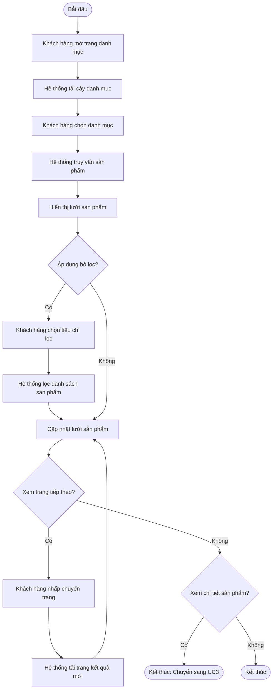

### 1.4.2 UC2: Sơ đồ hoạt động Tìm kiếm sản phẩm (Search Products)

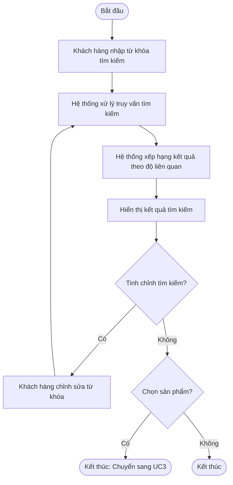

### 1.4.3 UC3: Sơ đồ hoạt động Xem chi tiết sản phẩm (View Product Details)

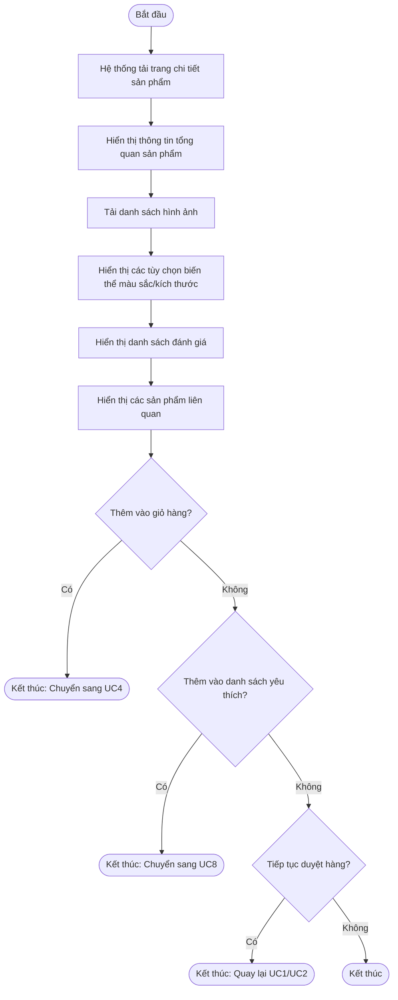

### 1.4.4 UC4: Sơ đồ hoạt động Quản lý giỏ hàng (Manage Cart)

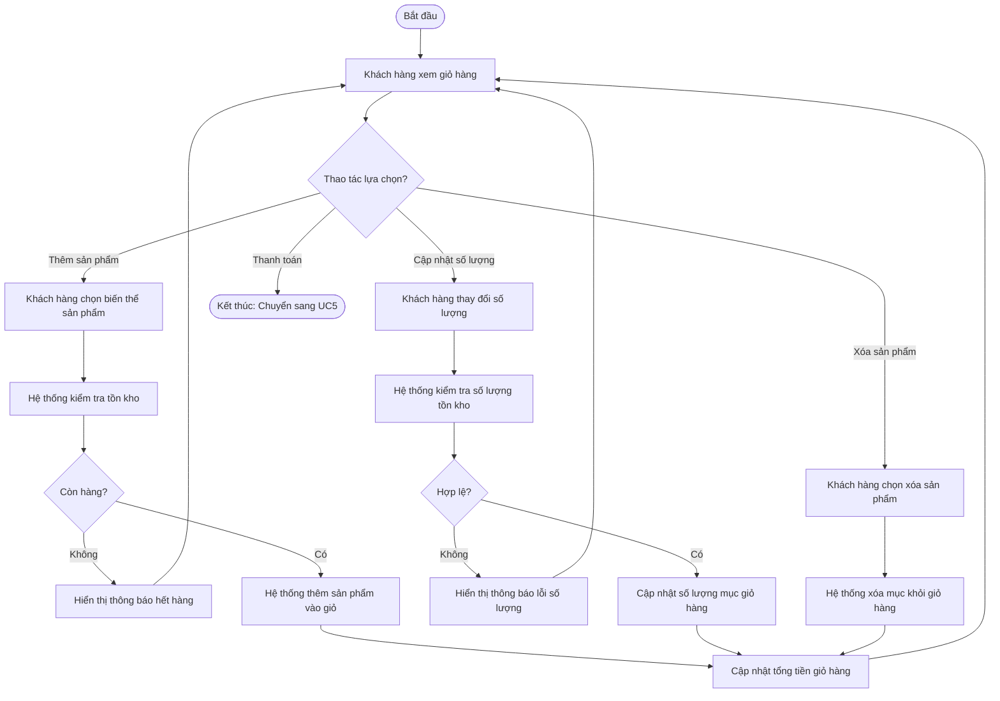

### 1.4.5 UC5: Sơ đồ hoạt động Thanh toán (Checkout)

```mermaid
flowchart TD
    Start([Bắt đầu]) --> A[Hiển thị tóm tắt giỏ hàng]
    A --> B{Tất cả sản phẩm còn hàng?}
    
    B -->|Không| C[Hiển thị cảnh báo sản phẩm hết hàng]
    C --> D[Khách hàng xóa bỏ các mặt hàng hết kho]
    D --> E{Giỏ hàng rỗng?}
    E -->|Có| F[Quay về trang mua sắm]
    E -->|Không| A
    
    B -->|Có| G[Tính tổng giá trị hàng hóa]
    G --> H[Áp dụng mã giảm giá và tính phí vận chuyển]
    H --> I[Hiển thị thông tin tổng kết đơn hàng]
    
    I --> J[Khách hàng nhập địa chỉ giao hàng chi tiết]
    J --> K[Kiểm tra tính hợp lệ của địa chỉ]
    K --> L{Địa chỉ hợp lệ?}
    L -->|Không| M[Hiển thị thông báo lỗi biểu mẫu]
    M --> J
    L -->|Có| N[Khách hàng chọn phương thức thanh toán]
    
    N --> O[Khách hàng xác nhận đặt hàng]
    O --> P[Bắt đầu giao dịch cơ sở dữ liệu (Transaction)]
    P --> Q[Tạo bản ghi đơn hàng (orders)]
    Q --> R[Tạo danh sách chi tiết đơn hàng (order_items)]
    R --> S[Khóa và trừ số lượng tồn kho]
    S --> T[Xác nhận giao dịch (Commit transaction)]
    
    T --> U[Xử lý giao dịch thanh toán]
    U --> V{Thanh toán thành công?}
    
    V -->|Không| W[Bắt đầu giao dịch hoàn tác (Rollback)]
    W --> X[Đánh dấu đơn hàng thất bại/hủy]
    X --> Y[Hoàn trả số lượng tồn kho]
    Y --> Z[Xác nhận hoàn tác (Commit rollback)]
    Z --> AA[Hiển thị thông báo lỗi thanh toán]
    AA --> N
    
    V -->|Có| AB[Cập nhật trạng thái đơn hàng sang ĐÃ THANH TOÁN]
    AB --> AC[Gửi email xác nhận đơn hàng]
    AC --> AD[Ghi nhật ký vào luồng sự kiện truy cập]
    AD --> End([Kết thúc: Hoàn tất thanh toán])
```

### 1.4.6 UC6: Sơ đồ hoạt động Theo dõi đơn hàng (Track Orders)

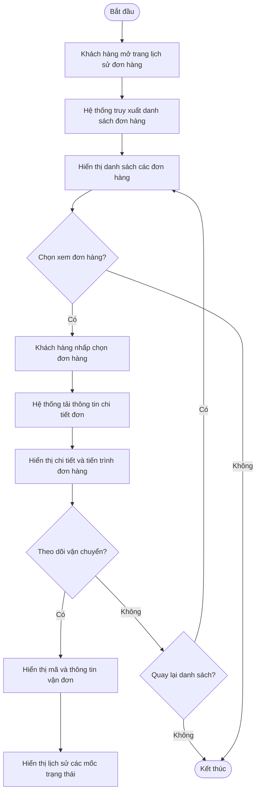

### 1.4.7 UC7: Sơ đồ hoạt động Viết đánh giá (Write Reviews)

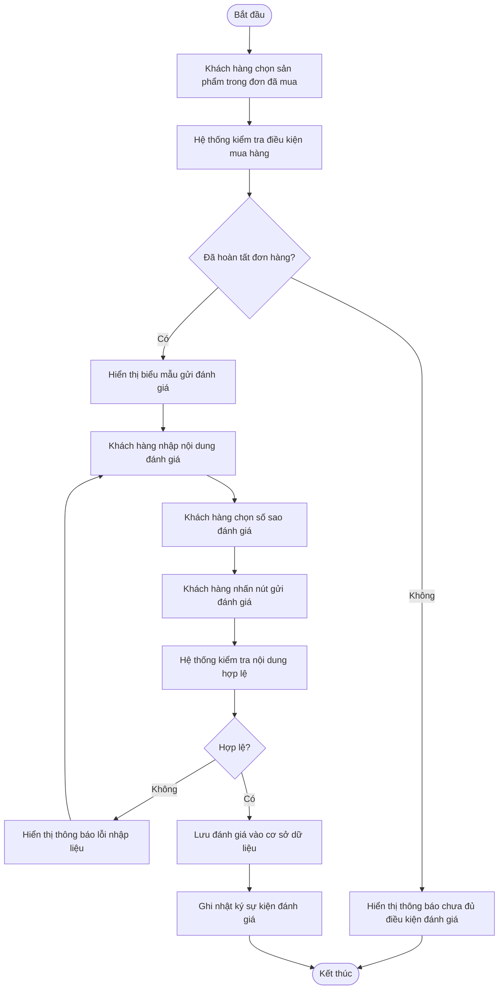

### 1.4.8 UC8: Sơ đồ hoạt động Quản lý danh sách yêu thích (Manage Wishlist)

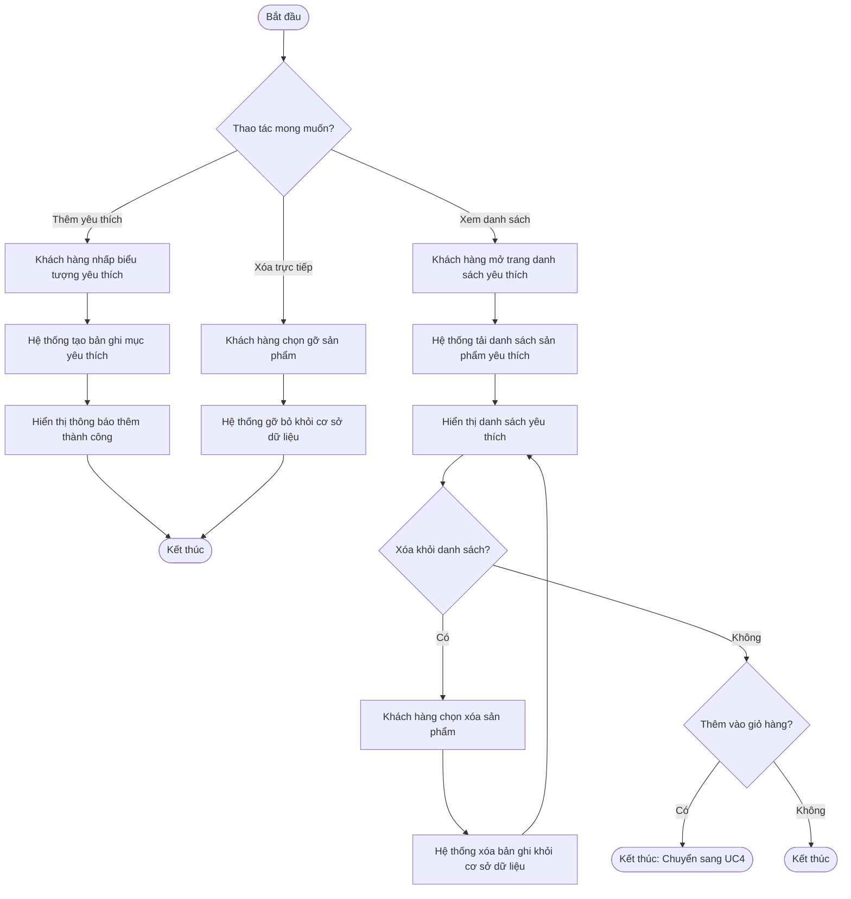

### 1.4.9 UC9: Sơ đồ hoạt động Quản lý sản phẩm (Manage Products - Admin)

```mermaid
flowchart TD
    Start([Bắt đầu]) --> A[Quản trị viên mở trang quản lý sản phẩm]
    A --> B[Hiển thị bảng danh sách sản phẩm]
    B --> C{Thao tác quản trị?}
    
    C -->|Thêm mới| D[Quản trị viên nhấp nút thêm sản phẩm]
    D --> E[Hiển thị biểu mẫu thêm sản phẩm]
    E --> F[Quản trị viên nhập thông tin sản phẩm và biến thể]
    F --> G[Quản trị viên tải lên hình ảnh]
    G --> H[Quản trị viên nhấn lưu sản phẩm]
    H --> I{Dữ liệu hợp lệ?}
    I -->|Không| J[Hiển thị thông báo lỗi nhập liệu]
    J --> F
    I -->|Có| K[Tạo bản ghi sản phẩm trong cơ sở dữ liệu]
    K --> L[Ghi nhật ký thao tác quản trị]
    L --> B
    
    C -->|Chỉnh sửa| M[Quản trị viên chọn sản phẩm cần sửa]
    M --> N[Tải thông tin chi tiết sản phẩm]
    N --> O[Hiển thị biểu mẫu chỉnh sửa]
    O --> P[Quản trị viên cập nhật thông tin]
    P --> Q[Quản trị viên nhấn lưu thay đổi]
    Q --> I
    
    C -->|Lưu trữ / Ẩn| R[Quản trị viên chọn sản phẩm cần ẩn]
    R --> S[Xác nhận thao tác lưu trữ]
    S --> T[Đánh dấu sản phẩm đã lưu trữ (is_active = false)]
    T --> L
```

### 1.4.10 UC10: Sơ đồ hoạt động Quản lý danh mục (Manage Categories - Admin)

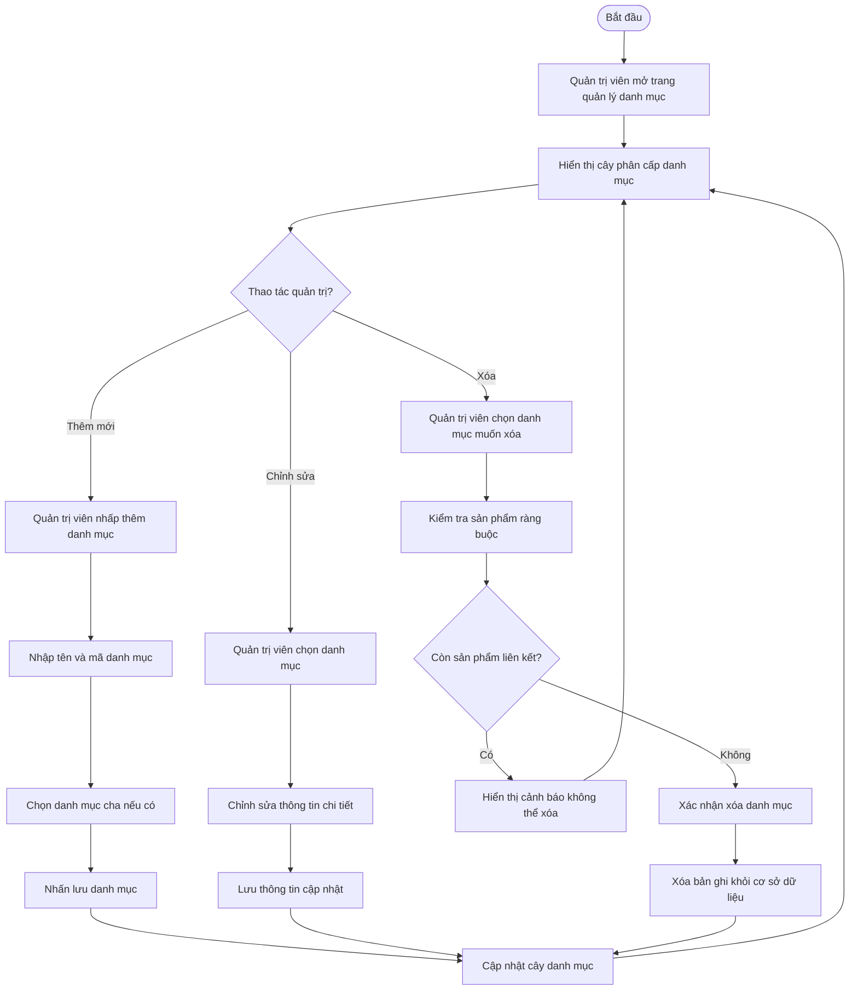

### 1.4.11 UC11: Sơ đồ hoạt động Quản lý tồn kho (Manage Inventory - Admin)

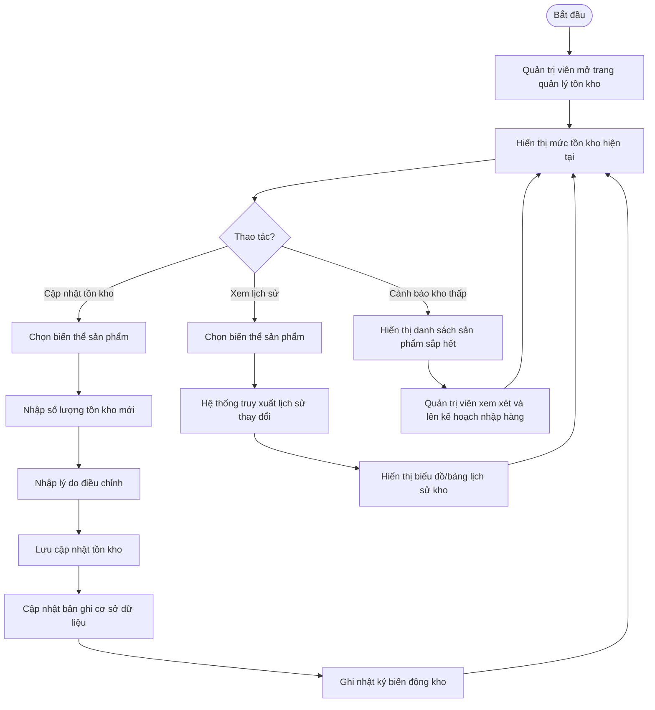

### 1.4.12 UC12: Sơ đồ hoạt động Quản lý mã giảm giá (Manage Coupons - Admin)

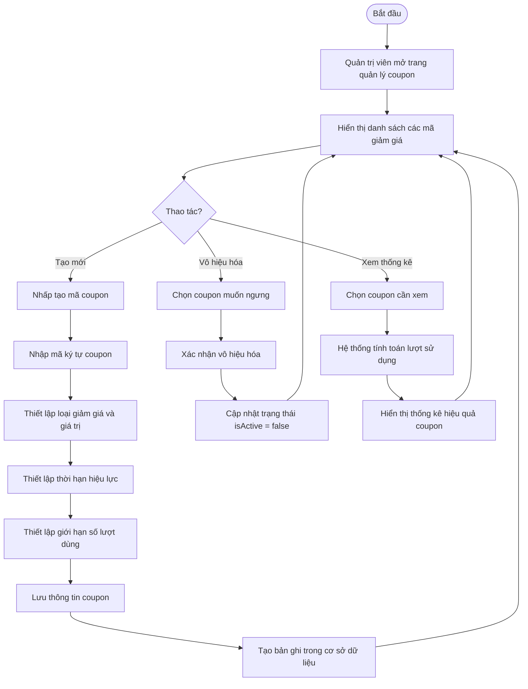

### 1.4.13 UC13: Sơ đồ hoạt động Quản lý đơn hàng (Manage Orders - Admin)

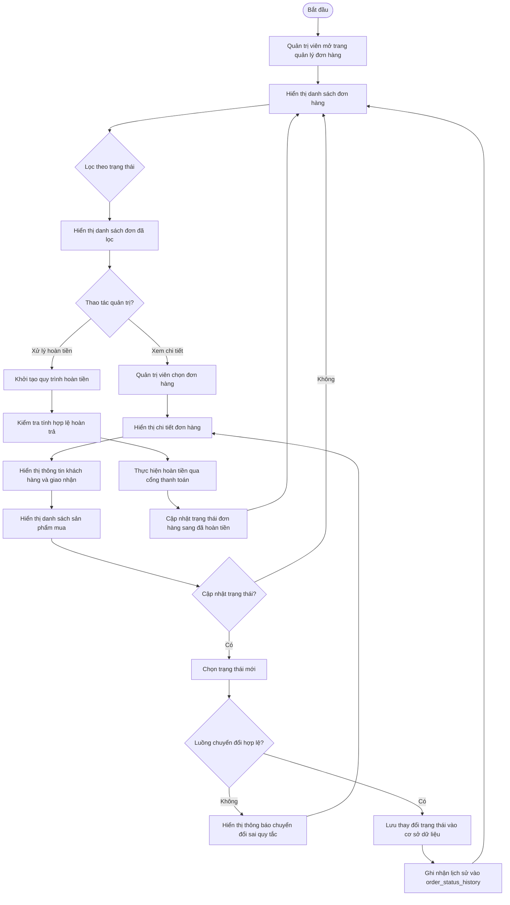

### 1.4.14 UC14: Sơ đồ hoạt động Xem bảng điều khiển (View Dashboard - Admin)

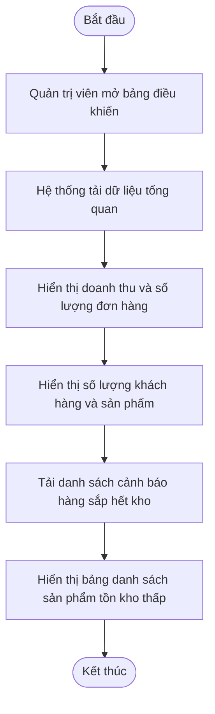

### 1.4.15 UC15: Sơ đồ hoạt động Chọn thành phố / địa điểm (Select City/Location)

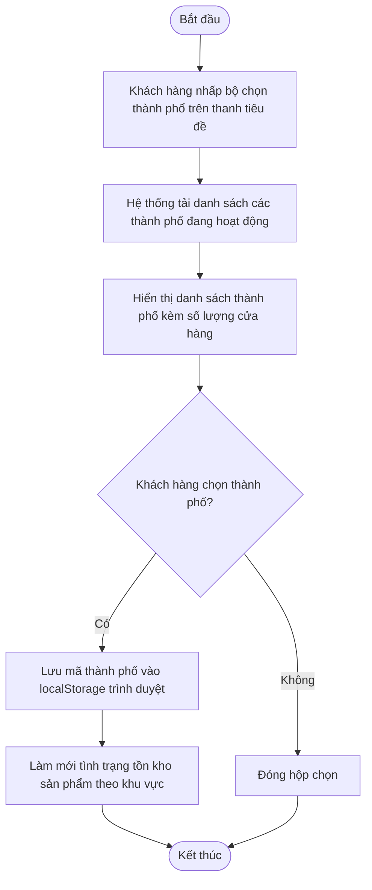

### 1.4.16 UC16: Sơ đồ hoạt động Kiểm tra tồn kho cửa hàng (Check Store Availability)

```mermaid
flowchart TD
    Start([Bắt đầu]) --> A[Hệ thống tải trang chi tiết sản phẩm]
    A --> B[Lấy thông tin thành phố đã chọn từ bộ nhớ/Context]
    B --> C{Đã chọn thành phố?}
    C -->|Không| D[Ẩn hộp tra cứu tồn kho cửa hàng]
    D --> End([Kết thúc])
    C -->|Có| E[Gọi API tra cứu tồn kho theo mã thành phố]
    E --> F{Dữ liệu đã sẵn sàng?}
    F -->|Không| G[Hiển thị hiệu ứng tải dữ liệu (loading skeleton)]
    G --> E
    F -->|Có| H[Hiển thị tổng số tồn kho toàn thành phố]
    H --> I[Liệt kê danh sách từng cửa hàng chi nhánh]
    I --> J[Hiển thị trạng thái còn hàng/hết hàng kèm số lượng cụ thể]
    J --> End
```

### 1.4.17 UC17: Sơ đồ hoạt động Quản lý tồn kho chi nhánh (Manage Branch Inventory - Staff)

```mermaid
flowchart TD
    Start([Bắt đầu]) --> A[Nhân viên truy cập trang tồn kho chi nhánh]
    A --> B[Hệ thống kiểm tra vai trò người dùng]
    B --> C{Vai trò hợp lệ?}
    C -->|Không| D[Hiển thị thông báo từ chối truy cập 403]
    D --> End([Kết thúc])
    C -->|Có| E[Lọc danh sách cửa hàng theo phạm vi thẩm quyền]
    E --> F[Hiển thị danh sách tồn kho cửa hàng]
    F --> G{Thao tác?}
    
    G -->|Xem chi tiết| H[Hiển thị chi tiết số lượng từng biến thể]
    H --> F
    
    G -->|Cập nhật| I[Nhân viên chọn biến thể sản phẩm]
    I --> J[Nhân viên nhập số lượng tồn kho thực tế mới]
    J --> K[Hệ thống xác minh quyền hạn trên cửa hàng mục tiêu]
    K --> L{Có quyền chỉnh sửa?}
    L -->|Không| M[Hiển thị thông báo không có quyền can thiệp]
    M --> F
    L -->|Có| N[Cập nhật bảng store_inventory trong cơ sở dữ liệu]
    N --> O[Tăng số hiệu phiên bản version (Khóa lạc quan)]
    O --> P[Hiển thị thông báo cập nhật thành công]
    P --> F
```

### 1.4.18 UC18: Sơ đồ hoạt động Giao dịch bán hàng tại quầy POS (POS Transaction - Staff)

```mermaid
flowchart TD
    Start([Bắt đầu]) --> A[Nhân viên mở trang bán hàng POS]
    A --> B[Hệ thống kiểm tra vai trò nhân viên và cửa hàng gán]
    B --> C{Vai trò hợp lệ?}
    C -->|Không| D[Hiển thị lỗi không có quyền truy cập]
    D --> End([Kết thúc])
    C -->|Có| E[Hiển thị giao diện quầy thu ngân và ô tìm kiếm]
    E --> F[Nhân viên nhập từ khóa hoặc quét mã SKU sản phẩm]
    F --> G[Hệ thống tìm kiếm theo tên hoặc tiền tố SKU]
    G --> H{Tìm thấy kết quả?}
    H -->|Không| I[Hiển thị thông báo không tìm thấy sản phẩm]
    I --> F
    H -->|Có| J[Hiển thị kết quả kèm số lượng tồn tại cửa hàng]
    J --> K{Nhân viên chọn sản phẩm?}
    K -->|Không| F
    K -->|Có| L[Nhập số lượng khách mua]
    L --> M[Hệ thống kiểm tra tồn kho tại cửa hàng]
    M --> N{Đủ số lượng?}
    N -->|Không| O[Hiển thị cảnh báo số lượng tồn kho không đủ]
    O --> J
    N -->|Có| P[Thêm sản phẩm vào danh sách đơn POS]
    P --> Q{Thêm sản phẩm khác?}
    Q -->|Có| F
    Q -->|Không| R[Hiển thị tổng tiền và danh sách sản phẩm]
    R --> S[Nhân viên nhấn xác nhận thanh toán]
    S --> T[Hệ thống kiểm tra lại tồn kho toàn bộ giỏ hàng]
    T --> U{Tất cả mặt hàng sẵn sàng?}
    U -->|Không| V[Báo lỗi mặt hàng đã hết]
    V --> R
    U -->|Có| W[Tạo bản ghi đơn hàng channel=pos, status=completed]
    W --> X[Tạo bản ghi thanh toán status=succeeded]
    X --> Y[Trừ số lượng trong store_inventory]
    Y --> Z[Trừ số lượng trong inventory tổng]
    Z --> AA[Hiển thị thông báo thành công kèm mã đơn hàng]
    AA --> End([Kết thúc: Hoàn tất đơn POS])
```

---

## 1.5 Sơ đồ tuần tự hệ thống (System Sequence Diagrams)

### 1.5.1 UC1: Sơ đồ tuần tự Duyệt sản phẩm (Browse Products Sequence)

```mermaid
sequenceDiagram
    autonumber
    participant C as Khách hàng (Customer)
    participant FE as Giao diện Storefront (Next.js)
    participant API as Máy chủ API (FastAPI)
    participant DB as Cơ sở dữ liệu MySQL
    
    C->>FE: Nhấp chọn danh mục
    FE->>API: GET /categories/[id]/products
    API->>DB: SELECT products WHERE category_id = ?
    DB-->>API: products[]
    API-->>FE: ProductListResponse
    FE-->>C: Hiển thị lưới sản phẩm
    
    C->>FE: Áp dụng bộ lọc (khoảng giá, màu sắc)
    FE->>API: GET /products?category=X&min_price=Y&max_price=Z
    API->>DB: SELECT products WITH filters
    DB-->>API: filteredProducts[]
    API-->>FE: FilteredProductList
    FE-->>C: Cập nhật lưới sản phẩm đã lọc
```

### 1.5.2 UC2: Sơ đồ tuần tự Tìm kiếm sản phẩm (Search Products Sequence)

```mermaid
sequenceDiagram
    autonumber
    participant C as Khách hàng (Customer)
    participant FE as Giao diện Storefront (Next.js)
    participant API as Máy chủ API (FastAPI)
    participant DB as Cơ sở dữ liệu MySQL
    
    C->>FE: Nhập từ khóa tìm kiếm
    FE->>API: GET /products/search?q=keyword
    API->>DB: SELECT MATCHES against keyword
    DB-->>API: searchResults[]
    API->>API: Xếp hạng kết quả theo độ liên quan
    API-->>FE: SearchResultsResponse
    FE-->>C: Hiển thị kết quả tìm kiếm
    
    Note over C,DB: Ghi nhật ký sự kiện tìm kiếm
    API->>API: Ghi log vào luồng sự kiện truy cập
```

### 1.5.3 UC3: Sơ đồ tuần tự Xem chi tiết sản phẩm (View Product Details Sequence)

```mermaid
sequenceDiagram
    autonumber
    participant C as Khách hàng (Customer)
    participant FE as Giao diện Storefront (Next.js)
    participant API as Máy chủ API (FastAPI)
    participant DB as Cơ sở dữ liệu MySQL
    
    C->>FE: Nhấp chọn sản phẩm
    FE->>API: GET /products/[id]
    API->>DB: SELECT product WITH variants
    DB-->>API: productDetails
    API->>DB: SELECT reviews WHERE product_id = ?
    DB-->>API: reviews[]
    API->>DB: SELECT related products
    DB-->>API: relatedProducts[]
    API-->>FE: ProductDetailResponse
    FE-->>C: Hiển thị trang chi tiết sản phẩm
    
    Note over C,DB: Ghi nhật ký xem sản phẩm
    API->>API: Ghi log vào luồng sự kiện truy cập
```

### 1.5.4 UC4: Sơ đồ tuần tự Quản lý giỏ hàng (Manage Cart Sequence)

```mermaid
sequenceDiagram
    autonumber
    participant C as Khách hàng (Customer)
    participant FE as Giao diện Storefront (Next.js)
    participant API as Máy chủ API (FastAPI)
    participant DB as Cơ sở dữ liệu MySQL
    
    C->>FE: Thêm sản phẩm vào giỏ
    FE->>API: POST /cart/items
    API->>DB: SELECT inventory WHERE variant_id = ?
    DB-->>API: stockLevel
    
    alt Còn hàng trong kho
        API->>DB: INSERT cart_item
        API->>DB: UPDATE cart total
        DB-->>API: Thành công
        API-->>FE: CartItemAdded
        FE-->>C: Hiển thị thông báo thêm thành công
    else Hết hàng
        API-->>FE: OutOfStockError
        FE-->>C: Hiển thị cảnh báo hết hàng
    end
```

### 1.5.5 UC5: Sơ đồ tuần tự Thanh toán (Checkout Sequence)

```mermaid
sequenceDiagram
    autonumber
    participant C as Khách hàng (Customer)
    participant FE as Giao diện Storefront (Next.js)
    participant API as Máy chủ API (FastAPI)
    participant DB as Cơ sở dữ liệu MySQL
    
    C->>FE: Tiến hành thanh toán
    FE->>API: GET /cart/[cartId]
    API->>DB: SELECT cart_items JOIN products
    DB-->>API: cartItems[]
    API-->>FE: CartResponse
    FE-->>C: Hiển thị tóm tắt giỏ hàng
    
    C->>FE: Nhập địa chỉ chi tiết (tỉnh/thành, phường/xã, địa chỉ cụ thể)
    C->>FE: Nhấn xác nhận đặt hàng
    FE->>API: POST /orders/checkout
    Note over API,DB: Bắt đầu giao dịch (Begin Transaction)
    API->>DB: INSERT orders (lưu địa chỉ và thông tin người nhận)
    API->>DB: INSERT order_items (lưu snapshot thông tin sản phẩm)
    API->>DB: INSERT payments (status=succeeded)
    API->>DB: UPDATE inventory (trừ tồn kho)
    API->>DB: UPDATE carts SET status=checked_out
    DB-->>API: Giao dịch xác nhận thành công (Transaction committed)
    
    API->>API: Ghi log giao dịch vào luồng sự kiện truy cập
    API-->>FE: OrderConfirmation
    FE-->>C: Hiển thị màn hình đặt hàng thành công
```

### 1.5.6 UC6: Sơ đồ tuần tự Theo dõi đơn hàng (Track Orders Sequence)

```mermaid
sequenceDiagram
    autonumber
    participant C as Khách hàng (Customer)
    participant FE as Giao diện Storefront (Next.js)
    participant API as Máy chủ API (FastAPI)
    participant DB as Cơ sở dữ liệu MySQL
    
    C->>FE: Truy cập lịch sử đơn hàng
    FE->>API: GET /orders
    API->>DB: SELECT orders WHERE customer_id = ?
    DB-->>API: orders[]
    API-->>FE: OrderListResponse
    FE-->>C: Hiển thị danh sách đơn hàng
    
    C->>FE: Chọn đơn hàng cụ thể
    FE->>API: GET /orders/[id]
    API->>DB: SELECT order WITH items
    DB-->>API: orderDetails
    API->>DB: SELECT status_history
    DB-->>API: statusHistory[]
    API-->>FE: OrderDetailResponse
    FE-->>C: Hiển thị chi tiết và tiến trình xử lý đơn hàng
```

### 1.5.7 UC7: Sơ đồ tuần tự Viết đánh giá (Write Reviews Sequence)

```mermaid
sequenceDiagram
    autonumber
    participant C as Khách hàng (Customer)
    participant FE as Giao diện Storefront (Next.js)
    participant API as Máy chủ API (FastAPI)
    participant DB as Cơ sở dữ liệu MySQL
    
    C->>FE: Chọn sản phẩm cần đánh giá
    FE->>API: GET /orders/[orderId]/items/[itemId]/review eligibility
    API->>DB: SELECT order WHERE customer_id = ? AND status = 'completed'
    DB-->>API: orderExists
    
    alt Đủ điều kiện đánh giá
        API-->>FE: EligibleResponse
        FE-->>C: Hiển thị biểu mẫu nhập đánh giá
        C->>FE: Gửi nhận xét và số sao
        FE->>API: POST /reviews
        API->>DB: INSERT product_review
        DB-->>API: reviewId
        API-->>FE: ReviewCreated
        FE-->>C: Hiển thị thông báo gửi đánh giá thành công
    else Chưa đủ điều kiện
        API-->>FE: NotEligibleError
        FE-->>C: Hiển thị thông báo chưa thể đánh giá sản phẩm này
    end
```

### 1.5.8 UC8: Sơ đồ tuần tự Quản lý danh sách yêu thích (Manage Wishlist Sequence)

```mermaid
sequenceDiagram
    autonumber
    participant C as Khách hàng (Customer)
    participant FE as Giao diện Storefront (Next.js)
    participant API as Máy chủ API (FastAPI)
    participant DB as Cơ sở dữ liệu MySQL
    
    C->>FE: Thêm sản phẩm vào yêu thích
    FE->>API: POST /wishlist
    API->>DB: INSERT wishlist_item
    DB-->>API: Thành công
    API-->>FE: WishlistItemAdded
    FE-->>C: Hiển thị thông báo đã lưu vào danh sách yêu thích
    
    C->>FE: Xem danh sách yêu thích
    FE->>API: GET /wishlist
    API->>DB: SELECT wishlist_items WITH products
    DB-->>API: wishlistItems[]
    API-->>FE: WishlistResponse
    FE-->>C: Hiển thị danh sách yêu thích
    
    C->>FE: Gỡ bỏ khỏi danh sách yêu thích
    FE->>API: DELETE /wishlist/[itemId]
    API->>DB: DELETE wishlist_item
    DB-->>API: Thành công
    API-->>FE: WishlistItemRemoved
    FE-->>C: Cập nhật lại giao diện danh sách
```

### 1.5.9 UC9: Sơ đồ tuần tự Quản lý sản phẩm (Manage Products Sequence - Admin)

```mermaid
sequenceDiagram
    autonumber
    participant A as Quản trị viên (Admin)
    participant FE as Giao diện Admin (Next.js)
    participant API as Máy chủ API (FastAPI)
    participant DB as Cơ sở dữ liệu MySQL
    
    A->>FE: Truy cập danh sách sản phẩm
    FE->>API: GET /admin/products
    API->>DB: SELECT products
    DB-->>API: products[]
    API-->>FE: ProductListResponse
    FE-->>A: Hiển thị bảng sản phẩm
    
    A->>FE: Nhấp tạo mới sản phẩm
    FE-->>A: Hiển thị biểu mẫu nhập liệu
    
    A->>FE: Gửi thông tin sản phẩm mới
    FE->>API: POST /admin/products
    API->>DB: INSERT product
    DB-->>API: productId
    API-->>FE: ProductCreated
    FE-->>A: Hiển thị thông báo thêm thành công
```

### 1.5.10 UC10: Sơ đồ tuần tự Quản lý danh mục (Manage Categories Sequence - Admin)

```mermaid
sequenceDiagram
    autonumber
    participant A as Quản trị viên (Admin)
    participant FE as Giao diện Admin (Next.js)
    participant API as Máy chủ API (FastAPI)
    participant DB as Cơ sở dữ liệu MySQL
    
    A->>FE: Truy cập quản lý danh mục
    FE->>API: GET /admin/categories
    API->>DB: SELECT categories
    DB-->>API: categories[]
    API-->>FE: CategoryTreeResponse
    FE-->>A: Hiển thị cây danh mục
    
    A->>FE: Thêm danh mục mới
    FE->>API: POST /admin/categories
    API->>DB: INSERT category
    DB-->>API: categoryId
    API-->>FE: CategoryCreated
    FE-->>A: Cập nhật cây danh mục trên giao diện
```

### 1.5.11 UC11: Sơ đồ tuần tự Quản lý tồn kho (Manage Inventory Sequence - Admin)

```mermaid
sequenceDiagram
    autonumber
    participant A as Quản trị viên (Admin)
    participant FE as Giao diện Admin (Next.js)
    participant API as Máy chủ API (FastAPI)
    participant DB as Cơ sở dữ liệu MySQL
    
    A->>FE: Truy cập trang tồn kho
    FE->>API: GET /admin/inventory
    API->>DB: SELECT inventory WITH variants
    DB-->>API: inventoryLevels[]
    API-->>FE: InventoryResponse
    FE-->>A: Hiển thị danh sách tồn kho
    
    A->>FE: Cập nhật số lượng tồn
    FE->>API: PUT /admin/inventory/[variantId]
    API->>DB: UPDATE inventory SET quantity = ?
    API->>DB: INSERT inventory_history
    DB-->>API: Thành công
    API-->>FE: InventoryUpdated
    FE-->>A: Hiển thị số lượng tồn kho mới
```

### 1.5.12 UC12: Sơ đồ tuần tự Quản lý mã giảm giá (Manage Coupons Sequence - Admin)

```mermaid
sequenceDiagram
    autonumber
    participant A as Quản trị viên (Admin)
    participant FE as Giao diện Admin (Next.js)
    participant API as Máy chủ API (FastAPI)
    participant DB as Cơ sở dữ liệu MySQL
    
    A->>FE: Truy cập trang mã giảm giá
    FE->>API: GET /admin/coupons
    API->>DB: SELECT coupons
    DB-->>API: coupons[]
    API-->>FE: CouponListResponse
    FE-->>A: Hiển thị danh sách coupon
    
    A->>FE: Tạo mã coupon mới
    FE->>API: POST /admin/coupons
    API->>DB: INSERT coupon
    DB-->>API: couponId
    API-->>FE: CouponCreated
    FE-->>A: Hiển thị thông báo tạo thành công
```

### 1.5.13 UC13: Sơ đồ tuần tự Quản lý đơn hàng (Manage Orders Sequence - Admin)

```mermaid
sequenceDiagram
    autonumber
    participant A as Quản trị viên (Admin)
    participant FE as Giao diện Admin (Next.js)
    participant API as Máy chủ API (FastAPI)
    participant DB as Cơ sở dữ liệu MySQL
    
    A->>FE: Mở trang danh sách đơn hàng
    FE->>API: GET /admin/orders
    API->>DB: SELECT orders
    DB-->>API: orders[]
    API-->>FE: OrderListResponse
    FE-->>A: Hiển thị danh sách đơn hàng
    
    A->>FE: Cập nhật trạng thái đơn
    FE->>API: PUT /admin/orders/[orderId]/status
    API->>DB: UPDATE orders SET status = ?
    API->>DB: INSERT order_status_history
    DB-->>API: Thành công
    API-->>FE: OrderStatusUpdated
    FE-->>A: Hiển thị trạng thái đơn hàng đã đổi
```

### 1.5.14 UC14: Sơ đồ tuần tự Xem bảng điều khiển (View Dashboard Sequence - Admin)

```mermaid
sequenceDiagram
    autonumber
    participant A as Quản trị viên (Admin)
    participant FE as Giao diện Admin (Next.js)
    participant API as Máy chủ API (FastAPI)
    participant DB as Cơ sở dữ liệu MySQL
    
    A->>FE: Mở trang Dashboard
    FE->>API: GET /admin/dashboard/overview
    API->>DB: SELECT doanh thu/đơn hàng/khách hàng/sản phẩm
    DB-->>API: overviewData
    API-->>FE: OverviewResponse
    FE-->>A: Hiển thị bảng điều khiển chỉ số kinh doanh
    
    FE->>API: GET /admin/dashboard/low-stock
    API->>DB: SELECT products WHERE on_hand <= 5
    DB-->>API: lowStockProducts[]
    API-->>FE: LowStockResponse
    FE-->>A: Hiển thị cảnh báo các sản phẩm sắp hết hàng
```

### 1.5.15 UC18: Sơ đồ tuần tự Bán hàng tại quầy POS (POS Transaction Sequence - Staff)

```mermaid
sequenceDiagram
    autonumber
    participant S as Nhân viên (Staff)
    participant FE as Giao diện Admin POS (Next.js)
    participant API as Máy chủ API (FastAPI)
    participant DB as Cơ sở dữ liệu MySQL
    
    S->>FE: Mở trang bán hàng POS
    FE->>API: GET /auth/me
    API-->>FE: staffId, storeId
    
    S->>FE: Nhập từ khóa tìm sản phẩm
    FE->>API: GET /pos/products?q=[keyword]&store_id=[storeId]
    API->>DB: SELECT products WHERE (sku LIKE 'keyword%' OR name LIKE 'keyword%')
    API->>DB: JOIN store_inventory WHERE store_id = ?
    DB-->>API: productsWithStock[]
    API-->>FE: ProductSearchResponse (tối đa 8 sản phẩm)
    FE-->>S: Hiển thị danh sách sản phẩm kèm tồn kho chi nhánh
    
    S->>FE: Chọn sản phẩm và nhập số lượng
    S->>FE: Nhấn thêm vào đơn POS
    FE-->>S: Hiển thị mục trong giỏ hàng POS
    
    S->>FE: Xác nhận giao dịch
    FE->>API: POST /pos/transactions
    Note over API,DB: Bắt đầu giao dịch (Begin Transaction)
    API->>DB: INSERT orders (channel=pos, status=completed, staff_id, store_id)
    API->>DB: INSERT order_items
    API->>DB: INSERT payments (status=succeeded)
    API->>DB: UPDATE store_inventory SET on_hand = on_hand - qty
    API->>DB: UPDATE inventory SET on_hand = on_hand - qty
    DB-->>API: Giao dịch hoàn tất thành công (Transaction committed)
    
    API-->>FE: OrderCreatedResponse
    FE-->>S: Hiển thị hóa đơn và mã đơn hàng vừa hoàn tất
```

### 1.5.16 UC15: Sơ đồ tuần tự Chọn thành phố / địa điểm (Select City/Location Sequence)

```mermaid
sequenceDiagram
    autonumber
    participant C as Khách hàng (Customer)
    participant FE as Giao diện Storefront (Next.js)
    participant API as Máy chủ API (FastAPI)
    participant DB as Cơ sở dữ liệu MySQL
    
    C->>FE: Nhấp chọn bộ chọn thành phố
    FE->>API: GET /api/v1/locations/cities
    API->>DB: SELECT cities WHERE is_active = true
    DB-->>API: cities[]
    API-->>FE: CityResponse[]
    FE-->>C: Hiển thị danh sách thành phố kèm số lượng cửa hàng
    
    C->>FE: Chọn một thành phố
    FE->>FE: Lưu vào localStorage (dk_selected_city_code)
    FE->>FE: Cập nhật LocationContext
    FE-->>C: Thành phố đã được chọn, làm mới tình trạng tồn kho
```

### 1.5.17 UC16: Sơ đồ tuần tự Kiểm tra tồn kho cửa hàng (Check Store Availability Sequence)

```mermaid
sequenceDiagram
    autonumber
    participant C as Khách hàng (Customer)
    participant FE as Giao diện Storefront (Next.js)
    participant API as Máy chủ API (FastAPI)
    participant DB as Cơ sở dữ liệu MySQL
    
    C->>FE: Xem trang chi tiết sản phẩm
    FE->>FE: Lấy selectedCity từ LocationContext
    
    alt Đã chọn thành phố
        FE->>API: GET /api/v1/catalog/products/[slug]/availability?city_code=[code]
        API->>DB: SELECT cities WHERE code = ?
        DB-->>API: city
        API->>DB: SELECT stores WHERE city_id = ?
        DB-->>API: stores[]
        API->>DB: SELECT store_inventory JOIN variants
        DB-->>API: inventory[]
        API-->>FE: ProductAvailabilityResponse
        FE-->>C: Hiển thị hộp StoreAvailabilityBox với số lượng từng cửa hàng
    else Chưa chọn thành phố
        FE-->>C: Ẩn hộp tra cứu tồn kho cửa hàng
    end
```

### 1.5.18 UC17: Sơ đồ tuần tự Quản lý tồn kho chi nhánh (Manage Branch Inventory Sequence - Staff)

```mermaid
sequenceDiagram
    autonumber
    participant S as Nhân viên (Admin/Manager/Planner)
    participant FE as Giao diện Admin (Next.js)
    participant API as Máy chủ API (FastAPI)
    participant DB as Cơ sở dữ liệu MySQL
    
    S->>FE: Mở trang tồn kho chi nhánh
    FE->>API: GET /api/v1/admin/branch-inventory
    API->>DB: SELECT store_inventory JOIN stores JOIN variants
    DB-->>API: inventory[]
    API-->>FE: BranchInventoryItem[]
    FE-->>S: Hiển thị danh sách tồn kho theo cửa hàng
    
    S->>FE: Cập nhật số lượng tồn kho
    FE->>API: PATCH /api/v1/admin/branch-inventory
    API->>API: check_store_inventory_permission(actor, store_id)
    
    alt Hợp lệ về quyền hạn
        API->>DB: UPDATE store_inventory SET on_hand = ?, version = version + 1
        DB-->>API: Thành công
        API-->>FE: 204 No Content
        FE-->>S: Cập nhật số lượng thành công
    else Không có quyền (Forbidden)
        API-->>FE: 403 Forbidden
        FE-->>S: Hiển thị thông báo không có quyền chỉnh sửa
    end
```

---

## 1.6 Sơ đồ lớp (Class Diagrams)

### 1.6.1 Toàn bộ thực thể OLTP (Complete OLTP Entities)

```mermaid
classDiagram
    class Customer {
        <<implemented>>
        +customer_id: BIGINT UNSIGNED PK
        +public_id: BINARY(16) UNIQUE
        +email: VARCHAR(254) UNIQUE
        +display_name: VARCHAR(100)
        +password_hash: VARCHAR(255)
        +role: ENUM (customer|admin|store_manager)
        +status: ENUM (active|disabled)
        +city_id: BIGINT UNSIGNED?
        +store_id: BIGINT UNSIGNED?
        +data_origin: ENUM (manual|synthetic)
        +generation_run_id: VARCHAR(50)?
        +anonymized_at: DATETIME?
        +created_at: DATETIME
        +updated_at: DATETIME
    }
    
    class Category {
        <<implemented>>
        +category_id: BIGINT UNSIGNED PK
        +public_id: BINARY(16) UNIQUE
        +code: VARCHAR(50) UNIQUE
        +name: VARCHAR(100)
        +parent_category_id: BIGINT UNSIGNED?
        +is_active: BOOLEAN
        +created_at: DATETIME
        +updated_at: DATETIME
    }
    
    class Product {
        <<implemented>>
        +product_id: BIGINT UNSIGNED PK
        +public_id: BINARY(16) UNIQUE
        +name: VARCHAR(255)
        +slug: VARCHAR(255) UNIQUE
        +description: TEXT?
        +image_url: VARCHAR(500)?
        +category_id: BIGINT UNSIGNED FK
        +is_active: BOOLEAN
        +archived_at: DATETIME?
        +created_at: DATETIME
        +updated_at: DATETIME
    }
    
    class ProductVariant {
        <<implemented>>
        +variant_id: BIGINT UNSIGNED PK
        +public_id: BINARY(16) UNIQUE
        +product_id: BIGINT UNSIGNED FK
        +sku: VARCHAR(50) UNIQUE
        +size_code: VARCHAR(10)
        +color_code: VARCHAR(20)
        +price_vnd: BIGINT UNSIGNED
        +is_active: BOOLEAN
        +created_at: DATETIME
        +updated_at: DATETIME
    }
    
    class Cart {
        <<implemented>>
        +cart_id: BIGINT UNSIGNED PK
        +public_id: BINARY(16) UNIQUE
        +customer_id: BIGINT UNSIGNED FK
        +status: ENUM
        +active_customer_guard: VARCHAR(100)?
        +checked_out_at: DATETIME?
        +created_at: DATETIME
        +updated_at: DATETIME
    }
    
    class CartItem {
        <<implemented>>
        +cart_item_id: BIGINT UNSIGNED PK
        +cart_id: BIGINT UNSIGNED FK
        +variant_id: BIGINT UNSIGNED FK
        +quantity: INT UNSIGNED
        +is_present: BOOLEAN
        +first_added_at: DATETIME
        +removed_at: DATETIME?
        +updated_at: DATETIME
    }
    
    class Order {
        <<implemented>>
        +order_id: BIGINT UNSIGNED PK
        +order_number: VARCHAR(32) UNIQUE
        +cart_id: BIGINT UNSIGNED?
        +customer_id: BIGINT UNSIGNED FK
        +checkout_idempotency_key: VARCHAR(100)?
        +coupon_id: BIGINT UNSIGNED?
        +status: ENUM
        +currency_code: VARCHAR(3)
        +subtotal_vnd: BIGINT UNSIGNED
        +coupon_code_snapshot: VARCHAR(50)?
        +coupon_type_snapshot: VARCHAR(20)?
        +coupon_value_snapshot: BIGINT UNSIGNED?
        +discount_amount_vnd: BIGINT UNSIGNED
        +shipping_fee_vnd: BIGINT UNSIGNED
        +total_vnd: BIGINT UNSIGNED
        +receiver_name: VARCHAR(200)
        +receiver_phone: VARCHAR(20)
        +shipping_address_text: TEXT
        +channel: ENUM (online|pos)
        +store_id: BIGINT UNSIGNED?
        +staff_id: BIGINT UNSIGNED?
        +paid_at: DATETIME?
        +confirmed_at: DATETIME?
        +completed_at: DATETIME?
        +cancelled_at: DATETIME?
        +created_at: DATETIME
        +updated_at: DATETIME
    }
    
    class OrderItem {
        <<implemented>>
        +order_item_id: BIGINT UNSIGNED PK
        +public_id: BINARY(16) UNIQUE
        +order_id: BIGINT UNSIGNED FK
        +variant_id: BIGINT UNSIGNED FK
        +product_public_id_snapshot: BINARY(16)
        +category_code_snapshot: VARCHAR(50)?
        +category_name_snapshot: VARCHAR(100)?
        +product_name_snapshot: VARCHAR(255)
        +sku_snapshot: VARCHAR(50)
        +size_code_snapshot: VARCHAR(10)
        +color_code_snapshot: VARCHAR(20)
        +unit_price_vnd: BIGINT UNSIGNED
        +quantity: INT UNSIGNED
        +line_total_vnd: BIGINT UNSIGNED
        +created_at: DATETIME
    }
    
    class OrderStatusHistory {
        <<implemented>>
        +order_status_history_id: BIGINT UNSIGNED PK
        +order_id: BIGINT UNSIGNED FK
        +from_status: ENUM?
        +to_status: ENUM
        +transition_source: ENUM
        +reason: VARCHAR(500)?
        +transition_idempotency_key: VARCHAR(100)?
        +transitioned_at: DATETIME
        +created_at: DATETIME
    }
    
    class Payment {
        <<implemented>>
        +payment_id: BIGINT UNSIGNED PK
        +payment_reference: VARCHAR(64) UNIQUE
        +order_id: BIGINT UNSIGNED FK
        +payment_idempotency_key: VARCHAR(100)?
        +status: ENUM (pending|succeeded|failed|refunded)
        +currency_code: VARCHAR(3)
        +amount_vnd: BIGINT UNSIGNED
        +failure_code: VARCHAR(50)?
        +attempted_at: DATETIME
        +created_at: DATETIME
    }
    
    class Coupon {
        <<implemented>>
        +coupon_id: BIGINT UNSIGNED PK
        +public_id: BINARY(16) UNIQUE
        +code_normalized: VARCHAR(50) UNIQUE
        +discount_type: ENUM (percentage|fixed_amount)
        +discount_value: BIGINT UNSIGNED
        +minimum_subtotal_vnd: BIGINT UNSIGNED
        +starts_at: DATETIME
        +ends_at: DATETIME
        +is_active: BOOLEAN
        +total_usage_limit: INT UNSIGNED?
        +per_customer_usage_limit: INT UNSIGNED?
        +used_count: INT UNSIGNED
        +archived_at: DATETIME?
        +archived_by_customer_id: BIGINT UNSIGNED?
        +archive_reason: VARCHAR(500)?
        +created_at: DATETIME
        +updated_at: DATETIME
    }
    
    class CouponRedemption {
        <<implemented>>
        +coupon_redemption_id: BIGINT UNSIGNED PK
        +coupon_id: BIGINT UNSIGNED FK
        +order_id: BIGINT UNSIGNED FK
        +customer_id: BIGINT UNSIGNED FK
        +status: ENUM
        +redeemed_at: DATETIME
        +released_at: DATETIME?
        +created_at: DATETIME
        +updated_at: DATETIME
    }
    
    class ProductReview {
        <<implemented>>
        +review_id: BIGINT UNSIGNED PK
        +public_id: BINARY(16) UNIQUE
        +order_item_id: BIGINT UNSIGNED FK
        +customer_id: BIGINT UNSIGNED FK
        +product_id: BIGINT UNSIGNED FK
        +rating: TINYINT
        +content: TEXT?
        +status: ENUM
        +moderation_reason: VARCHAR(500)?
        +moderated_by_customer_id: BIGINT UNSIGNED?
        +moderated_at: DATETIME?
        +created_at: DATETIME
        +updated_at: DATETIME
    }
    
    class WishlistItem {
        <<implemented>>
        +wishlist_item_id: BIGINT UNSIGNED PK
        +customer_id: BIGINT UNSIGNED FK
        +product_id: BIGINT UNSIGNED FK
        +is_present: BOOLEAN
        +first_added_at: DATETIME
        +last_added_at: DATETIME?
        +removed_at: DATETIME?
        +updated_at: DATETIME
    }
    
    class Inventory {
        <<implemented>>
        +variant_id: BIGINT UNSIGNED PK
        +opening_on_hand: BIGINT UNSIGNED
        +on_hand: BIGINT UNSIGNED
        +version: BIGINT UNSIGNED
        +updated_at: DATETIME
    }
    
    class City {
        <<implemented>>
        +city_id: BIGINT UNSIGNED PK
        +code: VARCHAR(32) UNIQUE
        +name: VARCHAR(120)
        +is_active: BOOLEAN
        +created_at: DATETIME
        +updated_at: DATETIME
    }
    
    class Store {
        <<implemented>>
        +store_id: BIGINT UNSIGNED PK
        +city_id: BIGINT UNSIGNED FK
        +code: VARCHAR(32) UNIQUE
        +name: VARCHAR(120)
        +address: VARCHAR(500)
        +phone: VARCHAR(32)
        +is_active: BOOLEAN
        +created_at: DATETIME
        +updated_at: DATETIME
    }
    
    class StoreInventory {
        <<implemented>>
        +store_id: BIGINT UNSIGNED PK
        +variant_id: BIGINT UNSIGNED PK
        +on_hand: BIGINT UNSIGNED
        +opening_on_hand: BIGINT UNSIGNED
        +version: BIGINT UNSIGNED
        +updated_at: DATETIME
    }
    
    Category "1" --> "*" Product : chứa
    Category "0..1" --> "*" Category : danh mục cha
    Product "1" --> "*" ProductVariant : có
    Customer "1" --> "*" Cart : sở hữu
    Customer "1" --> "*" Order : đặt hàng
    Cart "1" --> "*" CartItem : chứa
    CartItem "*" --> "1" ProductVariant : tham chiếu
    Order "1" --> "*" OrderItem : chứa
    Order "1" --> "1" Payment : có
    Order "1" --> "*" OrderStatusHistory : theo dõi lịch sử
    OrderItem "*" --> "1" ProductVariant : tham chiếu
    Coupon "1" --> "*" CouponRedemption : theo dõi sử dụng
    CouponRedemption "*" --> "1" Customer : sử dụng bởi
    ProductReview "*" --> "1" Customer : viết bởi
    ProductReview "*" --> "1" Product : dành cho
    WishlistItem "*" --> "1" Customer : thuộc về
    WishlistItem "*" --> "1" Product : tham chiếu
    Inventory "1" --> "1" ProductVariant : theo dõi tồn kho
    City "1" --> "*" Store : bao gồm
    Store "1" --> "*" StoreInventory : theo dõi tồn kho
    ProductVariant "1" --> "*" StoreInventory : có trong kho
    Customer "0..1" --> "1" City : phân công quản lý
    Customer "0..1" --> "1" Store : làm việc tại
```

---

# PHẦN II: NỀN TẢNG DATA LAKEHOUSE

> **Phạm vi:** Nền tảng dữ liệu phân tích và báo cáo quản trị  
> **Tác nhân (Actors):** Data Engineer (Kỹ sư dữ liệu), Data Analyst (Chuyên viên phân tích dữ liệu)  
> **Ngăn xếp công nghệ (Stack):** Apache Spark, Apache Iceberg, Polaris Catalog, Apache Airflow, Trino, Apache Superset, MinIO S3

---

## 2.1 Xác định Actors

### Bảng tổng hợp Actors (Data Platform)

| Actor (Tác nhân) | Vai trò | Mô tả | Giao diện |
|-------|---------|-------|-----------|
| **Data Engineer** | Kỹ sư dữ liệu | Thiết kế, vận hành các đường ống ETL/ELT, kiểm soát chất lượng dữ liệu và quản lý metadata catalog | Giao diện Airflow, Spark CLI, Polaris Console |
| **Data Analyst** | Chuyên viên phân tích | Khai thác truy vấn dữ liệu phân tích, xây dựng biểu đồ BI dashboard và tạo các đặc trưng phục vụ Machine Learning | Trino/Hue, Superset, Jupyter Notebook |

---

## 2.2 System Use-Case Diagrams

### 2.2.1 Phân hệ Nền tảng Dữ liệu (Data Platform Domain)

```mermaid
graph TB
    subgraph "Phân hệ Nền tảng Dữ liệu (Data Platform Domain)"
        UC15[Cấu hình luồng ETL]
        UC16[Giám sát quá trình nạp dữ liệu]
        UC17[Quản lý Iceberg Catalog]
        UC18[Truy vấn dữ liệu phân tích]
        UC19[Tạo bảng điều khiển BI]
        UC20[Trích xuất đặc trưng ML]
        UC21[Chạy tác vụ xử lý theo lô]
        UC22[Kiểm tra chất lượng dữ liệu]
        UC23[Xử lý và khắc phục sự cố lỗi]
    end
    
    DE((Kỹ sư Dữ liệu<br>Data Engineer))
    DA((Chuyên viên Phân tích<br>Data Analyst))
    
    DE --> UC15
    DE --> UC16
    DE --> UC17
    DE --> UC21
    DE --> UC22
    DE --> UC23
    
    DA --> UC18
    DA --> UC19
    DA --> UC20
    
    UC15 -->|<<include>>| UC21
    UC16 -->|<<include>>| UC22
    UC18 -->|<<extend>>| UC19
    UC18 -->|<<extend>>| UC20
    UC22 -->|<<extend>>| UC23
```

### 2.2.2 Luồng xử lý đường ống dữ liệu (Data Pipeline Flow)

```mermaid
graph LR
    subgraph "Nguồn dữ liệu OLTP"
        MySQL[(Cơ sở dữ liệu MySQL 8.4)]
        FastAPI[(Nhật ký sự kiện FastAPI)]
    end
    
    subgraph "Vùng đệm tiếp nhận (Landing Zone)"
        MinIO[(Lưu trữ MinIO S3)]
    end
    
    subgraph "Các tầng kiến trúc Medallion"
        Bronze[(Tầng Bronze<br>Dữ liệu thô)]
        Silver[(Tầng Silver<br>Dữ liệu làm sạch)]
        Gold[(Tầng Gold<br>Dữ liệu tổng hợp)]
    end
    
    subgraph "Tầng dịch vụ phục vụ (Serving Layer)"
        Trino[(Công cụ truy vấn Trino)]
        Superset[(Bảng điều khiển Superset)]
        ML[(Tập đặc trưng ML Features)]
    end
    
    MySQL -->|Trích xuất định kỳ| MinIO
    FastAPI -->|Thu thập Fluent Bit| MinIO
    MinIO -->|Nạp dữ liệu| Bronze
    Bronze -->|Làm sạch & Chuẩn hóa| Silver
    Silver -->|Tổng hợp nghiệp vụ| Gold
    Gold -->|Truy vấn OLAP| Trino
    Trino -->|Trực quan hóa| Superset
    Gold -->|Huấn luyện mô hình| ML
```

---

## 2.3 Component Diagrams

### 2.3.1 Sơ đồ kiến trúc thành phần tổng thể (System Architecture Overview)

```mermaid
graph TB
    subgraph "Tầng thu nạp dữ liệu (Data Ingestion Layer)"
        AF[Bộ điều phối Airflow 2.10.5]
        SP[Xử lý phân tán Spark 3.5.9]
        FB[Bộ thu thập log Fluent Bit 4.2.3]
    end
    
    subgraph "Tầng lưu trữ đối tượng & Catalog"
        S3[(Kho lưu trữ MinIO S3)]
        POL[Quản lý Catalog Polaris 1.6.0]
    end
    
    subgraph "Tầng định dạng bảng dữ liệu mở"
        ICE[(Định dạng bảng Apache Iceberg 1.10.1)]
    end
    
    subgraph "Tầng công cụ truy vấn phân tán (Query Layer)"
        TR[Công cụ tính toán Trino 483]
    end
    
    subgraph "Tầng hiển thị và phân tích (Presentation Layer)"
        SU[Trực quan hóa Superset 4.1.2]
        HU[Giao diện truy vấn Hue 4.11.0]
    end
    
    AF --> SP
    SP --> S3
    FB --> S3
    S3 --> ICE
    POL --> ICE
    ICE --> TR
    TR --> SU
    TR --> HU
```

### 2.3.2 Sơ đồ thành phần đường ống ETL (ETL Component Diagram)

```mermaid
graph TB
    subgraph "Các luồng điều phối Airflow (DAGs)"
        D1[ingest_oltp_batch]
        D2[ingest_oltp_landing_to_bronze]
        D3[ingest_oltp_silver]
        D4[logs_pipeline]
    end
    
    subgraph "Các tác vụ xử lý Spark Jobs"
        J1[extract_oltp.py]
        J2[ingest_oltp_to_bronze.py]
        J3[ingest_oltp_silver.py]
        J4[ingest_logs_to_bronze.py]
        J5[ingest_logs_silver.py]
        J6[build_logs_gold.py]
    end
    
    subgraph "Thư viện dùng chung (Shared Libraries)"
        L1[spark.py: Khởi tạo ngữ cảnh Spark]
        L2[config.py: Nạp cấu hình hệ thống]
        L3[landing.py: Xử lý tệp vùng Landing]
        L4[validate.py: Kiểm tra chất lượng dữ liệu]
    end
    
    D1 --> J1
    D2 --> J2
    D3 --> J3
    D4 --> J4
    D4 --> J5
    D4 --> J6
    
    J1 --> L1
    J1 --> L2
    J1 --> L3
    J2 --> L1
    J3 --> L1
    J3 --> L4
```

---

## 2.4 Data Flow Diagrams

### 2.4.1 Sơ đồ luồng dữ liệu kiến trúc Medallion (Medallion Architecture Flow)

```mermaid
flowchart TB
    subgraph "Vùng đệm tiếp nhận (Landing Zone)"
        L1[Tệp Parquet trích xuất từ OLTP]
        L2[Tệp nhật ký sự kiện JSONL.gz]
    end
    
    subgraph "Tầng Bronze - Dữ liệu thô (Raw)"
        B1[Đọc tệp Parquet]
        B2[Phân tích cú pháp tệp JSONL]
        B3[Bổ sung metadata nguồn gốc]
        B4[Ghi chèn nối tiếp vào bảng Bronze]
        B5[Cách ly các bản ghi hỏng/lỗi định dạng]
    end
    
    subgraph "Tầng Silver - Dữ liệu chuẩn hóa (Cleansed)"
        S1[Khử trùng lặp bản ghi theo khóa chính]
        S2[Chuẩn hóa định dạng mốc thời gian]
        S3[Phân tích cấu trúc các trường JSON]
        S4[Thực hiện UPSERT/MERGE cho dữ liệu biến động]
        S5[Khử định danh dữ liệu cá nhân PII]
        S6[Kiểm tra tính toàn vẹn và quy tắc nghiệp vụ]
        S7[Cách ly bản ghi không đạt chuẩn chất lượng]
    end
    
    subgraph "Tầng Gold - Dữ liệu tổng hợp kinh doanh (Business)"
        G1[Xây dựng các bảng chiều Dimension]
        G2[Xây dựng các bảng sự kiện Fact]
        G3[Xây dựng các Data Mart tóm tắt]
        G4[Thực hiện kiểm tra đối soát doanh thu/số dòng]
        G5[Xuất bản dữ liệu phục vụ BI và ML]
    end
    
    L1 --> B1
    L2 --> B2
    B1 --> B3
    B2 --> B3
    B3 --> B4
    B3 --> B5
    
    B4 --> S1
    S1 --> S2
    S2 --> S3
    S3 --> S4
    S4 --> S5
    S5 --> S6
    S6 --> S7
    
    S6 --> G1
    S6 --> G2
    G1 --> G3
    G2 --> G3
    G3 --> G4
    G4 --> G5
```

### 2.4.2 Sơ đồ luồng trích xuất dữ liệu giao dịch OLTP (OLTP Extraction Flow)

```mermaid
flowchart TD
    Start([Bắt đầu: DAG kích hoạt]) --> A[Nạp cấu hình danh sách bảng]
    A --> B[Đọc trạng thái con trỏ trích xuất Cursor]
    B --> C[Kết nối đến cơ sở dữ liệu MySQL]
    C --> D{Kết nối thành công?}
    
    D -->|Không| E[Ghi nhận lỗi kết nối]
    E --> F[Gửi cảnh báo đến kỹ sư dữ liệu]
    F --> End1([Kết thúc: Thất bại])
    
    D -->|Có| G[Xây dựng câu lệnh truy vấn tăng dần]
    G --> H[Thực thi truy vấn trích xuất dữ liệu]
    H --> I{Có dữ liệu mới?}
    
    I -->|Không| J[Ghi log không có bản ghi mới]
    J --> End2([Kết thúc: Không có thay đổi])
    
    I -->|Có| L[Chuyển đổi dữ liệu sang định dạng DataFrame]
    L --> M[Ghi tệp Parquet lên MinIO S3]
    M --> N{Ghi tệp thành công?}
    
    N -->|Không| O[Thử lại tối đa 3 lần]
    O --> P{Hết số lần thử lại?}
    P -->|Có| Q[Ghi nhận lỗi ghi tệp]
    Q --> F
    P -->|Không| M
    
    N -->|Có| R[Tạo tệp kê khai MD5 manifest]
    R --> S[Tải tệp manifest lên MinIO]
    S --> T[Cập nhật mốc con trỏ mới]
    T --> U[Kiểm tra tính toàn vẹn của tệp manifest]
    U --> V{Toàn vẹn?}
    
    V -->|Không| W[Cách ly các tệp bị lỗi]
    W --> F
    V -->|Có| X[Ghi nhận hoàn tất thành công]
    X --> End3([Kết thúc: Thành công])
```

### 2.4.3 Sơ đồ luồng thu nạp nhật ký truy cập (Access Log Ingestion Flow)

```mermaid
flowchart TD
    Start([Bắt đầu]) --> A[Fluent Bit lắng nghe luồng log từ Docker]
    A --> B[Lưu tạm vào bộ đệm Buffer]
    B --> C{Bộ đệm đầy hoặc hết thời gian chờ?}
    C -->|Chưa| B
    C -->|Rồi| D[Nén dữ liệu theo chuẩn gzip]
    D --> E[Tạo đường dẫn phân vùng theo thời gian trên S3]
    E --> F[Tải tệp nén lên kho MinIO]
    F --> G{Tải lên thành công?}
    G -->|Không| H[Thử lại việc tải lên]
    H --> F
    G -->|Có| I[Xóa bộ đệm và giải phóng bộ nhớ]
    I --> B
```

---

## 2.5 Activity Diagrams

### 2.5.1 UC15: Sơ đồ hoạt động Cấu hình luồng ETL (Configure ETL Pipeline)

```mermaid
flowchart TD
    Start([Bắt đầu]) --> A[Kỹ sư dữ liệu mở tệp cấu hình]
    A --> B[Chỉnh sửa danh mục bảng cần trích xuất]
    B --> C[Thiết lập trường con trỏ tăng dần Cursor fields]
    C --> D[Định nghĩa danh sách khóa chính Primary Keys]
    D --> E[Cấu hình lịch trình chạy tự động Cron schedule]
    E --> F[Lưu tệp cấu hình]
    F --> G[Kiểm tra tính hợp lệ cú pháp]
    G --> H{Cấu hình hợp lệ?}
    H -->|Không| I[Hiển thị danh sách lỗi cấu hình]
    I --> B
    H -->|Có| J[Triển khai luồng cập nhật lên Airflow]
    J --> End([Kết thúc])
```

### 2.5.2 UC16: Sơ đồ hoạt động Giám sát thu nạp dữ liệu (Monitor Data Ingestion)

```mermaid
flowchart TD
    Start([Bắt đầu]) --> A[Mở giao diện giám sát Airflow]
    A --> B[Kiểm tra trạng thái các luồng DAG]
    B --> C{Có tác vụ nào thất bại?}
    C -->|Có| D[Xem chi tiết nhật ký lỗi Task Logs]
    D --> E[Xác định tác vụ và nguyên nhân lỗi]
    E --> F[Khắc phục lỗi hoặc kích hoạt chạy lại]
    C -->|Không| G[Kiểm tra thời lượng thực thi của các tác vụ]
    G --> H[Đánh giá dung lượng dữ liệu được nạp]
    H --> I[Kiểm tra chỉ số độ trễ xử lý Latency]
    I --> End([Kết thúc])
```

### 2.5.3 UC21: Sơ đồ hoạt động Chạy tác vụ xử lý theo lô (Run Batch Jobs)

```mermaid
flowchart TD
    Start([Bắt đầu]) --> A[Truy cập trang danh sách các DAGs]
    A --> B[Hiển thị bảng trạng thái các luồng xử lý]
    B --> C{Thao tác mong muốn?}
    
    C -->|Kích hoạt thủ công| D[Chọn luồng DAG cần chạy]
    D --> E[Cấu hình các tham số chạy nếu có]
    E --> F[Kích hoạt phiên chạy Trigger DAG Run]
    F --> G[Theo dõi tiến trình thực thi]
    G --> H{Chạy thành công?}
    H -->|Có| I[Ghi nhận hoàn tất tác vụ]
    H -->|Không| J[Mở nhật ký lỗi chi tiết]
    J --> K[Phân tích và khắc phục sự cố]
    K --> L([Kết thúc: Chuyển sang ca xử lý UC23])
    
    C -->|Xem lịch sử chạy| M[Chọn luồng DAG cần xem]
    M --> N[Hiển thị bảng lịch sử các lần chạy]
    N --> O[Hiển thị biểu đồ thời lượng tác vụ]
    O --> B
    
    C -->|Tạm dừng/Kích hoạt lại| P[Bật/Tắt trạng thái hoạt động của DAG]
    P --> B
    
    I --> B
```

### 2.5.4 UC22: Sơ đồ hoạt động Kiểm tra chất lượng dữ liệu (Validate Data Quality)

```mermaid
flowchart TD
    Start([Bắt đầu]) --> A[Lựa chọn tầng dữ liệu cần kiểm tra]
    A --> B[Thu thập số liệu thống kê cơ bản]
    B --> C[Kiểm tra tỷ lệ giá trị rỗng Null Ratios]
    C --> D[Xác thực kiểu dữ liệu và định dạng]
    D --> E[Kiểm tra tính toàn vẹn tham chiếu và khóa chính]
    E --> F[Tính toán điểm số chất lượng dữ liệu Quality Score]
    F --> G{Điểm số đạt ngưỡng cho phép?}
    
    G -->|Không| H[Tạo báo cáo chi tiết vi phạm chất lượng]
    H --> I[Gửi thông báo cảnh báo đến kỹ sư dữ liệu]
    I --> End1([Kết thúc: Phát hiện lỗi dữ liệu])
    
    G -->|Có| J[Ghi nhận các chỉ số chất lượng đạt chuẩn]
    J --> End2([Kết thúc: Kiểm tra đạt yêu cầu])
```

---

## 2.6 Sequence Diagrams

### 2.6.1 UC15: Sơ đồ tuần tự Cấu hình luồng ETL (Configure ETL Pipeline Sequence)

```mermaid
sequenceDiagram
    autonumber
    participant DE as Kỹ sư Dữ liệu (Data Engineer)
    participant CLI as Công cụ dòng lệnh (Spark CLI)
    participant YML as Tệp cấu hình (YAML Config)
    participant MN as Kho lưu trữ MinIO S3
    
    DE->>CLI: Chạy lệnh cập nhật cấu hình
    CLI->>YML: Đọc thông số cấu hình hiện tại
    YML-->>CLI: Dữ liệu cấu hình (configData)
    CLI-->>DE: Hiển thị nội dung cấu hình
    
    DE->>CLI: Nhập nội dung cấu hình mới
    CLI->>YML: Lưu tệp cấu hình mới
    CLI->>MN: Đồng bộ tệp cấu hình lên MinIO S3
    MN-->>CLI: Xác nhận đồng bộ thành công
    CLI-->>DE: Thông báo cấu hình đã được cập nhật
```

### 2.6.2 UC16: Sơ đồ tuần tự Giám sát thu nạp dữ liệu (Monitor Data Ingestion Sequence)

```mermaid
sequenceDiagram
    autonumber
    participant DE as Kỹ sư Dữ liệu (Data Engineer)
    participant AF as Bộ điều phối Apache Airflow
    participant SP as Động cơ Apache Spark
    participant MN as Kho lưu trữ MinIO S3
    
    DE->>AF: Truy cập giao diện quản trị Web UI
    AF-->>DE: Hiển thị bảng điều khiển trạng thái các DAG
    
    DE->>AF: Nhấp chọn luồng xử lý cần xem
    AF->>AF: Tải danh sách các phiên chạy
    AF-->>DE: Hiển thị lịch sử thực thi
    
    DE->>AF: Mở nhật ký chi tiết của tác vụ
    AF->>SP: Truy vấn nhật ký thực thi từ Spark driver
    SP-->>AF: Dữ liệu log chi tiết (taskLogs)
    AF-->>DE: Hiển thị nhật ký thực thi cho kỹ sư
```

### 2.6.3 UC18: Sơ đồ tuần tự Truy vấn dữ liệu phân tích (Query Analytical Data Sequence)

```mermaid
sequenceDiagram
    autonumber
    participant DA as Chuyên viên Phân tích (Data Analyst)
    participant TR as Công cụ truy vấn Trino
    participant PC as Quản lý Metadata Polaris Catalog
    participant IC as Bảng dữ liệu Apache Iceberg
    
    DA->>TR: Gửi truy vấn SQL phân tích
    TR->>TR: Phân tích cú pháp câu lệnh (Parse query)
    TR->>TR: Tạo kế hoạch thực thi tối ưu
    TR->>PC: Phân giải vị trí metadata của các bảng
    PC-->>TR: Thông tin metadata và vị trí tệp
    TR->>IC: Đọc trực tiếp các tệp dữ liệu Parquet từ Iceberg
    IC-->>TR: Dữ liệu kết quả từ các phân vùng
    TR->>TR: Tổng hợp và tính toán kết quả cuối
    TR-->>DA: Trả về tập kết quả truy vấn (ResultSet)
```

### 2.6.4 UC19: Sơ đồ tuần tự Tạo bảng điều khiển BI (Create BI Dashboards Sequence)

```mermaid
sequenceDiagram
    autonumber
    participant DA as Chuyên viên Phân tích (Data Analyst)
    participant SU as Giao diện Apache Superset
    participant TR as Động cơ truy vấn Trino
    
    DA->>SU: Khởi tạo bảng điều khiển mới
    SU-->>DA: Hiển thị khung làm việc thiết kế dashboard
    
    DA->>SU: Thêm một biểu đồ trực quan hóa
    SU-->>DA: Mở màn hình cấu hình biểu đồ
    
    DA->>SU: Chọn nguồn dữ liệu kết nối Trino
    DA->>SU: Viết câu lệnh truy vấn phân tích SQL
    SU->>TR: Gửi lệnh thực thi truy vấn
    TR-->>SU: Trả về tập dữ liệu kết quả
    SU->>SU: Dựng hình và kết xuất biểu đồ
    SU-->>DA: Hiển thị bản xem trước biểu đồ trực quan
    
    DA->>SU: Nhấn lưu bảng điều khiển
    SU->>SU: Lưu trữ cấu hình vào cơ sở dữ liệu Superset
```

### 2.6.5 UC20: Sơ đồ tuần tự Trích xuất đặc trưng ML (Generate ML Features Sequence)

```mermaid
sequenceDiagram
    autonumber
    participant DA as Chuyên viên Phân tích (Data Analyst)
    participant SP as Xử lý phân tán Apache Spark
    participant IC as Bảng dữ liệu Apache Iceberg
    participant FS as Kho lưu trữ đặc trưng (Feature Store)
    
    DA->>SP: Kích hoạt tác vụ tạo đặc trưng ML
    SP->>IC: Đọc bản chụp lịch sử giao dịch từ tầng Gold
    IC-->>SP: Dữ liệu giao dịch và đơn hàng
    
    SP->>SP: Tính toán đặc trưng lịch sử mua hàng của khách
    SP->>SP: Tính toán đặc trưng hiệu suất bán hàng của sản phẩm
    SP->>SP: Xử lý các đặc trưng chuỗi thời gian
    SP->>SP: Sinh nhãn dự đoán hành vi mua lại (Repurchase labels)
    
    SP->>FS: Ghi tập đặc trưng vào Feature Store
    FS-->>SP: Xác nhận lưu trữ đặc trưng thành công
    SP->>SP: Kiểm tra tính phân phối chuẩn của dữ liệu
    SP->>DA: Thông báo hoàn tất tác vụ huấn luyện/tạo đặc trưng
```

### 2.6.6 UC23: Sơ đồ tuần tự Xử lý và khắc phục sự cố lỗi (Troubleshoot Failures Sequence)

```mermaid
sequenceDiagram
    autonumber
    participant DE as Kỹ sư Dữ liệu (Data Engineer)
    participant AF as Bộ điều phối Apache Airflow
    participant SP as Động cơ Apache Spark
    
    AF->>DE: Gửi cảnh báo tác vụ thất bại (qua Email/Webhook)
    DE->>AF: Truy cập giao diện xem chi tiết nhật ký lỗi
    AF-->>DE: Nội dung chi tiết thông báo lỗi (errorLogs)
    
    DE->>DE: Phân tích mã lỗi và nguyên nhân
    DE->>SP: Kiểm tra giao diện Spark Web UI để xem tiến trình các Stage
    SP-->>DE: Thông số tài nguyên và lỗi executor (jobMetrics)
    
    DE->>DE: Xác định nguyên nhân gốc rễ (dữ liệu sai lệch, thiếu bộ nhớ, v.v.)
    DE->>AF: Chỉnh sửa tham số và kích hoạt chạy lại tác vụ
    AF->>SP: Tái thực thi tác vụ xử lý dữ liệu
    
    alt Xử lý thành công
        SP->>AF: Tác vụ hoàn tất thành công
        AF->>DE: Gửi thông báo khắc phục sự cố thành công
    else Vẫn tiếp tục lỗi
        SP->>AF: Tác vụ tiếp tục báo lỗi thất bại
        AF->>DE: Yêu cầu nâng cấp mức độ xử lý khẩn cấp (Escalation)
    end
```

---

# PHẦN III: KIỂM TRA TÍNH NHẤT QUÁN

## 3.1 Ma trận cân bằng (Balancing Matrix)

| Thành phần chức năng | Tác nhân (Actors) | Ca sử dụng (Use Cases) | Sơ đồ hoạt động (Activities) | Sơ đồ tuần tự (Sequences) |
|-------------------|--------|-----------|------------|-----------|
| **Khách hàng (Customer)** | ✅ Đầy đủ | UC1-UC8, UC15, UC16 | ✅ UC1-UC8, UC15, UC16 | ✅ UC1-UC8, UC15, UC16 |
| **Quản trị viên (Admin)** | ✅ Đầy đủ | UC9-UC14 | ✅ UC9-UC14 | ✅ UC9-UC14 |
| **Nhân viên (Staff / POS / Chi nhánh)** | ✅ Đầy đủ | UC17, UC18 | ✅ UC17, UC18 | ✅ UC17, UC18 |
| **Kỹ sư dữ liệu (Data Engineer)** | ✅ Đầy đủ | UC15-UC17, UC21-UC23 | ✅ UC15, UC16, UC21, UC22 | ✅ UC15, UC16, UC23 |
| **Chuyên viên phân tích (Data Analyst)** | ✅ Đầy đủ | UC18-UC20 | - | ✅ UC18, UC19, UC20 |

---

## 3.2 Kiểm tra độ bao phủ (Coverage Verification)

### Độ bao phủ phân hệ Web OLTP (Web OLTP Coverage)

| Tiêu chí kiểm tra | Trạng thái | Ghi chú đánh giá |
|-------|--------|-------|
| Tất cả các tác nhân đều có ca sử dụng tương ứng | ✅ Đạt | Khách hàng: 10 UCs, Quản trị viên: 6 UCs, Nhân viên: 2 UCs |
| Tất cả các ca sử dụng đều được gán tác nhân thực thi | ✅ Đạt | Không có ca sử dụng mồ côi (no orphan use cases) |
| Các luồng sự kiện tuân thủ đúng cú pháp SVDPI | ✅ Đạt | Đã kiểm tra đầy đủ toàn bộ các luồng sự kiện theo chuẩn Alan Dennis |
| Sơ đồ hoạt động ánh xạ khớp với các ca sử dụng | ✅ Đạt | Đầy đủ 18 sơ đồ hoạt động cho 18 ca sử dụng nghiệp vụ |
| Sơ đồ tuần tự ánh xạ khớp với các ca sử dụng | ✅ Đạt | Đầy đủ 18 sơ đồ tuần tự thể hiện tương tác hệ thống |
| Sơ đồ lớp bao phủ toàn diện mô hình miền | ✅ Đạt | Đầy đủ các thực thể cốt lõi, kiểu liệt kê, thực thể hỗ trợ và mô hình đa chi nhánh |
| Mối quan hệ Include / Extend được thiết lập hợp lệ | ✅ Đạt | Không có phụ thuộc vòng lặp hoặc lỗi logic quan hệ |

### Độ bao phủ phân hệ Data Lakehouse (Data Lakehouse Coverage)

| Tiêu chí kiểm tra | Trạng thái | Ghi chú đánh giá |
|-------|--------|-------|
| Tất cả các tác nhân phân tích đều có ca sử dụng | ✅ Đạt | Data Engineer: 6 UCs, Data Analyst: 3 UCs |
| Tất cả các ca sử dụng đều gắn với tác nhân cụ thể | ✅ Đạt | Đảm bảo tính minh bạch trách nhiệm phân quyền |
| Luồng sự kiện tuân thủ cấu trúc phân tích | ✅ Đạt | Đầy đủ 9 luồng xử lý dữ liệu được chuẩn hóa |
| Sơ đồ thành phần thể hiện đầy đủ kiến trúc hạ tầng | ✅ Đạt | Bao gồm tổng thể hệ thống và chi tiết đường ống ETL |
| Sơ đồ luồng dữ liệu minh họa rõ ràng luồng đường ống | ✅ Đạt | Kiến trúc Medallion (Bronze, Silver, Gold) và luồng trích xuất dữ liệu |
| Sơ đồ hoạt động phản ánh đúng quy trình vận hành dữ liệu | ✅ Đạt | 4 sơ đồ hoạt động chính cho vận hành, giám sát và kiểm tra chất lượng |
| Sơ đồ tuần tự thể hiện rõ tương tác giữa các công cụ | ✅ Đạt | 6 sơ đồ tuần tự giữa Airflow, Spark, MinIO, Trino, Polaris và Superset |

### Bảng tổng kết số lượng biểu đồ (Diagram Count Summary)

| Loại biểu đồ (Diagram Type) | Phân hệ Web OLTP | Phân hệ Data Lakehouse | Tổng cộng |
|--------------|----------|----------------|-------|
| Sơ đồ ca sử dụng (Use-Case Diagrams) | 2 | 2 | 4 |
| Bảng mô tả chi tiết ca sử dụng (Use-Case Descriptions) | 18 | 9 | 27 |
| Sơ đồ hoạt động (Activity Diagrams) | 18 | 4 | 22 |
| Sơ đồ tuần tự (Sequence Diagrams) | 18 | 6 | 24 |
| Sơ đồ lớp (Class Diagrams) | 4 | - | 4 |
| Sơ đồ thành phần (Component Diagrams) | - | 2 | 2 |
| Sơ đồ luồng dữ liệu (Data Flow Diagrams) | - | 3 | 3 |
| **Tổng số sơ đồ và đặc tả** | **60** | **26** | **86** |

---

> **Kết thúc tài liệu phân tích OOSAD**  
> **Hệ thống:** Nền tảng Dữ liệu Thương mại Điện tử D&K (D&K E-Commerce Data Platform)  
> **Phương pháp tiếp cận:** Phân tích và Thiết kế Hệ thống Hướng đối tượng (Alan Dennis)
