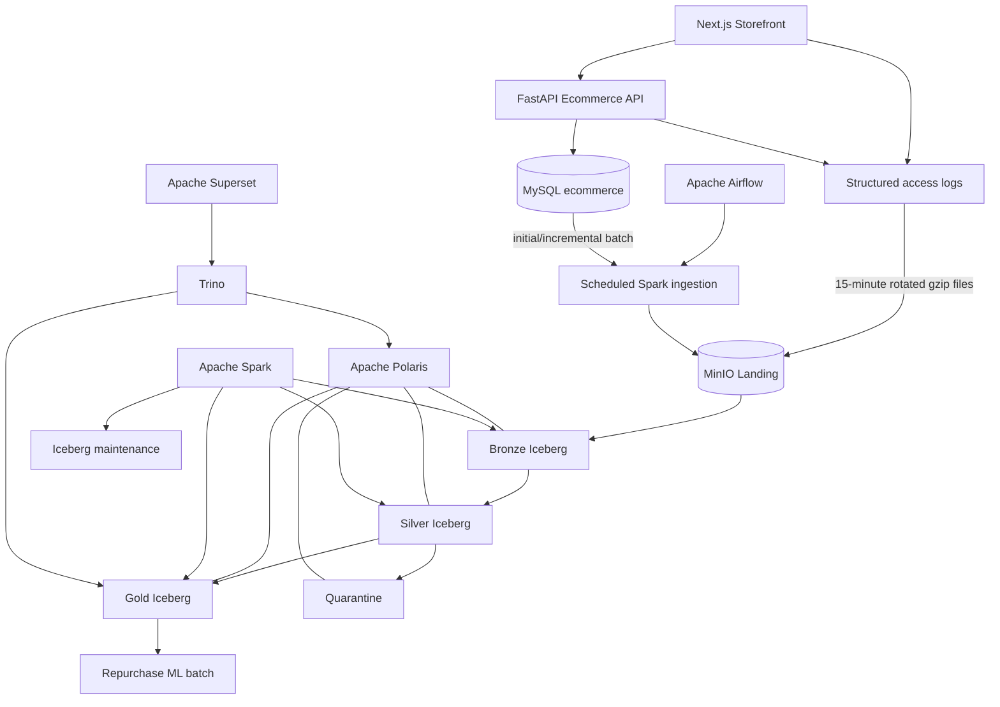

# Kế hoạch kiến trúc Lakehouse cho TLCN

## 0. Trạng thái và thứ tự ưu tiên

Tài liệu này là kế hoạch kiến trúc Lakehouse hiện hành của TLCN, được chốt ngày 2026-08-07 từ bản kế hoạch Word do chủ đề tài cung cấp.

Thứ tự ưu tiên khi có xung đột:

1. [`scope.md`](scope.md) quyết định phạm vi và acceptance của TLCN;
2. tài liệu này quyết định kiến trúc ingestion, storage, table format, catalog, compute và serving;
3. [`../architecture/oltp-schema.md`](../architecture/oltp-schema.md) quyết định logical schema và invariant của MySQL OLTP;
4. [`web-plan.md`](web-plan.md) quyết định phạm vi source website;
5. tài liệu đánh giá hoặc tài liệu cũ chỉ dùng tham khảo.

Kiến trúc chốt:

> MySQL OLTP và structured web access log → MinIO Landing → Spark → Iceberg Bronze–Silver–Gold → Polaris Catalog → Trino → Superset, được điều phối bằng Airflow.

---

## 1. Mục tiêu

Xây dựng một Data Lakehouse xử lý theo lô cho website thương mại điện tử, chứng minh được:

- nạp initial và incremental từ MySQL OLTP;
- gom access log theo micro-batch 15 phút;
- lưu raw input có thể replay;
- chuẩn hóa dữ liệu OLTP mutable và log append-only;
- quản lý bảng bằng Apache Iceberg;
- quản lý namespace và metadata bảng bằng Apache Polaris;
- tách processing engine là Spark khỏi query engine là Trino;
- xây dựng facts, dimensions và marts phục vụ BI;
- truy vấn Gold trực tiếp qua Trino mà không chạy analytics trên primary OLTP;
- kiểm tra data quality, quarantine, reconciliation, idempotency và lineage;
- compact small files theo metric và ngưỡng, không chạy mù theo lịch;
- tạo Gold dataset cho bài toán dự đoán khả năng khách hàng mua lại.

Trọng tâm là Data Engineering. Website chỉ cần đủ chức năng để tạo dữ liệu OLTP và access log có ý nghĩa.

---

## 2. Quyết định công nghệ

| Khối | Công nghệ chốt | Trách nhiệm |
|---|---|---|
| Source OLTP | MySQL 8.4/InnoDB | System of record cho dữ liệu nghiệp vụ |
| Source log | Structured JSONL access log | Request/route/status/latency và ngữ cảnh hành vi tối thiểu |
| Object storage | MinIO | Landing và file dữ liệu/metadata Iceberg |
| Orchestration | Apache Airflow | Schedule, dependency, retry, backfill và audit run |
| Processing | Apache Spark/PySpark | Extract, parse, transform, DQ, merge và aggregate |
| Table format | Apache Iceberg | Snapshot, schema evolution, partition evolution và atomic table commit |
| Catalog | Apache Polaris | Catalog/namespace cho các bảng Iceberg |
| Query engine | Trino | SQL query trên Silver/Gold qua Polaris |
| Dashboard | Apache Superset | Dashboard đọc qua Trino |
| ML | pandas, scikit-learn, joblib | Repurchase batch downstream từ Gold |
| Runtime | Docker Compose | Môi trường local và demo |
| Dependency | uv workspace | Quản lý Python dependency và lockfile |

### 2.1. Chỉ dùng một table format

Toàn bộ bảng Bronze, Silver và Gold dùng Apache Iceberg. Không dùng đồng thời Delta Lake hoặc Apache Hudi cho cùng pipeline.

Landing file chưa phải trusted Iceberg table. Landing giữ file nguồn bất biến để tách việc tiếp nhận file khỏi table commit.

### 2.2. Hai engine có vai trò khác nhau

- Spark là write/transform engine chính.
- Trino là read/query engine cho BI và kiểm tra ad-hoc.
- Superset chỉ kết nối Trino.
- Không cho nhiều engine cùng ghi một bảng trong TLCN.

### 2.3. Vai trò của Polaris

Polaris là catalog control plane cho Iceberg:

- quản lý catalog và namespace;
- phân giải table name sang Iceberg metadata;
- cung cấp metadata thống nhất cho Spark và Trino;
- tách catalog khỏi từng compute engine;
- tạo đường nâng cấp cho governance và credential vending sau này.

TLCN không xây dựng governance đa tenant phức tạp. Chỉ triển khai quyền tối thiểu cho Spark writer và Trino reader.

### 2.4. Baseline triển khai local

Baseline Docker Compose được pin để PoC có thể tái lập:

- Apache Polaris `1.5.0` dùng relational JDBC metastore trên PostgreSQL;
- Apache Iceberg `1.10.1` chạy với Spark `3.5.9`;
- Trino `483` dùng Iceberg REST catalog và vended credentials;
- Polaris Console `1.4.0` được build từ commit `e5fea020` của [`apache/polaris-tools`](https://github.com/apache/polaris-tools);
- catalog `lakehouse` có năm namespace `bronze`, `silver`, `gold`, `quarantine`, `system`;
- `spark_writer` có quyền quản lý content; `trino_reader` chỉ có quyền đọc data/metadata;
- service credential nằm trong Docker named volume, không ghi vào Git hoặc image.

Baseline này chứng minh catalog/storage/compute/query integration. DAG, bảng Bronze–Silver–Gold, DQ và dashboard vẫn phải được triển khai theo các phần sau của kế hoạch.

---

## 3. Phạm vi nguồn dữ liệu

TLCN có hai nguồn chính thức.

### 3.1. MySQL OLTP

Nguồn nghiệp vụ là 16 bảng được cho phép trong schema `ecommerce`:

1. `customers`;
2. `categories`;
3. `products`;
4. `product_variants`;
5. `carts`;
6. `cart_items`;
7. `wishlist_items`;
8. `orders`;
9. `order_items`;
10. `payments`;
11. `order_status_history`;
12. `inventory`;
13. `coupons`;
14. `coupon_redemptions`;
15. `refunds`;
16. `product_reviews`.

`customer_credentials` không được extract vì chứa password hash và dữ liệu đăng nhập không cần cho phân tích.

`products` và `coupons` dùng archive terminal: Lakehouse lấy current archive state và
audit metadata từ MySQL qua cursor `(updated_at, PK)`. Không suy diễn business deletion
từ request `DELETE` trong access log; log đó chỉ dùng cho traffic, latency, error và
admin workload.

`product_reviews` không có approval queue. Review mới được ghi `approved` và hiển thị
ngay; admin chỉ hậu kiểm sang `rejected` hoặc khôi phục lại `approved`. Lakehouse merge
current visibility theo `(updated_at, review_id)`; access log moderation không thay thế
trạng thái nghiệp vụ trong MySQL.

Đặc điểm ingestion:

- initial load cho lần chạy đầu;
- incremental batch bằng composite cursor `(source_timestamp, stable_pk)`;
- capture high watermark trước khi đọc;
- account chỉ có `SELECT` trên allowlist;
- cursor chỉ commit sau khi downstream publication thành công.

### 3.2. Structured web access log

Log dùng để phân tích request và hành vi web ở mức tối thiểu, không thay thế dữ liệu nghiệp vụ OLTP.

Một log record có grain:

> Một HTTP request đã hoàn tất tại web/API boundary.

Các trường bắt buộc:

- `request_id` duy nhất;
- `occurred_at_utc`;
- `service_name`;
- `http_method`;
- `route_template` hoặc canonical path;
- `status_code`;
- `latency_ms`;
- `actor_type`: anonymous/customer/admin/system;
- `actor_key` nullable và phải pseudonymize trước trusted Silver;
- `product_id` nullable nếu route gắn được với product;
- `search_query` nullable, đã trim/normalize và qua PII sanitizer;
- `filter_keys` nullable, không chứa giá trị secret;
- `user_agent` hoặc parsed client family;
- `client_ip` chỉ tồn tại ở raw nếu cần vận hành, phải mask/hash trước Silver;
- `schema_version`;
- `source_file`;
- `emitted_at_utc`.

Log tuyệt đối không chứa:

- password hoặc password hash;
- access/refresh token;
- cookie/session secret;
- authorization header;
- request/response body checkout;
- số điện thoại, địa chỉ giao hàng hoặc email nguyên bản;
- thông tin thanh toán nhạy cảm.

Log được rotate mỗi 15 phút, nén `gzip` và chuyển sang Landing. Có thể đổi thành 30 phút bằng cấu hình nhưng một môi trường chỉ dùng một interval đã chốt.

Deduplication key là `request_id`. Nếu nguồn cũ không có `request_id`, dùng deterministic hash của các trường ổn định và phải ghi rõ hạn chế.

### 3.3. Nguồn bị hoãn

Các nguồn sau không thuộc TLCN:

- clickstream event từ frontend/mobile;
- analytics session;
- Kafka topic;
- CDC streaming;
- GeoIP enrichment từ dịch vụ ngoài;
- event recommendation/advertising.

`Event` trong sơ đồ Word được coi là hướng mở rộng KLTN, không được tạo bảng giả trong TLCN.

---

## 4. Kiến trúc tổng thể



### 4.1. Dependency rules

1. Web/API chỉ ghi MySQL và structured log; không gọi Airflow, Spark, Polaris hoặc Trino.
2. Airflow điều phối nhưng không chứa business transformation lớn.
3. Spark là writer duy nhất cho Iceberg tables trong TLCN.
4. Polaris quản lý catalog; không xử lý transform hoặc query.
5. Trino chỉ đọc trusted Silver/Gold cho BI/ad-hoc query.
6. Superset không đọc primary MySQL, MinIO path hoặc Iceberg metadata trực tiếp.
7. ML chỉ đọc Gold snapshot đã qua quality/reconciliation gate.
8. Landing/Bronze không được coi là nguồn KPI chính thức.

---

## 5. Namespace và storage layout

### 5.1. Polaris namespaces

Một catalog `lakehouse` có các namespace:

- `lakehouse.bronze`;
- `lakehouse.silver`;
- `lakehouse.gold`;
- `lakehouse.quarantine`;
- `lakehouse.system`.

Không tạo catalog riêng cho từng bảng hoặc từng DAG.

### 5.2. MinIO layout

```text
s3://web-lakehouse/
├── landing/
│   ├── oltp/<table>/extract_date=YYYY-MM-DD/run_id=<run_id>/*.parquet
│   └── logs/date=YYYY-MM-DD/hour=HH/window_start=<timestamp>/*.jsonl.gz
├── warehouse/
│   ├── bronze/
│   ├── silver/
│   ├── gold/
│   ├── quarantine/
│   └── system/
├── checkpoints/
└── artifacts/ml/repurchase/
```

Nguyên tắc:

- Landing append-only và immutable theo source object identity;
- Iceberg quản lý file dưới `warehouse/`, không tự sửa/xóa file bằng lệnh filesystem;
- không partition theo UUID, customer ID, product ID hoặc request ID;
- mọi path dùng UTC date/hour;
- timezone nghiệp vụ `Asia/Ho_Chi_Minh` chỉ dùng khi trình bày và tính business calendar.

---

## 6. Luồng xử lý

### 6.1. Giai đoạn 1 — Collection và Landing

#### OLTP

1. Airflow tạo `run_id` và capture high watermark cho từng bảng.
2. Spark đọc bằng account read-only từ committed cursor tới high watermark.
3. Dữ liệu ghi Parquet vào Landing theo table/run.
4. Manifest lưu row count, cursor min/max, checksum và object list.
5. File hoàn tất mới được đánh dấu ready; downstream không đọc file đang ghi dở.

#### Access log

1. Web/API ghi JSONL có schema version.
2. Log writer rotate file theo cửa sổ 15 phút.
3. File đóng được nén `gzip` và đặt tên bất biến.
4. Airflow phát hiện/copy file vào Landing.
5. Manifest lưu source file identity, size, checksum, time range và line count.
6. Cùng source file/checksum không được ingest thành công hai lần.

### 6.2. Giai đoạn 2 — Bronze

Spark đọc Landing và commit Bronze Iceberg append-only.

Bronze OLTP giữ source fields cùng:

- `_run_id`;
- `_source_system`;
- `_source_schema`;
- `_source_table`;
- `_source_primary_key`;
- `_source_cursor_at`;
- `_source_high_watermark`;
- `_source_file`;
- `_source_checksum`;
- `_ingested_at_utc`;
- `_schema_version`.

Bronze log giữ raw payload hoặc raw columns cùng:

- `_run_id`;
- `_source_file`;
- `_source_file_checksum`;
- `_source_line_number`;
- `_ingested_at_utc`;
- `_parser_version`;
- `_schema_version`.

Bronze không join, không tính KPI, không enrich và không xóa source duplicate. Row không thể route/deserialize được ghi vào technical quarantine kèm raw reference.

### 6.3. Giai đoạn 3 — Silver

#### Silver OLTP

- cast kiểu dữ liệu;
- chuẩn hóa timestamp về UTC;
- deduplicate theo source identity;
- `MERGE` current state cho bảng mutable;
- append/deduplicate cho bảng lịch sử;
- kiểm tra PK, FK, status, amount và relationship;
- pseudonymize PII;
- tạo domain table có grain rõ.

#### Silver access log

- parse JSON hoặc access-log text theo schema/parser version;
- chuẩn hóa route template;
- validate timestamp, method, status và latency;
- deduplicate theo `request_id`;
- mask/hash IP và actor key;
- parse user agent ở mức client/device family nếu cần;
- normalize search query và filter keys;
- enrich product/customer reference bằng left join có kiểm soát;
- không drop row chỉ vì không resolve được anonymous actor hoặc product;
- đưa row vi phạm semantic rule vào quarantine.

Không triển khai GeoIP external lookup trong TLCN. Trường country/region chỉ được dùng nếu nguồn log đã cung cấp hợp lệ.

### 6.4. Giai đoạn 4 — Gold

Spark xây dựng:

- dimensions;
- transaction facts;
- web request fact;
- business marts;
- web traffic/performance marts;
- data freshness/quality mart;
- feature/label dataset cho ML.

Gold publication chỉ thành công khi:

1. upstream snapshots đã cố định;
2. DQ core pass;
3. reconciliation pass;
4. fact grain unique;
5. dimension keys resolve theo policy;
6. không có raw PII;
7. publication manifest được ghi thành công.

### 6.5. Giai đoạn 5 — Serving

1. Trino đọc Iceberg catalog qua Polaris.
2. Superset kết nối Trino bằng account read-only.
3. Dashboard chỉ query Gold marts hoặc curated Gold facts.
4. Không cần publish Gold sang MySQL analytics.
5. Query nặng/ad-hoc không được chạy trên primary OLTP.

---

## 7. Airflow DAG catalogue

### 7.1. `ingest_oltp_batch`

```text
check_mysql
→ capture_high_watermarks
→ extract_tables_to_landing
→ validate_landing_manifests
→ append_bronze_oltp
→ validate_bronze_oltp
→ build_silver_oltp
→ run_silver_oltp_dq
→ publish_oltp_interval
```

### 7.2. `ingest_access_logs`

Schedule: mỗi 15 phút.

```text
discover_closed_log_files
→ verify_file_checksum
→ copy_to_landing
→ write_log_manifest
→ append_bronze_access_logs
→ parse_and_dedup_silver_logs
→ run_silver_log_dq
→ publish_log_interval
```

### 7.3. `build_gold`

```text
resolve_required_input_snapshots
→ build_dimensions
→ build_transaction_facts
→ build_web_request_fact
→ build_business_marts
→ build_web_marts
→ reconcile
→ validate_gold
→ publish_gold_snapshot
```

Gold chạy theo data interval. Không phụ thuộc vào thời điểm task upstream kết thúc một cách mơ hồ.

### 7.4. `maintain_iceberg_tables`

DAG kiểm tra metric trước khi chạy maintenance:

- số file nhỏ;
- median/average file size;
- số snapshot;
- số manifest;
- số file không còn được tham chiếu;
- thời gian query hoặc scan bytes nếu đo được.

Chỉ trigger compaction khi vượt threshold theo table class. Sau compaction phải validate row count/checksum và không đổi logical result.

Các tác vụ có thể gồm:

- rewrite data files;
- rewrite manifests;
- expire snapshots theo retention;
- remove orphan files sau safety window;
- sort dữ liệu theo query pattern đã đo được.

Không mặc định dùng Z-order vì đây không phải abstraction chung bắt buộc của Iceberg. Ưu tiên partition evolution, sort order và file rewrite phù hợp với engine thực tế.

### 7.5. `repurchase_ml_batch`

```text
wait_for_gold_publication
→ build_point_in_time_features
→ build_closed_horizon_labels
→ temporal_split
→ train_and_evaluate
→ batch_score
→ publish_artifact_manifest
```

ML failure không rollback Gold publication.

---

## 8. Bảng logical Lakehouse

### 8.1. Bronze

- `bronze_customers_batch`;
- `bronze_categories_batch`;
- `bronze_products_batch`;
- `bronze_product_variants_batch`;
- `bronze_carts_batch`;
- `bronze_cart_items_batch`;
- `bronze_wishlist_items_batch`;
- `bronze_orders_batch`;
- `bronze_order_items_batch`;
- `bronze_payments_batch`;
- `bronze_order_status_history_batch`;
- `bronze_inventory_batch`;
- `bronze_coupons_batch`;
- `bronze_coupon_redemptions_batch`;
- `bronze_refunds_batch`;
- `bronze_product_reviews_batch`;
- `bronze_access_logs`;
- `bronze_ingestion_errors`;
- `bronze_batch_audit`.

### 8.2. Silver

- `silver_customers`;
- `silver_categories`;
- `silver_products`;
- `silver_product_variants`;
- `silver_carts`;
- `silver_cart_items`;
- `silver_wishlist_items`;
- `silver_orders`;
- `silver_order_items`;
- `silver_payments`;
- `silver_order_status_history`;
- `silver_inventory`;
- `silver_coupons`;
- `silver_coupon_redemptions`;
- `silver_refunds`;
- `silver_product_reviews`;
- `silver_order_lifecycle`;
- `silver_access_logs`;
- `silver_data_quarantine`;
- `silver_data_quality_results`.

`silver_products` và `silver_coupons` merge `is_active`, `archived_at`,
`archived_by_customer_id` và `archive_reason` như current state. Rule DQ bắt buộc archive
metadata đầy đủ và entity archive phải inactive; FK lịch sử vẫn được giữ để order và
redemption trước archive tiếp tục reconcile.

`silver_product_reviews` giữ verified-purchase reference, rating/content, `created_at`,
current `status`, moderation actor/reason và `moderated_at`. Review `approved` mới có thể
không có moderation actor/time; review `rejected` bắt buộc đủ actor/time/reason.

### 8.3. Gold dimensions

- `dim_date`;
- `dim_customer`;
- `dim_category`;
- `dim_product`;
- `dim_variant`;
- `dim_route`;
- `dim_client` nếu client/device analysis được giữ trong scope.

Dimension dùng Type 1 trong scope hiện tại: `dim_product` expose `is_archived` và
`archived_at`; archive reason ở Silver cho audit thay vì tạo dimension tự do. Lịch sử
do `fact_order_item` và snapshot trên order bảo toàn, không dựng SCD2 từ access log.

### 8.4. Gold facts

| Fact | Grain |
|---|---|
| `fact_order` | Một order |
| `fact_order_item` | Một order line |
| `fact_payment` | Một payment |
| `fact_cart` | Một cart |
| `fact_wishlist_item` | Một customer-product wishlist state |
| `fact_product_review` | Một review/order item với current visibility state |
| `fact_inventory_snapshot` | Một variant tại một snapshot date |
| `fact_web_request` | Một deduplicated HTTP request |

`fact_product_review` không phải moderation event history: OLTP chỉ giữ lần thay đổi
visibility gần nhất, nên không dựng timeline nhiều lần ẩn/khôi phục từ current row hoặc
access log.

### 8.5. Gold marts

- `mart_sales_daily`;
- `mart_product_performance`;
- `mart_customer_summary`;
- `mart_cart_abandonment`;
- `mart_wishlist_product_interest`;
- `mart_inventory_daily`;
- `mart_web_traffic_daily`;
- `mart_web_performance_daily`;
- `mart_search_interest_daily`;
- `mart_data_freshness_quality`;
- `gold_customer_repurchase_features`;
- `gold_customer_repurchase_labels`;
- `gold_customer_repurchase_scores`.

---

## 9. KPI và giới hạn diễn giải

### 9.1. KPI nghiệp vụ từ OLTP

- gross collected revenue;
- refunded amount;
- order count theo status;
- average order value;
- units sold;
- doanh thu theo ngày/category/product;
- customer mới và customer mua hàng;
- cart abandonment theo grain cart;
- wishlist popularity;
- inventory current/low-stock;
- historical repurchase rate.
- review submitted/visible/hidden count và average rating chỉ trên review đang hiển thị.

### 9.2. KPI access log

- request count;
- unique authenticated actor theo ngày nếu `actor_key` có chất lượng;
- status-code distribution;
- 4xx/5xx rate;
- latency average/p50/p95/p99;
- top route;
- product detail request count;
- search request count;
- top normalized search query;
- filter usage count.

### 9.3. Funnel

Business funnel ưu tiên dùng OLTP milestones:

```text
cart có item → order paid → order confirmed → order completed
```

Access log chỉ bổ sung traffic tới product/search/cart/checkout route. Không khẳng định chính xác `view → add-to-cart` nếu chưa có canonical event hoặc request contract thể hiện action đó.

### 9.4. DAU/MAU

- DAU/MAU customer chỉ tính từ authenticated `actor_key` đã pseudonymize;
- không dùng IP làm customer identity;
- anonymous DAU/MAU nằm ngoài scope nếu không có anonymous owner key ổn định;
- phải công bố coverage: tỷ lệ request có authenticated actor.

---

## 10. Data quality và quarantine

### 10.1. Landing/Bronze checks

- source object có checksum và manifest;
- log file đã đóng, không ingest file đang ghi;
- file name/path đúng interval;
- schema version được hỗ trợ;
- OLTP PK/cursor tồn tại;
- line count hoặc row count khớp manifest;
- không extract `customer_credentials`;
- cùng source object không được commit hai lần.

### 10.2. Silver OLTP checks

- PK/business key unique;
- FK resolve theo policy;
- amount không âm;
- order arithmetic đúng;
- payment/status hợp lệ;
- inventory invariant đúng;
- order transition hợp lệ;
- review phải trỏ đến completed order item; status chỉ `approved/rejected` và moderation
  metadata phải nhất quán với current visibility;
- PII được pseudonymize theo contract.

### 10.3. Silver log checks

- `request_id` không null và unique sau dedup;
- timestamp hợp lệ, không vượt clock-skew threshold;
- `status_code` trong 100–599;
- `latency_ms >= 0` và dưới hard sanity limit;
- method/route đúng allowlist hoặc được gắn `unknown`;
- secret/PII scanner không phát hiện field cấm;
- actor/product reference nullable nhưng unresolved rate phải được báo cáo;
- parser error rate dưới threshold.

### 10.4. Gold checks

- fact grain unique;
- dimension key resolve;
- revenue/units reconcile với Silver OLTP;
- request totals reconcile với Silver log theo interval;
- mart totals reconcile với facts;
- visible review count/rating chỉ tính `approved`; submitted/hidden metrics phải được
  ghi nhãn riêng và reconcile với `silver_product_reviews`;
- không có raw IP, token, email, phone hoặc address;
- Gold snapshot chỉ publish khi core rule pass.

### 10.5. Quarantine contract

Mỗi row quarantine có:

- `rule_id`;
- `layer`;
- `source_type`;
- source table/file/line hoặc PK reference;
- Bronze snapshot/reference;
- error code và severity;
- parser/schema version;
- run ID;
- quarantined time;
- reprocess status.

---

## 11. Reconciliation và idempotency

### 11.1. OLTP

1. source row count tại cutoff ↔ Landing/Bronze accepted rows;
2. Bronze distinct source identity ↔ Silver logical rows;
3. orders/payments ↔ Gold facts;
4. source VND totals ↔ Gold revenue;
5. order item quantity ↔ Gold units sold;
6. inventory current ↔ Silver/Gold snapshot.

### 11.2. Access log

1. closed source file count ↔ Landing manifest file count;
2. source line count ↔ Bronze accepted + technical reject count;
3. Bronze distinct `request_id` ↔ Silver request + semantic reject count;
4. Silver request count ↔ Gold fact request count theo interval;
5. Gold fact request count ↔ web marts.

### 11.3. Idempotency

- cùng OLTP input range không tạo thêm logical row;
- cùng log file checksum không được ingest hai lần;
- cùng `request_id` chỉ có một Silver/Gold request;
- rerun transform trên cùng input snapshots tạo cùng logical result;
- cursor chỉ commit sau publication thành công;
- failed run không làm lộ partial Gold result cho Superset.

---

## 12. Iceberg maintenance

### 12.1. Small-file policy

Không compact chỉ dựa trên số file toàn hệ thống. Mỗi table class có threshold riêng theo:

- số file nhỏ hơn target size;
- tổng bytes có thể rewrite;
- số partition bị ảnh hưởng;
- khoảng thời gian từ lần maintenance trước;
- query impact đo được.

Ngưỡng ban đầu là config và phải được hiệu chỉnh bằng thực nghiệm. Plan không hard-code một con số chưa benchmark.

### 12.2. Snapshot retention

- giữ snapshot đủ cho cửa sổ replay/backfill/demo;
- không expire snapshot đang được Gold publication hoặc ML manifest tham chiếu;
- orphan cleanup có safety window;
- maintenance run phải audit snapshot trước/sau;
- row count và KPI không đổi sau compaction.

### 12.3. Concurrency

- Airflow giới hạn một writer active cho cùng table/partition class;
- retry dựa trên Iceberg commit conflict, không ghi file thủ công;
- maintenance không chạy đồng thời với critical Gold publication nếu chưa kiểm chứng concurrency;
- Spark và Trino compatibility phải được kiểm tra bằng integration test.

---

## 13. Security và privacy

- MySQL extractor dùng account read-only theo table allowlist;
- Spark writer và Trino reader dùng principal riêng;
- Superset chỉ có quyền đọc Gold marts cần thiết;
- MinIO credential không commit vào repository;
- Polaris admin credential không dùng cho job thường;
- log không chứa credential/header/body nhạy cảm;
- IP và actor key được pseudonymize trước Silver;
- customer PII không xuất hiện trong Gold hoặc ML;
- log retention raw phải ngắn hơn trusted analytical retention nếu không cần audit dài hạn;
- việc anonymize customer phải truyền sang Silver/Gold và dataset ML liên quan.

---

## 14. Observability

Mỗi run lưu:

- DAG/task/run ID;
- data interval;
- source high watermark hoặc log window;
- source file/checksum;
- Iceberg snapshot ID input/output;
- Polaris catalog/namespace/table;
- rows read/written/deduplicated/rejected/quarantined;
- bytes và file count trước/sau;
- min/max event/source time;
- Spark duration/resource metrics;
- DQ và reconciliation result;
- maintenance action;
- code/config/parser/schema version;
- publication status.

Dashboard vận hành tối thiểu:

- freshness theo source;
- last successful interval;
- row/file volume;
- DQ failure/quarantine rate;
- small-file count;
- DAG duration/failure;
- Gold publication snapshot.

---

## 15. Testing strategy

### Source contract

- MySQL schema/cursor compatibility;
- log JSON schema version;
- PII/secret exclusion;
- log rotation tạo file đóng đúng interval;
- duplicate log delivery.

### Ingestion

- initial/incremental OLTP;
- same-timestamp composite cursor;
- fixed high watermark;
- corrupt/truncated gzip;
- late log file;
- duplicate source file/checksum;
- failed downstream không commit cursor.

### Iceberg/Polaris

- create/load/append/merge table qua Polaris;
- Spark writer và Trino reader nhìn cùng snapshot;
- schema evolution tương thích;
- commit conflict/retry;
- snapshot rollback ở môi trường test;
- compaction không đổi logical result.

### Silver/Gold

- OLTP mutable merge;
- append-only dedup;
- log parse/dedup;
- unknown actor/product handling;
- semantic quarantine;
- fact/mart grain;
- source-to-Gold reconciliation;
- replay/backfill equivalence.

### BI/ML

- Superset chỉ đọc Trino;
- dashboard query không chạm OLTP;
- point-in-time ML boundary;
- closed horizon và temporal split;
- reproducible artifact/score lineage.

---

## 16. Phân công hai người

### Người A — Source và ingestion

- website/API/MySQL;
- structured access-log contract và rotation;
- OLTP/log Landing ingestion;
- manifests, checksum, high watermark và cursor;
- Bronze tables;
- source-to-Bronze reconciliation;
- source/ingestion tests.

### Người B — Lakehouse và analytics

- Spark/Iceberg/MinIO;
- Polaris catalog và Trino integration;
- Silver parse/merge/DQ/quarantine;
- Gold facts/dimensions/marts;
- Superset dashboard;
- Iceberg maintenance;
- ML feature/label/train/score.

### Làm chung

- architecture/compatibility PoC;
- grain, KPI và privacy review;
- reconciliation rules;
- replay/backfill/compaction test;
- benchmark, report, slide và demo.

---

## 17. Roadmap 10 tuần

| Tuần | Người A | Người B | Mốc |
|---:|---|---|---|
| 1 | Freeze OLTP và log contract | Freeze KPI/Gold/ML contract | Scope hai nguồn ổn định |
| 2 | Hoàn thiện web/log rotation | Iceberg–Polaris–Trino PoC | Compatibility pass |
| 3 | Generator và source fixtures | MinIO/Spark/Airflow base | Platform stable |
| 4 | OLTP/log Landing ingestion | Bronze Iceberg/audit | Bronze stable |
| 5 | Cursor/file idempotency | Silver OLTP/log | Silver stable |
| 6 | Source reconciliation | DQ/quarantine | Quality gate |
| 7 | Replay/backfill support | Gold facts/dimensions | Gold accepted |
| 8 | Source fixes/benchmark | Marts/Trino/Superset | BI accepted |
| 9 | Failure/late-file scenarios | Maintenance và ML | Maintenance/ML accepted |
| 10 | Clean setup/runbook | Report/demo/performance | Final |

---

## 18. Acceptance criteria

### Source và Landing

- chỉ 16 bảng MySQL allowlist được extract;
- structured access log không chứa secret/PII cấm;
- log file rotate và ingest theo interval cấu hình;
- source object có manifest/checksum;
- corrupt hoặc duplicate file được xử lý có kiểm soát.

### Pipeline

- initial/incremental OLTP không miss same-timestamp row;
- Bronze giữ raw data và metadata đủ replay;
- Silver OLTP typed/merged/deduplicated đúng;
- Silver log parsed/deduplicated và pseudonymized đúng;
- quarantine không trộn vào trusted Gold;
- Gold fact/mart có grain unique;
- reconciliation OLTP và log pass;
- rerun không nhân logical row/KPI;
- cursor/publication chỉ commit sau quality gate;
- Spark và Trino đọc cùng Iceberg table qua Polaris.

### Maintenance

- small-file metric được thu thập;
- compaction chỉ chạy khi vượt threshold cấu hình;
- row count/checksum/KPI không đổi sau compaction;
- snapshot expiration tôn trọng retention và reference;
- maintenance run có audit trước/sau.

### BI và ML

- Superset chỉ truy vấn Gold qua Trino;
- dashboard không truy vấn primary OLTP;
- KPI khớp Gold snapshot và source interval;
- DAU/MAU chỉ dùng authenticated actor có coverage công bố;
- ML feature/label không dùng tương lai;
- model artifact và score có snapshot/run lineage.

---

## 19. Demo end-to-end

1. Khởi động source web/MySQL và platform Lakehouse.
2. Thao tác website để tạo OLTP row và access log.
3. Xem MySQL source và một log file đã rotate.
4. Chạy OLTP ingestion và log ingestion DAG.
5. Xem Landing manifest và Bronze Iceberg snapshot.
6. Xem Silver typed/merged log/OLTP data và quarantine.
7. Xem Gold facts/marts.
8. Truy vấn cùng Gold table bằng Trino qua Polaris.
9. Xem Superset dashboard.
10. Chạy reconciliation.
11. Rerun cùng input để chứng minh idempotency.
12. Inject small files, chạy maintenance và chứng minh kết quả logic không đổi.
13. Replay hoặc backfill một interval.
14. Chạy feature/label và ML evaluation.

---

## 20. Ngoài phạm vi TLCN

- frontend/mobile clickstream event pipeline;
- Kafka và Flink;
- realtime/streaming SLA;
- GeoIP external enrichment;
- multi-cloud/federated catalog;
- nhiều writer engine;
- data mesh hoặc multi-tenant governance;
- MLflow;
- online feature store hoặc realtime inference;
- recommendation system;
- full-text behavioral event catalogue.

Các phần này chỉ được thêm ở KLTN khi có câu hỏi nghiên cứu, dữ liệu, benchmark và thời gian triển khai tương ứng.
