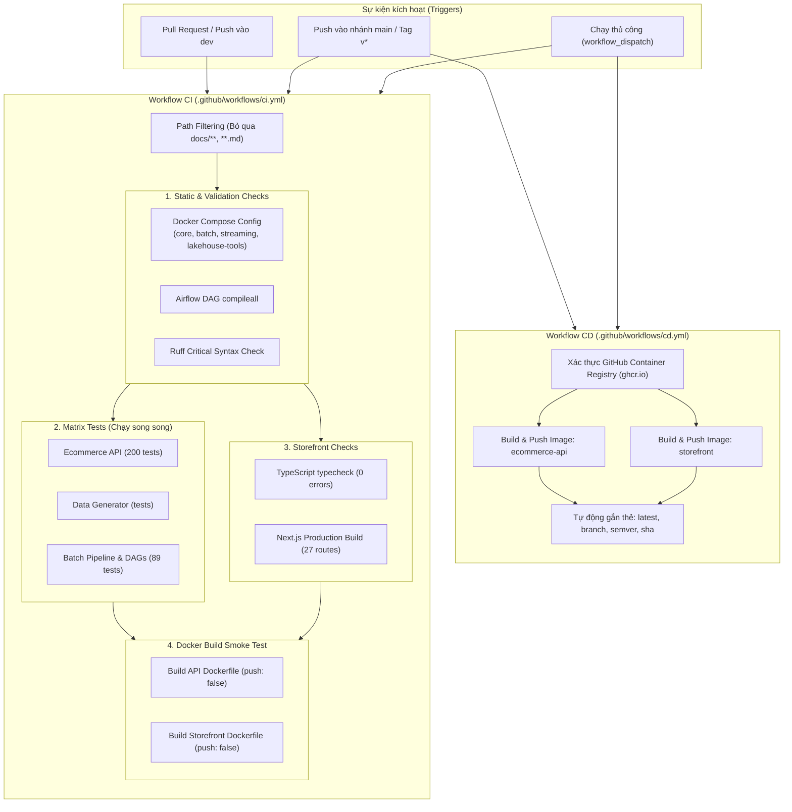

# CI/CD & DataOps Runbook

Tài liệu này hướng dẫn chi tiết về kiến trúc, cấu hình và quy trình tự động hóa **CI (Continuous Integration)** và **CD (Continuous Delivery)** của hệ thống **D&K E-Commerce Data Platform**.

---

## 1. Tổng quan Kiến trúc CI/CD (Overview)

Quy trình tự động hóa được xây dựng trên nền tảng **GitHub Actions** với hai workflow độc lập phục vụ hai mục đích:



---

## 2. Quy trình Kiểm thử Tích hợp Liên tục (Continuous Integration - CI)

File workflow: [`.github/workflows/ci.yml`](../../.github/workflows/ci.yml)

### 2.1. Bộ lọc đường dẫn (Path Filtering)
- **Tối ưu tài nguyên:** Khi các commit chỉ thay đổi tài liệu (`docs/**`, `**.md`, `.gitignore`, `LICENSE`), GitHub Actions sẽ **bỏ qua** chạy CI để tránh lãng phí thời gian và hạn ngạch runner.

### 2.2. Kiểm tra tĩnh & Tính tương thích Hạ tầng (`repository-validation`)
1. **Docker Compose Validation:** Chạy `docker compose config --quiet` trên toàn bộ 4 profile hoạt động thực tế (`core`, `batch`, `streaming`, `lakehouse-tools`). Đảm bảo không có xung đột cổng, lỗi cú pháp YAML hoặc biến môi trường thiếu.
2. **Kiểm tra biên dịch Airflow DAG:** Chạy `python3 -m compileall -q airflow/dags/` để phát hiện ngay lập tức bất kỳ lỗi cú pháp Python nào trong các định nghĩa pipeline.
3. **Kiểm tra lỗi cú pháp mã nguồn (Ruff Linter):** Chạy `uvx ruff check --select E9,F63,F7,F82 .` để rà quét các lỗi cú pháp nghiêm trọng (undefined variables, invalid syntax) chỉ trong **0.2 giây**.

### 2.3. Kiểm thử song song theo Matrix (`python-tests`)
Để tối ưu hóa thời gian thực thi, các bộ test Python được phân tách thành ma trận chạy đồng thời trên 3 runner riêng biệt:
- **`Ecommerce API`:** 200 bài test kiểm thử toàn diện nghiệp vụ OLTP, RBAC 7 vai trò, COGS snapshot, vòng đời đơn hàng, và đổi trả hàng.
- **`Data Generator`:** Kiểm thử trình sinh dữ liệu giao dịch giả lập theo phân phối thị trường Việt Nam.
- **`Batch Pipeline & DAGs`:** 89 bài test kiểm thử các tầng Medallion (Landing, Bronze, Silver, Gold), bảo trì Iceberg, và bộ test tính toàn vẹn DAG (`pipelines/tests/test_dags.py`).

### 2.4. Kiểm tra mã nguồn giao diện (`storefront`)
- **TypeScript Typecheck:** `npm run typecheck` (`tsc --noEmit`) đảm bảo 100% strict type safety cho 27 trang giao diện.
- **Next.js Production Build:** `npm run build` kiểm tra khả năng đóng gói Next.js standalone server phục vụ triển khai Docker.

### 2.5. Kiểm tra sức sống của Dockerfile (`docker-smoke-build`)
- Biên dịch thử nghiệm cả hai `Dockerfile` (`services/ecommerce-api/Dockerfile` và `apps/storefront/Dockerfile`) với tham số `push: false`.
- Tận dụng GitHub Actions Cache (`type=gha`) để tái sử dụng các tầng image (layer caching).

---

## 3. Quy trình Đóng gói & Phát hành Liên tục (Continuous Delivery - CD)

File workflow: [`.github/workflows/cd.yml`](../../.github/workflows/cd.yml)

### 3.1. Mục tiêu và Cơ chế phát hành
Khi mã nguồn được merge vào nhánh `main` hoặc khi gắn thẻ phiên bản Git (`v1.0.0`, `v1.1.0`), pipeline CD sẽ tự động:
1. Đăng nhập vào **GitHub Container Registry (`ghcr.io`)** thông qua `${{ secrets.GITHUB_TOKEN }}` (không cần cấu hình secret bên ngoài).
2. Tự động gắn thẻ đa phiên bản (multi-tagging):
   - `latest`: Trỏ tới bản dựng mới nhất trên nhánh `main`.
   - `<git-sha>`: Mã băm rút gọn của commit (ví dụ: `sha-c4cb3eb`).
   - `vX.Y.Z`: Phiên bản phát hành theo chuẩn Semantic Versioning khi push tag.
3. Đẩy hai Docker images hoàn chỉnh lên GHCR:
   - `ghcr.io/<tên-tài-khoản>/tlcn/ecommerce-api`
   - `ghcr.io/<tên-tài-khoản>/tlcn/storefront`

### 3.2. Hướng dẫn kéo và chạy Image từ Container Registry
Người dùng hoặc Giảng viên khi nghiệm thu đồ án có thể kéo trực tiếp các bản image đã đóng gói sẵn mà không cần cài đặt môi trường lập trình:

```bash
# Đăng nhập vào GHCR (nếu repository ở chế độ private)
echo $GITHUB_TOKEN | docker login ghcr.io -u <username> --password-stdin

# Kéo các image dựng sẵn
docker pull ghcr.io/<owner>/tlcn/ecommerce-api:latest
docker pull ghcr.io/<owner>/tlcn/storefront:latest
```

---

## 4. Các lệnh kiểm thử cục bộ trước khi đẩy code (Local Pre-push Commands)

Để đảm bảo commit chắc chắn vượt qua CI trên GitHub Actions, lập trình viên chạy chuỗi lệnh sau tại thư mục gốc dự án:

```bash
# 1. Kiểm tra cú pháp Compose toàn bộ profiles
docker compose --profile core --profile batch --profile streaming --profile lakehouse-tools config --quiet

# 2. Kiểm tra cú pháp DAGs & Linter
python3 -m compileall -q airflow/dags/
uvx ruff check --select E9,F63,F7,F82 .

# 3. Chạy toàn bộ Unit Tests Python
uv run --locked --package ecommerce-api --extra dev -- pytest services/ecommerce-api/tests
uv run --locked --package data-generator --extra dev -- pytest generator/tests
PYTHONPATH=pipelines/src uv run --locked --package batch-pipeline --extra dev -- pytest pipelines/tests

# 4. Kiểm tra Typecheck và Build Storefront
npm --prefix apps/storefront run typecheck
npm --prefix apps/storefront run build
```
