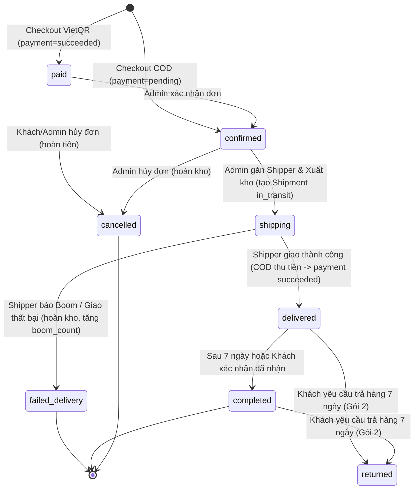

# Đặc tả Thiết kế Hệ thống: Vòng đời Đơn hàng, Thanh toán COD & Giao vận Shipper Nội bộ (Gói 1)

> **Tài liệu:** `docs/superpowers/specs/2026-09-20-order-lifecycle-cod-logistics-design.md`  
> **Dự án:** D&K E-Commerce Data Platform (`TLCN`)  
> **Phân hệ:** Gói 1 — Core Order Lifecycle, COD Payment, Boom Handling & In-house Logistics  
> **Ngày lập:** 2026-09-20  
> **Tác giả:** Antigravity & Team  
> **Trạng thái:** Chờ phê duyệt (Pending Review)

---

## 1. TỔNG QUAN & MỤC TIÊU THIẾT KẾ

### 1.1. Bối cảnh
Trong tài liệu đặc tả nghiệp vụ ([`BUSINESS_REQUIREMENTS.md`](file:///home/danhtran/TLCN/docs/project/BUSINESS_REQUIREMENTS.md)), hệ thống đã quy định mô hình giao vận nội bộ với đội ngũ shipper trực thuộc biên chế D&K, hình thức thanh toán COD kèm chế tài xử lý boom hàng, và vòng đời trạng thái đơn hàng mở rộng. CSDL MySQL 8.4 đã có sẵn các bảng và trường tương ứng trong migration `0014_logistics_returns_inbound_cogs.py`.

Tuy nhiên, trên tầng ứng dụng Web (`apps/storefront`) và Backend API (`services/ecommerce-api`), các nghiệp vụ này vẫn chưa được triển khai đầy đủ. Khách hàng chỉ có thể thanh toán mặc định qua VietQR, đơn hàng nhảy cóc từ `confirmed` sang `completed`, và Admin không có công cụ điều phối shipper hay ghi nhận kết quả giao hàng.

### 1.2. Mục tiêu của Gói 1
1. **Hoàn thiện phương thức thanh toán:** Hỗ trợ song song `vietqr` (chuyển khoản trước) và `cod` (thanh toán tiền mặt khi nhận hàng) trên giao diện checkout.
2. **Kiểm soát rủi ro boom hàng COD:** Kiểm tra thuộc tính `is_cod_blocked`. Nếu khách hàng đã boom hàng $\ge 3$ lần, tự động khóa phương thức COD.
3. **Mở rộng State Machine đơn hàng:** Chuẩn hóa luồng trạng thái từ `paid / confirmed` $\rightarrow$ `shipping` $\rightarrow$ `delivered` $\rightarrow$ `completed` / `failed_delivery`.
4. **Vận hành Giao vận nội bộ D&K:** Xây dựng phân hệ quản lý đội ngũ Shipper (`delivery_staff`) và vòng đời phát hàng (`shipments`).
5. **Cơ chế hoàn kho & xử lý boom hàng tự động:** Khi giao thất bại, hoàn trả số lượng vào kho tổng `inventory.on_hand`, tăng `boom_count` của khách và tự động kích hoạt cờ `is_cod_blocked`.

---

## 2. KIẾN TRÚC DỮ LIỆU & STATE MACHINE ĐƠN HÀNG

### 2.1. Biểu đồ Chuyển đổi Trạng thái (Order State Machine)



### 2.2. Ràng buộc Toàn vẹn Dữ liệu (Database Invariants)
1. **Khởi tạo đơn hàng:**
   * `orders.payment_method IN ('vietqr', 'cod')`.
   * Nếu `payment_method = 'vietqr'`: `status = 'paid'`, `payment.status = 'succeeded'`, `paid_at = now`.
   * Nếu `payment_method = 'cod'`: `status = 'confirmed'`, `payment.status = 'pending'`, `paid_at = NULL`.
2. **Khóa vi phạm COD:**
   * Khi tạo đơn COD, nếu `customer.is_cod_blocked = TRUE` $\rightarrow$ chặn giao dịch, trả về HTTP 403 Forbidden.
3. **Phiếu giao hàng (`shipments`):**
   * Mỗi đơn hàng online có tối đa một bản ghi `shipments` liên kết qua `order_id` (UK).
   * Khi chuyển sang `shipping`: `shipment.status = 'in_transit'`, `dispatched_at = now`. Nếu đơn là COD thì `cod_amount_vnd = order.total_vnd`, ngược lại bằng 0.
   * Khi chuyển sang `delivered`: `shipment.status = 'delivered'`, `delivered_at = now`, `cod_collected_vnd = cod_amount_vnd`. Nếu đơn là COD: set `order.paid_at = now`, `payment.status = 'succeeded'`.
4. **Xử lý Boom hàng (`failed_delivery`):**
   * `shipment.status = 'failed'`, `failed_at = now`, `cod_collected_vnd = 0`, bắt buộc có `failure_reason` ($\ge 3$ ký tự).
   * Khóa và hoàn trả tồn kho: Với mỗi dòng trong `order_items`, `inventory.on_hand += quantity`, `inventory.version += 1`.
   * Tăng `customer.boom_count += 1`. Nếu `customer.boom_count >= 3`, cập nhật `customer.is_cod_blocked = TRUE`.

---

## 3. THIẾT KẾ BACKEND API (FASTAPI)

### 3.1. Module mới: `app/modules/logistics`

Tạo thư mục `services/ecommerce-api/app/modules/logistics` với các file:
* `schemas.py`: Pydantic models cho Shipper và Shipment.
* `service.py`: Nghiệp vụ CRUD shipper và truy vấn vận đơn.
* `router.py`: Đăng ký các endpoints quản trị vào `v1_router`.

#### Danh sách Endpoints Logistics:
| Method | Endpoint | Quyền | Mô tả |
|---|---|---|---|
| `GET` | `/api/v1/admin/delivery-staff` | Admin | Lấy danh sách toàn bộ Shipper nội bộ. |
| `POST` | `/api/v1/admin/delivery-staff` | Admin | Tạo mới một Shipper (`full_name`, `phone`, `vehicle_plate`). |
| `PATCH` | `/api/v1/admin/delivery-staff/{staff_id}` | Admin | Cập nhật thông tin hoặc toggle `is_active` của Shipper. |
| `GET` | `/api/v1/admin/shipments` | Admin | Danh sách vận đơn, hỗ trợ query params: `status`, `staff_id`, `order_number`. |
| `GET` | `/api/v1/admin/shipments/{order_number}` | Admin | Xem chi tiết phiếu giao hàng của một đơn cụ thể. |

#### Data Schemas (`logistics/schemas.py`):
```python
class DeliveryStaffCreateRequest(BaseModel):
    full_name: str = Field(min_length=2, max_length=100)
    phone: str = Field(min_length=8, max_length=20)
    vehicle_plate: str | None = Field(default=None, max_length=30)

class DeliveryStaffUpdateRequest(BaseModel):
    full_name: str | None = Field(default=None, min_length=2, max_length=100)
    phone: str | None = Field(default=None, min_length=8, max_length=20)
    vehicle_plate: str | None = Field(default=None, max_length=30)
    is_active: bool | None = None

class DeliveryStaffResponse(BaseModel):
    staff_id: int
    public_id: str
    full_name: str
    phone: str
    vehicle_plate: str | None
    is_active: bool
    created_at: datetime

class ShipmentResponse(BaseModel):
    shipment_id: int
    shipment_code: str
    order_id: int
    order_number: str
    delivery_staff_id: int | None
    delivery_staff_name: str | None
    delivery_staff_phone: str | None
    status: str
    attempt_count: int
    cod_amount_vnd: int
    cod_collected_vnd: int
    dispatched_at: datetime | None
    delivered_at: datetime | None
    failed_at: datetime | None
    failure_reason: str | None
    notes: str | None
```

### 3.2. Cập nhật Luồng Checkout (`app/modules/checkout`)

#### File sửa đổi:
* [`app/modules/checkout/schemas.py`](file:///home/danhtran/TLCN/services/ecommerce-api/app/modules/checkout/schemas.py):
  ```python
  class CheckoutRequest(BaseModel):
      receiver_name: str = Field(min_length=1, max_length=160)
      receiver_phone: str = Field(min_length=1, max_length=32)
      shipping_address_text: str = Field(min_length=1, max_length=1000)
      coupon_code: str | None = Field(default=None, max_length=64)
      payment_method: Literal["vietqr", "cod"] = "vietqr"
  ```
* [`app/modules/checkout/service.py`](file:///home/danhtran/TLCN/services/ecommerce-api/app/modules/checkout/service.py):
  * Kiểm tra `if payload.payment_method == "cod"`:
    * Kiểm tra `customer.is_cod_blocked`. Nếu `True` $\rightarrow$ Ném lỗi `AppError(VALIDATION_ERROR, "Tài khoản của bạn đã bị khóa phương thức COD do boom hàng. Vui lòng chọn VietQR.", status_code=403)`.
    * Khởi tạo `Order` với: `status="confirmed"`, `payment_method="cod"`, `paid_at=None`, `confirmed_at=now`.
    * Khởi tạo `Payment` với: `status="pending"`, `amount_vnd=amounts.total_vnd`.
    * Ghi `OrderStatusHistory` với: `from_status=None, to_status="confirmed", transition_source="checkout"`.
  * Nếu `payload.payment_method == "vietqr"`:
    * Giữ nguyên: `status="paid"`, `payment_method="vietqr"`, `paid_at=now`.
    * `Payment(status="succeeded")`.
    * `OrderStatusHistory(from_status=None, to_status="paid", transition_source="checkout")`.

### 3.3. Mở rộng Trạng thái Đơn hàng (`app/modules/orders` & `app/modules/admin`)

Bổ sung các endpoints điều phối đơn hàng trong [`app/modules/admin/router.py`](file:///home/danhtran/TLCN/services/ecommerce-api/app/modules/admin/router.py) và logic nghiệp vụ trong [`app/modules/orders/service.py`](file:///home/danhtran/TLCN/services/ecommerce-api/app/modules/orders/service.py):

1. **`POST /api/v1/admin/orders/{order_number}/dispatch`**
   * *Payload:* `{"delivery_staff_id": int, "notes": str | None}`
   * *Ràng buộc:* Đơn phải có `status == 'confirmed'`.
   * *Thực thi:*
     * Xác minh `delivery_staff` tồn tại và đang hoạt động (`is_active = True`).
     * Sinh mã vận đơn: `SHP-{order_number}`.
     * Tạo `Shipment(order_id, delivery_staff_id, status='in_transit', cod_amount_vnd=order.total_vnd if order.payment_method == 'cod' else 0, dispatched_at=now, notes=notes)`.
     * Đổi `order.status = 'shipping'`.
     * Ghi lịch sử: `from_status='confirmed', to_status='shipping', transition_source='admin'`.

2. **`POST /api/v1/admin/orders/{order_number}/deliver`**
   * *Ràng buộc:* Đơn phải có `status == 'shipping'`.
   * *Thực thi:*
     * Cập nhật `shipment.status = 'delivered'`, `delivered_at = now`.
     * Nếu `order.payment_method == 'cod'`:
       * Cập nhật `shipment.cod_collected_vnd = shipment.cod_amount_vnd`.
       * Cập nhật `payment.status = 'succeeded'`.
       * Cập nhật `order.paid_at = now`.
     * Đổi `order.status = 'delivered'`.
     * Ghi lịch sử: `from_status='shipping', to_status='delivered', transition_source='admin'`.

3. **`POST /api/v1/admin/orders/{order_number}/failed-delivery`**
   * *Payload:* `{"failure_reason": str}` (min_length=3).
   * *Ràng buộc:* Đơn phải có `status == 'shipping'`.
   * *Thực thi:*
     * Cập nhật `shipment.status = 'failed'`, `failed_at = now`, `failure_reason = payload.failure_reason`, `cod_collected_vnd = 0`.
     * Đổi `order.status = 'failed_delivery'`.
     * Hoàn kho: Khóa `inventory` theo từng `variant_id` trong `order.items`, cộng lại số lượng `inv.on_hand += item.quantity`, tăng `inv.version += 1`.
     * Tăng số lần boom của khách: `customer.boom_count += 1`. Nếu `customer.boom_count >= 3`, bật `customer.is_cod_blocked = True`.
     * Ghi lịch sử: `from_status='shipping', to_status='failed_delivery', transition_source='admin', reason=payload.failure_reason`.

4. **`POST /api/v1/admin/orders/{order_number}/complete`**
   * *Ràng buộc:* Đơn phải có `status == 'delivered'`.
   * *Thực thi:* Đổi `order.status = 'completed'`, set `order.completed_at = now`. Ghi lịch sử `delivered -> completed`.

5. **`POST /api/v1/orders/{order_number}/complete` (Khách hàng)**
   * Cho phép khách bấm xác nhận "Đã nhận hàng" khi đơn ở trạng thái `shipping` hoặc `delivered`.

---

## 4. THIẾT KẾ GIAO DIỆN FRONTEND (NEXT.JS 15)

### 4.1. Trang Checkout (`apps/storefront/src/app/checkout/page.tsx`)
* **Thêm Bước 3: Phương thức thanh toán:**
  * Thẻ chọn **Chuyển khoản VietQR** (icon QR / Card ngân hàng):
    * Mô tả: *"Quét mã QR chuyển khoản tức thì, đơn được chuẩn bị xuất kho ngay."*
  * Thẻ chọn **Thanh toán khi nhận hàng - COD** (icon Tiền mặt / Xe tải):
    * Mô tả: *"Thanh toán tiền mặt cho Shipper nội bộ D&K khi nhận bưu phẩm."*
    * Nếu `customer.is_cod_blocked == true`:
      * Thẻ COD bị mờ (disabled), không thể click.
      * Banner cảnh báo màu đỏ/cam: *"Tài khoản của bạn đã bị tạm khóa tính năng COD do từng không nhận hàng (boom hàng). Vui lòng thanh toán qua VietQR."*
* **Tích hợp API:** Gửi thuộc tính `payment_method` được chọn khi submit form checkout.

### 4.2. Cập nhật Component Huy hiệu Trạng thái (`OrderStatusBadge.tsx`)
Bổ sung đầy đủ nhãn và kiểu hiển thị cho 9 trạng thái đơn hàng:
```typescript
const STATUS_PRESENTATION: Record<string, { label: string; classes: string }> = {
  paid: { label: "Đã thanh toán · Chờ xuất kho", classes: "border-warning/25 bg-warning/10 text-warning" },
  payment_failed: { label: "Thanh toán thất bại", classes: "border-danger/25 bg-danger/10 text-danger" },
  confirmed: { label: "Đã xác nhận · Chờ giao hàng", classes: "border-info/20 bg-info/10 text-blue-600" },
  shipping: { label: "Đang giao hàng", classes: "border-indigo-500/20 bg-indigo-500/10 text-indigo-600" },
  delivered: { label: "Đã giao hàng · Chờ hoàn tất", classes: "border-success/20 bg-success/10 text-success" },
  completed: { label: "Hoàn tất", classes: "border-ink bg-ink text-paper" },
  cancelled: { label: "Đã hủy", classes: "border-line bg-paper text-muted" },
  failed_delivery: { label: "Giao thất bại (Boom COD)", classes: "border-danger bg-danger/10 text-danger font-bold" },
  returned: { label: "Đã đổi / trả hàng", classes: "border-amber-500/20 bg-amber-500/10 text-amber-700" },
};
```

### 4.3. Trang Quản lý Vận chuyển Mới (`apps/storefront/src/app/admin/logistics/page.tsx`)
* Thêm liên kết vào `AdminNav.tsx`: `{ href: "/admin/logistics", label: "Vận chuyển", icon: "truck" }`.
* Bố cục 2 khối chức năng:
  1. **Khối 1: Đội ngũ Shipper D&K:**
     * Nút bấm mở modal "Thêm nhân viên giao hàng".
     * Bảng danh sách Shipper: Mã nhân viên, Họ và tên, Số điện thoại, Biển số xe, Công tắc bật/tắt hoạt động (`is_active`).
  2. **Khối 2: Giám sát Vận đơn (Shipments):**
     * Bộ lọc theo trạng thái vận đơn (`in_transit`, `delivered`, `failed`).
     * Bảng danh sách: Mã vận đơn (`SHP-...`), Mã đơn hàng, Shipper phụ trách, Trạng thái, Tiền COD cần thu, Thời gian xuất kho.

### 4.4. Nâng cấp Trang Quản trị Đơn hàng (`/admin/orders` và `[orderNumber]`)
* **Bộ lọc trạng thái:** Thêm các tùy chọn `shipping`, `delivered`, `failed_delivery`.
* **Cột thao tác thông minh theo trạng thái:**
  * Đơn `paid`: Nút `Xác nhận` và `Hủy`.
  * Đơn `confirmed`: Nút `Phân công Shipper` $\rightarrow$ Mở modal chọn Shipper đang rảnh $\rightarrow$ Bấm "Xuất kho giao hàng".
  * Đơn `shipping`:
    * Nút `Giao thành công` $\rightarrow$ Xác nhận thu tiền COD (nếu có) $\rightarrow$ Chuyển sang `delivered`.
    * Nút `Báo Boom hàng` $\rightarrow$ Mở popup nhập lý do $\rightarrow$ Chuyển sang `failed_delivery`.
  * Đơn `delivered`: Nút `Hoàn tất`.
* **Trang chi tiết đơn hàng:** Bổ sung Card "Thông tin Vận chuyển & Shipper" hiển thị thông tin Shipper, SĐT liên lạc và tiến độ phát hàng.

### 4.5. Trang Khách hàng Theo dõi Đơn hàng (`/orders/[orderNumber]`)
* Khi đơn ở trạng thái $\ge \text{shipping}$, hiển thị hộp thông tin: Mã vận đơn bưu phẩm, Họ tên & SĐT Shipper D&K phụ trách giao hàng.
* Nút "Đã nhận hàng" chỉ hiển thị khi đơn đã ở trạng thái `delivered` (hoặc `shipping`).

---

## 5. XỬ LÝ LỖI, BẢO MẬT & CHIẾN LƯỢC KIỂM THỬ

### 5.1. Xử lý Lỗi & Phòng ngừa Tranh chấp (Concurrency & Edge Cases)
1. **Idempotency Key:** Mọi transition của đơn hàng (`dispatch`, `deliver`, `failed_delivery`) đều yêu cầu hoặc tự động gắn khóa tuần tự hóa để chống bấm đúp chuột (Double-submit).
2. **Khóa bản ghi (Row-level Locking):** Thao tác boom hàng hoàn kho sử dụng `SELECT ... FOR UPDATE` trên bảng `inventory` theo thứ tự `variant_id` tăng dần, bảo đảm không xảy ra Deadlock.
3. **Bảo mật PII:** API trả về thông tin Shipper cho khách hàng chỉ lộ tên và số điện thoại công vụ, không để lộ thông tin định danh nội bộ.

### 5.2. Kế hoạch Kiểm thử Toàn diện (Test Plan)
1. **Unit & Integration Tests Backend (Pytest):**
   * `test_checkout_cod_success`: Tạo đơn COD thành công, kiểm tra `status='confirmed'`, `payment.status='pending'`.
   * `test_checkout_cod_blocked_raises_403`: Khách hàng có `is_cod_blocked=True` khi checkout COD bị chặn 403.
   * `test_order_dispatch_creates_shipment`: Admin gán shipper thành công, đơn chuyển sang `shipping`.
   * `test_order_deliver_cod_collects_money`: Giao COD thành công, kiểm tra `paid_at` và `payment.status='succeeded'`.
   * `test_order_failed_delivery_restores_inventory_and_increments_boom`: Báo boom hàng, kiểm tra số lượng tồn kho được hoàn trả chính xác, `boom_count` tăng thêm 1; nếu đạt 3 lần thì `is_cod_blocked` chuyển thành `True`.
2. **Frontend Typecheck & Build:**
   * Chạy `npm run typecheck` trong `apps/storefront` đảm bảo không có lỗi TypeScript.
   * Chạy `npm run build` xác nhận trang `/admin/logistics` và `/checkout` render thành công.
3. **Data Lakehouse Smoke Check:**
   * Xác nhận luồng trích xuất Bronze/Silver/Gold vẫn hoạt động trơn tru với các trạng thái đơn hàng mới.

---

## 6. LỘ TRÌNH KẾ TIẾP CỦA CÁC PHÂN HỆ TIẾP THEO

Sau khi Gói 1 hoàn tất, hệ thống sẽ tiếp tục triển khai các gói tiếp theo theo lộ trình:
* **Gói 2 (Hậu mãi & Khiếu nại 7 ngày):** Triển khai `return_requests` và `return_items` dựa trên nền tảng đơn hàng `delivered` đã có từ Gói 1.
* **Gói 3 (Sổ cái Kho & Nhập xưởng):** Tự động hóa ghi nhận `inventory_transactions` cho mọi giao dịch xuất nhập và xây dựng giao diện nhập xưởng kho tổng.
* **Gói 4 (Quản lý Danh mục):** Xây dựng trang quản trị cây phân cấp danh mục ngành hàng `/admin/categories`.
