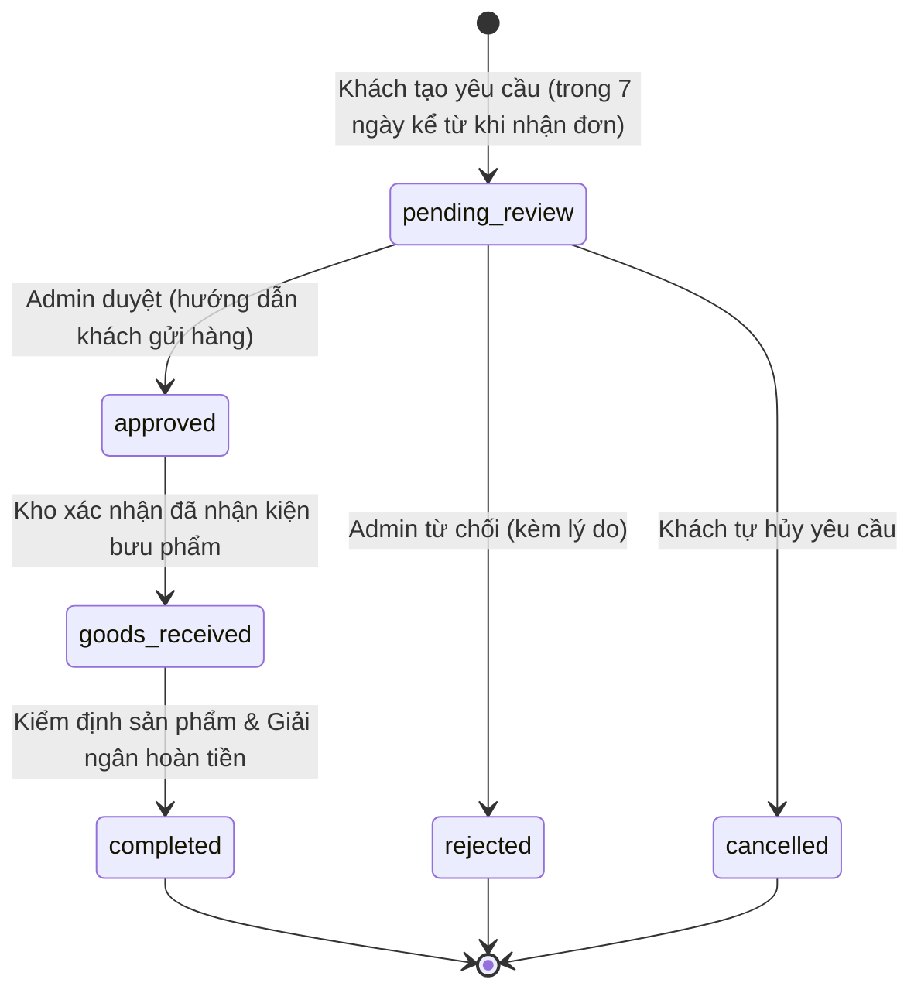

# Design Spec: Returns & Refunds Flow (Gói 2)

- **Date:** 2026-09-20
- **Author:** Antigravity Agent
- **Target Branch:** `dev`
- **Scope:** E-commerce API (`services/ecommerce-api`) & Storefront UI (`apps/storefront`)
- **Status:** Approved / In Review

---

## 1. Executive Summary & Goals

Hệ thống Returns & Refunds (Gói 2) cung cấp quy trình đổi trả hàng và hoàn tiền toàn diện, khép kín từ khi khách hàng tạo yêu cầu trực tuyến cho tới khi hàng hoàn về kho, được kiểm định chất lượng, nhập lại tồn kho và giải ngân hoàn tiền.

### Mục tiêu chính:
1. **Minh bạch và bảo vệ khách hàng:** Cho phép khách hàng yêu cầu hoàn trả cho đơn hàng đã nhận thành công (`delivered` hoặc `completed`) trong vòng 7 ngày, hỗ trợ trả từng sản phẩm hoặc toàn bộ đơn.
2. **Quy trình kiểm soát kho an toàn:** Tách bạch 3 giai đoạn: Tiếp nhận & Duyệt chính sách $\rightarrow$ Nhận hàng & Kiểm định thực tế tại kho $\rightarrow$ Quyết toán tài chính hoàn tiền. Tuyệt đối không hoàn tiền khi chưa nhận và kiểm định hàng.
3. **Nhập kho nguyên tử & Chống Race Condition:** Tự động tăng tồn kho (`inventory.on_hand += quantity`) và ghi nhận `InventoryTransaction(movement_type='return_customer')` với row-level lock (`SELECT ... FOR UPDATE`) cho các sản phẩm đạt chuẩn kiểm định (`passed`).
4. **Tính toán tài chính chuẩn xác:** Phân bổ giảm giá coupon theo tỷ lệ thực tế, đảm bảo không hoàn tiền vượt quá số tiền khách đã chi trả. Sinh bản ghi `Refund(status='succeeded')` liên kết với `Payment` gốc để hạch toán Doanh thu thuần (Net Revenue).
5. **Giao diện người dùng liền mạch:** Hỗ trợ form tạo yêu cầu đổi trả, theo dõi tiến trình 4 bước (Stepper) cho khách hàng và trang quản trị riêng `/admin/returns` cho nhân viên vận hành.

---

## 2. Architecture & State Machine

### 2.1. State Machine của `ReturnRequest`



- **`pending_review`**: Khách hàng khởi tạo yêu cầu kèm lý do, STK ngân hàng và ảnh chụp tình trạng.
- **`approved`**: Admin kiểm tra điều kiện chính sách và đồng ý cho gửi hàng về kho.
- **`rejected`**: Admin từ chối (ghi rõ `admin_note`).
- **`cancelled`**: Khách chủ động hủy yêu cầu khi còn ở `pending_review`.
- **`goods_received`**: Kho hàng nhận được kiện hàng hoàn gửi về từ đơn vị vận chuyển hoặc khách.
- **`completed`**: Kho hoàn tất kiểm định từng sản phẩm và thực hiện hoàn tiền thành công.

### 2.2. Trạng thái Đơn hàng gốc (`Order.status`) & Nhãn tài chính

1. **Hoàn trả toàn bộ đơn hàng (Full Return):**
   - Khi tất cả các sản phẩm trong đơn hàng được hoàn trả thành công:
     `Order.status` chuyển từ `completed` (hoặc `delivered`) $\rightarrow$ `'returned'`.
   - Ghi nhận `OrderStatusHistory(from_status='completed', to_status='returned', transition_source='admin_return')`.
2. **Hoàn trả một phần (Partial Return):**
   - Khi khách chỉ trả 1 hoặc một vài sản phẩm và giữ lại các sản phẩm khác:
     `Order.status` **giữ nguyên `'completed'`**.
   - Trên giao diện Storefront & Admin, gắn nhãn tài chính phụ: **`Đã hoàn tiền một phần (Partially Refunded)`** kèm số tiền đã hoàn thực tế.

---

## 3. Data Models & Database Specifications

### 3.1. Bảng `return_requests` (Đã có sẵn, hoàn thiện quan hệ & dữ liệu)
- `return_id`: BIGINT UNSIGNED, PK, AUTO_INCREMENT
- `public_id`: UUID / GUID, Unique
- `return_code`: VARCHAR(64), Unique (Định dạng: `RT-YYYYMMDD-XXXXXX`)
- `order_id`: BIGINT UNSIGNED, FK `orders.order_id`
- `customer_id`: BIGINT UNSIGNED, FK `customers.customer_id`
- `action_type`: VARCHAR(16), `'refund'`
- `status`: VARCHAR(32), `'pending_review' | 'approved' | 'rejected' | 'goods_received' | 'completed' | 'cancelled'`
- `customer_reason`: TEXT, Lý do khách đưa ra
- `image_urls`: JSON, mảng chuỗi URL hình ảnh minh chứng
- `admin_note`: TEXT, Ghi chú duyệt/từ chối hoặc thông tin chuyển khoản từ Admin
- `reviewed_at`: DATETIME(6), Thời điểm Admin duyệt/từ chối
- `resolved_at`: DATETIME(6), Thời điểm kiểm định & hoàn tiền hoàn tất
- `created_at`: DATETIME(6), DEFAULT CURRENT_TIMESTAMP(6)
- `updated_at`: DATETIME(6), ON UPDATE CURRENT_TIMESTAMP(6)

### 3.2. Bảng `return_items`
- `return_item_id`: BIGINT UNSIGNED, PK, AUTO_INCREMENT
- `public_id`: UUID / GUID, Unique
- `return_id`: BIGINT UNSIGNED, FK `return_requests.return_id`
- `order_item_id`: BIGINT UNSIGNED, FK `order_items.order_item_id`
- `variant_id`: BIGINT UNSIGNED, FK `product_variants.variant_id`
- `quantity`: INT UNSIGNED, Số lượng trả ($1 \le quantity \le$ số lượng trong `order_items`)
- `refund_amount_vnd`: BIGINT UNSIGNED, Số tiền hoàn dự kiến cho item này
- `inspection_status`: VARCHAR(16), `'pending' | 'passed' | 'failed'`
- `created_at`: DATETIME(6)
- `updated_at`: DATETIME(6)

### 3.3. Bảng `refunds` (Liên kết với `payments`)
- `refund_id`: BIGINT UNSIGNED, PK, AUTO_INCREMENT
- `public_id`: UUID / GUID, Unique
- `payment_id`: BIGINT UNSIGNED, FK `payments.payment_id`, Unique
- `refund_idempotency_key`: VARCHAR(64), Unique
- `status`: VARCHAR(16), `'succeeded' | 'failed'`
- `currency_code`: CHAR(3), `'VND'`
- `amount_vnd`: BIGINT UNSIGNED, Số tiền thực tế hoàn trả cho khách
- `reason`: VARCHAR(500), Lý do hoàn tiền (kèm `return_code`)
- `requested_by_customer_id`: BIGINT UNSIGNED, FK `customers.customer_id`
- `created_at`: DATETIME(6)
- `completed_at`: DATETIME(6)

### 3.4. Bảng `order_status_history`
Cập nhật Check Constraint `valid_transition` và `transition_source`:
- Cho phép transition: `(from_status = 'completed' and to_status = 'returned')`.
- Cho phép transition source: thêm `'admin_return'`.

---

## 4. Business Logic & Calculation Rules

### 4.1. Điều kiện tiên quyết để tạo Return Request
- Khách hàng là chủ sở hữu của đơn hàng (`order.customer_id == current_customer.customer_id`).
- Đơn hàng đang ở trạng thái `delivered` hoặc `completed`.
- Thời gian tính từ khi giao hàng thành công đến hiện tại $\le 7$ ngày:
  $$\Delta t = \text{now()} - (\text{order.completed\_at} \text{ or } \text{order.updated\_at}) \le 7 \times 86400 \text{ giây}$$
- Không có yêu cầu đổi trả nào khác của đơn hàng này đang ở trạng thái chưa kết thúc (`status IN ('pending_review', 'approved', 'goods_received')`).

### 4.2. Công thức tính tiền hoàn phân bổ Coupon (Prorated Refund Amount)
Để tránh gian lận khi đơn hàng áp dụng voucher giảm giá (ví dụ: mua 2 áo 500k, giảm 200k còn 800k; nếu trả 1 áo thì chỉ được hoàn 400k chứ không phải 500k):
$$\text{discount\_ratio} = \frac{\text{order.discount\_amount\_vnd}}{\text{order.subtotal\_vnd}}$$
$$\text{item\_net\_unit\_price} = \text{round}\left(\text{order\_item.unit\_price\_vnd} \times (1 - \text{discount\_ratio})\right)$$
$$\text{item.refund\_amount\_vnd} = \text{item\_net\_unit\_price} \times \text{item.quantity}$$

### 4.3. Kiểm định & Nhập kho nguyên tử (Inspection & Stock Restock)
Khi Admin gọi endpoint `inspect-and-resolve`:
1. Duyệt qua từng item trong danh sách kiểm định:
   - Cập nhật `return_items.inspection_status = 'passed' | 'failed'`.
   - Nếu `passed`:
     - Khóa dòng kho của variant: `SELECT * FROM inventories WHERE variant_id = :id FOR UPDATE`.
     - Cộng lại tồn kho: `inventory.on_hand += item.quantity`.
     - Thêm bản ghi `InventoryTransaction`:
       - `variant_id`: `item.variant_id`
       - `location_type`: `'central_warehouse'`
       - `movement_type`: `'return_customer'`
       - `quantity_delta`: `+item.quantity`
       - `reference_code`: `return_code`
       - `notes`: `"Hàng hoàn nhập kho từ yêu cầu trả hàng "` + `return_code`
   - Nếu `failed`:
     - Không cộng tồn kho bán.
     - `refund_amount_vnd` của item này không được tính vào số tiền giải ngân hoàn cho khách.
2. Tính tổng tiền hoàn thực tế:
   $$\text{total\_refund\_vnd} = \sum_{\text{item } \in \text{ passed}} \text{item.refund\_amount\_vnd}$$
3. Nếu $\text{total\_refund\_vnd} > 0$:
   - Tạo bản ghi `Refund`:
     - `payment_id`: `order.payment.payment_id`
     - `status`: `'succeeded'`
     - `amount_vnd`: `total_refund_vnd`
     - `completed_at`: `now()`
4. Cập nhật `ReturnRequest`:
   - `status`: `'completed'`
   - `resolved_at`: `now()`
5. Cập nhật `Order`:
   - Kiểm tra xem tổng số lượng sản phẩm hoàn trả của đơn có bằng tổng số lượng mua ban đầu hay không.
   - Nếu bằng: `order.status = 'returned'`, ghi `OrderStatusHistory(transition_source='admin_return')`.
   - Nếu nhỏ hơn: giữ `order.status = 'completed'`.

---

## 5. Backend REST API Specification

### 5.1. Customer Endpoints (`/api/v1/returns`)
1. **`POST /api/v1/orders/{order_number}/returns`**
   - **Mục đích:** Khách hàng gửi yêu cầu trả hàng.
   - **Headers:** `Idempotency-Key` (bắt buộc, 1-64 ký tự).
   - **Request Body (`CreateReturnRequestPayload`):**
     ```json
     {
       "customer_reason": "Sản phẩm bị rách chỉ viền áo và sai kích thước",
       "bank_name": "Vietcombank",
       "bank_account_number": "0123456789",
       "bank_account_holder": "TRAN THI B",
       "image_urls": ["https://example.com/image1.jpg"],
       "items": [
         {
           "order_item_id": 12,
           "quantity": 1
         }
       ]
     }
     ```
   - **Response (`ReturnRequestDetailResponse`):** Mã HTTP 201 Created.
2. **`GET /api/v1/returns`**
   - **Mục đích:** Danh sách yêu cầu trả hàng của khách hàng hiện tại.
   - **Response:** `list[ReturnRequestSummaryResponse]`.
3. **`GET /api/v1/returns/{return_code}`**
   - **Mục đích:** Xem chi tiết tiến độ một yêu cầu trả hàng.
   - **Response:** `ReturnRequestDetailResponse`.
4. **`POST /api/v1/returns/{return_code}/cancel`**
   - **Mục đích:** Khách tự hủy yêu cầu khi còn ở `pending_review`.
   - **Response:** `ReturnRequestDetailResponse` (status chuyển `cancelled`).

### 5.2. Admin Endpoints (`/api/v1/admin/returns`)
1. **`GET /api/v1/admin/returns`**
   - **Query Parameters:** `status` (tùy chọn), `search` (mã return, mã order, SĐT), `limit`, `offset`.
   - **Response:** Danh sách các yêu cầu đổi trả toàn hệ thống kèm phân trang.
2. **`GET /api/v1/admin/returns/{return_code}`**
   - **Response:** Chi tiết đầy đủ của yêu cầu, thông tin khách hàng, chi tiết đơn hàng, danh sách item và thông tin tài khoản giải ngân.
3. **`POST /api/v1/admin/returns/{return_code}/review`**
   - **Request Body:**
     ```json
     {
       "action": "approved", // hoặc "rejected"
       "admin_note": "Đã duyệt yêu cầu. Vui lòng đóng gói và gửi về kho tại 123 Lê Lợi, Q1, TP.HCM."
     }
     ```
   - **Response:** `ReturnRequestDetailResponse`.
4. **`POST /api/v1/admin/returns/{return_code}/receive`**
   - **Mục đích:** Kho xác nhận đã nhận được kiện bưu phẩm gửi về.
   - **Response:** `ReturnRequestDetailResponse` (status chuyển `goods_received`).
5. **`POST /api/v1/admin/returns/{return_code}/inspect-and-resolve`**
   - **Headers:** `Idempotency-Key` (bắt buộc).
   - **Request Body:**
     ```json
     {
       "items": [
         {
           "return_item_id": 45,
           "inspection_status": "passed"
         }
       ],
       "admin_note": "Hàng nguyên tem mác, đạt chuẩn tái nhập kho. Đã chuyển khoản hoàn tiền."
     }
     ```
   - **Response:** `ReturnRequestDetailResponse` (status chuyển `completed`).

---

## 6. Frontend Storefront & Admin Portal Architecture

### 6.1. Storefront Client (`apps/storefront`)
- **`apps/storefront/src/components/returns/CreateReturnModal.tsx`**:
  - Modal tạo yêu cầu hoàn trả:
    - Danh sách các item trong đơn với checkbox và select số lượng.
    - Textarea lý do trả hàng.
    - Các trường nhập STK, Tên ngân hàng, Chủ tài khoản.
    - Input URL ảnh hoặc upload preview.
    - Hiển thị dự tính số tiền được hoàn lại (`refund_amount_vnd`).
- **`apps/storefront/src/app/orders/[orderNumber]/page.tsx`**:
  - Bổ sung nút **"Yêu cầu Đổi / Trả hàng"** nếu đơn `delivered` / `completed` và $\le 7$ ngày.
  - Bổ sung Card thông báo trạng thái đổi trả nếu đơn đã có `ReturnRequest`.
- **`apps/storefront/src/app/orders/returns/[returnCode]/page.tsx`**:
  - Trang theo dõi tiến độ chi tiết với Status Stepper 4 bước.
  - Danh sách sản phẩm, trạng thái kiểm định và số tiền hoàn.
  - Nút "Hủy yêu cầu" khi ở trạng thái `pending_review`.

### 6.2. Admin Portal (`apps/storefront`)
- **`apps/storefront/src/components/AdminNav.tsx`**:
  - Bổ sung mục điều hướng: `{ href: "/admin/returns", label: "Đổi trả & Hoàn tiền", icon: "rotate-ccw" }`.
- **`apps/storefront/src/app/admin/returns/page.tsx`**:
  - Tab lọc trạng thái: Tất cả | Chờ duyệt | Chờ nhận hàng | Đã nhận hàng | Hoàn tất | Đã từ chối.
  - Bảng dữ liệu quản lý yêu cầu đổi trả.
- **`apps/storefront/src/app/admin/returns/[returnCode]/page.tsx`**:
  - Trang quản trị chi tiết yêu cầu:
    - Card thông tin khách hàng & STK giải ngân.
    - Nút thao tác theo trạng thái: Duyệt / Từ chối (`pending_review`), Nhận hàng (`approved`), Kiểm định & Giải ngân (`goods_received`).
    - Modal kiểm định từng sản phẩm (`passed` / `failed`).
- **`apps/storefront/src/app/admin/orders/[orderNumber]/page.tsx`**:
  - Hiển thị Card thông tin Hoàn trả & Hoàn tiền nếu đơn hàng có phát sinh đổi trả.

---

## 7. Testing & Verification Strategy

1. **Backend Unit & Integration Tests (`services/ecommerce-api/tests/`):**
   - `test_return_request_creation.py`:
     - Test tạo yêu cầu hoàn trả thành công với đơn `delivered`/`completed` trong 7 ngày.
     - Test chặn tạo yêu cầu khi đơn chưa `delivered` (ví dụ `shipping`, `confirmed`).
     - Test chặn tạo yêu cầu khi đã quá 7 ngày.
     - Test tính toán chính xác số tiền hoàn có phân bổ coupon.
     - Test chặn yêu cầu trùng lặp khi đang có yêu cầu mở.
   - `test_return_review_and_receive.py`:
     - Test Admin duyệt (`approved`) và từ chối (`rejected`).
     - Test Kho xác nhận nhận hàng (`goods_received`).
     - Test khách hàng hủy yêu cầu (`cancelled`).
   - `test_return_inspection_and_refund.py`:
     - Test kiểm định `passed`: tồn kho `on_hand` tăng nguyên tử, bản ghi `InventoryTransaction(movement_type='return_customer')` được tạo, `Refund(status='succeeded')` được tạo.
     - Test kiểm định `failed`: không cộng tồn kho, không hoàn tiền món đó.
     - Test hoàn trả toàn bộ: `order.status` chuyển thành `returned`.
     - Test hoàn trả một phần: `order.status` giữ nguyên `completed`.
     - Đảm bảo 125 backend tests hiện có tiếp tục pass 100% (0 regression).
2. **Frontend Typecheck & Build:**
   - Chạy `npm --prefix apps/storefront run typecheck` (0 errors).
   - Chạy `npm --prefix apps/storefront run build` (24+ pages build thành công).
