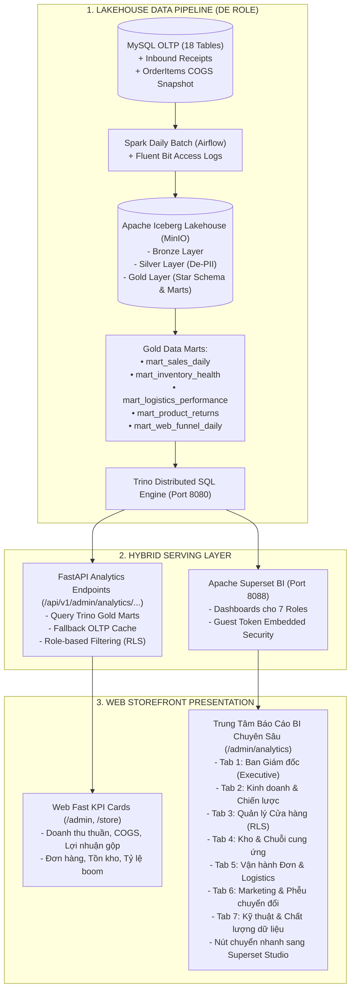

# Thiết Kế Kỹ Thuật: Hệ Thống Báo Cáo Quản Trị Theo Vai Trò (Hybrid Role-Based Dashboards & Data Marts Integration)
## Gói 4: Data Pipeline Integration, Backfill & Aggregated Reporting

- **Tác giả:** Antigravity Pairing Assistant & Tech Lead
- **Ngày lập:** 2026-09-22
- **Trạng thái:** Proposed
- **Tài liệu tham chiếu:**
  - `docs/architecture/BUSINESS_DOMAIN.md` (Đặc tả miền nghiệp vụ 7 Roles & KPIs)
  - `docs/architecture/MANAGEMENT_INFO_TECHNICAL_SPEC.md` (Kiến trúc MIS & Traceability Matrix)
  - `docs/superpowers/specs/2026-09-21-inbound-inventory-costing-design.md` (Gói 3: Inbound & Moving Weighted COGS)

---

## 1. Bối Cảnh & Mục Tiêu Kiến Trúc

### 1.1. Bối cảnh
Sau khi hoàn thành 3 gói nghiệp vụ cốt lõi:
- **Gói 1:** Core Order Lifecycle, COD Delivery, Boom Handling & In-house Logistics.
- **Gói 2:** Customer Returns, Inspection Restock, Refund Settlement & Financial Badges.
- **Gói 3:** Inbound Production Receipts từ xưởng nội bộ, Giá vốn hàng bán Bình quân gia quyền di động (Moving Weighted Average COGS) và snapshot giá vốn vào `OrderItem`.

Hệ thống cần tích hợp toàn bộ các dữ liệu này vào luồng phân tích dữ liệu (Lakehouse) và hiển thị trực quan cho các cấp quản lý trên giao diện Web.

### 1.2. Mục tiêu kỹ thuật
1. **Kiến trúc Hybrid (Headless BI API + Embedded Superset BI):**
   - **Tầng 1 (Headless KPI Serving):** Web Backend FastAPIs query trực tiếp số liệu đã tổng hợp sẵn từ Data Marts (hoặc cache/fallback) để hiển thị tức thời các thẻ KPI tài chính trên Web (`/admin`, `/store`) với độ trễ thấp (< 200ms).
   - **Tầng 2 (Deep-Dive Role BI Hub):** Cung cấp trang trung tâm phân tích chuyên sâu (`/admin/analytics`) với 7 tab tương ứng với 7 Role nghiệp vụ trong `BUSINESS_DOMAIN.md`, hỗ trợ nhúng trực tiếp dashboard tương tác qua Apache Superset Embedded SDK và liên kết nhanh tới Superset Studio.
2. **Đồng bộ hóa Lakehouse Data Pipeline (Role DE):**
   - Đăng ký ingest 2 bảng mới từ MySQL sang Lakehouse: `inbound_receipts` và `inbound_receipt_items` trong `pipelines/config/default.yml`.
   - Chuẩn hóa các bảng Gold Marts (`mart_sales_daily`, `mart_inventory_health`, `mart_logistics_performance`, `mart_product_returns`) để tính toán chính xác COGS, Lợi nhuận gộp (Gross Profit) và Tỷ suất Lợi nhuận gộp (Gross Profit Margin %).
3. **Kịch bản Backfill & Seed Demo Đồ Án:**
   - Cung cấp kịch bản seed dữ liệu giả lập phong phú theo chuỗi thời gian, đảm bảo tất cả biểu đồ và thẻ thống kê đều có dữ liệu trực quan sinh động khi thuyết minh bảo vệ đồ án.

---

## 2. Phân Tích Nghiệp Vụ Theo 7 Role (Trích Xuất Từ BUSINESS_DOMAIN.md)

| Cấp Quản Trị | Role Nghiệp Vụ | Trọng Tâm & Business Questions | KPI Trọng Yếu | Nguồn Dữ Liệu Phục Vụ |
| :--- | :--- | :--- | :--- | :--- |
| **Strategic** | **1. Ban Giám đốc (CEO / Executive)** | Toàn cảnh kinh doanh, doanh thu, lợi nhuận gộp, margin, tăng trưởng, sức khỏe tồn kho, hiệu quả marketing (ROAS/CAC). | GMV, Net Revenue, COGS, Gross Profit, Gross Margin %, Orders, AOV, Growth MoM/YoY. | `mart_sales_daily`, `fact_order` |
| **Tactical** | **2. Trưởng phòng Kinh doanh & Chiến lược (Sales Strategy)** | Phân rã doanh thu theo Store, Category, Product, Region, Segment. Xu hướng seasonality và dự báo. | Sales Growth, Store Contribution, Category Performance, Product Revenue, AOV Trend. | `mart_sales_daily`, `dim_product`, `dim_store` |
| | **3. Trưởng phòng Marketing (Marketing Manager)** | Phễu chuyển đổi Clickstream, hiệu quả chiến dịch (Campaigns), tỷ lệ giữ chân khách hàng (Retention), CAC, ROAS. | Sessions, Views, Add to Cart, Checkout, Conversion Rate, CAC, ROAS, Repeat Rate. | `mart_web_funnel_daily`, `access_logs` |
| **Operational** | **4. Trưởng cửa hàng (Store Manager)** | Vận hành tại 1 chi nhánh (Row-Level Security), doanh thu trong ngày, đạt target, hàng sắp hết tại quầy, đơn hủy/trả tại shop. | Store Today Revenue, Orders, Target Achievement %, Low-stock at Store, Store Return Rate. | `mart_sales_daily` (filter `store_id`), `mart_inventory_health` |
| | **5. Quản lý Nhập/Xuất kho (Inventory Manager)** | Dòng chảy hàng hóa toàn chuỗi, tồn Kho tổng vs Cửa hàng, nhập xưởng sản xuất, xuất giao, vòng quay tồn kho (Turnover). | On-hand, Reserved, Inbound Receipts, Outbound, Stockout Count, Inventory Turnover, Days of Inventory. | `mart_inventory_health`, `inbound_receipts` |
| | **6. Quản lý Đơn hàng & Vận hành (Order / Customer Ops)** | Vòng đời đơn hàng, xử lý ngoại lệ (Cancelled, Returned, Refunded, Payment Failed, Boom hàng), SLA giao hàng. | Pending Orders, Shipping SLA, Boom Rate (Failed COD), Return Rate, Refund Amount, Fulfillment Time. | `mart_logistics_performance`, `mart_product_returns` |
| **Technical** | **7. System / Data Administrator** | Ổn định dịch vụ, độ trễ và trạng thái Data Pipelines (Batch, CDC, Streaming lag), Data Quality, đối soát dữ liệu (Reconciliation). | API Health, Error 5xx %, Pipeline Status & Lag, Data Freshness SLA, Reconciliation Variance. | `lakehouse.silver` vs `gold`, System Logs |

---

## 3. Kiến Trúc Chi Tiết Của Phương Án Hybrid



### 3.1. Ma Trận Phân Quyền & Kiểm Soát Truy Cập Dashboard (RBAC & Least Privilege)

Áp dụng nguyên tắc quyền hạn tối thiểu: Cấp cao (Admin / Ban Giám đốc) có toàn quyền xem tất cả các dashboard; các cấp quản lý bộ phận chỉ được truy cập duy nhất dashboard thuộc phạm vi trách nhiệm của mình và **tuyệt đối không được xem Dashboard cấp cao / Doanh thu toàn công ty**:

| Tài khoản / Role Người Dùng | Ban Giám Đốc (CEO) | Kinh Doanh & Chiến Lược | Quản Lý Cửa Hàng (Store) | Kho & Chuỗi Cung Ứng | Vận Hành Đơn & Logistics | Marketing & Funnel | Kỹ Thuật & Dữ Liệu |
| :--- | :---: | :---: | :---: | :---: | :---: | :---: | :---: |
| **Admin / Ban Giám Đốc (`admin`)** | ✅ **Toàn quyền** | ✅ **Toàn quyền** | ✅ **Xem mọi store** | ✅ **Toàn quyền** | ✅ **Toàn quyền** | ✅ **Toàn quyền** | ✅ **Toàn quyền** |
| **Trưởng phòng Kinh doanh (`sales_manager`)** | ❌ Chặn (403) | ✅ **Xem** | ✅ **Xem mọi store** | ❌ Chặn (403) | ❌ Chặn (403) | ❌ Chặn (403) | ❌ Chặn (403) |
| **Trưởng phòng Marketing (`marketing_manager`)** | ❌ Chặn (403) | ❌ Chặn (403) | ❌ Chặn (403) | ❌ Chặn (403) | ❌ Chặn (403) | ✅ **Xem** | ❌ Chặn (403) |
| **Trưởng Cửa hàng (`store_manager`)** | ❌ Chặn (403) | ❌ Chặn (403) | 🔒 **Chỉ xem Store của mình (RLS)** | ❌ Chặn (403) | ❌ Chặn (403) | ❌ Chặn (403) | ❌ Chặn (403) |
| **Quản lý Kho (`inventory_manager`)** | ❌ Chặn (403) | ❌ Chặn (403) | ❌ Chặn (403) | ✅ **Xem** | ❌ Chặn (403) | ❌ Chặn (403) | ❌ Chặn (403) |
| **Quản lý Đơn hàng (`operations_manager`)** | ❌ Chặn (403) | ❌ Chặn (403) | ❌ Chặn (403) | ❌ Chặn (403) | ✅ **Xem** | ❌ Chặn (403) | ❌ Chặn (403) |
| **Quản trị Kỹ thuật (`system_admin`)** | ❌ Chặn (403) | ❌ Chặn (403) | ❌ Chặn (403) | ❌ Chặn (403) | ❌ Chặn (403) | ❌ Chặn (403) | ✅ **Xem** |

---

## 4. Đặc Tả Chi Tiết Từng Hợp Phần

### 4.1. Hợp phần 1: Backend Serving & Financial Aggregation APIs

#### 4.1.1. Cập nhật `AdminOverviewResponse` (`services/ecommerce-api/app/modules/admin/schemas.py`)
Mở rộng cấu trúc phản hồi tổng quan:
```python
class AdminOverviewResponse(BaseModel):
    # Metrics hiện tại
    active_products: int
    active_variants: int
    low_stock_variants: int
    customers: int
    paid_orders: int
    confirmed_orders: int
    completed_orders: int
    cancelled_orders: int
    total_reviews: int
    active_coupons: int
    gross_revenue_vnd: int
    refunded_amount_vnd: int
    net_revenue_vnd: int

    # Bổ sung metrics tài chính mới từ COGS & Logistics
    cogs_vnd: int = 0                    # Tổng giá vốn của các đơn thành công (delivered / completed)
    gross_profit_vnd: int = 0            # Lợi nhuận gộp = net_revenue_vnd - cogs_vnd
    gross_margin_percent: float = 0.0    # Tỷ suất lợi nhuận gộp = round((gross_profit / net_revenue) * 100, 1)
    boom_orders_count: int = 0           # Số đơn giao thất bại (boom hàng)
    return_orders_count: int = 0         # Số đơn có yêu cầu đổi trả
```

#### 4.1.2. Tạo Module `analytics` (`services/ecommerce-api/app/modules/analytics/`)
Cung cấp các endpoint phục vụ báo cáo với bảo mật RBAC 2 lớp:
- `GET /api/v1/admin/analytics/overview`: Tổng hợp các chỉ số tài chính và vận hành toàn hệ thống (yêu cầu quyền `admin`).
- `GET /api/v1/admin/analytics/role-metrics?target_role=...&store_id=...`:
  - **Kiểm tra quyền hạn nghiêm ngặt (Security Gate):**
    - Nếu `actor.role == 'admin'`: Được phép truy cập mọi `target_role` và `store_id`.
    - Nếu `actor.role != 'admin'`: Chỉ được phép yêu cầu đúng `target_role` khớp với role của mình. Nếu yêu cầu role khác hoặc role cấp cao (`executive`), trả về **HTTP 403 Forbidden**.
    - Nếu `actor.role == 'store_manager'`: Bắt buộc khóa `store_id = actor.store_id`. Nếu cố tình truyền `store_id` khác hoặc để trống, trả về **HTTP 403 Forbidden**.
- `GET /api/v1/admin/analytics/sales-trend`: Chuỗi dữ liệu doanh thu, giá vốn, lợi nhuận theo ngày (từ `mart_sales_daily` hoặc OLTP fallback; chỉ dành cho `admin` hoặc `sales_manager`).
- `GET /api/v1/admin/analytics/superset-config`: Trả về cấu hình dashboard ID, Superset base URL (`http://localhost:8088`), và trạng thái khả dụng của Superset.

### 4.2. Hợp phần 2: Giao Diện Người Dùng Storefront Admin

#### 4.2.1. Cập nhật Dashboard Tổng quan `/admin` (`apps/storefront/src/app/admin/page.tsx`)
- Thêm hàng thẻ tài chính nâng cao:
  - **Doanh thu thuần (Net Revenue):** Format VND compact (`1,2 tỷ ₫`).
  - **Giá vốn hàng bán (COGS):** Hiển thị tổng giá vốn với chú thích *"Tính theo bình quân gia quyền di động"*.
  - **Lợi nhuận gộp (Gross Profit):** Hiển thị kèm badge **Tỷ suất Lợi nhuận gộp (%)** (xanh lá khi lãi, đỏ khi lỗ).
  - **Tỷ lệ Boom hàng & Đổi trả:** Cảnh báo các thất thoát trong khâu giao vận và hoàn hàng.

#### 4.2.2. Xây dựng Trung tâm Báo cáo BI Chuyên sâu `/admin/analytics` (`apps/storefront/src/app/admin/analytics/page.tsx`)
- Thêm đường dẫn vào thanh điều hướng quản trị `AdminNav.tsx`:
  - `{ href: "/admin/analytics", label: "Báo cáo BI Lakehouse", icon: "bar-chart" }`.
- **Cơ chế hiển thị thích ứng theo Role (View Gate):**
  - **Đối với tài khoản Quản trị viên (`admin`):**
    - Hiển thị đầy đủ cả 7 Tabs tương ứng với 7 Roles.
    - Cung cấp tính năng **"Mô phỏng góc nhìn Role" (Role View Switcher)** dạng Dropdown/Toggle để chuyển nhanh giữa các góc nhìn nhằm phục vụ demo và kiểm toán toàn diện.
  - **Đối với tài khoản cấp bộ phận (`store_manager`, `marketing_manager`,...):**
    - Tự động ẩn toàn bộ các Tab ngoài phạm vi quyền hạn; chỉ hiển thị duy nhất Tab nghiệp vụ của mình.
    - Chặn và hiển thị thông báo lỗi `Access Denied` nếu cố tình truy cập qua URL parameter trái phép.
- Giao diện 7 Tabs nghiệp vụ:
  1. **Tab "Ban Giám đốc (CEO)":**
     - KPI Summary Cards: Doanh thu, Lợi nhuận gộp, Gross Margin %, AOV, Tăng trưởng.
     - Biểu đồ xu hướng Doanh thu vs Giá vốn vs Lợi nhuận gộp theo chuỗi ngày.
     - Tỷ trọng doanh thu theo Kênh (Online vs POS) và Ngành hàng.
  2. **Tab "Kinh doanh & Chiến lược":**
     - Phân rã doanh số theo Cửa hàng và Khu vực.
     - Top 10 sản phẩm mang lại doanh thu và lợi nhuận cao nhất.
  3. **Tab "Quản lý Cửa hàng (Store)":**
     - Dropdown chọn Cửa hàng (khóa chặt theo RLS của tài khoản cửa hàng).
     - Doanh thu theo ca/ngày tại quầy, Top sản phẩm bán chạy tại quầy.
  4. **Tab "Kho & Chuỗi cung ứng":**
     - Tổng tồn kho toàn hệ thống (Kho tổng trung tâm vs Các chi nhánh).
     - Thống kê các đợt nhập xưởng thành phẩm và biến động giá vốn.
     - Danh sách cảnh báo hàng cạn kho (Stockout) và tồn đọng lâu (Slow-moving).
  5. **Tab "Vận hành Đơn & Logistics":**
     - Phễu đơn hàng (Chờ xác nhận $\rightarrow$ Đóng gói $\rightarrow$ Đang giao $\rightarrow$ Hoàn tất).
     - Thống kê Boom hàng (Failed delivery COD) và Hiệu suất shipper.
     - Đối soát Đổi trả hàng & Hoàn tiền (Returns & Refunds).
  6. **Tab "Marketing & Phễu chuyển đổi":**
     - Phễu chuyển đổi Clickstream từ Access Logs: Lượt truy cập $\rightarrow$ Xem sản phẩm $\rightarrow$ Giỏ hàng $\rightarrow$ Thanh toán $\rightarrow$ Mua hàng thành công.
  7. **Tab "Kỹ thuật & Đối soát dữ liệu":**
     - Trạng thái các luồng ETL (Airflow DAGs, Spark jobs, Freshness SLA).
     - Reconciliation Gate: Bảng so sánh doanh thu và số dòng giữa MySQL OLTP và Iceberg Gold Marts.
- Hỗ trợ nút **"Mở Superset Studio"** chuyển tiếp người dùng sang cổng Apache Superset đầy đủ (`http://localhost:8088`).

### 4.3. Hợp phần 3: Cấu Hình Lakehouse Data Pipeline (Role DE)

#### 4.3.1. Cập nhật `pipelines/config/default.yml`
Thêm 2 bảng mới từ MySQL:
```yaml
  - name: inbound_receipts
    cursor_field: updated_at
    pk: receipt_id
    mutability: mutable
    silver_table: silver_inbound_receipts
  - name: inbound_receipt_items
    cursor_field: created_at
    pk: item_id
    mutability: append_only
    silver_table: silver_inbound_receipt_items
```

#### 4.3.2. Cập nhật Gold Layer (`pipelines/src/lakehouse/oltp/gold.py`)
- Xác nhận các cột trong `mart_sales_daily`:
  - `gross_revenue_vnd`: Tổng tiền hàng bán được.
  - `cogs_vnd`: Tổng giá vốn hàng bán (`quantity * cost_price_vnd`).
  - `gross_profit_vnd`: Lợi nhuận gộp $= \text{gross\_revenue} - \text{cogs}$.
  - `gross_profit_margin_pct`: Tỷ suất lợi nhuận gộp $= \text{round}((\text{gross\_profit} / \text{gross\_revenue}) * 100, 2)\%$.
- Đảm bảo các chỉ số này tính đúng kể cả với đơn hàng Online và đơn bán tại quầy POS.

### 4.4. Hợp phần 4: Kịch Bản Seed & Backfill Dữ Liệu Demo Đồ Án

Xây dựng script `database/seeds/seed_demo_scenarios.py` để sinh dữ liệu mẫu nhất quán:
1. **Lịch sử nhập kho xưởng:** Tạo 3 đợt nhập kho xưởng liên tiếp với số lượng và chi phí khác nhau, kiểm chứng công thức Moving Weighted Average cập nhật giá vốn.
2. **Lịch sử đơn hàng đa dạng:**
   - 20+ đơn hàng Online qua các trạng thái (Đã giao, Đang giao, Đã hủy, Boom hàng).
   - 10+ đơn hàng POS tại các cửa hàng khác nhau.
   - 3+ đơn hàng có yêu cầu đổi trả (1 phần và toàn phần) kèm hoàn tiền.
3. Chạy script để nạp trực tiếp vào MySQL, giúp các màn hình Dashboard Web và Báo cáo Lakehouse hiển thị số liệu sinh động, thuyết phục ngay lập tức.

---

## 5. Kế Hoạch Kiểm Thử & Tiêu Chí Nghiệm Thu (Success Criteria)

1. **Kiểm thử Backend & API (`pytest`):**
   - Đảm bảo toàn bộ 161+ bài test hiện tại tiếp tục pass 100%.
   - Bổ sung unit tests cho các endpoint analytics mới (`test_analytics_api.py`), kiểm tra tính đúng đắn của phép tính COGS, Gross Profit, Gross Margin.
2. **Kiểm thử Giao diện Web (`typecheck` & `next build`):**
   - TypeScript `tsc --noEmit` đạt 0 lỗi.
   - Next.js 15 production build thành công 27/27 routes (bao gồm `/admin/analytics`).
3. **Tính Toàn Vẹn & Khả Dụng Nghiệp Vụ:**
   - Khi có đơn hàng giao thành công, COGS và Gross Profit trên Dashboard Admin tự động tăng tương ứng.
   - Người dùng có thể chuyển đổi giữa 7 tabs role trên `/admin/analytics` để xem các góc nhìn báo cáo khác nhau mà không gặp lỗi layout hay crash trang.
